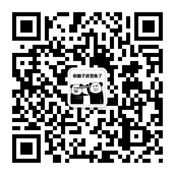

# 跟煎魚學 Go

寫寫程式碼，喝喝茶，搞搞 Go，一起吧，這是我的專案地址：<https://github.com/EDDYCJY/blog>

## 線上閱讀

* <https://eddycjy.gitbook.io/golang/>

## 我的微信公眾號

推薦大家關注我的微信公眾號，長期堅持更新原創知識。也可以加我 WeChat，拉你進 Go 技術交流群：

<figure><figcaption>
煎魚的微信公眾號
</figcaption></figure>

## ？

如果有任何疑問或錯誤，歡迎在 issues 進行提問或給予修正意見

如果喜歡或對你有所幫助，歡迎 Star，對作者是一種鼓勵和推進 😀

## License

所有文章採用[知識共享署名-非商業性使用-相同方式共享 3.0 中國大陸許可協議](https://creativecommons.org/licenses/by-nc-sa/3.0/cn/)進行許可
