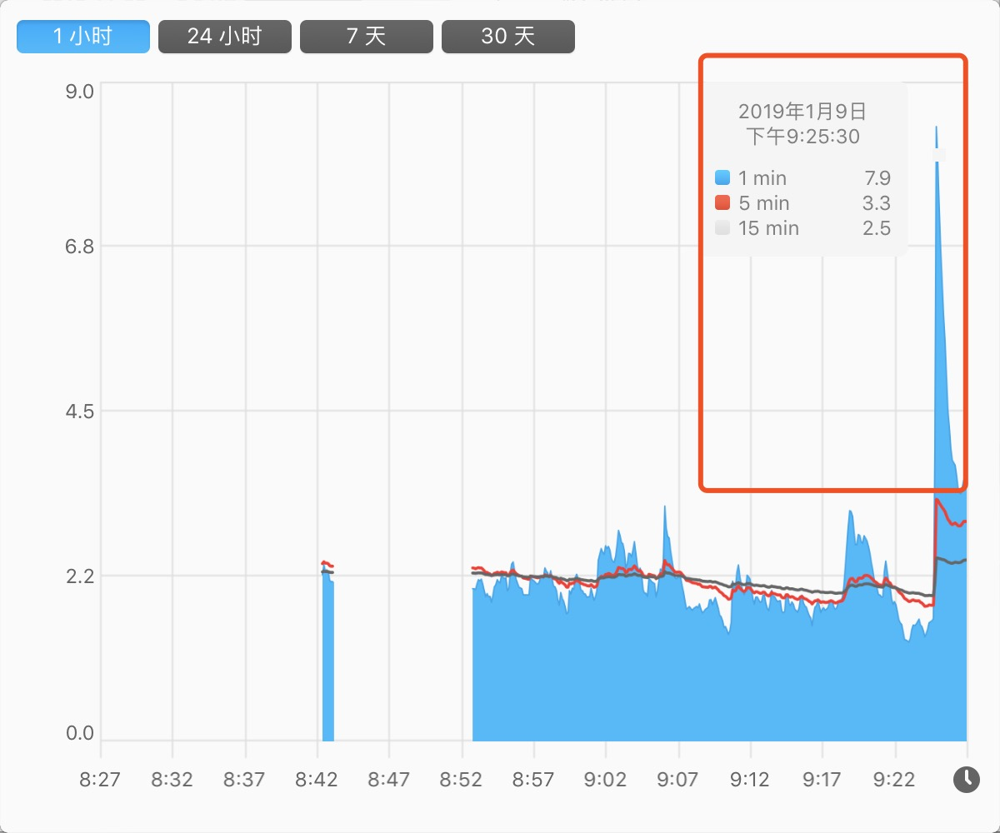
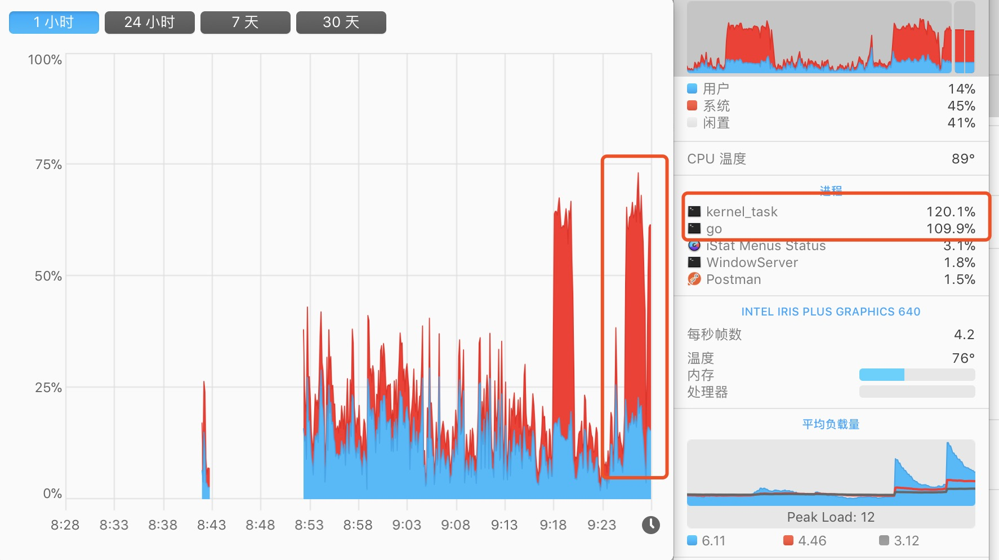
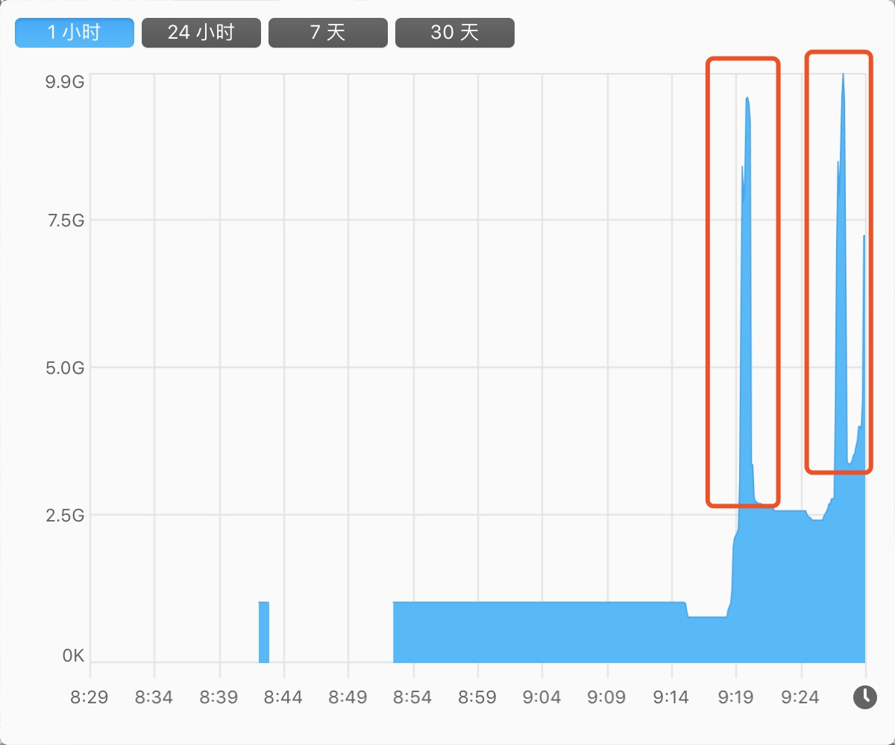

# 1.6 來，控制一下 goroutine 的併發數量


## 問題

```go
func main() {
    userCount := math.MaxInt64
    for i := 0; i < userCount; i++ {
        go func(i int) {
            // 做一些各种各样的业务逻辑处理
            fmt.Printf("go func: %d\n", i)
            time.Sleep(time.Second)
        }(i)
    }
}
```
在這裡，假設 `userCount` 是一個外部傳入的引數（不可預測，有可能值非常大），有人會全部丟進去迴圈。想著全部都併發 goroutine 去同時做某一件事。覺得這樣子會效率會更高，對不對！

那麼，你覺得這裡有沒有什麼問題？

## 噩夢般的開始

當然，在**特定場景下**，問題可大了。因為在本文被丟進去同時併發的可是一個極端值。我們可以一起觀察下圖的指標分析，看看情況有多 “崩潰”。下圖是上述程式碼的表現：

### 輸出結果

```
...
go func: 5839
go func: 5840
go func: 5841
go func: 5842
go func: 5915
go func: 5524
go func: 5916
go func: 8209
go func: 8264
signal: killed
```

如果你自己執行過程式碼，在 “輸出結果” 上你會遇到如下問題：

* 系統資源佔用率不斷上漲
* 輸出一定數量後：控制檯就不再重新整理輸出最新的值了
* 訊號量：signal: killed

### 系統負載



### CPU



短時間內系統負載暴增

### 虛擬記憶體



短時間內佔用的虛擬記憶體暴增

### top

```
PID    COMMAND      %CPU  TIME     #TH   #WQ  #PORT MEM    PURG   CMPRS  PGRP  PPID  STATE    BOOSTS
...
73414  test         100.2 01:59.50 9/1   0    18    6801M+ 0B     114G+  73403 73403 running  *0[1]
```

### 小結

如果仔細看過監控工具的示意圖，就可以知道其實我間隔的執行了兩次，能看到系統間的使用率幅度非常大。當程序被殺掉後，整體又恢復為正常值

在這裡，我們回到主題，就是在**不控制併發的 goroutine 數量** 會發生什麼問題？大致如下：

* CPU 使用率浮動上漲
* Memory 佔用不斷上漲。也可以看看 CMPRS，它表示程序的壓縮資料的位元組數。已經到達 114G+ 了
* 主程序崩潰（被殺掉了）

簡單來說，“崩潰” 的原因就是對系統資源的佔用過大。常見的比如：開啟檔案數（too many files open）、記憶體佔用等等

### 危害

對該臺伺服器產生非常大的影響，影響自身及相關聯的應用。很有可能導致不可用或響應緩慢，另外啟動了複數 “失控” 的 goroutine，導致程式流轉混亂

## 解決方案

在前面花了大量篇幅，渲染了在存在大量併發 goroutine 數量時，不控制的話會出現 “嚴重” 的問題，接下來一起思考下解決方案。如下：

1. 控制/限制 goroutine 同時併發執行的數量
2. 改變應用程式的邏輯寫法（避免大規模的使用系統資源和等待）
3. ~~調整服務的硬體設定、最大開啟數、記憶體等閾值~~

## 控制 goroutine 併發數量

接下來正式的開始解決這個問題，希望你認真閱讀的同時加以思考，因為這個問題在實際專案中真的是太常見了！

問題已經丟擲來了，你需要做的是**想想有什麼辦法**解決這個問題。建議你自行思考一下技術方案。再接著往下看 :-)

### 嘗試 chan

```go
func main() {
    userCount := 10
    ch := make(chan bool, 2)
    for i := 0; i < userCount; i++ {
        ch <- true
        go Read(ch, i)
    }

    //time.Sleep(time.Second)
}

func Read(ch chan bool, i int) {
    fmt.Printf("go func: %d\n", i)
    <- ch
}
```
輸出結果：

```
go func: 1
go func: 2
go func: 3
go func: 4
go func: 5
go func: 6
go func: 7
go func: 8
go func: 0
```

嗯，我們似乎很好的控制了 2 個 2 個的 “順序” 執行多個 goroutine。但是，問題出現了。你仔細數一下輸出結果，才 9 個值？

這明顯就不對。原因出在當主協程結束時，子協程也是會被終止掉的。因此剩餘的 goroutine 沒來及把值輸出，就被送上路了（不信你把 `time.Sleep` 開啟看看，看看輸出數量）

### 嘗試 sync

```go
...
var wg = sync.WaitGroup{}

func main() {
    userCount := 10
    for i := 0; i < userCount; i++ {
        wg.Add(1)
        go Read(i)
    }

    wg.Wait()
}

func Read(i int) {
    defer wg.Done()
    fmt.Printf("go func: %d\n", i)
}
```
嗯，單純的使用 `sync.WaitGroup` 也不行。沒有控制到同時併發的 goroutine 數量（代指達不到本文所要求的目標）

#### 小結

單純**簡單**使用 channel 或 sync 都有明顯缺陷，不行。我們再看看元件配合能不能實作

### 嘗試 chan + sync

```go
...
var wg = sync.WaitGroup{}

func main() {
    userCount := 10
    ch := make(chan bool, 2)
    for i := 0; i < userCount; i++ {
        wg.Add(1)
        go Read(ch, i)
    }

    wg.Wait()
}

func Read(ch chan bool, i int) {
    defer wg.Done()

    ch <- true
    fmt.Printf("go func: %d, time: %d\n", i, time.Now().Unix())
    time.Sleep(time.Second)
    <-ch
}
```
輸出結果：

```
go func: 9, time: 1547911938
go func: 1, time: 1547911938
go func: 6, time: 1547911939
go func: 7, time: 1547911939
go func: 8, time: 1547911940
go func: 0, time: 1547911940
go func: 3, time: 1547911941
go func: 2, time: 1547911941
go func: 4, time: 1547911942
go func: 5, time: 1547911942
```

從輸出結果來看，確實實作了控制 goroutine 以 2 個 2 個的數量去執行我們的 “業務邏輯”，當然結果集也理所應當的是亂序輸出

### 方案一：簡單 Semaphore

在確立了簡單使用 chan + sync 的方案是可行後，我們重新將流轉邏輯封裝為 [gsema](https://github.com/EDDYCJY/gsema)，主程式變成如下：

```go
import (
    "fmt"
    "time"

    "github.com/EDDYCJY/gsema"
)

var sema = gsema.NewSemaphore(3)

func main() {
    userCount := 10
    for i := 0; i < userCount; i++ {
        go Read(i)
    }

    sema.Wait()
}

func Read(i int) {
    defer sema.Done()
    sema.Add(1)

    fmt.Printf("go func: %d, time: %d\n", i, time.Now().Unix())
    time.Sleep(time.Second)
}
```
### 分析方案

在上述程式碼中，程式執行流程如下：

* 設定允許的併發數目為 3 個
* 迴圈 10 次，每次啟動一個 goroutine 來執行任務
* 每一個 goroutine 在內部利用 `sema` 進行調控是否阻塞
* 按允許併發數逐漸釋出 goroutine，最後結束任務

看上去人模人樣，沒什麼嚴重問題。但卻有一個 “大” 坑，認真看到第二點 “每次啟動一個 goroutine” 這句話。這裡**有點問題**，提前產生那麼多的 goroutine 會不會有什麼問題，接下來一起分析下利弊，如下：

#### 利

* 適合**量不大、複雜度低**的使用場景
  * 幾百幾千個、幾十萬個也是可以接受的（看具體業務場景）
  * 實際業務邏輯在執行前就已經被阻塞等待了（因為併發數受限），基本實際業務邏輯損耗的效能比 goroutine 本身大
  * goroutine 本身很輕便，僅損耗極少許的記憶體空間和排程。這種等待響應的情況都是躺好了，等待任務喚醒
* Semaphore 操作複雜度低且流轉簡單，容易控制

#### 弊

* 不適合**量很大、複雜度高**的使用場景
  * 有幾百萬、幾千萬個 goroutine 的話，就浪費了大量排程 goroutine 和記憶體空間。恰好你的伺服器也接受不了的話
* Semaphore 操作複雜度提高，要管理更多的狀態

### 小結

* 基於什麼業務場景，就用什麼方案去做事
* 有足夠的時間，允許你去追求更優秀、極致的方案（用第三方庫也行）

用哪種方案，我認為主要基於以上兩點去思考，都是 OK 的。沒有對錯，只有當前業務場景能不能接受，這個預先啟動的 goroutine 數量你的系統是否能夠接受

當然了，常見/簡單的 Go 應用採用這類技術方案，基本就能解決問題了。因為像本文第一節 “問題” 如此超巨大數量的情況，情況很少。其並不存在那些 “特殊性”。因此用這個方案基本 OK

## 靈活控制 goroutine 併發數量

小手一緊。隔壁老王發現了新的問題。“方案一” 中，在**輸入輸出一體**的情況下，在常見的業務場景中確實可以

但，這次新的業務場景比較特殊，要控制輸入的數量，以此達到**改變允許併發執行 goroutine 的數量**。我們仔細想想，要做出如下改變：

* 輸入/輸出要抽離，才可以分別控制
* 輸入/輸出要可變，理所應當在 for-loop 中（可設定數值的地方）
* 允許改變 goroutine 併發數量，但它也必須有一個**最大值**（因為允許改變是相對）

### 方案二：靈活 chan + sync

```go
package main

import (
    "fmt"
    "sync"
    "time"
)

var wg sync.WaitGroup

func main() {
    userCount := 10
    ch := make(chan int, 5)
    for i := 0; i < userCount; i++ {
        wg.Add(1)
        go func() {
            defer wg.Done()
            for d := range ch {
                fmt.Printf("go func: %d, time: %d\n", d, time.Now().Unix())
                time.Sleep(time.Second * time.Duration(d))
            }
        }()
    }

    for i := 0; i < 10; i++ {
        ch <- 1
        ch <- 2
        //time.Sleep(time.Second)
    }

    close(ch)
    wg.Wait()
}
```
輸出結果：

```
...
go func: 1, time: 1547950567
go func: 3, time: 1547950567
go func: 1, time: 1547950567
go func: 2, time: 1547950567
go func: 2, time: 1547950567
go func: 3, time: 1547950567
go func: 1, time: 1547950568
go func: 2, time: 1547950568
go func: 3, time: 1547950568
go func: 1, time: 1547950568
go func: 3, time: 1547950569
go func: 2, time: 1547950569
```

在 “方案二” 中，我們可以隨時隨地的根據新的業務需求，做如下事情：

* 變更 channel 的輸入數量
* 能夠根據特殊情況，變更 channel 的迴圈值
* 變更最大允許併發的 goroutine 數量

總的來說，就是可控空間都儘量放開了，是不是更加靈活了呢 :-)

### 方案三：第三方庫

* [go-playground/pool](https://github.com/go-playground/pool)
* [nozzle/throttler](https://github.com/nozzle/throttler)
* [Jeffail/tunny](https://github.com/Jeffail/tunny)
* [panjf2000/ants](https://github.com/panjf2000/ants)

比較成熟的第三方庫也不少，基本都是以生成和管理 goroutine 為目標的池工具。我簡單列了幾個，具體建議大家閱讀下原始碼或者多找找，原理相似

## 總結

在本文的開頭，我花了大力氣（極端數量），告訴你**同時併發過多的 goroutine 數量會導致系統佔用資源不斷上漲。最終該服務崩盤的極端情況**。為的是希望你今後避免這種問題，給你留下深刻的印象

接下來我們以 “控制 goroutine 併發數量” 為主題，展開了一番分析。分別給出了三種方案。在我看來，各具優缺點，我建議你**挑選合適自身場景的技術方案**就可以了

因為，有不同型別的技術方案也能解決這個問題，千人千面。本文推薦的是較常見的解決方案，也歡迎大家在評論區繼續補充 :-)
