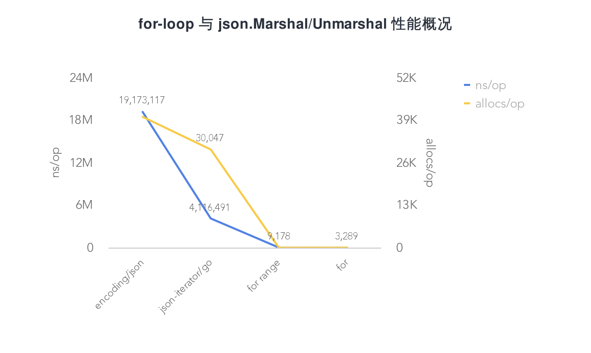

# 1.7 for-loop 與 json.Unmarshal 效能分析概要

在專案中，常常會遇到迴圈交換賦值的資料處理場景，尤其是 RPC，資料互動格式要轉為 Protobuf，賦值是無法避免的。一般會有如下幾種做法：

* for
* for range
* json.Marshal/Unmarshal

這時候又面臨 “選擇困難症”，用哪個好？又想程式碼量少，又擔心效能有沒有影響啊...

為了弄清楚這個疑惑，接下來將分別編寫三種使用場景。來簡單看看它們的效能情況，看看誰更 “好”

## 功能程式碼

```go
...
type Person struct {
    Name   string `json:"name"`
    Age    int    `json:"age"`
    Avatar string `json:"avatar"`
    Type   string `json:"type"`
}

type AgainPerson struct {
    Name   string `json:"name"`
    Age    int    `json:"age"`
    Avatar string `json:"avatar"`
    Type   string `json:"type"`
}

const MAX = 10000

func InitPerson() []Person {
    var persons []Person
    for i := 0; i < MAX; i++ {
        persons = append(persons, Person{
            Name:   "EDDYCJY",
            Age:    i,
            Avatar: "https://github.com/EDDYCJY",
            Type:   "Person",
        })
    }

    return persons
}

func ForStruct(p []Person, count int) {
    for i := 0; i < count; i++ {
        _, _ = i, p[i]
    }
}

func ForRangeStruct(p []Person) {
    for i, v := range p {
        _, _ = i, v
    }
}

func JsonToStruct(data []byte, againPerson []AgainPerson) ([]AgainPerson, error) {
    err := json.Unmarshal(data, &againPerson)
    return againPerson, err
}

func JsonIteratorToStruct(data []byte, againPerson []AgainPerson) ([]AgainPerson, error) {
    var jsonIter = jsoniter.ConfigCompatibleWithStandardLibrary
    err := jsonIter.Unmarshal(data, &againPerson)
    return againPerson, err
}
```
## 測試程式碼

```go
...
func BenchmarkForStruct(b *testing.B) {
    person := InitPerson()
    count := len(person)
    b.ResetTimer()
    for i := 0; i < b.N; i++ {
        ForStruct(person, count)
    }
}

func BenchmarkForRangeStruct(b *testing.B) {
    person := InitPerson()

    b.ResetTimer()
    for i := 0; i < b.N; i++ {
        ForRangeStruct(person)
    }
}

func BenchmarkJsonToStruct(b *testing.B) {
    var (
        person = InitPerson()
        againPersons []AgainPerson
    )
    data, err := json.Marshal(person)
    if err != nil {
        b.Fatalf("json.Marshal err: %v", err)
    }

    b.ResetTimer()
    for i := 0; i < b.N; i++ {
        JsonToStruct(data, againPersons)
    }
}

func BenchmarkJsonIteratorToStruct(b *testing.B) {
    var (
        person = InitPerson()
        againPersons []AgainPerson
    )
    data, err := json.Marshal(person)
    if err != nil {
        b.Fatalf("json.Marshal err: %v", err)
    }

    b.ResetTimer()
    for i := 0; i < b.N; i++ {
        JsonIteratorToStruct(data, againPersons)
    }
}
```
## 測試結果

```
BenchmarkForStruct-4                    500000          3289 ns/op           0 B/op           0 allocs/op
BenchmarkForRangeStruct-4               200000          9178 ns/op           0 B/op           0 allocs/op
BenchmarkJsonToStruct-4                    100      19173117 ns/op     2618509 B/op       40036 allocs/op
BenchmarkJsonIteratorToStruct-4            300       4116491 ns/op     3694017 B/op       30047 allocs/op
```

從測試結果來看，效能排名為：for < for range < json-iterator < encoding/json。接下來我們看看是什麼原因導致了這樣子的排名？

## 效能對比



### for-loop

在測試結果中，`for range` 在效能上相較 `for` 差。這是為什麼呢？在這裡我們可以參見 `for range` 的 [實作](https://github.com/gcc-mirror/gcc/blob/master/gcc/go/gofrontend/statements.cc)，偽實作如下：

```
for_temp := range
len_temp := len(for_temp)
for index_temp = 0; index_temp < len_temp; index_temp++ {
    value_temp = for_temp[index_temp]
    index = index_temp
    value = value_temp
    original body
}
```

透過分析偽實作，可得知 `for range` 相較 `for` 多做了如下事項

#### Expression

```
RangeClause = [ ExpressionList "=" | IdentifierList ":=" ] "range" Expression .
```

在迴圈開始之前會對範圍表示式進行求值，多做了 “解” 表示式的動作，得到了最終的範圍值

#### Copy

```
...
value_temp = for_temp[index_temp]
index = index_temp
value = value_temp
...
```

從偽實作上可以得出，`for range` 始終使用**值複製**的方式來生成迴圈變數。通俗來講，就是在每次迴圈時，都會對迴圈變數重新分配

#### 小結

透過上述的分析，可得知其比 `for` 慢的原因是 `for range` 有額外的效能開銷，主要為**值複製的動作**導致的效能下降。這是它慢的原因

那麼其實在 `for range` 中，我們可以使用 `_` 和 `T[i]` 也能達到和 `for` 差不多的效能。但這可能不是 `for range` 的設計本意了

### json.Marshal/Unmarshal

#### encoding/json

json 互轉是在三種方案中最慢的，這是為什麼呢？

眾所皆知，官方的 `encoding/json` 標準庫，是透過大量反射來實作的。那麼 “慢”，也是必然的。可參見下述程式碼：

```go
...
func newTypeEncoder(t reflect.Type, allowAddr bool) encoderFunc {
    ...
    switch t.Kind() {
    case reflect.Bool:
        return boolEncoder
    case reflect.Int, reflect.Int8, reflect.Int16, reflect.Int32, reflect.Int64:
        return intEncoder
    case reflect.Uint, reflect.Uint8, reflect.Uint16, reflect.Uint32, reflect.Uint64, reflect.Uintptr:
        return uintEncoder
    case reflect.Float32:
        return float32Encoder
    case reflect.Float64:
        return float64Encoder
    case reflect.String:
        return stringEncoder
    case reflect.Interface:
        return interfaceEncoder
    case reflect.Struct:
        return newStructEncoder(t)
    case reflect.Map:
        return newMapEncoder(t)
    case reflect.Slice:
        return newSliceEncoder(t)
    case reflect.Array:
        return newArrayEncoder(t)
    case reflect.Ptr:
        return newPtrEncoder(t)
    default:
        return unsupportedTypeEncoder
    }
}
```
既然官方的標準庫存在一定的 “問題”，那麼有沒有其他解決方法呢？目前在社群裡，大多為兩類方案。如下：

* 預編譯生成程式碼（提前確定型別），可以解決執行時的反射帶來的效能開銷。缺點是增加了預生成的步驟
* 最佳化序列化的邏輯，效能達到最大化

接下來的實驗，我們用第二種方案的庫來測試，看看有沒有改變。另外也推薦大家瞭解如下專案：

* [json-iterator/go](https://github.com/json-iterator/go)
* [mailru/easyjson](https://github.com/mailru/easyjson)
* [pquerna/ffjson](https://github.com/pquerna/ffjson)

#### json-iterator/go

目前社群較常用的是 json-iterator/go，我們在測試程式碼中用到了它

它的用法與標準庫 100% 相容，並且效能有較大提升。我們一起粗略的看下是怎麼做到的，如下：

**reflect2**

利用 [modern-go/reflect2](https://github.com/modern-go/reflect2) 減少執行時排程開銷

```go
...
type StructDescriptor struct {
    Type   reflect2.Type
    Fields []*Binding
}

...
type Binding struct {
    levels    []int
    Field     reflect2.StructField
    FromNames []string
    ToNames   []string
    Encoder   ValEncoder
    Decoder   ValDecoder
}

type Extension interface {
    UpdateStructDescriptor(structDescriptor *StructDescriptor)
    CreateMapKeyDecoder(typ reflect2.Type) ValDecoder
    CreateMapKeyEncoder(typ reflect2.Type) ValEncoder
    CreateDecoder(typ reflect2.Type) ValDecoder
    CreateEncoder(typ reflect2.Type) ValEncoder
    DecorateDecoder(typ reflect2.Type, decoder ValDecoder) ValDecoder
    DecorateEncoder(typ reflect2.Type, encoder ValEncoder) ValEncoder
}
```
**struct Encoder/Decoder Cache**

型別為 struct 時，只需要反射一次 Name 和 Type，會快取 struct Encoder 和 Decoder

```go
var typeDecoders = map[string]ValDecoder{}
var fieldDecoders = map[string]ValDecoder{}
var typeEncoders = map[string]ValEncoder{}
var fieldEncoders = map[string]ValEncoder{}
var extensions = []Extension{}

....

fieldNames := calcFieldNames(field.Name(), tagParts[0], tag)
fieldCacheKey := fmt.Sprintf("%s/%s", typ.String(), field.Name())
decoder := fieldDecoders[fieldCacheKey]
if decoder == nil {
    decoder = decoderOfType(ctx.append(field.Name()), field.Type())
}
encoder := fieldEncoders[fieldCacheKey]
if encoder == nil {
    encoder = encoderOfType(ctx.append(field.Name()), field.Type())
}
```
**文字解析最佳化**

#### 小結

相較於官方標準庫，第三方庫 `json-iterator/go` 在執行時上做的更好。這是它快的原因

有個需要注意的點，在 Go1.10 後 `map` 型別與標準庫的已經沒有太大的效能差異。但是，例如 `struct` 型別等仍然有較大的效能提高

## 總結

在本文中，我們首先進行了效能測試，再分析了不同方案，得知為什麼了快慢的原因。那麼最終在選擇方案時，可以根據不同的應用場景去抉擇：

* 對效能開銷有較高要求：選用 `for`，開銷最小
* 中規中矩：選用 `for range`，大物件慎用
* 量小、佔用小、數量可控：選用 `json.Marshal/Unmarshal` 的方案也可以。其**重複程式碼**少，但開銷最大

在絕大多數場景中，使用哪種並沒有太大的影響。但作為工程師你應當清楚其利弊。以上就是不同的方案**分析概要**，希望對你有所幫助 :)
