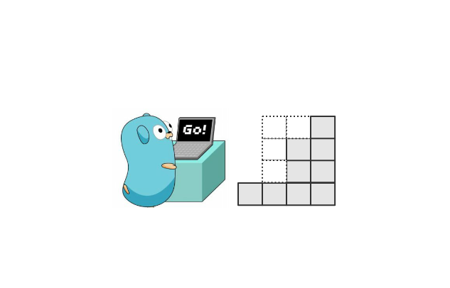
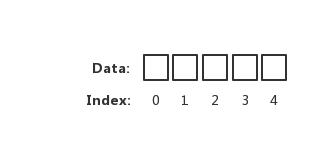
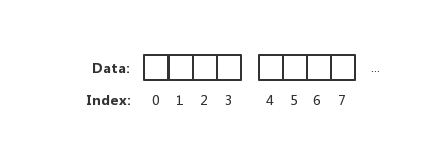
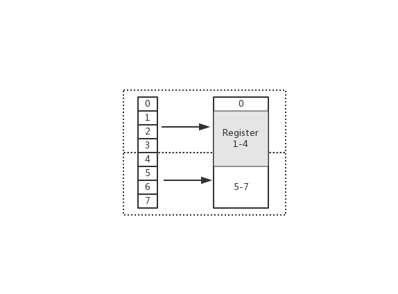

# 1.5 在 Go 中恰到好處的記憶體對齊



## 問題

```go
type Part1 struct {
    a bool
    b int32
    c int8
    d int64
    e byte
}
```
在開始之前，希望你計算一下 `Part1` 共佔用的大小是多少呢？

```go
func main() {
    fmt.Printf("bool size: %d\n", unsafe.Sizeof(bool(true)))
    fmt.Printf("int32 size: %d\n", unsafe.Sizeof(int32(0)))
    fmt.Printf("int8 size: %d\n", unsafe.Sizeof(int8(0)))
    fmt.Printf("int64 size: %d\n", unsafe.Sizeof(int64(0)))
    fmt.Printf("byte size: %d\n", unsafe.Sizeof(byte(0)))
    fmt.Printf("string size: %d\n", unsafe.Sizeof("EDDYCJY"))
}
```
輸出結果：

```
bool size: 1
int32 size: 4
int8 size: 1
int64 size: 8
byte size: 1
string size: 16
```

這麼一算，`Part1` 這一個結構體的佔用記憶體大小為 1+4+1+8+1 = 15 個位元組。相信有的小夥伴是這麼算的，看上去也沒什麼毛病

真實情況是怎麼樣的呢？我們實際呼叫看看，如下：

```go
type Part1 struct {
    a bool
    b int32
    c int8
    d int64
    e byte
}

func main() {
    part1 := Part1{}

    fmt.Printf("part1 size: %d, align: %d\n", unsafe.Sizeof(part1), unsafe.Alignof(part1))
}
```
輸出結果：

```
part1 size: 32, align: 8
```

最終輸出為佔用 32 個位元組。這與前面所預期的結果完全不一樣。這充分地說明了先前的計算方式是錯誤的。為什麼呢？

在這裡要提到 “記憶體對齊” 這一概念，才能夠用正確的姿勢去計算，接下來我們詳細的講講它是什麼

## 記憶體對齊

有的小夥伴可能會認為記憶體讀取，就是一個簡單的位元組陣列擺放



上圖表示一個坑一個蘿蔔的記憶體讀取方式。但實際上 CPU 並不會以一個一個位元組去讀取和寫入記憶體。相反 CPU 讀取記憶體是**一塊一塊讀取**的，塊的大小可以為 2、4、6、8、16 位元組等大小。塊大小我們稱其為**記憶體訪問粒度**。如下圖：



在樣例中，假設訪問粒度為 4。 CPU 是以每 4 個位元組大小的訪問粒度去讀取和寫入記憶體的。這才是正確的姿勢

### 為什麼要關心對齊

* 你正在編寫的程式碼在效能（CPU、Memory）方面有一定的要求
* 你正在處理向量方面的指令
* 某些硬體平臺（ARM）體系不支援未對齊的記憶體訪問

另外作為一個工程師，你也很有必要學習這塊知識點哦 :)

### 為什麼要做對齊

* 平臺（移植性）原因：不是所有的硬體平臺都能夠訪問任意地址上的任意資料。例如：特定的硬體平臺只允許在特定地址取得特定型別的資料，否則會導致異常情況
* 效能原因：若訪問未對齊的記憶體，將會導致 CPU 進行兩次記憶體訪問，並且要花費額外的時鐘週期來處理對齊及運算。而本身就對齊的記憶體僅需要一次訪問就可以完成讀取動作



在上圖中，假設從 Index 1 開始讀取，將會出現很崩潰的問題。因為它的記憶體訪問邊界是不對齊的。因此 CPU 會做一些額外的處理工作。如下：

1. CPU **首次**讀取未對齊地址的第一個記憶體塊，讀取 0-3 位元組。並移除不需要的位元組 0
2. CPU **再次**讀取未對齊地址的第二個記憶體塊，讀取 4-7 位元組。並移除不需要的位元組 5、6、7 位元組
3. 合併 1-4 位元組的資料
4. 合併後放入暫存器

從上述流程可得出，不做 “記憶體對齊” 是一件有點 "麻煩" 的事。因為它會增加許多耗費時間的動作

而假設做了記憶體對齊，從 Index 0 開始讀取 4 個位元組，只需要讀取一次，也不需要額外的運算。這顯然高效很多，是標準的**空間換時間**做法

### 預設係數

在不同平臺上的編譯器都有自己預設的 “對齊係數”，可透過預編譯命令 `#pragma pack(n)` 進行變更，n 就是代指 “對齊係數”。一般來講，我們常用的平臺的係數如下：

* 32 位：4
* 64 位：8

另外要注意，不同硬體平臺佔用的大小和對齊值都可能是不一樣的。因此本文的值不是唯一的，除錯的時候需按本機的實際情況考慮

### 成員對齊

```go
func main() {
    fmt.Printf("bool align: %d\n", unsafe.Alignof(bool(true)))
    fmt.Printf("int32 align: %d\n", unsafe.Alignof(int32(0)))
    fmt.Printf("int8 align: %d\n", unsafe.Alignof(int8(0)))
    fmt.Printf("int64 align: %d\n", unsafe.Alignof(int64(0)))
    fmt.Printf("byte align: %d\n", unsafe.Alignof(byte(0)))
    fmt.Printf("string align: %d\n", unsafe.Alignof("EDDYCJY"))
    fmt.Printf("map align: %d\n", unsafe.Alignof(map[string]string{}))
}
```
輸出結果：

```
bool align: 1
int32 align: 4
int8 align: 1
int64 align: 8
byte align: 1
string align: 8
map align: 8
```

在 Go 中可以呼叫 `unsafe.Alignof` 來返回相應型別的對齊係數。透過觀察輸出結果，可得知基本都是 `2^n`，最大也不會超過 8。這是因為我手提（64 位）編譯器預設對齊係數是 8，因此最大值不會超過這個數

### 整體對齊

在上小節中，提到了結構體中的成員變數要做位元組對齊。那麼想當然身為最終結果的結構體，也是需要做位元組對齊的

### 對齊規則

* 結構體的成員變數，第一個成員變數的偏移量為 0。往後的每個成員變數的對齊值必須為**編譯器預設對齊長度**（`#pragma pack(n)`）或**當前成員變數型別的長度**（`unsafe.Sizeof`），取**最小值作為當前型別的對齊值**。其偏移量必須為對齊值的整數倍
* 結構體本身，對齊值必須為**編譯器預設對齊長度**（`#pragma pack(n)`）或**結構體的所有成員變數型別中的最大長度**，取**最大數的最小整數倍**作為對齊值
* 結合以上兩點，可得知若**編譯器預設對齊長度**（`#pragma pack(n)`）超過結構體內成員變數的型別最大長度時，預設對齊長度是沒有任何意義的

## 分析流程

接下來我們一起分析一下，“它” 到底經歷了些什麼，影響了 “預期” 結果

| 成員變數  | 型別    | 偏移量 | 自身佔用 |
| ----- | ----- | --- | ---- |
| a     | bool  | 0   | 1    |
| 位元組對齊  | 無     | 1   | 3    |
| b     | int32 | 4   | 4    |
| c     | int8  | 8   | 1    |
| 位元組對齊  | 無     | 9   | 7    |
| d     | int64 | 16  | 8    |
| e     | byte  | 24  | 1    |
| 位元組對齊  | 無     | 25  | 7    |
| 總佔用大小 | -     | -   | 32   |

### 成員對齊

* 第一個成員 a
  * 型別為 bool
  * 大小/對齊值為 1 位元組
  * 初始地址，偏移量為 0。佔用了第 1 位
* 第二個成員 b
  * 型別為 int32
  * 大小/對齊值為 4 位元組
  * 根據規則 1，其偏移量必須為 4 的整數倍。確定偏移量為 4，因此 2-4 位為 Padding。而當前數值從第 5 位開始填充，到第 8 位。如下：axxx|bbbb
* 第三個成員 c
  * 型別為 int8
  * 大小/對齊值為 1 位元組
  * 根據規則1，其偏移量必須為 1 的整數倍。當前偏移量為 8。不需要額外對齊，填充 1 個位元組到第 9 位。如下：axxx|bbbb|c...
* 第四個成員 d
  * 型別為 int64
  * 大小/對齊值為 8 位元組
  * 根據規則 1，其偏移量必須為 8 的整數倍。確定偏移量為 16，因此

    9-16 位為 Padding。而當前數值從第 17 位開始寫入，到第 24 位。如下：axxx|bbbb|cxxx|xxxx|dddd|dddd
* 第五個成員 e
  * 型別為 byte
  * 大小/對齊值為 1 位元組
  * 根據規則 1，其偏移量必須為 1 的整數倍。當前偏移量為 24。不需要額外對齊，填充 1 個位元組到第 25 位。如下：axxx|bbbb|cxxx|xxxx|dddd|dddd|e...

### 整體對齊

在每個成員變數進行對齊後，根據規則 2，整個結構體本身也要進行位元組對齊，因為可發現它可能並不是 `2^n`，不是偶數倍。顯然不符合對齊的規則

根據規則 2，可得出對齊值為 8。現在的偏移量為 25，不是 8 的整倍數。因此確定偏移量為 32。對結構體進行對齊

### 結果

Part1 記憶體佈局：axxx|bbbb|cxxx|xxxx|dddd|dddd|exxx|xxxx

### 小結

透過本節的分析，可得知先前的 “推算” 為什麼錯誤？

是因為實際記憶體管理並非 “一個蘿蔔一個坑” 的思想。而是一塊一塊。透過空間換時間（效率）的思想來完成這塊讀取、寫入。另外也需要兼顧不同平臺的記憶體操作情況

## 巧妙的結構體

在上一小節，可得知根據成員變數的型別不同，其結構體的記憶體會產生對齊等動作。那假設欄位順序不同，會不會有什麼變化呢？我們一起來試試吧 :-)

```go
type Part1 struct {
    a bool
    b int32
    c int8
    d int64
    e byte
}

type Part2 struct {
    e byte
    c int8
    a bool
    b int32
    d int64
}

func main() {
    part1 := Part1{}
    part2 := Part2{}

    fmt.Printf("part1 size: %d, align: %d\n", unsafe.Sizeof(part1), unsafe.Alignof(part1))
    fmt.Printf("part2 size: %d, align: %d\n", unsafe.Sizeof(part2), unsafe.Alignof(part2))
}
```
輸出結果：

```
part1 size: 32, align: 8
part2 size: 16, align: 8
```

透過結果可以驚喜的發現，只是 “簡單” 對成員變數的欄位順序進行改變，就改變了結構體佔用大小

接下來我們一起剖析一下 `Part2`，看看它的內部到底和上一位之間有什麼區別，才導致了這樣的結果？

### 分析流程

| 成員變數  | 型別    | 偏移量 | 自身佔用 |
| ----- | ----- | --- | ---- |
| e     | byte  | 0   | 1    |
| c     | int8  | 1   | 1    |
| a     | bool  | 2   | 1    |
| 位元組對齊  | 無     | 3   | 1    |
| b     | int32 | 4   | 4    |
| d     | int64 | 8   | 8    |
| 總佔用大小 | -     | -   | 16   |

#### 成員對齊

* 第一個成員 e
  * 型別為 byte
  * 大小/對齊值為 1 位元組
  * 初始地址，偏移量為 0。佔用了第 1 位
* 第二個成員 c
  * 型別為 int8
  * 大小/對齊值為 1 位元組
  * 根據規則1，其偏移量必須為 1 的整數倍。當前偏移量為 2。不需要額外對齊
* 第三個成員 a
  * 型別為 bool
  * 大小/對齊值為 1 位元組
  * 根據規則1，其偏移量必須為 1 的整數倍。當前偏移量為 3。不需要額外對齊
* 第四個成員 b
  * 型別為 int32
  * 大小/對齊值為 4 位元組
  * 根據規則1，其偏移量必須為 4 的整數倍。確定偏移量為 4，因此第 3 位為 Padding。而當前數值從第 4 位開始填充，到第 8 位。如下：ecax|bbbb
* 第五個成員 d
  * 型別為 int64
  * 大小/對齊值為 8 位元組
  * 根據規則1，其偏移量必須為 8 的整數倍。當前偏移量為 8。不需要額外對齊，從 9-16 位填充 8 個位元組。如下：ecax|bbbb|dddd|dddd

#### 整體對齊

符合規則 2，不需要額外對齊

#### 結果

Part2 記憶體佈局：ecax|bbbb|dddd|dddd

## 總結

透過對比 `Part1` 和 `Part2` 的記憶體佈局，你會發現兩者有很大的不同。如下：

* Part1：axxx|bbbb|cxxx|xxxx|dddd|dddd|exxx|xxxx
* Part2：ecax|bbbb|dddd|dddd

仔細一看，`Part1` 存在許多 Padding。顯然它佔據了不少空間，那麼 Padding 是怎麼出現的呢？

透過本文的介紹，可得知是由於不同型別導致需要進行位元組對齊，以此保證記憶體的訪問邊界

那麼也不難理解，為什麼**調整結構體內成員變數的欄位順序**就能達到縮小結構體佔用大小的疑問了，是因為巧妙地減少了 Padding 的存在。讓它們更 “緊湊” 了。這一點對於加深 Go 的記憶體佈局印象和大物件的最佳化非常有幫

當然了，沒什麼特殊問題，你可以不關注這一塊。但你要知道這塊知識點 😄

## 參考

* [Data structure alignment](https://en.wikipedia.org/wiki/Data_structure_alignment)
* [Data alignment](https://www.ibm.com/developerworks/library/pa-dalign/)
