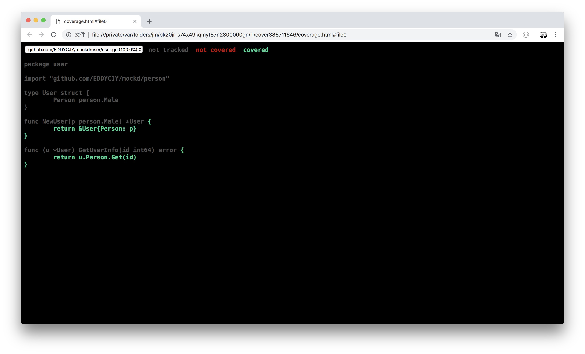

# 1.4 使用 Gomock 進行單元測試

在實際專案中，需要進行單元測試的時候。卻往往發現有一大堆依賴項。這時候就是 [Gomock](https://github.com/golang/mock) 大顯身手的時候了

Gomock 是 Go 語言的一個 mock 框架，官方的那種 🤪

## 安裝

```
$ go get -u github.com/golang/mock/gomock
$ go install github.com/golang/mock/mockgen
```

1. 第一步：我們將安裝 gomock 第三方庫和 mock 程式碼的生成工具 mockgen。而後者可以大大的節省我們的工作量。只需要瞭解其使用方式就可以
2. 第二步：輸入 `mockgen` 驗證程式碼生成工具是否安裝正確。若無法正常響應，請檢查 `bin` 目錄下是否包含該二進位制檔案

### 用法

在 `mockgen` 命令中，支援兩種生成模式：

1. source：從原始檔生成 mock 介面（透過 -source 啟用）

```
mockgen -source=foo.go [other options]
```

1. reflect：透過使用反射程式來生成 mock 介面。它透過傳遞兩個非標誌引數來啟用：匯入路徑和逗號分隔的介面列表

```
mockgen database/sql/driver Conn,Driver
```

從本質上來講，兩種方式生成的 mock 程式碼並沒有什麼區別。因此選擇合適的就可以了

## 寫測試用例

在本文將模擬一個簡單 Demo 來編寫測試用例，熟悉整體的測試流程

### 步驟

1. 想清楚整體邏輯
2. 定義想要（模擬）依賴項的 interface（介面）
3. 使用 `mockgen` 命令對所需 mock 的 interface 生成 mock 檔案
4. 編寫單元測試的邏輯，在測試中使用 mock
5. 進行單元測試的驗證

### 目錄

```
├── mock
├── person
│   └── male.go
└── user
    ├── user.go
    └── user_test.go
```

### 編寫

#### interface 方法

開啟 person/male.go 檔案，寫入以下內容：

```go
package person

type Male interface {
    Get(id int64) error
}
```
#### 呼叫方法

開啟 user/user.go 檔案，寫入以下內容：

```go
package user

import "github.com/EDDYCJY/mockd/person"

type User struct {
    Person person.Male
}

func NewUser(p person.Male) *User {
    return &User{Person: p}
}

func (u *User) GetUserInfo(id int64) error {
    return u.Person.Get(id)
}
```
#### 生成 mock 檔案

回到 `mockd/` 的根目錄下，執行以下命令

```
$ mockgen -source=./person/male.go -destination=./mock/male_mock.go -package=mock
```

在執行完畢後，可以發現 `mock/` 目錄下多出了 male\_mock.go 檔案，這就是 mock 檔案。那麼命令中的指令又分別有什麼用呢？如下：

* -source：設定需要模擬（mock）的介面檔案
* -destination：設定 mock 檔案輸出的地方，若不設定則列印到標準輸出中
* -package：設定 mock 檔案的包名，若不設定則為 `mock_` 字首加上檔名（如本文的包名會為 mock\_person）

想了解更多的指令符，可參見 [官方文件](https://github.com/golang/mock#running-mockgen)

**輸出的 mock 檔案**

```go
// Code generated by MockGen. DO NOT EDIT.
// Source: ./person/male.go

// Package mock is a generated GoMock package.
package mock

import (
    gomock "github.com/golang/mock/gomock"
    reflect "reflect"
)

// MockMale is a mock of Male interface
type MockMale struct {
    ctrl     *gomock.Controller
    recorder *MockMaleMockRecorder
}

// MockMaleMockRecorder is the mock recorder for MockMale
type MockMaleMockRecorder struct {
    mock *MockMale
}

// NewMockMale creates a new mock instance
func NewMockMale(ctrl *gomock.Controller) *MockMale {
    mock := &MockMale{ctrl: ctrl}
    mock.recorder = &MockMaleMockRecorder{mock}
    return mock
}

// EXPECT returns an object that allows the caller to indicate expected use
func (m *MockMale) EXPECT() *MockMaleMockRecorder {
    return m.recorder
}

// Get mocks base method
func (m *MockMale) Get(id int64) error {
    ret := m.ctrl.Call(m, "Get", id)
    ret0, _ := ret[0].(error)
    return ret0
}

// Get indicates an expected call of Get
func (mr *MockMaleMockRecorder) Get(id interface{}) *gomock.Call {
    return mr.mock.ctrl.RecordCallWithMethodType(mr.mock, "Get", reflect.TypeOf((*MockMale)(nil).Get), id)
}
```
#### 測試用例

開啟 user/user\_test.go 檔案，寫入以下內容：

```go
package user

import (
    "testing"

    "github.com/EDDYCJY/mockd/mock"

    "github.com/golang/mock/gomock"
)

func TestUser_GetUserInfo(t *testing.T) {
    ctl := gomock.NewController(t)
    defer ctl.Finish()

    var id int64 = 1
    mockMale := mock.NewMockMale(ctl)
    gomock.InOrder(
        mockMale.EXPECT().Get(id).Return(nil),
    )

    user := NewUser(mockMale)
    err := user.GetUserInfo(id)
    if err != nil {
        t.Errorf("user.GetUserInfo err: %v", err)
    }
}
```
1. gomock.NewController：返回 `gomock.Controller`，它代表 mock 生態系統中的頂級控制元件。定義了 mock 物件的範圍、生命週期和期待值。另外它在多個 goroutine 中是安全的
2. mock.NewMockMale：建立一個新的 mock 例項
3. gomock.InOrder：宣告給定的呼叫應按順序進行（是對 gomock.After 的二次封裝）
4. mockMale.EXPECT().Get(id).Return(nil)：這裡有三個步驟，`EXPECT()`返回一個允許呼叫者設定**期望**和**返回值**的物件。`Get(id)` 是設定入參並呼叫 mock 例項中的方法。`Return(nil)` 是設定先前呼叫的方法出參。簡單來說，就是設定入參並呼叫，最後設定返回值
5. NewUser(mockMale)：建立 User 例項，值得注意的是，在這裡**注入了 mock 物件**，因此實際在隨後的 `user.GetUserInfo(id)` 呼叫（入參：id 為 1）中。它呼叫的是我們事先模擬好的 mock 方法
6. ctl.Finish()：進行 mock 用例的期望值斷言，一般會使用 `defer` 延遲執行，以防止我們忘記這一操作

### 測試

回到 `mockd/` 的根目錄下，執行以下命令

```
$ go test ./user
ok      github.com/EDDYCJY/mockd/user
```

看到這樣的結果，就大功告成啦！你可以自己調整一下 `Return()` 的返回值，以此得到不一樣的測試結果哦 😄

## 檢視測試情況

### 測試覆蓋率

```
$ go test -cover ./user
ok      github.com/EDDYCJY/mockd/user    (cached)    coverage: 100.0% of statements
```

可透過設定 `-cover` 標誌符來開啟覆蓋率的統計，展示內容為 `coverage: 100.0%`。

### 視覺化介面

1. 生成測試覆蓋率的 profile 檔案

```
$ go test ./... -coverprofile=cover.out
```

1. 利用 profile 檔案生成視覺化介面

```
$ go tool cover -html=cover.out
```

1. 檢視視覺化介面，分析覆蓋情況



## 更多

### 一、常用 mock 方法

#### 呼叫方法

* Call.Do()：宣告在匹配時要執行的操作
* Call.DoAndReturn()：宣告在匹配呼叫時要執行的操作，並且模擬返回該函式的返回值
* Call.MaxTimes()：設定最大的呼叫次數為 n 次
* Call.MinTimes()：設定最小的呼叫次數為 n 次
* Call.AnyTimes()：允許呼叫次數為 0 次或更多次
* Call.Times()：設定呼叫次數為 n 次

#### 引數匹配

* gomock.Any()：匹配任意值
* gomock.Eq()：透過反射匹配到指定的型別值，而不需要手動設定
* gomock.Nil()：返回 nil

建議更多的方法可參見 [官方文件](https://godoc.org/github.com/golang/mock/gomock#pkg-index)

### 二、生成多個 mock 檔案

你可能會想一條條命令生成 mock 檔案，豈不得崩潰？

當然，官方提供了更方便的方式，我們可以利用 `go:generate` 來完成批次處理的功能

```
go generate [-run regexp] [-n] [-v] [-x] [build flags] [file.go... | packages]
```

#### 修改 interface 方法

開啟 person/male.go 檔案，修改為以下內容：

```go
package person

//go:generate mockgen -destination=../mock/male_mock.go -package=mock github.com/EDDYCJY/mockd/person Male

type Male interface {
    Get(id int64) error
}
```
我們關注到 `go:generate` 這條語句，可分為以下部分：

1. 宣告 `//go:generate` （注意不要留空格）
2. 使用 `mockgen` 命令
3. 定義 `-destination`
4. 定義 `-package`
5. 定義 `source`，此處為 person 的包路徑
6. 定義 `interfaces`，此處為 `Male`

#### 重新生成 mock 檔案

回到 `mockd/` 的根目錄下，執行以下命令

```
$ go generate ./...
```

再檢查 `mock/` 發現也已經正確生成了，在多個檔案時是不是很方便呢 🤩

## 總結

在單元測試這一環，gomock 給我們提供了極大的便利。能夠 mock 掉許許多多的依賴項

其中還有很多的使用方式和功能。你可以 mark 住後詳細閱讀下官方文件，記憶會更深刻
