# 1.14 乾貨滿滿的 Go Modules 和 goproxy.cn

大家好，我是一隻普通的煎魚，週四晚上很有幸邀請到 goproxy.cn 的作者 @盛傲飛（@aofei） 到 Go 夜讀給我們進行第 61 期 《Go Modules、Go Module Proxy 和 goproxy.cn》的技術分享。

本次 @盛傲飛 的夜讀分享，是對 Go Modules 的一次很好的解讀，比較貼近工程實踐，我必然希望把這塊的知識更多的分享給大家，因此有了今天本篇文章，同時大家也可以多關注 Go 夜讀，每週會透過 zoom 線上直播的方式分享 Go 相關的技術話題，希望對大家有所幫助。

## 前言

Go 1.11 推出的模組（Modules）為 Go 語言開發者打開了一扇新的大門，理想化的依賴管理解決方案使得 Go 語言朝著計算機程式設計史上的第一個依賴烏托邦（Deptopia）邁進。隨著模組一起推出的還有模組代理協議（Module proxy protocol），透過這個協議我們可以實作 Go 模組代理（Go module proxy），也就是依賴映象。

Go 1.13 的釋出為模組帶來了大量的改進，所以模組的扶正就是這次 Go 1.13 釋出中開發者能直接感覺到的最大變化。而問題在於，Go 1.13 中的 GOPROXY 環境變數擁有了一個在中國大陸無法訪問到的預設值 `proxy.golang.org`，經過大家在 golang/go#31755 中激烈的討論（有些人甚至將話提上升到了“自由世界”的層次），最終 Go 核心團隊仍然無法為中國開發者提供一個可在中國大陸訪問的官方模組代理。

為了今後中國的 Go 語言開發者能更好地進行開發，七牛雲推出了非營利性專案 `goproxy.cn`，其目標是為中國和世界上其他地方的 Gopher 們提供一個免費的、可靠的、持續線上的且經過 CDN 加速的模組代理。可以預見未來是屬於模組化的，所以 Go 語言開發者能越早切入模組就能越早進入未來。

如果說 Go 1.11 和 Go 1.12 時由於模組的不完善你不願意切入，那麼 Go 1.13 你則可以大膽地開始放心使用。本次分享將討論如何使用模組和模組代理，以及在它們的使用中會常遇見的坑，還會講解如何快速搭建自己的私有模組代理，並簡單地介紹一下七牛雲推出的 `goproxy.cn` 以及它的出現對於中國 Go 語言開發者來說重要在何處。

## 目錄

* Go Modules 簡介
* 快速遷移專案至 Go Modules
* 使用 Go Modules 時常遇見的坑
  * 坑 1:判斷專案是否啟用了 Go Modules
  * 坑 2:管理 Go 的環境變數
  * 坑 3:從 dep、glide 等遷移至 Go Modules
  * 坑 4:拉取私有模組
  * 坑 5:更新現有的模組&#x20;
  * 坑 6:主版本號&#x20;
* Go Module Proxy 簡介
* Goproxy 中國(goproxy.cn)

## Go Modules 簡介

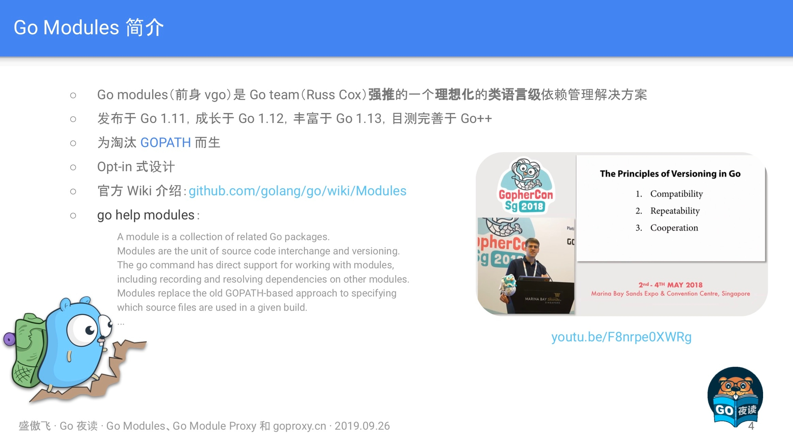

Go modules (前身 vgo) 是 Go team (Russ Cox) **強推**的一個**理想化**的**類語言級**依賴管理解決方案，它是和 Go1.11 一同釋出的，在 Go1.13 做了大量的最佳化和調整，目前已經變得比較不錯，如果你想用 Go modules，但還停留在 1.11/1.12 版本的話，強烈建議升級。

### 三個關鍵字

#### 強推

首先這並不是亂說的，因為 Go modules 確實是被強推出來的，如下：

* 之前：大家都知道在 Go modules 之前還有一個叫 dep 的專案，它也是 Go 的一個官方的實驗性專案，目的同樣也是為了解決 Go 在依賴管理方面的短板。在 Russ Cox 還沒有提出 Go modules 的時候，社群裡面幾乎所有的人都認為 dep 肯定就是未來 Go 官方的依賴管理解決方案了。
* 後來：誰都沒想到半路殺出個程咬金，Russ Cox 義無反顧地推出了 Go modules，這瞬間導致一石激起千層浪，讓社群炸了鍋。大家一致認為 Go team 實在是太霸道、太獨裁了，連個招呼都不打一聲。我記得當時有很多人在網上跟 Russ Cox 口水戰，各種依賴管理解決方案的專家都冒出來發表意見，討論範圍甚至一度超出了 Go 語言的圈子觸及到了其他語言的領域。

#### 理想化

從他強制要求使用語義化版本控制這一點來說就很理想化了，如下：

* Go modules 狠到如果你的 Tag 沒有遵循語義化版本控制那麼它就會忽略你的 Tag，然後根據你的 Commit 時間和雜湊值再為你生成一個假定的符合語義化版本控制的版本號。
* Go modules 還預設認為，只要你的主版本號不變，那這個模組版本肯定就不包含 Breaking changes，因為語義化版本控制就是這麼規定的啊。是不是很理想化。

#### 類語言級：

這個關鍵詞其實是我自己瞎編的，我只是單純地個人認為 Go modules 在設計上就像個語言級特性一樣，比如如果你的主版本號發生變更，那麼你的程式碼裡的 import path 也得跟著變，它認為主版本號不同的兩個模組版本是完全不同的兩個模組。此外，Go moduels 在設計上跟 go 整個命令都結合得相當緊密，無處不在，所以我才說它是一個有點兒像語言級的特性，雖然不是太嚴謹。

### 推 Go Modules 的人是誰

那麼在上文中提到的 Russ Cox 何許人也呢，很多人應該都知道他，他是 Go 這個專案目前程式碼提交量最多的人，甚至是第二名的兩倍還要多。

Russ Cox 還是 Go 現在的掌舵人（大家應該知道之前 Go 的掌舵人是 Rob Pike，但是聽說由於他本人不喜歡特朗普執政所以離開了美國，然後他歲數也挺大的了，所以也正在逐漸交權，不過現在還是在參與 Go 的發展）。

Russ Cox 的個人能力相當強，看問題的角度也很獨特，這也就是為什麼他剛一提出 Go modules 的概念就能引起那麼大範圍的響應。雖然是被強推的，但事實也證明當下的 Go modules 表現得確實很優秀，所以這表明一定程度上的 “獨裁” 還是可以接受的，至少可以保證一個專案能更加專一地朝著一個方向發展。

總之，無論如何 Go modules 現在都成了 Go 語言的一個密不可分的元件。

### GOPATH

Go modules 出現的目的之一就是為了解決 GOPATH 的問題，也就相當於是拋棄 GOPATH 了。

### Opt-in

Go modules 還處於 Opt-in 階段，就是你想用就用，不用就不用，不強制你。但是未來很有可能 Go2 就強制使用了。

### "module" != "package"

有一點需要糾正，就是“模組”和“包”，也就是 “module” 和 “package” 這兩個術語並不是等價的，是 “集合” 跟 “元素” 的關係，“模組” 包含 “包”，“包” 屬於 “模組”，一個 “模組” 是零個、一個或多個 “包” 的集合。

## Go Modules 相關屬性

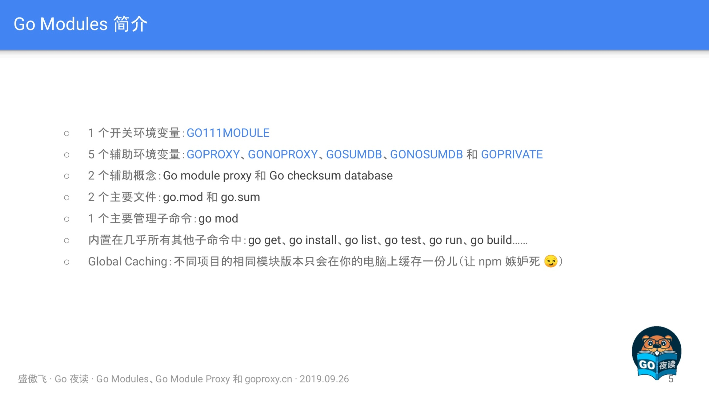

### go.mod

```
module example.com/foobar

go 1.13

require (
    example.com/apple v0.1.2
    example.com/banana v1.2.3
    example.com/banana/v2 v2.3.4
    example.com/pineapple v0.0.0-20190924185754-1b0db40df49a
)

exclude example.com/banana v1.2.4
replace example.com/apple v0.1.2 => example.com/rda v0.1.0 
replace example.com/banana => example.com/hugebanana
```

go.mod 是啟用了 Go moduels 的專案所必須的最重要的檔案，它描述了當前專案（也就是當前模組）的元資訊，每一行都以一個動詞開頭，目前有以下 5 個動詞:

* module：用於定義當前專案的模組路徑。
* go：用於設定預期的 Go 版本。
* require：用於設定一個特定的模組版本。
* exclude：用於從使用中排除一個特定的模組版本。
* replace：用於將一個模組版本替換為另外一個模組版本。

這裡的填寫格式基本為包引用路徑+版本號，另外比較特殊的是 `go $version`，目前從 Go1.13 的程式碼裡來看，還只是個標識作用，暫時未知未來是否有更大的作用。

### go.sum

go.sum 是類似於比如 dep 的 Gopkg.lock 的一類檔案，它詳細羅列了當前專案直接或間接依賴的所有模組版本，並寫明瞭那些模組版本的 SHA-256 雜湊值以備 Go 在今後的操作中保證專案所依賴的那些模組版本不會被篡改。

```
example.com/apple v0.1.2 h1:WXkYYl6Yr3qBf1K79EBnL4mak0OimBfB0XUf9Vl28OQ= 
example.com/apple v0.1.2/go.mod h1:xHWCNGjB5oqiDr8zfno3MHue2Ht5sIBksp03qcyfWMU= example.com/banana v1.2.3 h1:qHgHjyoNFV7jgucU8QZUuU4gcdhfs8QW1kw68OD2Lag= 
example.com/banana v1.2.3/go.mod h1:HSdplMjZKSmBqAxg5vPj2TmRDmfkzw+cTzAElWljhcU= example.com/banana/v2 v2.3.4 h1:zl/OfRA6nftbBK9qTohYBJ5xvw6C/oNKizR7cZGl3cI= example.com/banana/v2 v2.3.4/go.mod h1:eZbhyaAYD41SGSSsnmcpxVoRiQ/MPUTjUdIIOT9Um7Q= 
...
```

我們可以看到一個模組路徑可能有如下兩種：

```
example.com/apple v0.1.2 h1:WXkYYl6Yr3qBf1K79EBnL4mak0OimBfB0XUf9Vl28OQ= 
example.com/apple v0.1.2/go.mod h1:xHWCNGjB5oqiDr8zfno3MHue2Ht5sIBksp03qcyfWMU=
```

前者為 Go modules 打包整個模組包檔案 zip 後再進行 hash 值，而後者為針對 go.mod 的 hash 值。他們兩者，要不就是同時存在，要不就是隻存在 go.mod hash。

那什麼情況下會不存在 zip hash 呢，就是當 Go 認為肯定用不到某個模組版本的時候就會省略它的 zip hash，就會出現不存在 zip hash，只存在 go.mod hash 的情況。

### GO111MODULE

這個環境變數主要是 Go modules 的開關，主要有以下引數：

* auto：只在專案包含了 go.mod 檔案時啟用 Go modules，在 Go 1.13 中仍然是預設值，詳見 ：golang.org/issue/31857。
* on：無腦啟用 Go modules，推薦設定，未來版本中的預設值，讓 GOPATH 從此成為歷史。
* off：停用 Go modules。

### GOPROXY

這個環境變數主要是用於設定 Go 模組代理，主要如下：

* 它的值是一個以英文逗號 “,” 分割的 Go module proxy 列表（稍後講解）
  * 作用：用於使 Go 在後續拉取模組版本時能夠脫離傳統的 VCS 方式從映象站點快速拉取。它擁有一個預設：`https://proxy.golang.org,direct`，但很可惜 `proxy.golang.org` 在中國無法訪問，故而建議使用 `goproxy.cn` 作為替代，可以執行語句：`go env -w GOPROXY=https://goproxy.cn,direct`。
  * 設定為 “off” ：禁止 Go 在後續操作中使用任 何 Go module proxy。

剛剛在上面，我們可以發現值列表中有 “direct” ，它又有什麼作用呢。其實值列表中的 “direct” 為特殊指示符，用於指示 Go 回源到模組版本的源地址去抓取(比如 GitHub 等)，當值列表中上一個 Go module proxy 返回 404 或 410 錯誤時，Go 自動嘗試列表中的下一個，遇見 “direct” 時回源，遇見 EOF 時終止並丟擲類似 “invalid version: unknown revision...” 的錯誤。

### GOSUMDB

它的值是一個 Go checksum database，用於使 Go 在拉取模組版本時(無論是從源站拉取還是透過 Go module proxy 拉取)保證拉取到的模組版本資料未經篡改，也可以是“off”即禁止 Go 在後續操作中校驗模組版本

* 格式 1：`<SUMDB_NAME>+<PUBLIC_KEY>`。
* 格式 2：`<SUMDB_NAME>+<PUBLIC_KEY> <SUMDB_URL>`。
* 擁有預設值：`sum.golang.org` (之所以沒有按照上面的格式是因為 Go 對預設值做了特殊處理)。
* 可被 Go module proxy 代理 (詳見：Proxying a Checksum Database)。
* `sum.golang.org` 在中國無法訪問，故而更加建議將 GOPROXY 設定為 `goproxy.cn`，因為 `goproxy.cn` 支援代理 `sum.golang.org`。

### Go Checksum Database

Go checksum database 主要用於保護 Go 不會從任何源頭拉到被篡改過的非法 Go 模組版本，其作用（左）和工作機制（右）如下圖：

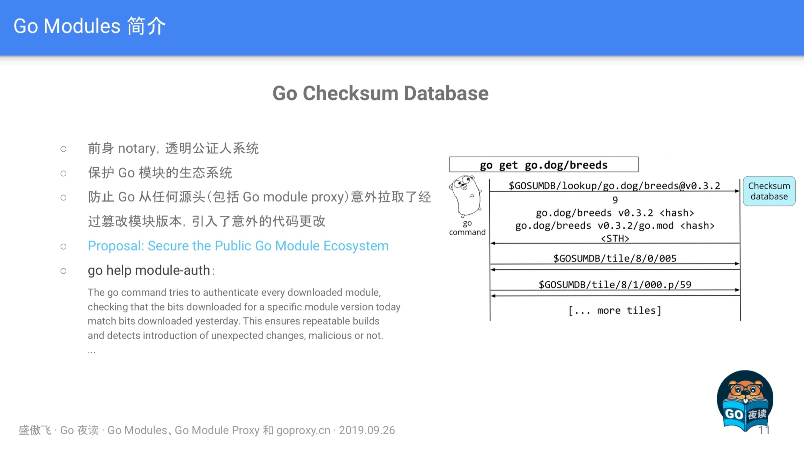

如果有興趣的小夥伴可以看看 [Proposal: Secure the Public Go Module Ecosystem](https://go.googlesource.com/proposal/+/master/design/25530-sumdb.md#proxying-a-checksum-database)，有詳細介紹其演算法機制，如果想簡單一點，檢視 `go help module-auth` 也是一個不錯的選擇。

### GONOPROXY/GONOSUMDB/GOPRIVATE

這三個環境變數都是用在當前專案依賴了私有模組，也就是依賴了由 GOPROXY 指定的 Go module proxy 或由 GOSUMDB 指定 Go checksum database 無法訪問到的模組時的場景

* 它們三個的值都是一個以英文逗號 “,” 分割的模組路徑字首，匹配規則同 path.Match。
* 其中 GOPRIVATE 較為特殊，它的值將作為 GONOPROXY 和 GONOSUMDB 的預設值，所以建議的最佳姿勢是隻是用 GOPRIVATE。

在使用上來講，比如 `GOPRIVATE=*.corp.example.com` 表示所有模組路徑以 `corp.example.com` 的下一級域名 (如 `team1.corp.example.com`) 為字首的模組版本都將不經過 Go module proxy 和 Go checksum database，需要注意的是不包括 `corp.example.com` 本身。

### Global Caching

這個主要是針對 Go modules 的全域性快取資料說明，如下：

* 同一個模組版本的資料只快取一份，所有其他模組共享使用。
* 目前所有模組版本資料均快取在 `$GOPATH/pkg/mod`和 ​`$GOPATH/pkg/sum` 下，未來或將移至 `$GOCACHE/mod`和`$GOCACHE/sum` 下( 可能會在當 `$GOPATH` 被淘汰後)。
* 可以使用 `go clean -modcache` 清理所有已快取的模組版本資料。

另外在 Go1.11 之後 GOCACHE 已經不允許設定為 off 了，我想著這也是為了模組資料快取移動位置做準備，因此大家應該儘快做好適配。

## 快速遷移專案至 Go Modules

* 第一步: 升級到 Go 1.13。
* 第二步: 讓 GOPATH 從你的腦海中完全消失，早一步踏入未來。
  * 修改 GOBIN 路徑（可選）：`go env -w GOBIN=$HOME/bin`。
  * 開啟 Go modules：`go env -w GO111MODULE=on`。
  * 設定 GOPROXY：`go env -w GOPROXY=https://goproxy.cn,direct` # 在中國是必須的，因為它的預設值被牆了。
* 第三步(可選): 按照你喜歡的目錄結構重新組織你的所有專案。
* 第四步: 在你專案的根目錄下執行 `go mod init <OPTIONAL_MODULE_PATH>` 以生成 go.mod 檔案。
* 第五步: 想辦法說服你身邊所有的人都去走一下前四步。

## 遷移後 go get 行為的改變

* 用 `go help module-get` 和 `go help gopath-get`分別去了解 Go modules 啟用和未啟用兩種狀態下的 go get 的行為
* 用 `go get` 拉取新的依賴
  * 拉取最新的版本(優先擇取 tag)：`go get golang.org/x/text@latest`
  * 拉取 `master` 分支的最新 commit：`go get golang.org/x/text@master`
  * 拉取 tag 為 v0.3.2 的 commit：`go get golang.org/x/text@v0.3.2`
  * 拉取 hash 為 342b231 的 commit，最終會被轉換為 v0.3.2：`go get golang.org/x/text@342b2e`
  * 用 `go get -u` 更新現有的依賴
  * 用 `go mod download` 下載 go.mod 檔案中指明的所有依賴
  * 用 `go mod tidy` 整理現有的依賴
  * 用 `go mod graph` 檢視現有的依賴結構
  * 用 `go mod init` 生成 go.mod 檔案 (Go 1.13 中唯一一個可以生成 go.mod 檔案的子命令)
* 用 `go mod edit` 編輯 go.mod 檔案
* 用 `go mod vendor` 匯出現有的所有依賴 (事實上 Go modules 正在淡化 Vendor 的概念)
* 用 `go mod verify` 校驗一個模組是否被篡改過

這裡我們注意到有兩點比較特別，分別是：

* 第一點：為什麼 “拉取 hash 為 342b231 的 commit，最終會被轉換為 v0.3.2” 呢。這是因為雖然我們設定了拉取 @342b2e commit，但是因為 Go modules 會與 tag 進行對比，若發現對應的 commit 與 tag 有關聯，則進行轉換。
* 第二點：為什麼不建議使用 `go mod vendor`，因為 Go modules 正在淡化 Vendor 的概念，很有可能 Go2 就去掉了。

## 使用 Go Modules 時常遇見的坑

### 坑 1: 判斷專案是否啟用了 Go Modules

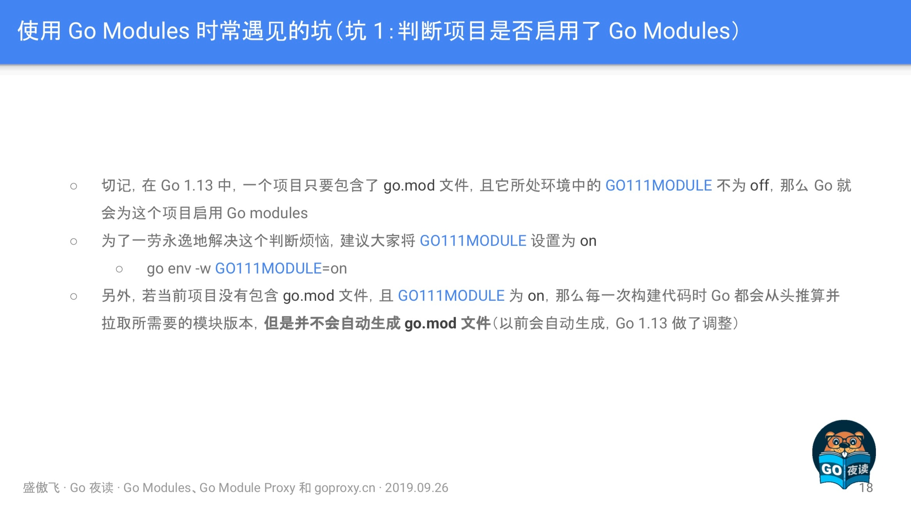

### 坑 2: 管理 Go 的環境變數

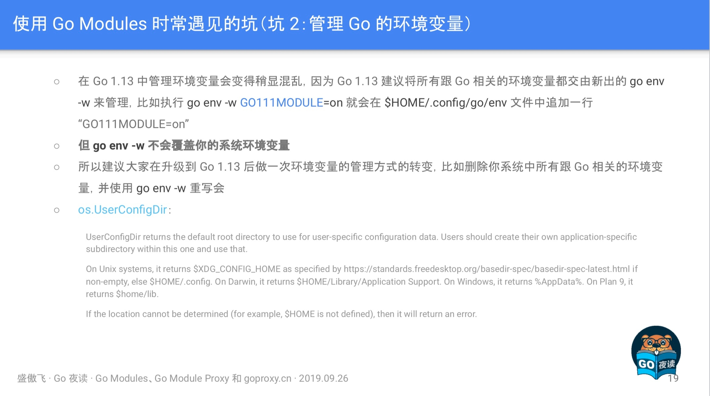

這裡主要是提到 Go1.13 新增了 `go env -w` 用於寫入環境變數，而寫入的地方是 `os.UserConfigDir` 所返回的路徑，需要注意的是 `go env -w` 不會覆寫。

### 坑 3: 從 dep、glide 等遷移至 Go Modules

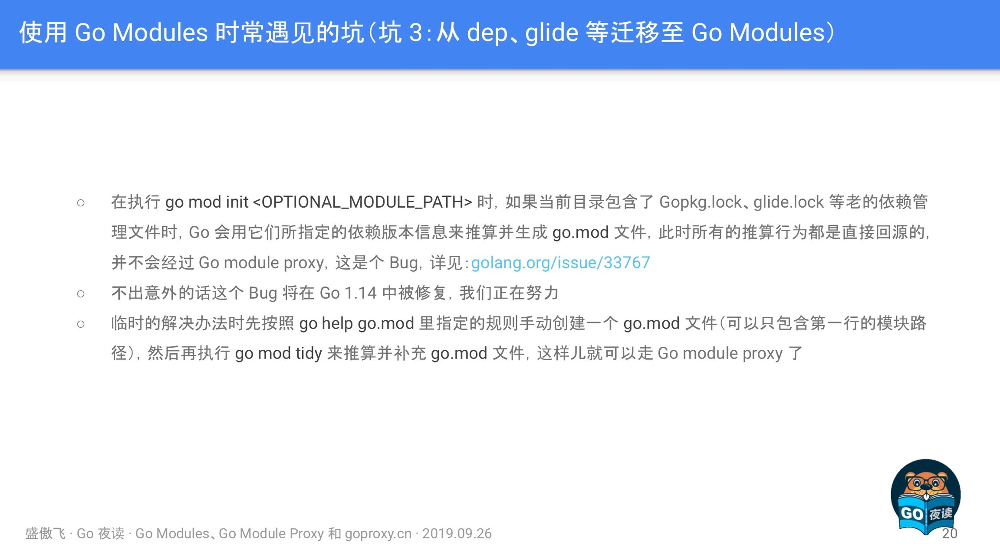

這裡主要是指從舊有的依賴包管理工具（dep/glide 等）進行遷移時，因為 BUG 的原因會導致不經過 GOPROXY 的代理，解決方法有如下兩個：

* 手動建立一個 go.mod 檔案，再執行 go mod tidy 進行補充。
* 上代理，相當於不使用 GOPROXY 了。

### 坑 4:拉取私有模組

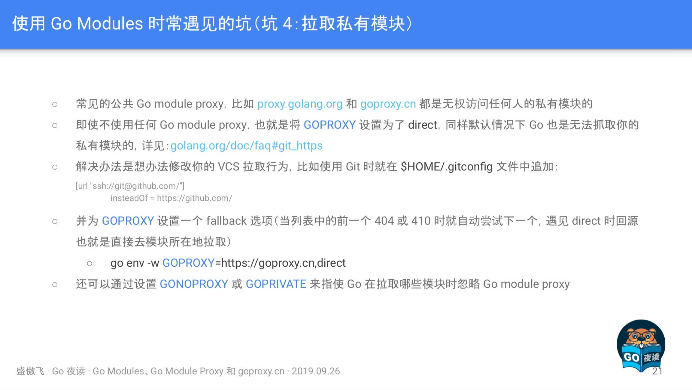

這裡主要想涉及兩塊知識點，如下：

* GOPROXY 是無權訪問到任何人的私有模組的，所以你放心，安全性沒問題。
* GOPROXY 除了設定模組代理的地址以外，還需要增加 “direct” 特殊標識才可以成功拉取私有庫。

### 坑 5:更新現有的模組

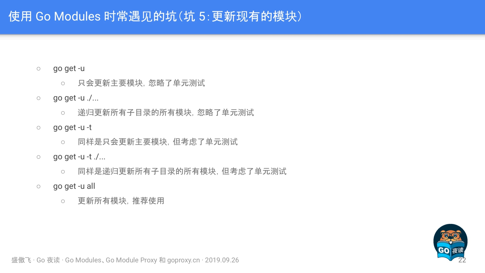

### 坑 6:主版本號

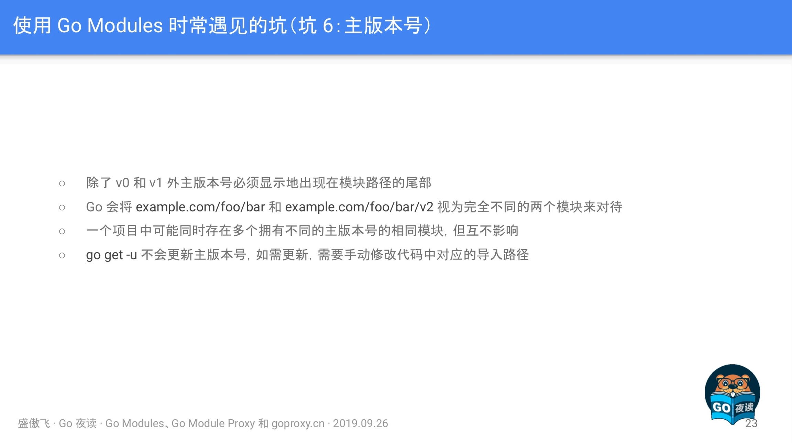

## Go Module Proxy 簡介

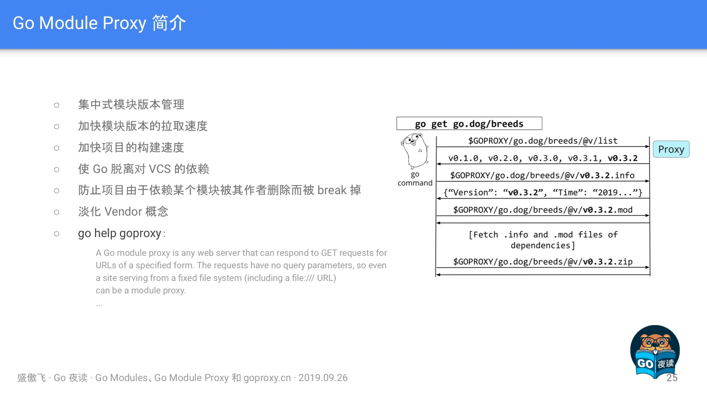

在這裡再次強調了 Go Module Proxy 的作用（圖左），以及其對應的協議互動流程（圖右），有興趣的小夥伴可以認真看一下。

## Goproxy 中國(goproxy.cn)

在這塊主要介紹了 Goproxy 的實踐操作以及 goproxy.cn 的一些 Q\&A 和 近況，如下：

### Q\&A

**Q：如果中國 Go 語言社群沒有咱們自己家的 Go Module Proxy 會怎麼樣？**

**A：**&#x5728; Go 1.13 中 GOPROXY 和 GOSUMDB 這兩個環境變數都有了在中國無法 訪問的預設值，儘管我在 golang.org/issue/31755 裡努力嘗 試過，但最終仍然無法為咱們中國的 Go 語言開發者謀得一個完美的解決方案。所以從今以後咱 們中國的所有 Go 語言開發者，只要是 使用了 Go modules 的，那麼都必須先修改 GOPROXY 和 GOSUMDB 才能正常使用 Go 做開發，否則可能連一個最簡單的程式都跑不起 來(只要它有依 賴第三方模 塊)。

**Q： 我建立 Goproxy 中國(goproxy.cn)的主要原因？**

**A：**&#x5176;實更早的時候，也就是今年年初我也曾 試圖在 golang.org/issue/31020 中請求 Go team 能想辦法避免那時的 GOPROXY 即將擁有的預設值可以在中國正常訪問，但 Go team 似乎也無能為力，為此我才堅定了建立 goproxy.cn 的信念。既然別人沒法兒幫忙，那咱們就 得自己動手，不為別的，就為了讓大家以後能夠更愉快地使用 Go 語言配合 Go modules 做開發。

最初我先是和七牛雲的 許叔(七牛雲的 創始人兼 CEO 許式偉)提出了我打算 建立 goproxy.cn 的想法，本是抱著 試試看的目的，但沒想 到 許叔幾乎是沒有超過一分鐘的考慮便認可了我的想法並表示願意一起推 動。那一陣子剛好趕上我在寫畢業論文，所以專案開發完後就 一直沒和七牛雲做交接，一直跑在我的個人服 務器上。直到有一次 goproxy.cn 被攻擊了，一下午的功夫 燒了我一百多美元，然後我才 意識到這種專案真不能個人來做。個人來做不靠 譜，萬一依賴這個專案的人多了，專案再出什麼事兒，那就會給大家􏰁成不必要的損 失。所以我趕緊和七牛雲做了交接，把 goproxy.cn 完全交給了七牛雲，甚至連域名都過戶了去。

### 近況

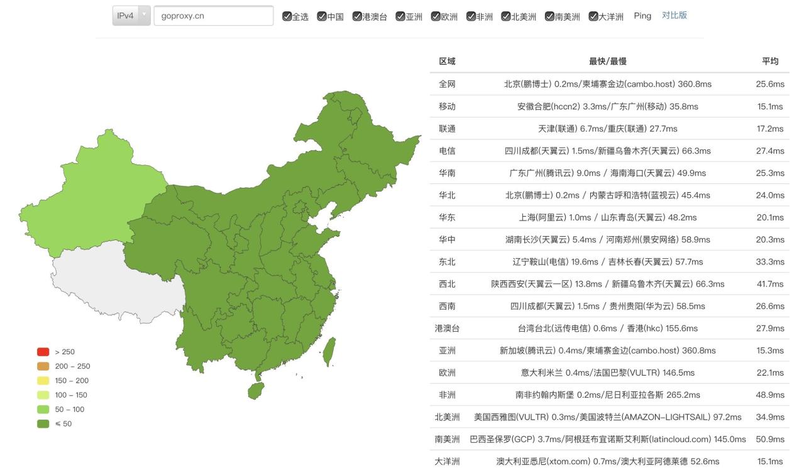

* Goproxy 中國 (goproxy.cn) 是目前中國最可靠的 Go module proxy (真不是在自賣自誇)。
* 為中國 Go 語言開發者量身打􏰁，支援代理 GOSUMDB 的預設值，經過全球 CDN 加速，高可用，可 應用進公司複雜的開發環境中，亦可用作上游代理。
* 由中國倍受信賴的雲服務提供商七牛雲無償提供基礎設施支援的開源的非營利性專案。
* 目標是為中國乃至全世界的 Go 語言開發者提供一個免 費的、可靠的、持 續線上的且經過 CDN 加􏰀的 Go module proxy。
* 域名已由七牛雲進行了備案 (滬ICP備11037377號-56)。

### 情況

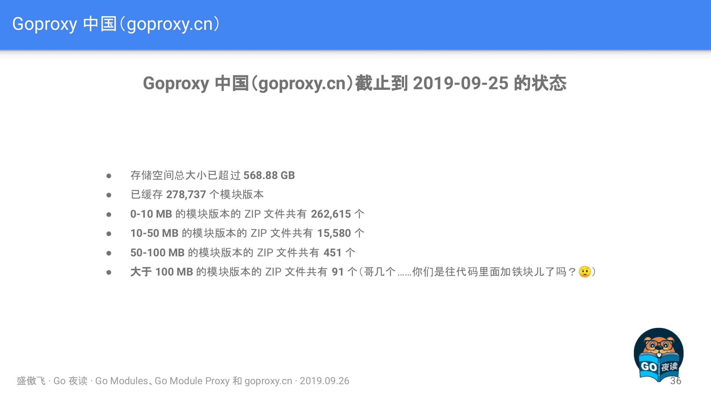

此處呈現的是儲存大小，主要是針對模組包程式碼，而一般來講程式碼並不會有多大，0-10MB，10-50MB 佔最大頭，也是能夠理解，但是大於 100MB 的模組包程式碼就比較誇張了。

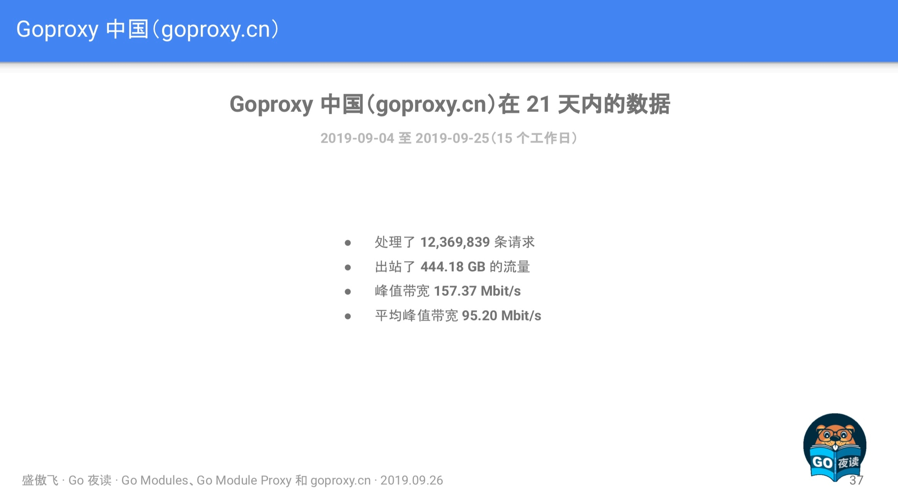

此時主要是展示了一下近期 goproxy.cn 的網路資料情況，我相信未來是會越來越高的，值得期待。

## Q\&A

**Q：如何解決 Go 1.13 在從 GitLab 拉取模組版本時遇到的，Go 錯誤地按照非期望值的路徑尋找目標模組版本結果致使最終目標模組拉取失敗的問題？**

**A：**&#x47;itLab 中配合 goget 而設定的 `<meta>` 存在些許問題，導致 Go 1.13 錯誤地識別了模組的具體路徑，這是個 Bug，據說在 GitLab 的新版本中已經被修復了，詳細內容可以看 <https://github.com/golang/go/issues/34094> 這個 Issue。然後目前的解決辦法的話除了升級 GitLab 的版本外，還可以參考 <https://github.com/developer-learning/night-reading-go/issues/468#issuecomment-535850154> 這條回覆。

**Q：使用 Go modules 時可以同時依賴同一個模組的不同的兩個或者多個小版本（修訂版本號不同）嗎？**

**A：**&#x4E0D;可以的，Go modules 只可以同時依賴一個模組的不同的兩個或者多個大版本（主版本號不同）。比如可以同時依賴 example.com/foobar\@v1.2.3 和 example.com/foobar/v2\@v2.3.4，因為他們的模組路徑（module path）不同，Go modules 規定主版本號不是 v0 或者 v1 時，那麼主版本號必須顯式地出現在模組路徑的尾部。但是，同時依賴兩個或者多個小版本是不支援的。比如如果模組 A 同時直接依賴了模組 B 和模組 C，且模組 A 直接依賴的是模組 C 的 v1.0.0 版本，然後模組 B 直接依賴的是模組 C 的 v1.0.1 版本，那麼最終 Go modules 會為模組 A 選用模組 C 的 v1.0.1 版本而不是模組 A 的 go.mod 檔案中指明的 v1.0.0 版本。

這是因為 Go modules 認為只要主版本號不變，那麼剩下的都可以直接升級採用最新的。但是如果採用了最新的結果導致專案 Break 掉了，那麼 Go modules 就會 Fallback 到上一個老的版本，比如在前面的例子中就會 Fallback 到 v1.0.0 版本。

**Q：在 go.sum 檔案中的一個模組版本的 Hash 校驗資料什麼情況下會成對出現，什麼情況下只會存在一行？**

**A：**&#x901A;常情況下，在 go.sum 檔案中的一個模組版本的 Hash 校驗資料會有兩行，前一行是該模組的 ZIP 檔案的 Hash 校驗資料，後一行是該模組的 go.mod 檔案的 Hash 校驗資料。但是也有些情況下只會出現一行該模組的 go.mod 檔案的 Hash 校驗資料，而不包含該模組的 ZIP 檔案本身的 Hash 校驗資料，這個情況發生在 Go modules 判定為你當前這個專案完全用不到該模組，根本也不會下載該模組的 ZIP 檔案，所以就沒必要對其作出 Hash 校驗保證，只需要對該模組的 go.mod 檔案作出 Hash 校驗保證即可，因為 go.mod 檔案是用得著的，在深入挖取專案依賴的時候要用。

**Q：能不能更詳細地講解一下 go.mod 檔案中的 replace 動詞的行為以及用法？**

**A：**&#x8FD9;個 replace 動詞的作用是把一個“模組版本”替換為另外一個“模組版本”，這是“模組版本”和“模組版本（module path）”之間的替換，“=>”識別符號前面的內容是待替換的“模組版本”的“模組路徑”，後面的內容是要替換的目標“模組版本”的所在地，即路徑，這個路徑可以是一個本地磁碟的相對路徑，也可以是一個本地磁碟的絕對路徑，還可以是一個網路路徑，但是這個目標路徑並不會在今後你的專案程式碼中作為你“匯入路徑（import path）”出現，程式碼裡的“匯入路徑”還是得以你替換成的這個目標“模組版本”的“模組路徑”作為字首。

另外需要注意，Go modules 是不支援在 “匯入路徑” 裡寫相對路徑的。舉個例子，如果專案 A 依賴了模組 B，比如模組 B 的“模組路徑”是 example.com/b，然後它在的磁碟路徑是 \~/b，在專案 A 裡的 go.mod 檔案中你有一行 replace example.com/b=>\~/b，然後在專案 A 裡的程式碼中的“匯入路基”就是 import"example.com/b"，而不是 import"\~/b"，剩下的工作是 Go modules 幫你自動完成了的。

然後就是我在分享中也提到了， exclude 和 replace 這兩個動詞只作用於當前主模組，也就是當前專案，它所依賴的那些其他模組版本中如果出現了你待替換的那個模組版本的話，Go modules 還是會為你依賴的那個模組版本去拉取你的這個待替換的模組版本。

舉個例子，比如專案 A 直接依賴了模組 B 和模組 C，然後模組 B 也直接依賴了模組 C，那麼你在專案 A 中的 go.mod 檔案裡的 replace c=>\~/some/path/c 是隻會影響專案 A 裡寫的程式碼中，而模組 B 所用到的還是你 replace 之前的那個 c，並不是你替換成的 \~/some/path/c 這個。

## 總結

在 Go1.13 釋出後，接觸 Go modules 和 Go module proxy 的人越來越多，經常在各種群看到各種小夥伴在諮詢，包括我自己也貢獻了好幾枚 “坑”，因此我覺得傲飛的這一次 《Go Modules、Go Module Proxy 和 goproxy.cn》的技術分享，非常的有實踐意義。如果後續大家還有什麼建議或問題，歡迎隨時來討論。

最後，感謝 goproxy.cn 背後的人們（@七牛雲 和 @盛傲飛）對中國 Go 語言社群的無私貢獻和奉獻。

## 進一步閱讀

* [night-reading-go/issues/468](https://github.com/developer-learning/night-reading-go/issues/468)
* [B站：【Go 夜讀】第 61 期 Go Modules、Go Module Proxy 和 goproxy.cn](https://www.bilibili.com/video/av69111199?from=search\&seid=14251207475086319821)
* [youtube：【Go 夜讀】第 61 期 Go Modules、Go Module Proxy 和 goproxy.cn](https://www.youtube.com/watch?v=H3LVVwZ9zNY)
