# 1.11 從實踐到原理，帶你參透 gRPC


gRPC 在 Go 語言中大放異彩，越來越多的小夥伴在使用，最近也在公司安利了一波，希望這一篇文章能帶你一覽 gRPC 的巧妙之處，本文篇幅比較長，請做好閱讀準備。本文目錄如下：

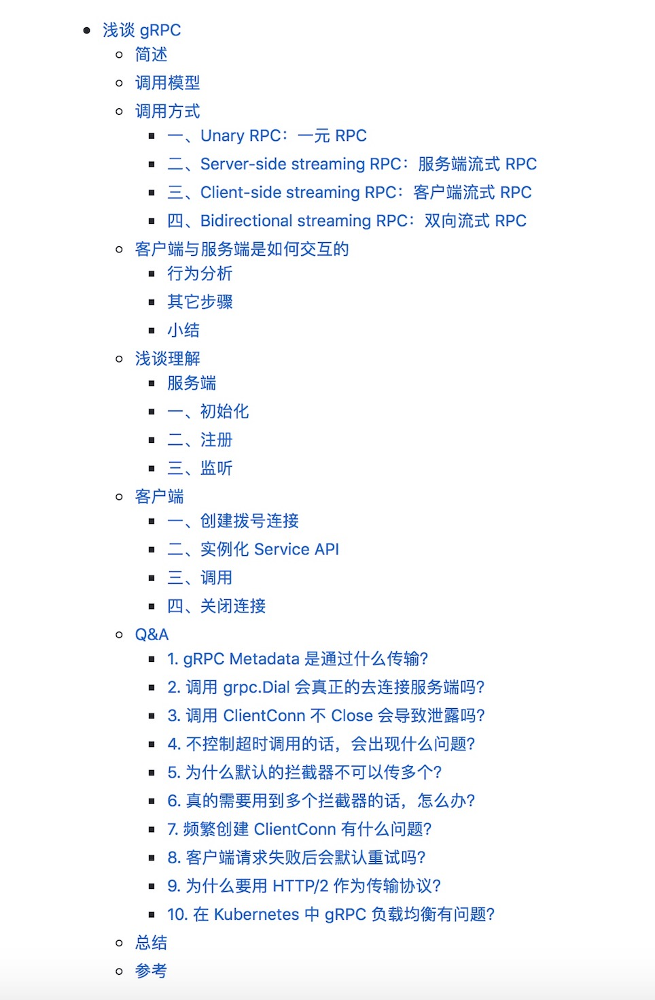

## 簡述

gRPC 是一個高效能、開源和通用的 RPC 框架，面向移動和 HTTP/2 設計。目前提供 C、Java 和 Go 語言版本，分別是：grpc, grpc-java, grpc-go. 其中 C 版本支援 C, C++, Node.js, Python, Ruby, Objective-C, PHP 和 C# 支援。

gRPC 基於 HTTP/2 標準設計，帶來諸如雙向流、流控、頭部壓縮、單 TCP 連線上的多複用請求等特性。這些特性使得其在移動裝置上表現更好，更省電和節省空間佔用。

## 呼叫模型

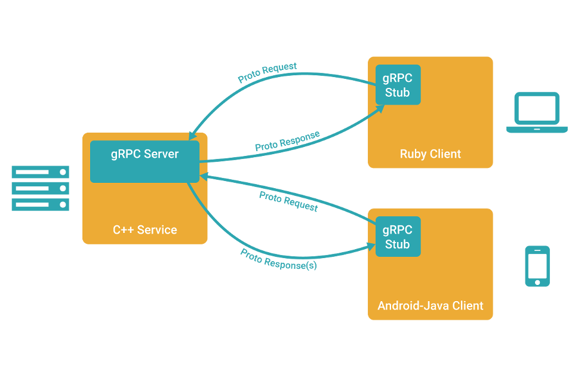

1、客戶端（gRPC Stub）呼叫 A 方法，發起 RPC 呼叫。

2、對請求資訊使用 Protobuf 進行物件序列化壓縮（IDL）。

3、服務端（gRPC Server）接收到請求後，解碼請求體，進行業務邏輯處理並返回。

4、對響應結果使用 Protobuf 進行物件序列化壓縮（IDL）。

5、客戶端接受到服務端響應，解碼請求體。回撥被呼叫的 A 方法，喚醒正在等待響應（阻塞）的客戶端呼叫並返回響應結果。

## 呼叫方式

### 一、Unary RPC：一元 RPC

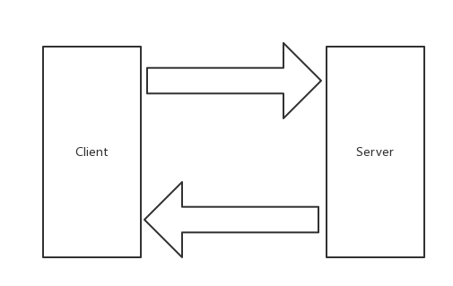

#### Server

```go
type SearchService struct{}

func (s *SearchService) Search(ctx context.Context, r *pb.SearchRequest) (*pb.SearchResponse, error) {
    return &pb.SearchResponse{Response: r.GetRequest() + " Server"}, nil
}

const PORT = "9001"

func main() {
    server := grpc.NewServer()
    pb.RegisterSearchServiceServer(server, &SearchService{})

    lis, err := net.Listen("tcp", ":"+PORT)
    ...

    server.Serve(lis)
}
```
* 建立 gRPC Server 物件，你可以理解為它是 Server 端的抽象物件。
* 將 SearchService（其包含需要被呼叫的服務端介面）註冊到 gRPC Server。 的內部註冊中心。這樣可以在接受到請求時，透過內部的 “服務發現”，發現該服務端介面並轉接進行邏輯處理。
* 建立 Listen，監聽 TCP 埠。
* gRPC Server 開始 lis.Accept，直到 Stop 或 GracefulStop。

#### Client

```go
func main() {
    conn, err := grpc.Dial(":"+PORT, grpc.WithInsecure())
    ...
    defer conn.Close()

    client := pb.NewSearchServiceClient(conn)
    resp, err := client.Search(context.Background(), &pb.SearchRequest{
        Request: "gRPC",
    })
    ...
}
```
* 建立與給定目標（服務端）的連線控制代碼。
* 建立 SearchService 的客戶端物件。
* 傳送 RPC 請求，等待同步響應，得到回撥後返回響應結果。

### 二、Server-side streaming RPC：服務端流式 RPC


#### Server

```go
func (s *StreamService) List(r *pb.StreamRequest, stream pb.StreamService_ListServer) error {
    for n := 0; n <= 6; n++ {
        stream.Send(&pb.StreamResponse{
            Pt: &pb.StreamPoint{
                ...
            },
        })
    }

    return nil
}
```
#### Client

```go
func printLists(client pb.StreamServiceClient, r *pb.StreamRequest) error {
    stream, err := client.List(context.Background(), r)
    ...

    for {
        resp, err := stream.Recv()
        if err == io.EOF {
            break
        }
        ...
    }

    return nil
}
```
### 三、Client-side streaming RPC：客戶端流式 RPC

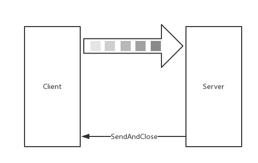

#### Server

```go
func (s *StreamService) Record(stream pb.StreamService_RecordServer) error {
    for {
        r, err := stream.Recv()
        if err == io.EOF {
            return stream.SendAndClose(&pb.StreamResponse{Pt: &pb.StreamPoint{...}})
        }
        ...

    }

    return nil
}
```
#### Client

```go
func printRecord(client pb.StreamServiceClient, r *pb.StreamRequest) error {
    stream, err := client.Record(context.Background())
    ...

    for n := 0; n < 6; n++ {
        stream.Send(r)
    }

    resp, err := stream.CloseAndRecv()
    ...

    return nil
}
```
### 四、Bidirectional streaming RPC：雙向流式 RPC

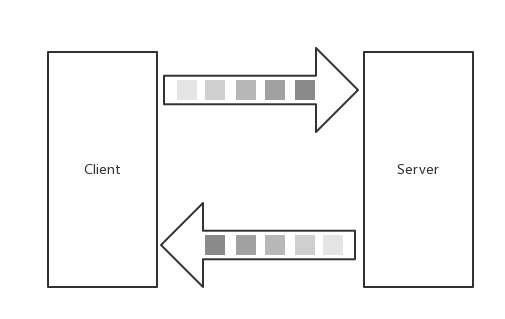

#### Server

```go
func (s *StreamService) Route(stream pb.StreamService_RouteServer) error {
    for {
        stream.Send(&pb.StreamResponse{...})
        r, err := stream.Recv()
        if err == io.EOF {
            return nil
        }
        ...
    }

    return nil
}
```
#### Client

```go
func printRoute(client pb.StreamServiceClient, r *pb.StreamRequest) error {
    stream, err := client.Route(context.Background())
    ...

    for n := 0; n <= 6; n++ {
        stream.Send(r)
        resp, err := stream.Recv()
        if err == io.EOF {
            break
        }
        ...
    }

    stream.CloseSend()

    return nil
}
```
## 客戶端與服務端是如何互動的

在開始分析之前，我們要先 gRPC 的呼叫有一個初始印象。那麼最簡單的就是對 Client 端呼叫 Server 端進行抓包去剖析，看看整個過程中它都做了些什麼事。如下圖：

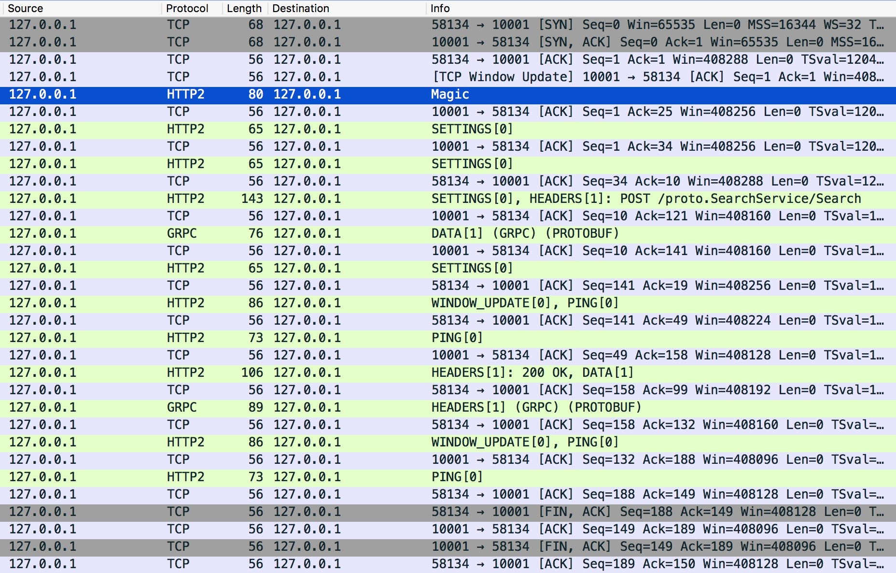

* Magic
* SETTINGS
* HEADERS
* DATA
* SETTINGS
* WINDOW\_UPDATE
* PING
* HEADERS&#x20;
* DATA
* HEADERS
* WINDOW\_UPDATE
* PING

我們略加整理發現共有十二個行為，是比較重要的。在開始分析之前，建議你自己先想一下，它們的作用都是什麼？大膽猜測一下，帶著疑問去學習效果更佳。

### 行為分析

#### Magic

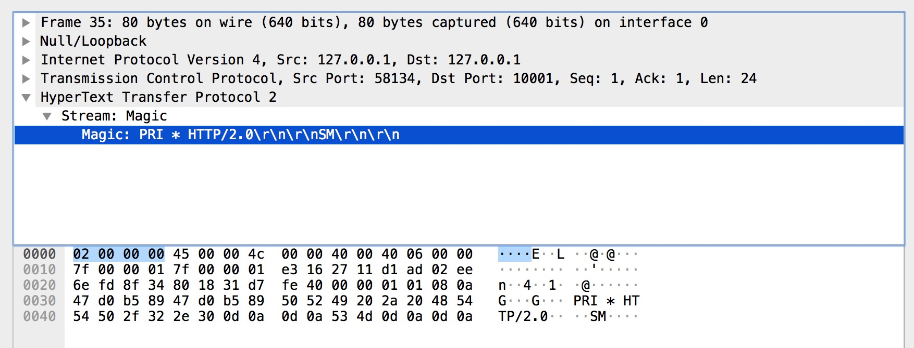

Magic 幀的主要作用是建立 HTTP/2 請求的前言。在 HTTP/2 中，要求兩端都要傳送一個連線前言，作為對所使用協議的最終確認，並確定 HTTP/2 連線的初始設定，客戶端和服務端各自發送不同的連線前言。

而上圖中的 Magic 幀是客戶端的前言之一，內容為 `PRI * HTTP/2.0\r\n\r\nSM\r\n\r\n`，以確定啟用 HTTP/2 連線。

#### SETTINGS

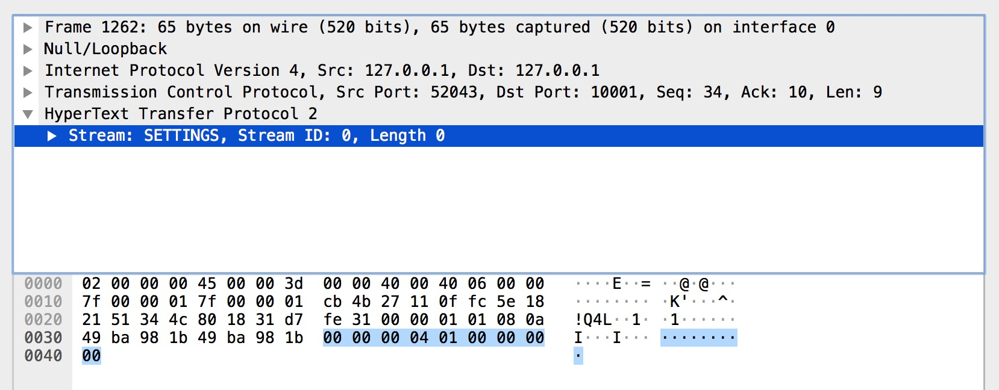

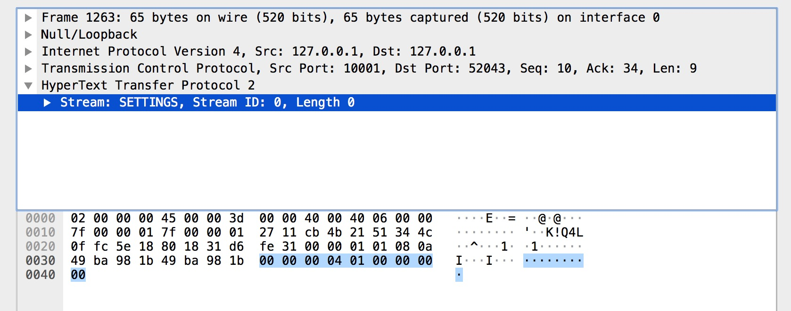

SETTINGS 幀的主要作用是設定這一個連線的引數，作用域是整個連線而並非單一的流。

而上圖的 SETTINGS 幀都是空 SETTINGS 幀，圖一是客戶端連線的前言（Magic 和 SETTINGS 幀分別組成連線前言）。圖二是服務端的。另外我們從圖中可以看到多個 SETTINGS 幀，這是為什麼呢？是因為傳送完連線前言後，客戶端和服務端還需要有一步互動確認的動作。對應的就是帶有 ACK 標識 SETTINGS 幀。

#### HEADERS

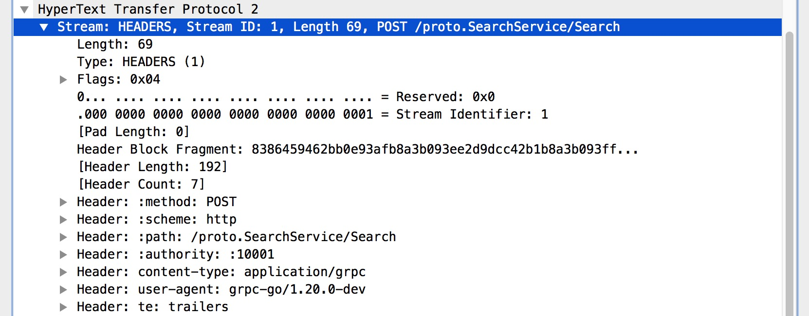

HEADERS 幀的主要作用是儲存和傳播 HTTP 的標頭資訊。我們關注到 HEADERS 裡有一些眼熟的資訊，分別如下：

* method：POST
* scheme：http
* path：/proto.SearchService/Search
* authority：:10001
* content-type：application/grpc
* user-agent：grpc-go/1.20.0-dev

你會發現這些東西非常眼熟，其實都是 gRPC 的基礎屬性，實際上遠遠不止這些，只是設定了多少展示多少。例如像平時常見的 `grpc-timeout`、`grpc-encoding` 也是在這裡設定的。

#### DATA

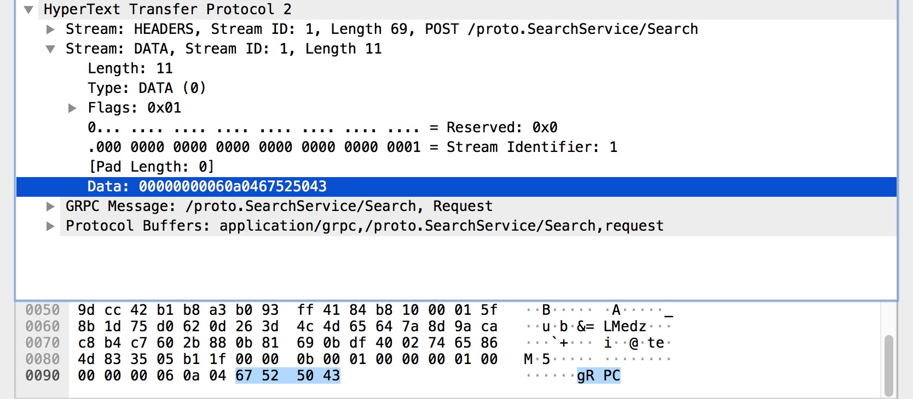

DATA 幀的主要作用是裝填主體資訊，是資料幀。而在上圖中，可以很明顯看到我們的請求引數 gRPC 儲存在裡面。只需要瞭解到這一點就可以了。

#### HEADERS, DATA, HEADERS

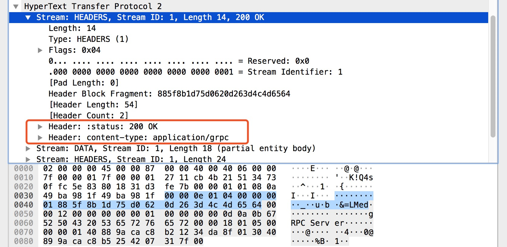

在上圖中 HEADERS 幀比較簡單，就是告訴我們 HTTP 響應狀態和響應的內容格式。

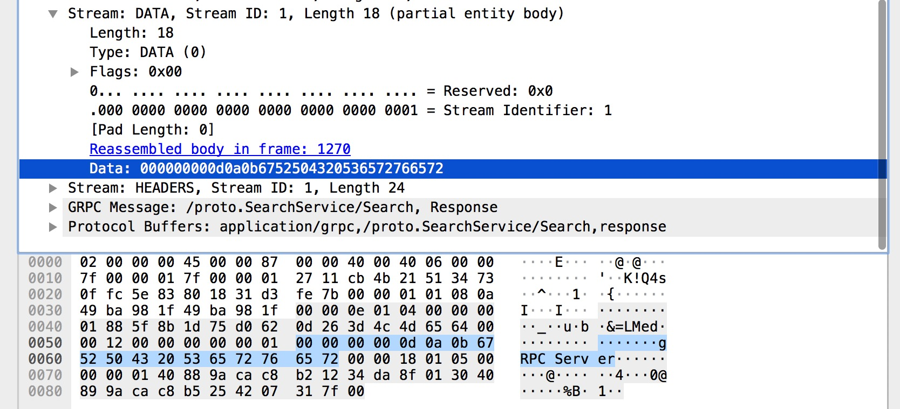

在上圖中 DATA 幀主要承載了響應結果的資料集，圖中的 gRPC Server 就是我們 RPC 方法的響應結果。

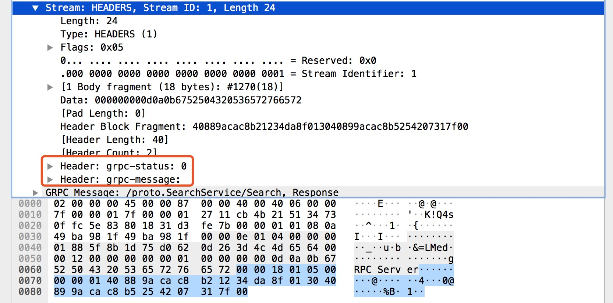

在上圖中 HEADERS 幀主要承載了 gRPC 狀態 和 gRPC 狀態訊息，圖中的 `grpc-status` 和 `grpc-message` 就是我們的 gRPC 呼叫狀態的結果。

### 其它步驟

#### WINDOW\_UPDATE

主要作用是管理和流的視窗控制。通常情況下開啟一個連線後，伺服器和客戶端會立即交換 SETTINGS 幀來確定流控制視窗的大小。預設情況下，該大小設定為約 65 KB，但可透過發出一個 WINDOW\_UPDATE 幀為流控制設定不同的大小。

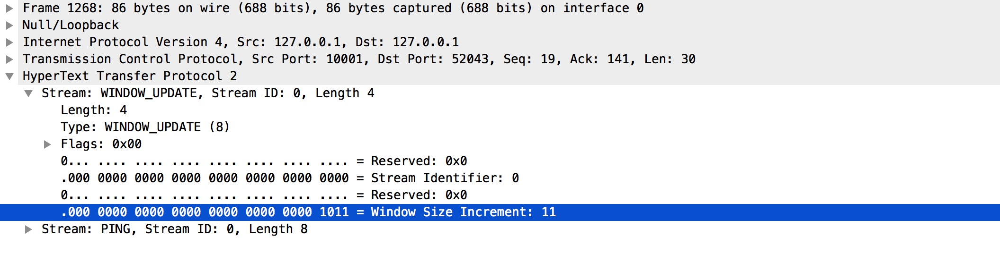

#### PING/PONG

主要作用是判斷當前連線是否仍然可用，也常用於計算往返時間。其實也就是 PING/PONG，大家對此應該很熟。

### 小結

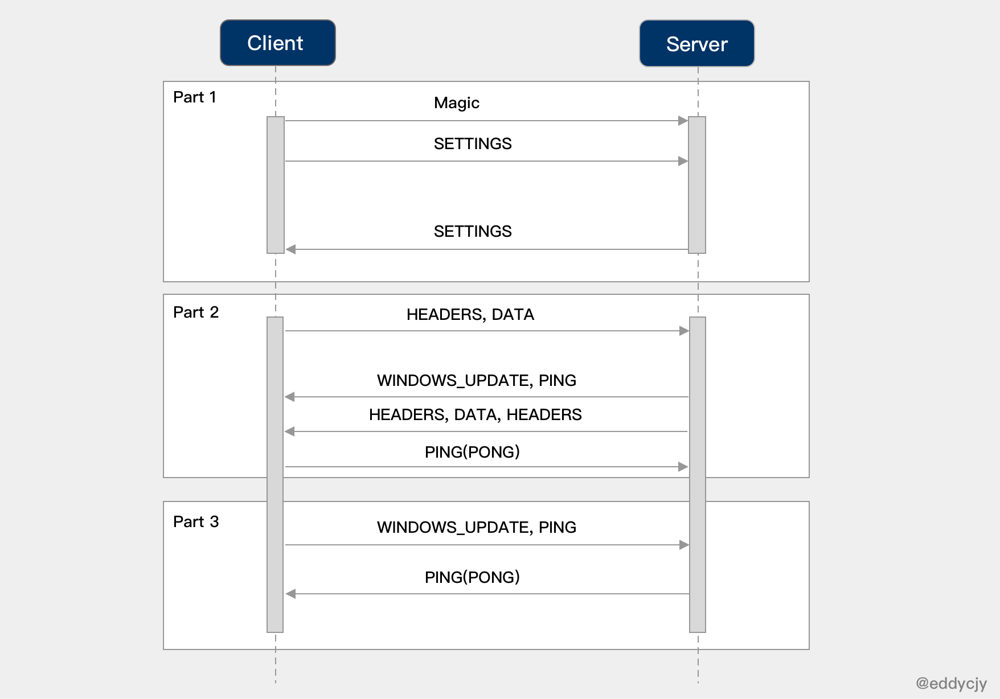

* 在建立連線之前，客戶端/服務端都會發送**連線前言**（Magic+SETTINGS），確立協議和設定項。
* 在傳輸資料時，是會涉及滑動視窗（WINDOW\_UPDATE）等流控策略的。
* 傳播 gRPC 附加資訊時，是基於 HEADERS 幀進行傳播和設定；而具體的請求/響應資料是儲存的 DATA 幀中的。
* 請求/響應結果會分為 HTTP 和 gRPC 狀態響應兩種型別。
* 客戶端發起 PING，服務端就會回應 PONG，反之亦可。

這塊 gRPC 的基礎使用，你可以看看我另外的 [《gRPC 入門系列》](https://github.com/EDDYCJY/blog#grpc%E7%B3%BB%E5%88%97%E7%9B%AE%E5%BD%95)，相信對你一定有幫助。

## 淺談理解

### 服務端

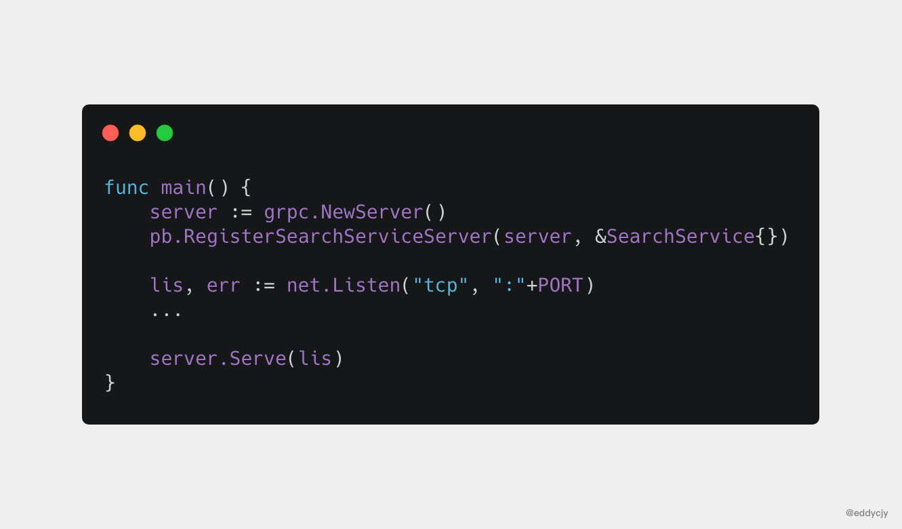

為什麼四行程式碼，就能夠起一個 gRPC Server，內部做了什麼邏輯。你有想過嗎？接下來我們一步步剖析，看看裡面到底是何方神聖。

### 一、初始化

```go
// grpc.NewServer()
func NewServer(opt ...ServerOption) *Server {
    opts := defaultServerOptions
    for _, o := range opt {
        o(&opts)
    }
    s := &Server{
        lis:    make(map[net.Listener]bool),
        opts:   opts,
        conns:  make(map[io.Closer]bool),
        m:      make(map[string]*service),
        quit:   make(chan struct{}),
        done:   make(chan struct{}),
        czData: new(channelzData),
    }
    s.cv = sync.NewCond(&s.mu)
    ...

    return s
}
```
這塊比較簡單，主要是例項 grpc.Server 並進行初始化動作。涉及如下：

* lis：監聽地址列表。
* opts：服務選項，這塊包含 Credentials、Interceptor 以及一些基礎設定。
* conns：客戶端連線控制代碼列表。
* m：服務資訊對映。
* quit：退出訊號。
* done：完成訊號。
* czData：用於儲存 ClientConn，addrConn 和 Server 的channelz 相關資料。
* cv：當優雅退出時，會等待這個訊號量，直到所有 RPC 請求都處理並斷開才會繼續處理。

### 二、註冊

```
pb.RegisterSearchServiceServer(server, &SearchService{})
```

#### 步驟一：Service API interface

```go
// search.pb.go
type SearchServiceServer interface {
    Search(context.Context, *SearchRequest) (*SearchResponse, error)
}

func RegisterSearchServiceServer(s *grpc.Server, srv SearchServiceServer) {
    s.RegisterService(&_SearchService_serviceDesc, srv)
}
```
還記得我們平時編寫的 Protobuf 嗎？在生成出來的 `.pb.go` 檔案中，會定義出 Service APIs interface 的具體實作約束。而我們在 gRPC Server 進行註冊時，會傳入應用 Service 的功能介面實作，此時生成的 `RegisterServer` 方法就會保證兩者之間的一致性。

#### 步驟二：Service API IDL

你想亂傳糊弄一下？不可能的，請乖乖定義與 Protobuf 一致的介面方法。但是那個 `&_SearchService_serviceDesc` 又有什麼作用呢？程式碼如下：

```
// search.pb.go
var _SearchService_serviceDesc = grpc.ServiceDesc{
    ServiceName: "proto.SearchService",
    HandlerType: (*SearchServiceServer)(nil),
    Methods: []grpc.MethodDesc{
        {
            MethodName: "Search",
            Handler:    _SearchService_Search_Handler,
        },
    },
    Streams:  []grpc.StreamDesc{},
    Metadata: "search.proto",
}
```

這看上去像服務的描述程式碼，用來向內部表述 “我” 都有什麼。涉及如下:

* ServiceName：服務名稱
* HandlerType：服務介面，用於檢查使用者提供的實作是否滿足介面要求
* Methods：一元方法集，注意結構內的 `Handler` 方法，其對應最終的 RPC 處理方法，在執行 RPC 方法的階段會使用。
* Streams：流式方法集
* Metadata：元資料，是一個描述資料屬性的東西。在這裡主要是描述 `SearchServiceServer` 服務

#### 步驟三：Register Service

```go
func (s *Server) register(sd *ServiceDesc, ss interface{}) {
    ...
    srv := &service{
        server: ss,
        md:     make(map[string]*MethodDesc),
        sd:     make(map[string]*StreamDesc),
        mdata:  sd.Metadata,
    }
    for i := range sd.Methods {
        d := &sd.Methods[i]
        srv.md[d.MethodName] = d
    }
    for i := range sd.Streams {
        ...
    }
    s.m[sd.ServiceName] = srv
}
```
在最後一步中，我們會將先前的服務介面資訊、服務描述資訊給註冊到內部 `service` 去，以便於後續實際呼叫的使用。涉及如下：

* server：服務的介面資訊
* md：一元服務的 RPC 方法集
* sd：流式服務的 RPC 方法集
* mdata：metadata，元資料

#### 小結

在這一章節中，主要介紹的是 gRPC Server 在啟動前的整理和註冊行為，看上去很簡單，但其實一切都是為了後續的實際執行的預先準備。因此我們整理一下思路，將其串聯起來看看，如下：

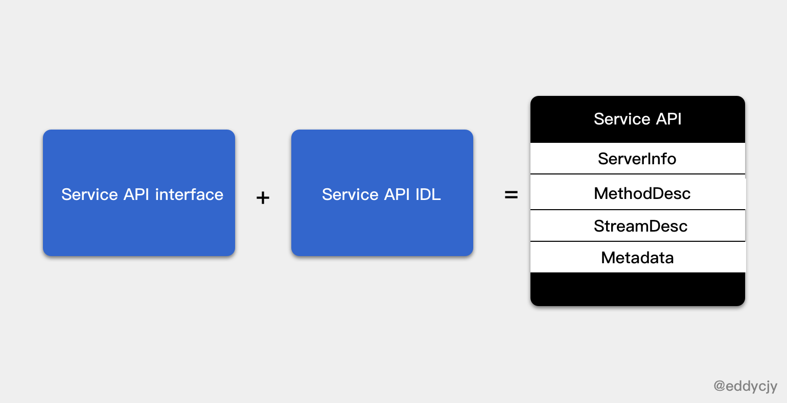

### 三、監聽

接下來到了整個流程中，最重要也是大家最關注的監聽/處理階段，核心程式碼如下：

```go
func (s *Server) Serve(lis net.Listener) error {
    ...
    var tempDelay time.Duration 
    for {
        rawConn, err := lis.Accept()
        if err != nil {
            if ne, ok := err.(interface {
                Temporary() bool
            }); ok && ne.Temporary() {
                if tempDelay == 0 {
                    tempDelay = 5 * time.Millisecond
                } else {
                    tempDelay *= 2
                }
                if max := 1 * time.Second; tempDelay > max {
                    tempDelay = max
                }
                ...
                timer := time.NewTimer(tempDelay)
                select {
                case <-timer.C:
                case <-s.quit:
                    timer.Stop()
                    return nil
                }
                continue
            }
            ...
            return err
        }
        tempDelay = 0

        s.serveWG.Add(1)
        go func() {
            s.handleRawConn(rawConn)
            s.serveWG.Done()
        }()
    }
}
```
Serve 會根據外部傳入的 Listener 不同而呼叫不同的監聽模式，這也是 `net.Listener` 的魅力，靈活性和擴充套件性會比較高。而在 gRPC Server 中最常用的就是 `TCPConn`，基於 TCP Listener 去做。接下來我們一起看看具體的處理邏輯，如下：

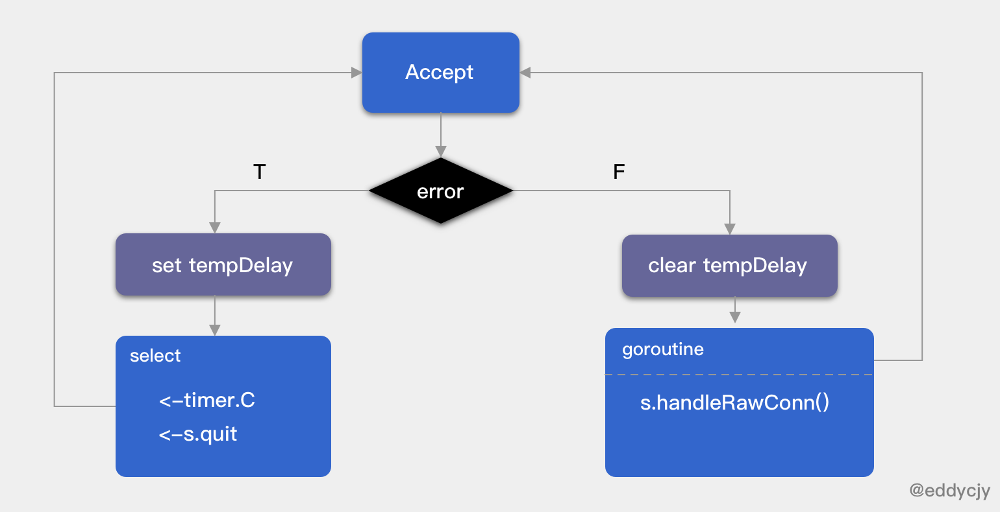

* 迴圈處理連線，透過 `lis.Accept` 取出連線，如果佇列中沒有需處理的連線時，會形成阻塞等待。
* 若 `lis.Accept` 失敗，則觸發休眠機制，若為第一次失敗那麼休眠 5ms，否則翻倍，再次失敗則不斷翻倍直至上限休眠時間 1s，而休眠完畢後就會嘗試去取下一個 “它”。
* 若 `lis.Accept` 成功，則重置休眠的時間計數和啟動一個新的 goroutine 呼叫 `handleRawConn` 方法去執行/處理新的請求，也就是大家很喜歡說的 “每一個請求都是不同的 goroutine 在處理”。
* 在迴圈過程中，包含了 “退出” 服務的場景，主要是硬關閉和優雅重啟服務兩種情況。

## 客戶端

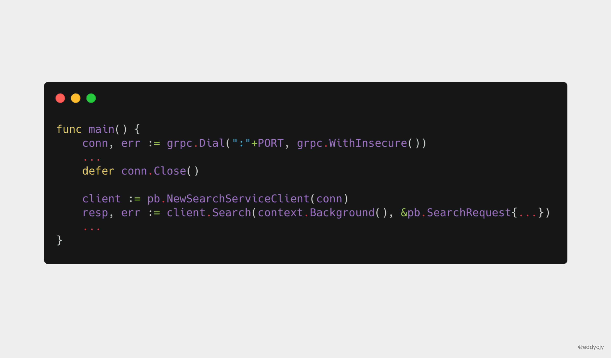

### 一、建立撥號連線

```go
// grpc.Dial(":"+PORT, grpc.WithInsecure())
func DialContext(ctx context.Context, target string, opts ...DialOption) (conn *ClientConn, err error) {
    cc := &ClientConn{
        target:            target,
        csMgr:             &connectivityStateManager{},
        conns:             make(map[*addrConn]struct{}),
        dopts:             defaultDialOptions(),
        blockingpicker:    newPickerWrapper(),
        czData:            new(channelzData),
        firstResolveEvent: grpcsync.NewEvent(),
    }
    ...
    chainUnaryClientInterceptors(cc)
    chainStreamClientInterceptors(cc)

    ...
}
```
`grpc.Dial` 方法實際上是對於 `grpc.DialContext` 的封裝，區別在於 `ctx` 是直接傳入 `context.Background`。其主要功能是**建立**與給定目標的客戶端連線，其承擔了以下職責：

* 初始化 ClientConn
* 初始化（基於程序 LB）負載均衡設定
* 初始化 channelz&#x20;
* 初始化重試規則和客戶端一元/流式攔截器
* 初始化協議棧上的基礎資訊
* 相關 context 的超時控制
* 初始化並解析地址資訊
* 建立與服務端之間的連線

#### 連沒連

之前聽到有的人說呼叫 `grpc.Dial` 後客戶端就已經與服務端建立起了連線，但這對不對呢？我們先鳥瞰全貌，看看正在跑的 goroutine。如下：

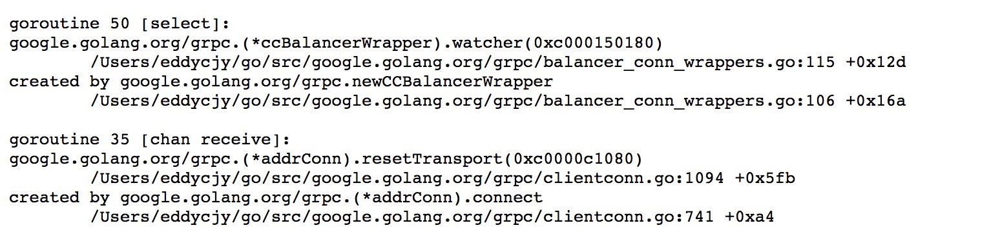

我們可以有幾個核心方法一直在等待/處理訊號，透過分析底層原始碼可得知。涉及如下：

```
func (ac *addrConn) connect()
func (ac *addrConn) resetTransport()
func (ac *addrConn) createTransport(addr resolver.Address, copts transport.ConnectOptions, connectDeadline time.Time)
func (ac *addrConn) getReadyTransport()
```

在這裡主要分析 goroutine 提示的 `resetTransport` 方法，看看都做了啥。核心程式碼如下：

```go
func (ac *addrConn) resetTransport() {
    for i := 0; ; i++ {
        if ac.state == connectivity.Shutdown {
            return
        }
        ...
        connectDeadline := time.Now().Add(dialDuration)
        ac.updateConnectivityState(connectivity.Connecting)
        newTr, addr, reconnect, err := ac.tryAllAddrs(addrs, connectDeadline)
        if err != nil {
            if ac.state == connectivity.Shutdown {
                return
            }
            ac.updateConnectivityState(connectivity.TransientFailure)
            timer := time.NewTimer(backoffFor)
            select {
            case <-timer.C:
                ...
            }
            continue
        }

        if ac.state == connectivity.Shutdown {
            newTr.Close()
            return
        }
        ...
        if !healthcheckManagingState {
            ac.updateConnectivityState(connectivity.Ready)
        }
        ...

        if ac.state == connectivity.Shutdown {
            return
        }
        ac.updateConnectivityState(connectivity.TransientFailure)
    }
}
```
在該方法中會不斷地去嘗試建立連線，若成功則結束。否則不斷地根據 `Backoff` 演算法的重試機制去嘗試建立連線，直到成功為止。從結論上來講，單純呼叫 `DialContext` 是非同步建立連線的，也就是並不是馬上生效，處於 `Connecting` 狀態，而正式下要到達 `Ready` 狀態才可用。

#### 真的連了嗎

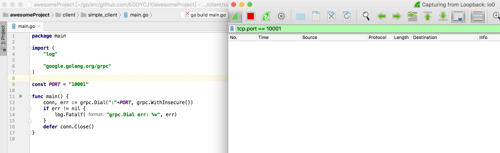

在抓包工具上提示一個包都沒有，那麼這算真正連線了嗎？我認為這是一個表述問題，我們應該儘可能的嚴謹。如果你真的想透過 `DialContext` 方法就打通與服務端的連線，則需要呼叫 `WithBlock` 方法，雖然會導致阻塞等待，但最終連線會到達 `Ready` 狀態（握手成功）。如下圖：

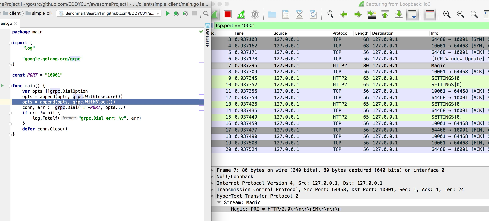

### 二、例項化 Service API

```go
type SearchServiceClient interface {
    Search(ctx context.Context, in *SearchRequest, opts ...grpc.CallOption) (*SearchResponse, error)
}

type searchServiceClient struct {
    cc *grpc.ClientConn
}

func NewSearchServiceClient(cc *grpc.ClientConn) SearchServiceClient {
    return &searchServiceClient{cc}
}
```
這塊就是例項 Service API interface，比較簡單。

### 三、呼叫

```go
// search.pb.go
func (c *searchServiceClient) Search(ctx context.Context, in *SearchRequest, opts ...grpc.CallOption) (*SearchResponse, error) {
    out := new(SearchResponse)
    err := c.cc.Invoke(ctx, "/proto.SearchService/Search", in, out, opts...)
    if err != nil {
        return nil, err
    }
    return out, nil
}
```
proto 生成的 RPC 方法更像是一個包裝盒，把需要的東西放進去，而實際上呼叫的還是 `grpc.invoke` 方法。如下：

```go
func invoke(ctx context.Context, method string, req, reply interface{}, cc *ClientConn, opts ...CallOption) error {
    cs, err := newClientStream(ctx, unaryStreamDesc, cc, method, opts...)
    if err != nil {
        return err
    }
    if err := cs.SendMsg(req); err != nil {
        return err
    }
    return cs.RecvMsg(reply)
}
```
透過概覽，可以關注到三塊呼叫。如下：

* newClientStream：取得傳輸層 Trasport 並組合封裝到 ClientStream 中返回，在這塊會涉及負載均衡、超時控制、 Encoding、 Stream 的動作，與服務端基本一致的行為。
* cs.SendMsg：傳送 RPC 請求出去，但其並不承擔等待響應的功能。
* cs.RecvMsg：阻塞等待接受到的 RPC 方法響應結果。

#### 連線

```go
// clientconn.go
func (cc *ClientConn) getTransport(ctx context.Context, failfast bool, method string) (transport.ClientTransport, func(balancer.DoneInfo), error) {
    t, done, err := cc.blockingpicker.pick(ctx, failfast, balancer.PickOptions{
        FullMethodName: method,
    })
    if err != nil {
        return nil, nil, toRPCErr(err)
    }
    return t, done, nil
}
```
在 `newClientStream` 方法中，我們透過 `getTransport` 方法取得了 Transport 層中抽象出來的 ClientTransport 和 ServerTransport，實際上就是取得一個連線給後續 RPC 呼叫傳輸使用。

### 四、關閉連線

```go
// conn.Close()
func (cc *ClientConn) Close() error {
    defer cc.cancel()
    ...
    cc.csMgr.updateState(connectivity.Shutdown)
    ...
    cc.blockingpicker.close()
    if rWrapper != nil {
        rWrapper.close()
    }
    if bWrapper != nil {
        bWrapper.close()
    }

    for ac := range conns {
        ac.tearDown(ErrClientConnClosing)
    }
    if channelz.IsOn() {
        ...
        channelz.AddTraceEvent(cc.channelzID, ted)
        channelz.RemoveEntry(cc.channelzID)
    }
    return nil
}
```
該方法會取消 ClientConn 上下文，同時關閉所有底層傳輸。涉及如下：

* Context Cancel
* 清空並關閉客戶端連線
* 清空並關閉解析器連線
* 清空並關閉負載均衡連線
* 新增跟蹤引用
* 移除當前通道資訊

## Q\&A

### 1. gRPC Metadata 是透過什麼傳輸？

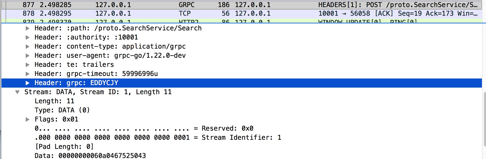

### 2. 呼叫 grpc.Dial 會真正的去連線服務端嗎？

會，但是是非同步連線的，連線狀態為正在連線。但如果你設定了 `grpc.WithBlock` 選項，就會阻塞等待（等待握手成功）。另外你需要注意，當未設定 `grpc.WithBlock` 時，ctx 超時控制對其無任何效果。

### 3. 呼叫 ClientConn 不 Close 會導致洩露嗎？

會，除非你的客戶端不是常駐程序，那麼在應用結束時會被動地回收資源。但如果是常駐程序，你又真的忘記執行 `Close` 語句，會造成的洩露。如下圖：

**3.1. 客戶端**

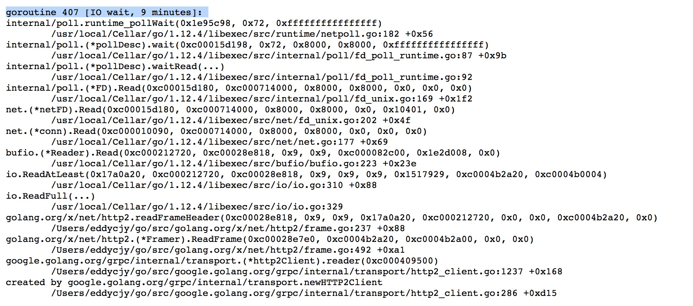

**3.2. 服務端**

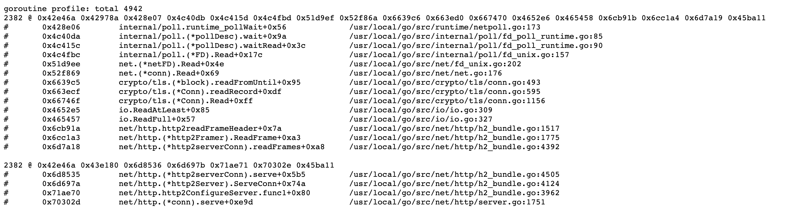

**3.3. TCP**

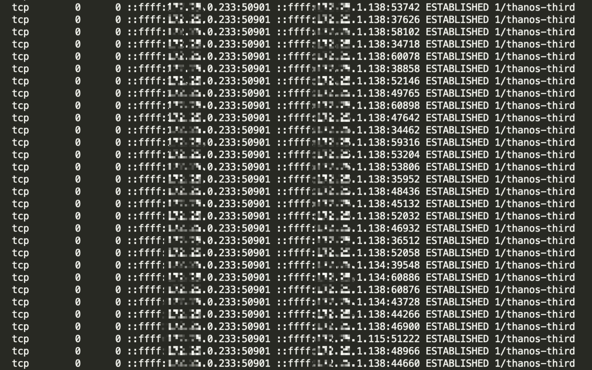

### 4. 不控制超時呼叫的話，會出現什麼問題？

短時間內不會出現問題，但是會不斷積蓄洩露，積蓄到最後當然就是服務無法提供響應了。如下圖：

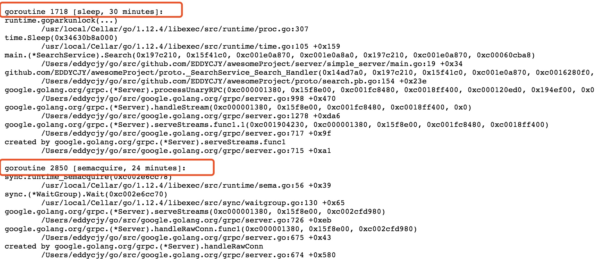

### 5. 為什麼預設的攔截器不可以傳多個？

```go
func chainUnaryClientInterceptors(cc *ClientConn) {
    interceptors := cc.dopts.chainUnaryInts
    if cc.dopts.unaryInt != nil {
        interceptors = append([]UnaryClientInterceptor{cc.dopts.unaryInt}, interceptors...)
    }
    var chainedInt UnaryClientInterceptor
    if len(interceptors) == 0 {
        chainedInt = nil
    } else if len(interceptors) == 1 {
        chainedInt = interceptors[0]
    } else {
        chainedInt = func(ctx context.Context, method string, req, reply interface{}, cc *ClientConn, invoker UnaryInvoker, opts ...CallOption) error {
            return interceptors[0](ctx, method, req, reply, cc, getChainUnaryInvoker(interceptors, 0, invoker), opts...)
        }
    }
    cc.dopts.unaryInt = chainedInt
}
```
當存在多個攔截器時，取的就是第一個攔截器。因此結論是允許傳多個，但並沒有用。

### 6. 真的需要用到多個攔截器的話，怎麼辦？

可以使用 [go-grpc-middleware](https://github.com/grpc-ecosystem/go-grpc-middleware) 提供的 `grpc.UnaryInterceptor` 和 `grpc.StreamInterceptor` 鏈式方法，方便快捷省心。

單單會用還不行，我們再深剖一下，看看它是怎麼實作的。核心程式碼如下：

```go
func ChainUnaryClient(interceptors ...grpc.UnaryClientInterceptor) grpc.UnaryClientInterceptor {
    n := len(interceptors)
    if n > 1 {
        lastI := n - 1
        return func(ctx context.Context, method string, req, reply interface{}, cc *grpc.ClientConn, invoker grpc.UnaryInvoker, opts ...grpc.CallOption) error {
            var (
                chainHandler grpc.UnaryInvoker
                curI         int
            )

            chainHandler = func(currentCtx context.Context, currentMethod string, currentReq, currentRepl interface{}, currentConn *grpc.ClientConn, currentOpts ...grpc.CallOption) error {
                if curI == lastI {
                    return invoker(currentCtx, currentMethod, currentReq, currentRepl, currentConn, currentOpts...)
                }
                curI++
                err := interceptors[curI](currentCtx, currentMethod, currentReq, currentRepl, currentConn, chainHandler, currentOpts...)
                curI--
                return err
            }

            return interceptors[0](ctx, method, req, reply, cc, chainHandler, opts...)
        }
    }
    ...
}
```
當攔截器數量大於 1 時，從 `interceptors[1]` 開始遞迴，每一個遞迴的攔截器 `interceptors[i]` 會不斷地執行，最後才真正的去執行 `handler` 方法。同時也經常有人會問攔截器的執行順序是什麼，透過這段程式碼你得出結論了嗎？

### 7. 頻繁建立 ClientConn 有什麼問題？

這個問題我們可以反向驗證一下，假設不公用 ClientConn 看看會怎麼樣？如下:

```go
func BenchmarkSearch(b *testing.B) {
    for i := 0; i < b.N; i++ {
        conn, err := GetClientConn()
        if err != nil {
            b.Errorf("GetClientConn err: %v", err)
        }
        _, err = Search(context.Background(), conn)
        if err != nil {
            b.Errorf("Search err: %v", err)
        }
    }
}
```
輸出結果：

```
    ... connection error: desc = "transport: Error while dialing dial tcp :10001: socket: too many open files"
    ... connection error: desc = "transport: Error while dialing dial tcp :10001: socket: too many open files"
    ... connection error: desc = "transport: Error while dialing dial tcp :10001: socket: too many open files"
    ... connection error: desc = "transport: Error while dialing dial tcp :10001: socket: too many open files"
FAIL
exit status 1
```

當你的應用場景是存在高頻次同時生成/呼叫 ClientConn 時，可能會導致系統的檔案控制代碼佔用過多。這種情況下你可以變更應用程式生成/呼叫 ClientConn 的模式，又或是池化它，這塊可以參考 [grpc-go-pool](https://github.com/EDDYCJY/blog/tree/9cb91be11af7dee7c0069f3758e82beea0a35b1e/talk/github.com/processout/grpc-go-pool/README.md) 專案。

### 8. 客戶端請求失敗後會預設重試嗎？

會不斷地進行重試，直到上下文取消。而重試時間方面採用 backoff 演算法作為的重連機制，預設的最大重試時間間隔是 120s。

### 9. 為什麼要用 HTTP/2 作為傳輸協議？

許多客戶端要透過 HTTP 代理來訪問網路，gRPC 全部用 HTTP/2 實作，等到代理開始支援 HTTP/2 就能透明轉發 gRPC 的資料。不光如此，負責負載均衡、訪問控制等等的反向代理都能無縫相容 gRPC，比起自己設計 wire protocol 的 Thrift，這樣做科學不少。@ctiller @滕亦飛

### 10. 在 Kubernetes 中 gRPC 負載均衡有問題？

gRPC 的 RPC 協議是基於 HTTP/2 標準實作的，HTTP/2 的一大特性就是不需要像 HTTP/1.1 一樣，每次發出請求都要重新建立一個新連線，而是會複用原有的連線。

所以這將導致 kube-proxy 只有在連線建立時才會做負載均衡，而在這之後的每一次 RPC 請求都會利用原本的連線，那麼實際上後續的每一次的 RPC 請求都跑到了同一個地方。

注：使用 k8s service 做負載均衡的情況下

## 總結

* gRPC 基於 HTTP/2 + Protobuf。
* gRPC 有四種呼叫方式，分別是一元、服務端/客戶端流式、雙向流式。
* gRPC 的附加資訊都會體現在 HEADERS 幀，資料在 DATA 幀上。
* Client 請求若使用 grpc.Dial 預設是非同步建立連線，當時狀態為 Connecting。
* Client 請求若需要同步則呼叫 WithBlock()，完成狀態為 Ready。
* Server 監聽是迴圈等待連線，若沒有則休眠，最大休眠時間 1s；若接收到新請求則起一個新的 goroutine 去處理。
* grpc.ClientConn 不關閉連線，會導致 goroutine 和 Memory 等洩露。
* 任何內/外呼叫如果不加超時控制，會出現洩漏和客戶端不斷重試。
* 特定場景下，如果不對 grpc.ClientConn 加以調控，會影響呼叫。
* 攔截器如果不用 go-grpc-middleware 鏈式處理，會覆蓋。
* 在選擇 gRPC 的負載均衡模式時，需要謹慎。

## 參考

* <http://doc.oschina.net/grpc>
* <https://github.com/grpc/grpc/blob/master/doc/PROTOCOL-HTTP2.md>
* <https://juejin.im/post/5b88a4f56fb9a01a0b31a67e>
* <https://www.ibm.com/developerworks/cn/web/wa-http2-under-the-hood/index.html>
* <https://github.com/grpc/grpc-go/issues/1953>
* <https://www.zhihu.com/question/52670041>
