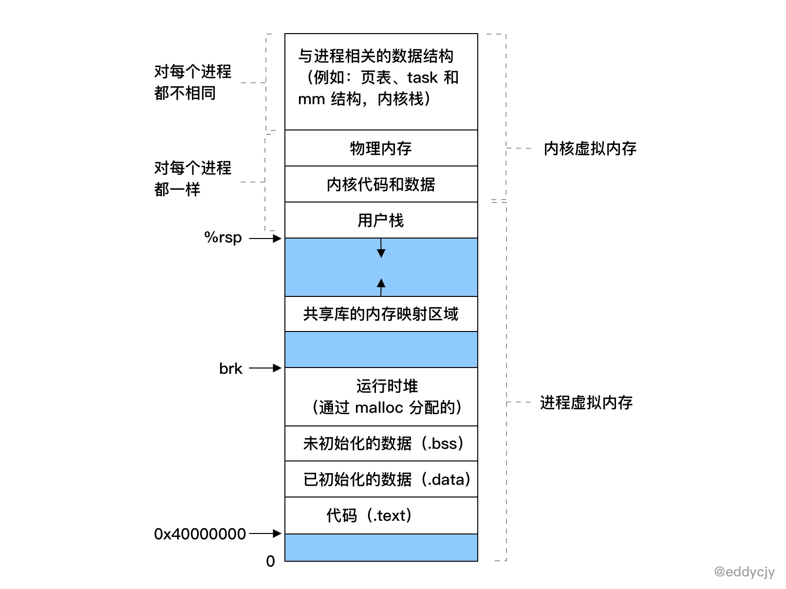
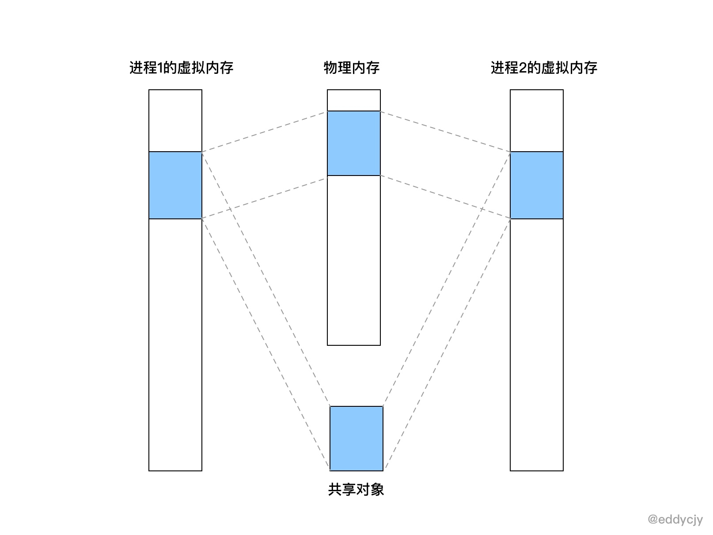
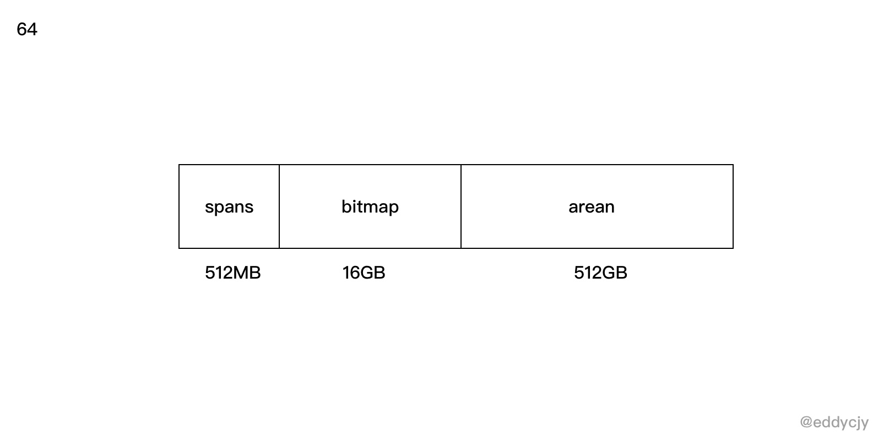

# 1.13 Go 應用記憶體佔用太多，讓排查？（VSZ篇）

前段時間，某同學說某服務的容器因為超出記憶體限制，不斷地重啟，問我們是不是有記憶體洩露，趕緊排查，然後解決掉，省的出問題。我們大為震驚，趕緊檢視監控+報警系統和效能分析，發現應用指標壓根就不高，不像有洩露的樣子。

那麼問題是出在哪裡了呢，我們進入某個容器裡查看了 `top` 的系統指標，結果如下：

```
PID       VSZ    RSS   ... COMMAND
67459     2007m  136m  ... ./eddycjy-server
```

從結果上來看，也沒什麼大開銷的東西，主要就一個 Go 程序，一看，某同學就說 VSZ 那麼高，而某雲上的容器記憶體指標居然恰好和 VSZ 的值相接近，因此某同學就懷疑是不是 VSZ 所導致的，覺得存在一定的關聯關係。

而從最終的結論上來講，上述的表述是不全對的，那麼在今天，本篇文章將**主要圍繞 Go 程序的 VSZ 來進行剖析**，看看到底它為什麼那麼 "高"，而在正式開始分析前，第一節為前置的補充知識，大家可按順序閱讀。

## 基礎知識

### 什麼是 VSZ

VSZ 是該程序所能使用的虛擬記憶體總大小，它包括程序可以訪問的所有記憶體，其中包括了被換出的記憶體（Swap）、已分配但未使用的記憶體以及來自共享庫的記憶體。

### 為什麼要虛擬記憶體

在前面我們有了解到 VSZ 其實就是該程序的虛擬記憶體總大小，那**如果我們想了解 VSZ 的話，那我們得先了解 “為什麼要虛擬記憶體？”**。

本質上來講，在一個系統中的程序是與其他程序共享 CPU 和主存資源的，而在現代的作業系統中，多程序的使用非常的常見，那麼如果太多的程序需要太多的記憶體，那麼在沒有虛擬記憶體的情況下，物理記憶體很可能會不夠用，就會導致其中有些任務無法執行，更甚至會出現一些很奇怪的現象，例如 “某一個程序不小心寫了另一個程序使用的記憶體”，就會造成記憶體破壞，因此虛擬記憶體是非常重要的一個媒介。

### 虛擬記憶體包含了什麼



而虛擬記憶體，又分為核心虛擬記憶體和程序虛擬記憶體，每一個程序的虛擬記憶體都是獨立的， 呈現如上圖所示。

這裡也補充說明一下，在核心虛擬記憶體中，是包含了核心中的程式碼和資料結構，而核心虛擬記憶體中的某些區域會被對映到所有程序共享的物理頁面中去，因此你會看到 ”核心虛擬記憶體“ 中實際上是包含了 ”物理記憶體“ 的，它們兩者存在對映關係。而在應用場景上來講，每個程序也會去共享核心的程式碼和全域性資料結構，因此就會被對映到所有程序的物理頁面中去。



### 虛擬記憶體的重要能力

為了更有效地管理記憶體並且減少出錯，現代系統提供了一種對主存的抽象概念，也就是今天的主角，叫做虛擬記憶體（VM），虛擬記憶體是硬體異常、硬體地址翻譯、主存、磁碟檔案和核心軟體互動的地方，它為每個程序提供了一個大的、一致的和私有的地址空間，虛擬記憶體提供了三個重要的能力：

1. 它將主存看成是一個儲存在磁碟上的地址空間的快取記憶體，在主存中只儲存活動區域，並根據需要在磁碟和主存之間來回傳送資料，透過這種方式，它高效地使用了主存。
2. 它為每個程序提供了一致的地址空間，從而簡化了記憶體管理。
3. 它保護了每個程序的地址空間不被其他程序破壞。

### 小結

上面發散的可能比較多，簡單來講，對於本文我們重點關注這些知識點，如下：

* 虛擬記憶體它是有各式各樣記憶體互動的地方，它包含的不僅僅是 "自己"，**而在本文中，我們只需要關注 VSZ，也就是程序虛擬記憶體，它包含了你的程式碼、資料、堆、棧段和共享庫**。
* 虛擬記憶體作為記憶體保護的工具，能夠保證程序之間的記憶體空間獨立，不受其他程序的影響，因此每一個程序的 VSZ 大小都不一樣，互不影響。
* 虛擬記憶體的存在，系統給各程序分配的記憶體之和是可以大於實際可用的物理記憶體的，因此你也會發現你程序的物理記憶體總是比虛擬記憶體低的多的多。

## 排查問題

在瞭解了基礎知識後，我們正式開始排查問題，第一步我們先編寫一個測試程式，看看沒有什麼業務邏輯的 Go 程式，它初始的 VSZ 是怎麼樣的。

### 測試

應用程式碼：

```go
func main() {
    r := gin.Default()
    r.GET("/ping", func(c *gin.Context) {
        c.JSON(200, gin.H{
            "message": "pong",
        })
    })
    r.Run(":8001")
}
```

檢視程序情況：

```
$ ps aux 67459
USER      PID  %CPU %MEM      VSZ    RSS   ...
eddycjy 67459   0.0  0.0  4297048    960   ...
```

從結果上來看，VSZ 為 4297048K，也就是 4G 左右，咋一眼看過去還是挺嚇人的，明明沒有什麼業務邏輯，但是為什麼那麼高呢，真是令人感到好奇。

### 確認有沒有洩露

在未知的情況下，我們可以首先看下 `runtime.MemStats` 和 `pprof`，確定應用到底有沒有洩露。不過我們這塊是演示程式，什麼業務邏輯都沒有，因此可以確定和應用沒有直接關係。

```
# runtime.MemStats
# Alloc = 1298568
# TotalAlloc = 1298568
# Sys = 71893240
# Lookups = 0
# Mallocs = 10013
# Frees = 834
# HeapAlloc = 1298568
# HeapSys = 66551808
# HeapIdle = 64012288
# HeapInuse = 2539520
# HeapReleased = 64012288
# HeapObjects = 9179
...
```

### Go FAQ

接著我第一反應是去翻了 Go FAQ（因為看到過，有印象），其問題為 "Why does my Go process use so much virtual memory?"，回答如下：

> The Go memory allocator reserves a large region of virtual memory as an arena for allocations. This virtual memory is local to the specific Go process; the reservation does not deprive other processes of memory.
>
> To find the amount of actual memory allocated to a Go process, use the Unix top command and consult the RES (Linux) or RSIZE (macOS) columns.

這個 FAQ 是在 2012 年 10 月 [提交](https://github.com/golang/go/commit/2100947d4a25dcf875be1941d0e3a409ea85051e) 的，這麼多年了也沒有更進一步的說明，再翻了 issues 和 forum，一些關閉掉的 issue 都指向了 FAQ，這顯然無法滿足我的求知慾，因此我繼續往下探索，看看裡面到底都擺了些什麼。

### 檢視記憶體對映

在上圖中，我們有提到程序虛擬記憶體，主要包含了你的程式碼、資料、堆、棧段和共享庫，那初步懷疑是不是程序做了什麼記憶體對映，導致了大量的記憶體空間被保留呢，為了確定這一點，我們透過如下命令去排查：

```
$ vmmap --wide 67459
...
==== Non-writable regions for process 67459
REGION TYPE                      START - END             [ VSIZE  RSDNT  DIRTY   SWAP] PRT/MAX SHRMOD PURGE    REGION DETAIL
__TEXT                 00000001065ff000-000000010667b000 [  496K   492K     0K     0K] r-x/rwx SM=COW          /bin/zsh
__LINKEDIT             0000000106687000-0000000106699000 [   72K    44K     0K     0K] r--/rwx SM=COW          /bin/zsh
MALLOC metadata        000000010669b000-000000010669c000 [    4K     4K     4K     0K] r--/rwx SM=COW          DefaultMallocZone_0x10669b000 zone structure
...
__TEXT                 00007fff76c31000-00007fff76c5f000 [  184K   168K     0K     0K] r-x/r-x SM=COW          /usr/lib/system/libxpc.dylib
__LINKEDIT             00007fffe7232000-00007ffff32cb000 [192.6M  17.4M     0K     0K] r--/r-- SM=COW          dyld shared cache combined __LINKEDIT
...        

==== Writable regions for process 67459
REGION TYPE                      START - END             [ VSIZE  RSDNT  DIRTY   SWAP] PRT/MAX SHRMOD PURGE    REGION DETAIL
__DATA                 000000010667b000-0000000106682000 [   28K    28K    28K     0K] rw-/rwx SM=COW          /bin/zsh
...   
__DATA                 0000000106716000-000000010671e000 [   32K    28K    28K     4K] rw-/rwx SM=COW          /usr/lib/zsh/5.3/zsh/zle.so
__DATA                 000000010671e000-000000010671f000 [    4K     4K     4K     0K] rw-/rwx SM=COW          /usr/lib/zsh/5.3/zsh/zle.so
__DATA                 0000000106745000-0000000106747000 [    8K     8K     8K     0K] rw-/rwx SM=COW          /usr/lib/zsh/5.3/zsh/complete.so
__DATA                 000000010675a000-000000010675b000 [    4K     4K     4K     0K] rw-
...
```

這塊主要是利用 macOS 的 `vmmap` 命令去檢視記憶體對映情況，這樣就可以知道這個程序的記憶體對映情況，從輸出分析來看，**這些關聯共享庫佔用的空間並不大，導致 VSZ 過高的根本原因不在共享庫和二進位制檔案上，但是並沒有發現大量保留記憶體空間的行為，這是一個問題點**。

注：若是 Linux 系統，可使用 `cat /proc/PID/maps` 或 `cat /proc/PID/smaps` 檢視。

### 檢視系統呼叫

既然在記憶體對映中，我們沒有明確的看到保留記憶體空間的行為，那我們接下來看看該程序的系統呼叫，確定一下它是否存在記憶體操作的行為，如下：

```
$ sudo dtruss -a ./awesomeProject
...
 4374/0x206a2:     15620       6      3 mprotect(0x1BC4000, 0x1000, 0x0)         = 0 0
...
 4374/0x206a2:     15781       9      4 sysctl([CTL_HW, 3, 0, 0, 0, 0] (2), 0x7FFEEFBFFA64, 0x7FFEEFBFFA68, 0x0, 0x0)         = 0 0
 4374/0x206a2:     15783       3      1 sysctl([CTL_HW, 7, 0, 0, 0, 0] (2), 0x7FFEEFBFFA64, 0x7FFEEFBFFA68, 0x0, 0x0)         = 0 0
 4374/0x206a2:     15899       7      2 mmap(0x0, 0x40000, 0x3, 0x1002, 0xFFFFFFFFFFFFFFFF, 0x0)         = 0x4000000 0
 4374/0x206a2:     15930       3      1 mmap(0xC000000000, 0x4000000, 0x0, 0x1002, 0xFFFFFFFFFFFFFFFF, 0x0)         = 0xC000000000 0
 4374/0x206a2:     15934       4      2 mmap(0xC000000000, 0x4000000, 0x3, 0x1012, 0xFFFFFFFFFFFFFFFF, 0x0)         = 0xC000000000 0
 4374/0x206a2:     15936       2      0 mmap(0x0, 0x2000000, 0x3, 0x1002, 0xFFFFFFFFFFFFFFFF, 0x0)         = 0x59B7000 0
 4374/0x206a2:     15942       2      0 mmap(0x0, 0x210800, 0x3, 0x1002, 0xFFFFFFFFFFFFFFFF, 0x0)         = 0x4040000 0
 4374/0x206a2:     15947       2      0 mmap(0x0, 0x10000, 0x3, 0x1002, 0xFFFFFFFFFFFFFFFF, 0x0)         = 0x1BD0000 0
 4374/0x206a2:     15993       3      0 madvise(0xC000000000, 0x2000, 0x8)         = 0 0
 4374/0x206a2:     16004       2      0 mmap(0x0, 0x10000, 0x3, 0x1002, 0xFFFFFFFFFFFFFFFF, 0x0)         = 0x1BE0000 0
...
```

在這小節中，我們透過 macOS 的 `dtruss` 命令監聽並查看了執行這個程式所進行的所有系統呼叫，發現了與記憶體管理有一定關係的方法如下：

* mmap：建立一個新的虛擬記憶體區域，但這裡需要注意，**就是當系統呼叫 mmap 時，它只是從虛擬記憶體中申請了一段空間出來，並不會去分配和對映真實的物理記憶體，而當你訪問這段空間的時候，才會在當前時間真正的去分配物理記憶體**。那麼對應到我們實際應用的程序中，那就是 VSZ 的增長後，而該記憶體空間又未正式使用的話，物理記憶體是不會有增長的。
* madvise：提供有關使用記憶體的建議，例如：MADV\_NORMAL、MADV\_RANDOM、MADV\_SEQUENTIAL、MADV\_WILLNEED、MADV\_DONTNEED 等等。
* mprotect：設定記憶體區域的保護情況，例如：PROT\_NONE、PROT\_READ、PROT\_WRITE、PROT\_EXEC、PROT\_SEM、PROT\_SAO、PROT\_GROWSUP、PROT\_GROWSDOWN 等等。
* sysctl：在核心執行時動態地修改核心的執行引數。

在此比較可疑的是 `mmap` 方法，它在 `dtruss` 的最終統計中一共呼叫了 10 餘次，我們可以相信它在 Go Runtime 的時候進行了大量的虛擬記憶體申請，我們再接著往下看，看看到底是在什麼階段進行了虛擬記憶體空間的申請。

注：若是 Linux 系統，可使用 `strace` 命令。

### 檢視 Go Runtime

#### 啟動流程

透過上述的分析，我們可以知道在 Go 程式啟動的時候 VSZ 就已經不低了，並且確定不是共享庫等的原因，且程式在啟動時系統呼叫確實存在 `mmap` 等方法的呼叫，那麼我們可以充分懷疑 Go 在初始化階段就保留了該記憶體空間。那我們第一步要做的就是檢視一下 Go 的引導啟動流程，看看是在哪裡申請的，引導過程如下：

```
graph TD
A(rt0_darwin_amd64.s:8<br/>_rt0_amd64_darwin) -->|JMP| B(asm_amd64.s:15<br/>_rt0_amd64)
B --> |JMP|C(asm_amd64.s:87<br/>runtime-rt0_go)
C --> D(runtime1.go:60<br/>runtime-args)
D --> E(os_darwin.go:50<br/>runtime-osinit)
E --> F(proc.go:472<br/>runtime-schedinit)
F --> G(proc.go:3236<br/>runtime-newproc)
G --> H(proc.go:1170<br/>runtime-mstart)
H --> I(在新创建的 p 和 m 上运行 runtime-main)
```

* runtime-osinit：取得 CPU 核心數。
* runtime-schedinit：初始化程式執行環境（包括棧、記憶體分配器、垃圾回收、P等）。
* runtime-newproc：建立一個新的 G 和 繫結 runtime.main。
* runtime-mstart：啟動執行緒 M。

注：來自@曹大的 《Go 程式的啟動流程》和@全成的 《Go 程式是怎樣跑起來的》，推薦大家閱讀。

#### 初始化執行環境

顯然，我們要研究的是 runtime 裡的 `schedinit` 方法，如下：

```go
func schedinit() {
    ...
    stackinit()
    mallocinit()
    mcommoninit(_g_.m)
    cpuinit()       // must run before alginit
    alginit()       // maps must not be used before this call
    modulesinit()   // provides activeModules
    typelinksinit() // uses maps, activeModules
    itabsinit()     // uses activeModules

    msigsave(_g_.m)
    initSigmask = _g_.m.sigmask

    goargs()
    goenvs()
    parsedebugvars()
    gcinit()
  ...
}
```

從用途來看，非常明顯， `mallocinit` 方法會進行記憶體分配器的初始化，我們繼續往下看。

#### 初始化記憶體分配器

**mallocinit**

接下來我們正式的分析一下 `mallocinit` 方法，在引導流程中， `mallocinit` 主要承擔 Go 程式的記憶體分配器的初始化動作，而今天主要是針對虛擬記憶體地址這塊進行拆解，如下：

```go
func mallocinit() {
    ...
    if sys.PtrSize == 8 {
        for i := 0x7f; i >= 0; i-- {
            var p uintptr
            switch {
            case GOARCH == "arm64" && GOOS == "darwin":
                p = uintptr(i)<<40 | uintptrMask&(0x0013<<28)
            case GOARCH == "arm64":
                p = uintptr(i)<<40 | uintptrMask&(0x0040<<32)
            case GOOS == "aix":
                if i == 0 {
                    continue
                }
                p = uintptr(i)<<40 | uintptrMask&(0xa0<<52)
            case raceenabled:
                ...
            default:
                p = uintptr(i)<<40 | uintptrMask&(0x00c0<<32)
            }
            hint := (*arenaHint)(mheap_.arenaHintAlloc.alloc())
            hint.addr = p
            hint.next, mheap_.arenaHints = mheap_.arenaHints, hint
        }
    } else {
      ...
    }
}
```

* 判斷當前是 64 位還是 32 位的系統。
* 從 0x7fc000000000\~0x1c000000000 開始設定保留地址。
* 判斷當前 `GOARCH`、`GOOS` 或是否開啟了競態檢查，根據不同的情況申請不同大小的連續記憶體地址，而這裡的 `p` 是即將要要申請的連續記憶體地址的開始地址。
* 儲存剛剛計算的 arena 的資訊到 `arenaHint` 中。

可能會有小夥伴問，為什麼要判斷是 32 位還是 64 位的系統，這是因為不同位數的虛擬記憶體的定址範圍是不同的，因此要進行區分，否則會出現高位的虛擬記憶體對映問題。而在申請保留空間時，我們會經常提到 `arenaHint` 結構體，它是 `arenaHints`連結串列裡的一個節點，結構如下：

```go
type arenaHint struct {
    addr uintptr
    down bool
    next *arenaHint
}
```

* addr：`arena` 的起始地址
* down：是否最後一個 `arena`
* next：下一個 `arenaHint` 的指標地址

那麼這裡瘋狂提到的 `arena` 又是什麼東西呢，這其實是 Go 的記憶體管理中的概念，Go Runtime 會把申請的虛擬記憶體分為三個大塊，如下：



* spans：記錄 arena 區域頁號和 mspan 的對映關係。
* bitmap：標識 arena 的使用情況，在功能上來講，會用於標識 arena 的哪些空間地址已經儲存了物件。
* arean：arean 其實就是 Go 的堆區，是由 mheap 進行管理的，它的 MaxMem 是 512GB-1。而在功能上來講，Go 會在初始化的時候申請一段連續的虛擬記憶體空間地址到 arean 保留下來，在真正需要申請堆上的空間時再從 arean 中取出來處理，這時候就會轉變為物理記憶體了。

在這裡的話，你需要理解 arean 區域在 Go 記憶體裡的作用就可以了。

**mmap**

我們剛剛透過上述的分析，已經知道 `mallocinit` 的用途了，但是你可能還是會有疑惑，就是我們之前所看到的 `mmap` 系統呼叫，和它又有什麼關係呢，怎麼就關聯到一起了，接下來我們先一起來看看更下層的程式碼，如下：

```go
func sysAlloc(n uintptr, sysStat *uint64) unsafe.Pointer {
    p, err := mmap(nil, n, _PROT_READ|_PROT_WRITE, _MAP_ANON|_MAP_PRIVATE, -1, 0)
    ...
    mSysStatInc(sysStat, n)
    return p
}

func sysReserve(v unsafe.Pointer, n uintptr) unsafe.Pointer {
    p, err := mmap(v, n, _PROT_NONE, _MAP_ANON|_MAP_PRIVATE, -1, 0)
    ...
}

func sysMap(v unsafe.Pointer, n uintptr, sysStat *uint64) {
    ...
    munmap(v, n)
    p, err := mmap(v, n, _PROT_READ|_PROT_WRITE, _MAP_ANON|_MAP_FIXED|_MAP_PRIVATE, -1, 0)
  ...
}
```

在 Go Runtime 中存在著一系列的系統級記憶體呼叫方法，本文涉及的主要如下：

* sysAlloc：從 OS 系統上申請清零後的記憶體空間，呼叫引數是 `_PROT_READ|_PROT_WRITE, _MAP_ANON|_MAP_PRIVATE`，得到的結果需進行記憶體對齊。
* sysReserve：從 OS 系統中保留記憶體的地址空間，這時候還沒有分配物理記憶體，呼叫引數是 `_PROT_NONE, _MAP_ANON|_MAP_PRIVATE`，得到的結果需進行記憶體對齊。
* sysMap：通知 OS 系統我們要使用已經保留了的記憶體空間，呼叫引數是 `_PROT_READ|_PROT_WRITE, _MAP_ANON|_MAP_FIXED|_MAP_PRIVATE`。

看上去好像很有道理的樣子，但是 `mallocinit` 方法在初始化時，到底是在哪裡涉及了 `mmap` 方法呢，表面看不出來，如下：

```
for i := 0x7f; i >= 0; i-- {
    ...
    hint := (*arenaHint)(mheap_.arenaHintAlloc.alloc())
    hint.addr = p
    hint.next, mheap_.arenaHints = mheap_.arenaHints, hint
}
```

實際上在呼叫 `mheap_.arenaHintAlloc.alloc()` 時，呼叫的是 `mheap` 下的 `sysAlloc` 方法，而 `sysAlloc` 又會與 `mmap` 方法產生呼叫關係，並且這個方法與常規的 `sysAlloc` 還不大一樣，如下：

```go
var mheap_ mheap
...
func (h *mheap) sysAlloc(n uintptr) (v unsafe.Pointer, size uintptr) {
    ...
    for h.arenaHints != nil {
        hint := h.arenaHints
        p := hint.addr
        if hint.down {
            p -= n
        }
        if p+n < p {
            v = nil
        } else if arenaIndex(p+n-1) >= 1<<arenaBits {
            v = nil
        } else {
            v = sysReserve(unsafe.Pointer(p), n)
        }
        ...
}
```

你可以驚喜的發現 `mheap.sysAlloc` 裡其實有呼叫 `sysReserve` 方法，而 `sysReserve` 方法又正正是從 OS 系統中保留記憶體的地址空間的特定方法，是不是很驚喜，一切似乎都串起來了。

#### 小結

在本節中，我們先寫了一個測試程式，然後根據非常規的排查思路進行了一步步的跟蹤懷疑，整體流程如下：

* 透過 `top` 或 `ps` 等命令，檢視程序執行情況，分析基礎指標。
* 透過 `pprof` 或 `runtime.MemStats` 等工具鏈檢視應用執行情況，分析應用層面是否有洩露或者哪兒高。
* 透過 `vmmap` 命令，檢視程序的記憶體對映情況，分析是不是程序虛擬空間內的某個區域比較高，例如：共享庫等。
* 透過 `dtruss` 命令，檢視程式的系統呼叫情況，分析可能出現的一些特殊行為，例如：在分析中我們發現  `mmap` 方法呼叫的比例是比較高的，那我們有充分的理由懷疑 Go 在啟動時就進行了大量的記憶體空間保留。
* 透過上述的分析，確定可能是在哪個環節申請了那麼多的記憶體空間後，再到 Go Runtime 中去做進一步的原始碼分析，因為原始碼面前，了無秘密，沒必要靠猜。

從結論上而言，VSZ（程序虛擬記憶體大小）與共享庫等沒有太大的關係，主要與 Go Runtime 存在直接關聯，也就是在前圖中表示的執行時堆（malloc）。轉換到 Go Runtime 裡，就是在 `mallocinit` 這個記憶體分配器的初始化階段裡進行了一定量的虛擬空間的保留。

而保留虛擬記憶體空間時，受什麼影響，又是一個哲學問題。從原始碼上來看，主要如下：

* 受不同的 OS 系統架構（GOARCH/GOOS）和位數（32/64 位）的影響。
* 受記憶體對齊的影響，計算回來的記憶體空間大小是需要經過對齊才會進行保留。

## 總結

我們透過一步步地分析，講解了 Go 會在哪裡，又會受什麼因素，去呼叫了什麼方法保留了那麼多的虛擬記憶體空間，但是我們肯定會憂心程序虛擬記憶體（VSZ）高，會不會存在問題呢，我分析如下：

* VSZ 並不意味著你真正使用了那些物理記憶體，因此是不需要擔心的。
* VSZ 並不會給 GC 帶來壓力，GC 管理的是程序實際使用的物理記憶體，而 VSZ 在你實際使用它之前，它並沒有過多的代價。
* VSZ 基本都是不可訪問的記憶體對映，也就是它並沒有記憶體的訪問許可權（不允許讀、寫和執行）。

看到這裡舒一口氣，因為 Go VSZ 的高，並不會對我們產生什麼非常實質性的問題，但是又仔細一想，為什麼 Go 要申請那麼多的虛擬記憶體呢，到底有啥用呢，考慮如下：Go 的設計是考慮到 `arena` 和 `bitmap` 的後續使用，先提早保留了整個記憶體地址空間。 然後隨著 Go Runtime 和應用的逐步使用，肯定也會開始實際的申請和使用記憶體，這時候 `arena` 和 `bitmap` 的記憶體分配器就只需要將事先申請好的記憶體地址空間保留更改為實際可用的物理記憶體就好了，這樣子可以極大的提高效能。

## 參考

* [曹大的 Go 程式的啟動流程](http://xargin.com/go-bootstrap/)
* [全成的 Go 程式是怎樣跑起來的](https://www.cnblogs.com/qcrao-2018/p/11124360.html)
* [推薦閱讀 歐神的 go-under-the-hood](https://github.com/changkun/go-under-the-hood/blob/master/book/zh-cn/part2runtime/ch07alloc/readme.md)
* [High virtual memory allocation by golang](https://forum.golangbridge.org/t/high-virtual-memory-allocation-by-golang/6716)
* [GO MEMORY MANAGEMENT](https://povilasv.me/go-memory-management/)
* [GoBigVirtualSize](https://utcc.utoronto.ca/~cks/space/blog/programming/GoBigVirtualSize)
* [GoProgramMemoryUse](https://utcc.utoronto.ca/~cks/space/blog/programming/GoProgramMemoryUse)
