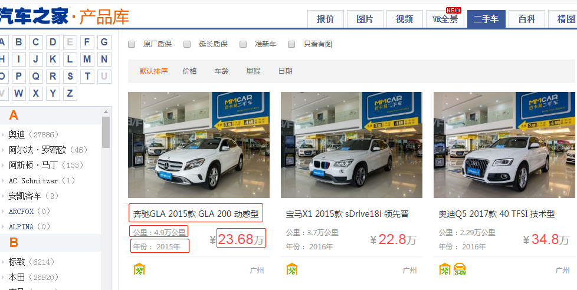
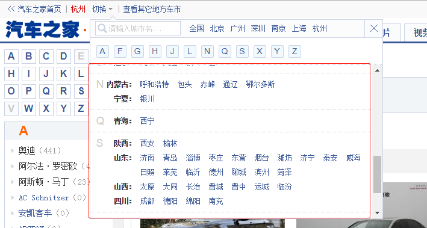
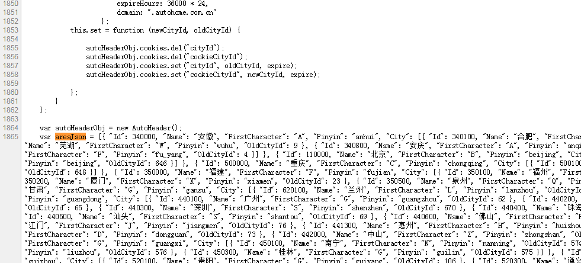
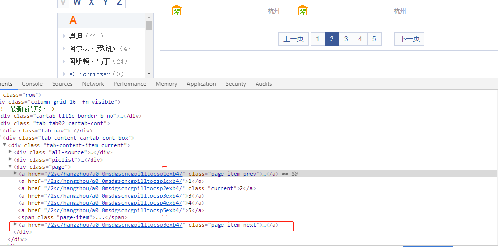
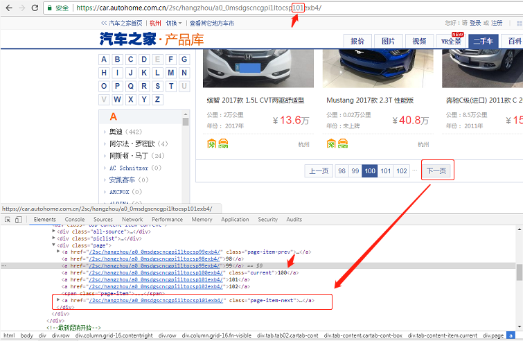
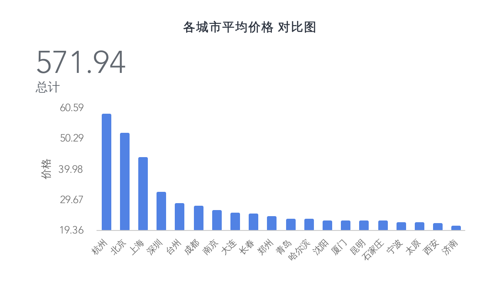
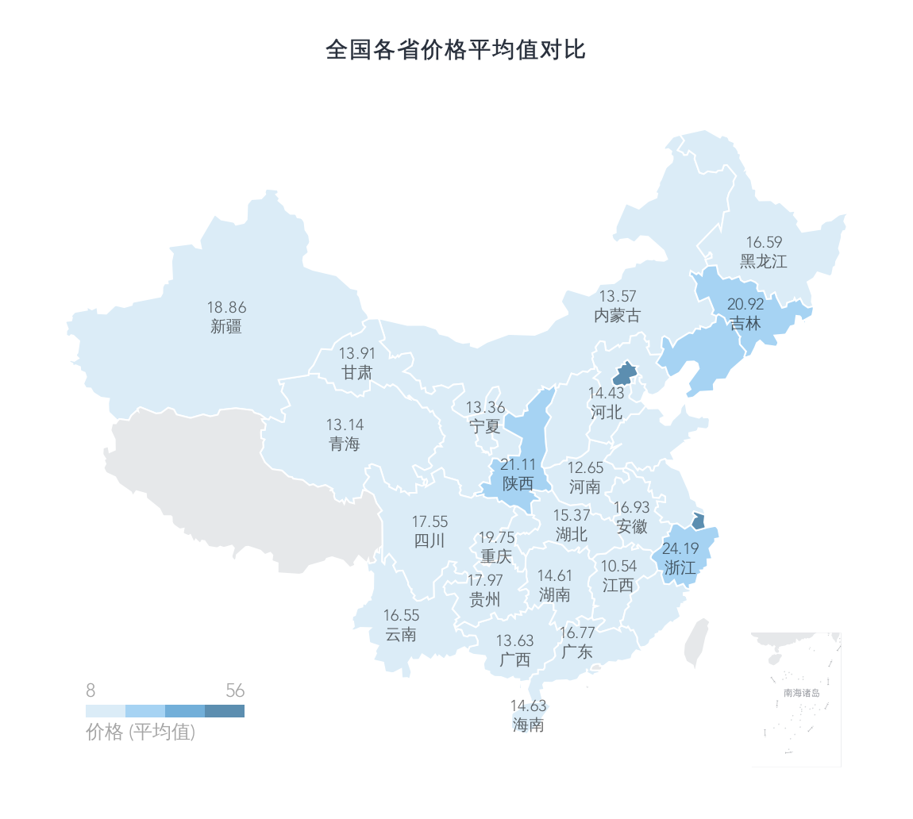
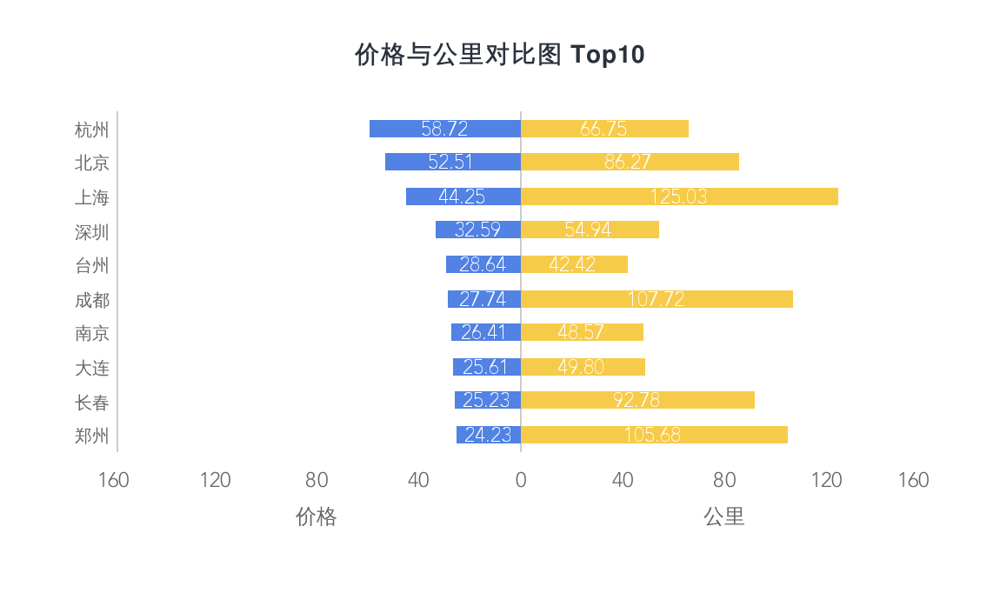
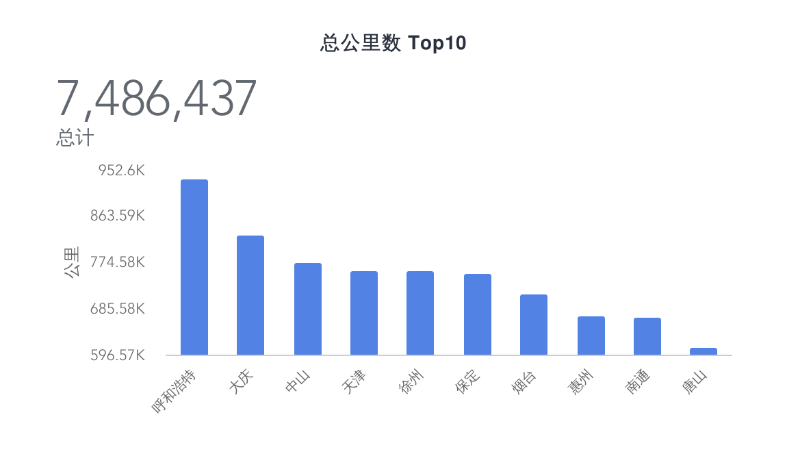

# 9.2 爬取汽車之家 二手車產品庫

專案地址：<https://github.com/go-crawler/car-prices>

## 目標

最近經常有人在耳邊提起汽車之家，也好奇二手車在國內的價格是怎麼樣的，因此本次的目標站點是 [汽車之家](https://car.autohome.com.cn/2sc/440399/index.html) 的二手車產品庫



分析目標源：

* 一頁共24條
* 含分頁，但這個老產品庫，在100頁後會存在問題，因此我們爬取99頁
* 可以取得全部城市
* 共可爬取 19w+ 資料

## 開始

爬取步驟

* 取得全部的城市
* 拼裝全部城市URL入佇列
* 解析二手車頁面結構
* 下一頁URL入佇列
* 迴圈拉取所有分頁的二手車資料
* 迴圈拉取佇列中城市的二手車資料
* 等待，確定佇列中無新的 URL
* 爬取的二手車資料入庫

### 取得城市



透過頁面檢視，可發現在城市篩選區可得到全部的二手車城市列表，但是你仔細查閱程式碼。會發現它是JS載入進來的，城市也統一放在了一個變數中



有兩種提取方法

* 分析JS變數，提取出來
* 直接將 `areaJson` 複製出來作為變數解析

在這裡我們直接將其複製粘貼出來即可，因為這是比較少變動的值

### 取得分頁



透過分析頁面可以得知分頁連結是有一定規律的，例如：`/2sc/hangzhou/a0_0msdgscncgpi1ltocsp2exb4/`，可以發現 `sp%d`，`sp` 後面為頁碼

按照常理，可以透過預測所有分頁連結，推入佇列後 `go routine` 一波 即可快速拉取

但是在這老產品庫存在一個問題，在超過 100 頁後，下一頁永遠是 101 頁



因此我們採取比較傳統的做法，透過拉取下一頁的連結去訪問，以便適應可能的分頁連結改變； 100 頁以後的分頁展示也很奇怪，先忽視

### 取得二手車資料

頁面結構較為固定，常規的清洗 HTML 即可

```go
func GetCars(doc *goquery.Document) (cars []QcCar) {
    cityName := GetCityName(doc)
    doc.Find(".piclist ul li:not(.line)").Each(func(i int, selection *goquery.Selection) {
        title := selection.Find(".title a").Text()
        price := selection.Find(".detail .detail-r").Find(".colf8").Text()
        kilometer := selection.Find(".detail .detail-l").Find("p").Eq(0).Text()
        year := selection.Find(".detail .detail-l").Find("p").Eq(1).Text()

        kilometer = strings.Join(compileNumber.FindAllString(kilometer, -1), "")
        year = strings.Join(compileNumber.FindAllString(strings.TrimSpace(year), -1), "")
        priceS, _ := strconv.ParseFloat(price, 64)
        kilometerS, _ := strconv.ParseFloat(kilometer, 64)
        yearS, _ := strconv.Atoi(year)

        cars = append(cars, QcCar{
            CityName: cityName,
            Title: title,
            Price: priceS,
            Kilometer: kilometerS,
            Year: yearS,
        })
    })

    return cars
}
```
## 資料





在各城市的平均價格對比中，我們可以發現北上廣深裡的北京、上海、深圳都在榜單上，而近年勢頭較猛的杭州直接佔領了榜首，且後幾名都有一些距離

而其他城市大致都是梯級下降的趨勢，看來一線城市的二手車也是不便宜了，當然這只是均價



我們可以看到價格和公里數的對比，上海、成都、鄭州的等比差異是有點大，感覺有需求的話可以在價格和公里數上做一個衡量



這圖有點兒有趣，粗略的統計了一下總公里數。在前幾張圖裡，平均價格排名較高的統統沒有出現在這裡，反倒是呼和浩特、大慶、中山等出現在了榜首

是否側面反應了一線城市的車輛更新換代較快，而較後的城市的車輛倒是換代較慢，公里數基本都槓槓的


透過對標題的分析，可以得知車輛產品庫的命名基本都是品牌名稱+自動/手動+XXXX款+屬性，看標題就能知道個概況了

## 參考

### 爬蟲專案地址

* <https://github.com/go-crawler/car-prices>
