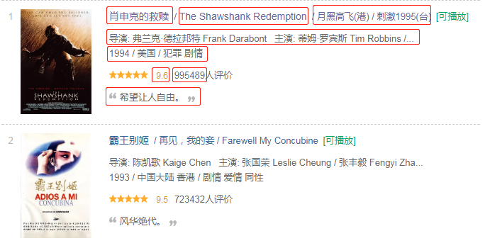
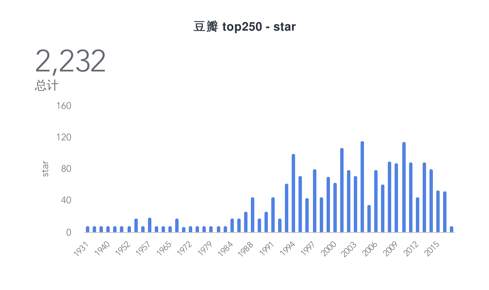
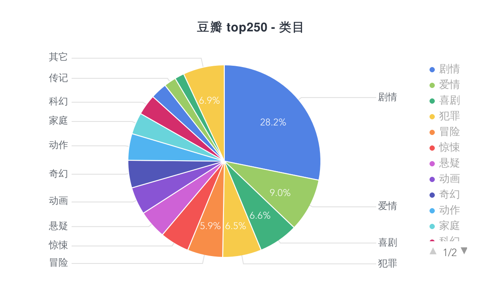

# 9.1 爬取豆瓣電影 Top250

爬蟲是標配了，看資料那一刻很有趣。第一個就從最最最簡單最基礎的爬蟲開始寫起吧！

專案地址：<https://github.com/go-crawler/douban-movie>

## 目標

我們的目標站點是 [豆瓣電影 Top250](https://movie.douban.com/top250)，估計大家都很眼熟了

本次爬取8個欄位，用於簡單的概括分析。具體的欄位如下：



簡單的分析一下目標源

* 一頁共25條
* 含分頁（共10頁）且分頁規則是正常的
* 每一項的資料欄位排序都是規則且不變

## 開始

由於量不大，我們的爬取步驟如下

* 分析頁面，取得所有的分頁
* 分析頁面，迴圈爬取所有頁面的電影資訊
* 爬取的電影資訊入庫

### 安裝

```
$ go get -u github.com/PuerkitoBio/goquery
```

### 執行

```
$ go run main.go
```

### 程式碼片段

#### 1、取得所有分頁

```go
func ParsePages(doc *goquery.Document) (pages []Page) {
    pages = append(pages, Page{Page: 1, Url: ""})
    doc.Find("#content > div > div.article > div.paginator > a").Each(func(i int, s *goquery.Selection) {
        page, _ := strconv.Atoi(s.Text())
        url, _ := s.Attr("href")

        pages = append(pages, Page{
            Page: page,
            Url:  url,
        })
    })

    return pages
}
```
#### 2、分析豆瓣電影資訊

```go
func ParseMovies(doc *goquery.Document) (movies []Movie) {
    doc.Find("#content > div > div.article > ol > li").Each(func(i int, s *goquery.Selection) {
        title := s.Find(".hd a span").Eq(0).Text()

        ...

        movieDesc := strings.Split(DescInfo[1], "/")
        year := strings.TrimSpace(movieDesc[0])
        area := strings.TrimSpace(movieDesc[1])
        tag := strings.TrimSpace(movieDesc[2])

        star := s.Find(".bd .star .rating_num").Text()

        comment := strings.TrimSpace(s.Find(".bd .star span").Eq(3).Text())
        compile := regexp.MustCompile("[0-9]")
        comment = strings.Join(compile.FindAllString(comment, -1), "")

        quote := s.Find(".quote .inq").Text()

        ...

        log.Printf("i: %d, movie: %v", i, movie)

        movies = append(movies, movie)
    })

    return movies
}
```
### 資料






看到這些資料，你有什麼想法呢，真是好奇 :=)
