# 9.3 瞭解一下Golang的市場行情

專案地址：<https://github.com/go-crawler/lagou_jobs>

如果對你有所幫助，歡迎 Star，給文章來波贊，這樣可以讓更多的人看見 :)

## 目標

在工作中 Golang 已是一份子，想讓大家瞭解一下 Golang 的市場行情，也想讓更多的人熟悉它。因此主要是展示資料分析的結果

目標站點是 [某招聘網站](https://www.lagou.com/) 的職位資料抓取和分析，爬取城市分別為 北京、上海、廣州、深圳、杭州、成都，再得出一個結論

### 分析

首先需要進行頁面分析，找到我們的抓取方向

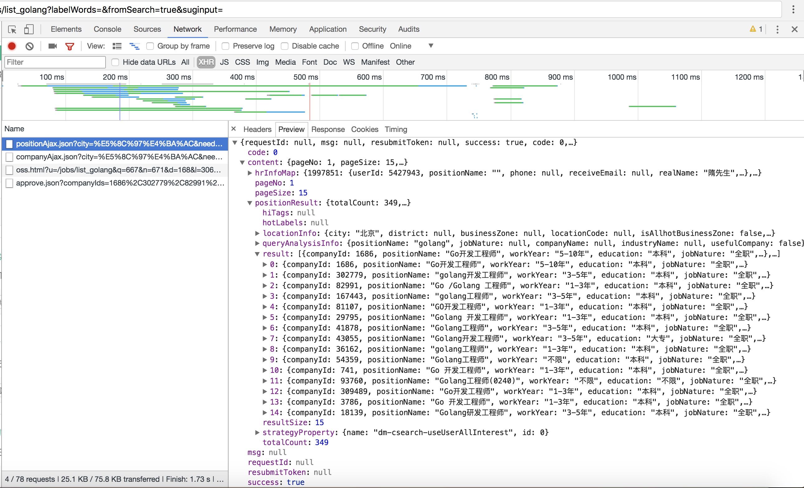

搜尋 golang 關鍵字，開啟頁面 F12 就能看到它傳送了四個請求，留意 positionAjax.json 這個請求

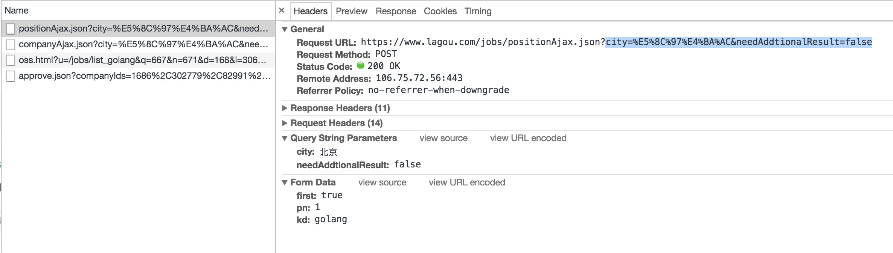

我們仔細研判這個介面的入參和出參

### 入參

1、Query String Param

* city：請求的城市
* needAddtionalResult：是否需要補充額外的引數，這裡預設 false

2、Form Data

* first：是否首頁
* pn：頁碼
* kd：關鍵字

### 出參

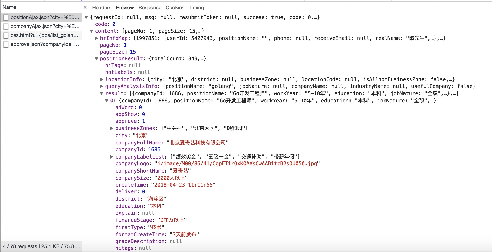

就是它了，從返回結果可得出許多有用的資訊

* companyFullName：公司全稱
* companyLabelList：公司標籤
* companyShortName：公司簡稱
* companySize：公司規模
* education：學歷要求
* financeStage：融資階段

等等\~

### 分頁

在上面兩張圖中，可以發現在 content 節點中包含 pageNo、pageSize 欄位，content.positionResult 節點有 totalCount 欄位，可以得知當前是第幾頁，每頁顯示多少條，當前的職位總條數

需要注意一下，分頁的計算是要向上取整的

## 模擬瀏覽器頭

User-Agent 可以用 [fake-useragent](https://github.com/EDDYCJY/fake-useragent) 這個專案來隨機生成 UA 頭😄

## 資料

### 一、分佈圖

不同工作、工種，自然也會遍佈在不同的工作區域，我們先了解一下各個城市的 Golang 工程師都主要在哪個區上班，心裡留個底

#### 北京

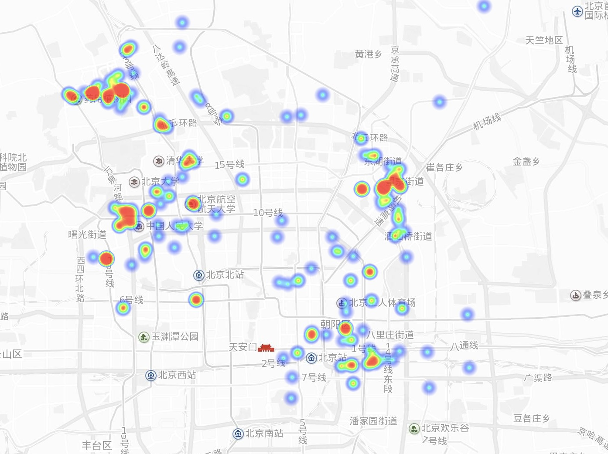

#### 上海

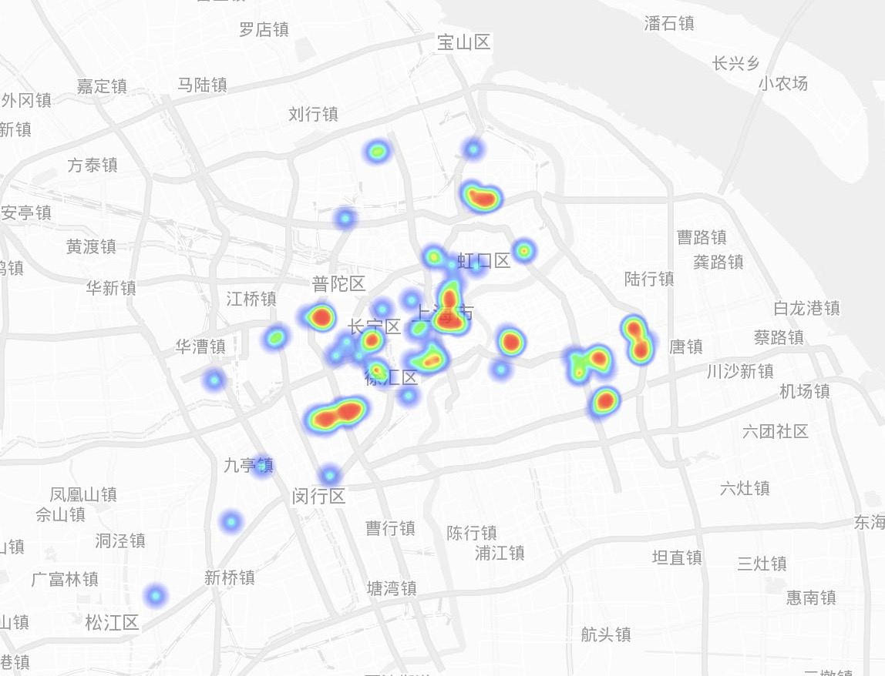

#### 廣州

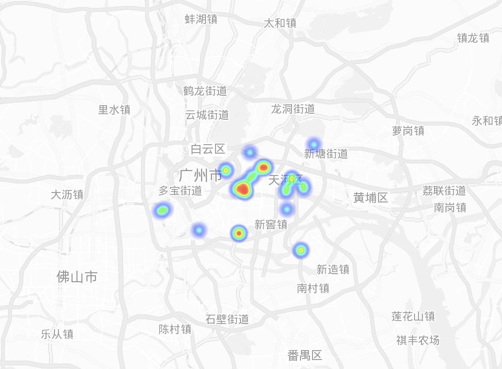

#### 深圳

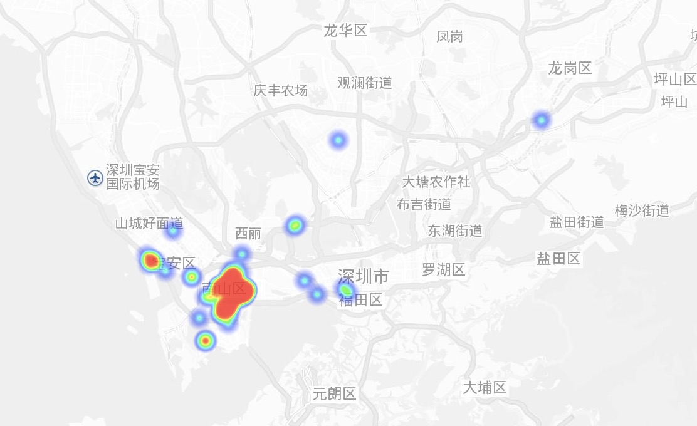

#### 杭州

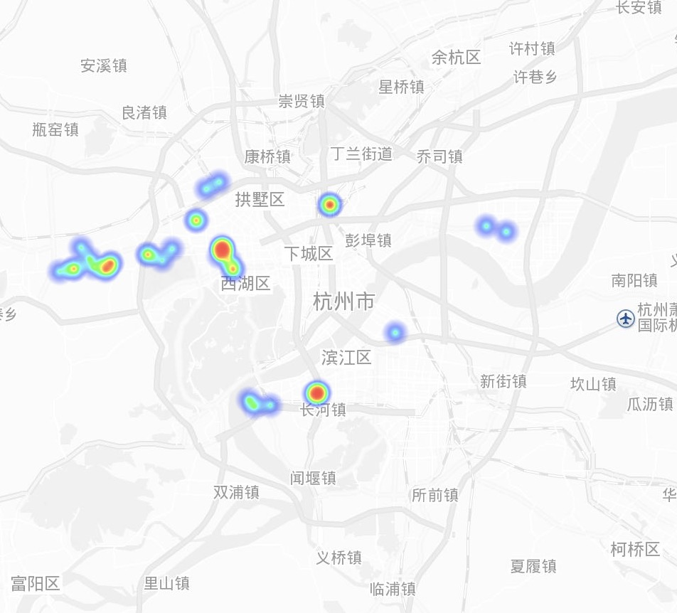

#### 成都

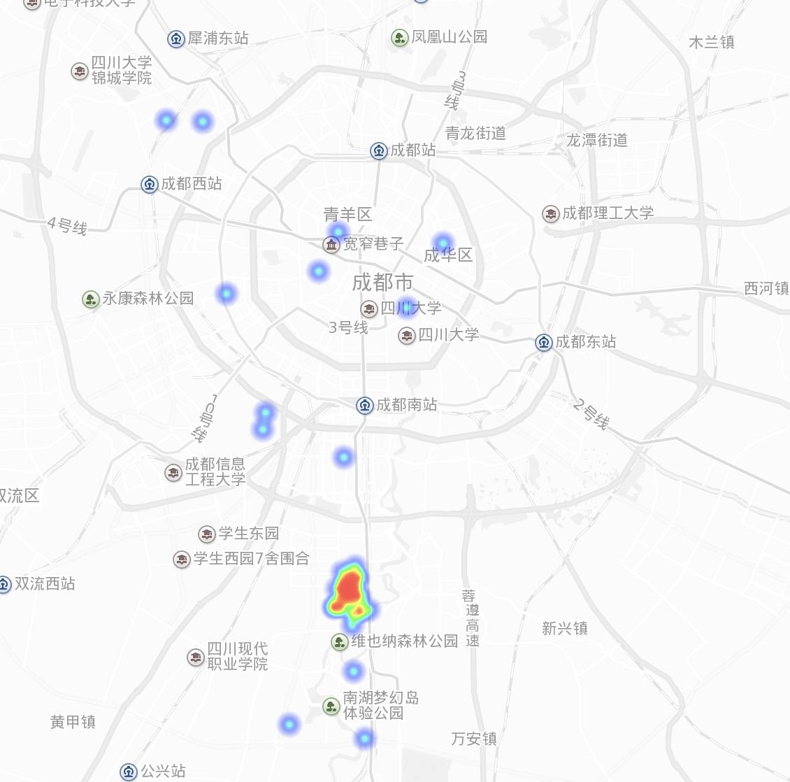

### 二、招聘與職位數量對比

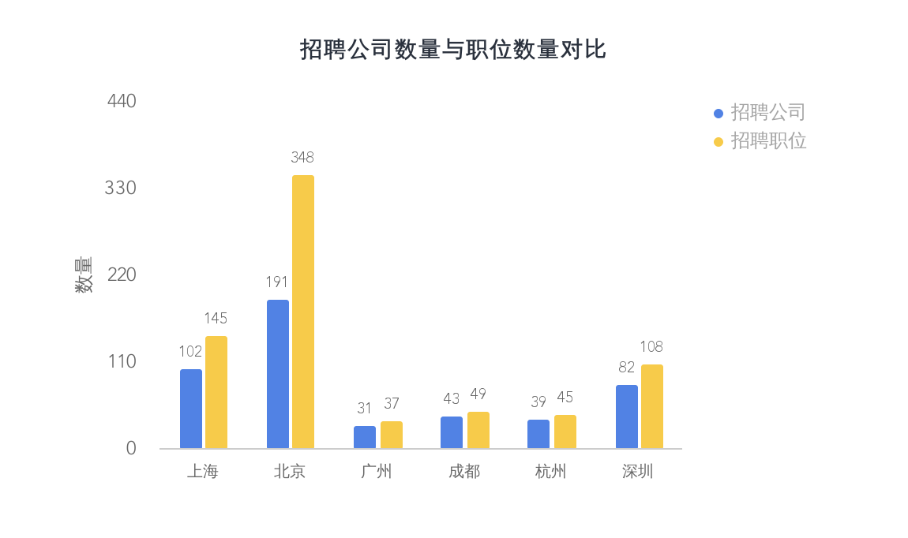

透過分析圖中的資料，我們可以得知各城市的招聘職位數量

* 北京：348
* 上海：145
* 廣州：37
* 成都：49
* 杭州：45
* 深圳：108

總共招聘的職位數量為 732 個，數量順序分別為 北京 > 上海 > 深圳 > 成都 > 杭州 > 廣州

還有另外一個關注點，就是招聘公司數量與職位的數量對比，可以看到 北京 招聘的職位數量為 348 個，而招聘的公司數量為 191 個，約為 1.82 的比例，也就是一家公司能提供兩個 Golang 職位，它可能類別不同、（中級、中高階、高階）級別不同，具有一定可能性。而在廣州，為 31 對比 37，雖然差額不大，但仍然存在這種現象

可以得出結果，Golang 在市場上具有一定的伸縮空間，也就是具有上升空間，一家公司會將 Golang 應用在多個不同的應用場景，也就是方向不同，需要的級別人才也就不同了

但是需要注意的是，Golang 的市場招聘人數目前份額還是較低，六個城市總數僅為 732 個，與其他大熱語言相差有一定距離，需要謹慎

同時，面試 Golang 的人與其他大熱語言相比會少些，職位的爭奪是否小點呢？

### 三、招聘公司規模

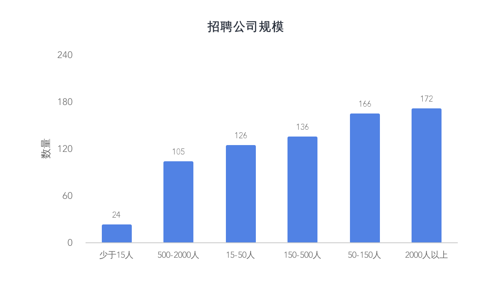

透過檢視招聘 Golang 工程師的公司規模，可以很直觀的發現，微型公司使用 Golang 較少，其他類別的規模都有一定程度的應用，且差距不大。在 2000 人以上、50 - 150 人的公司規模中最受青睞

為什麼呢，我認為有以下可能

* 大型公司結合場景，想透過 Golang 的特性來解決一些痛點問題
* 在小型公司 Golang 這顆新星實施起來更便捷，有一定的應用場景

你覺得呢，是不是應該有更多的選擇它的原因？

### 四、學歷要求

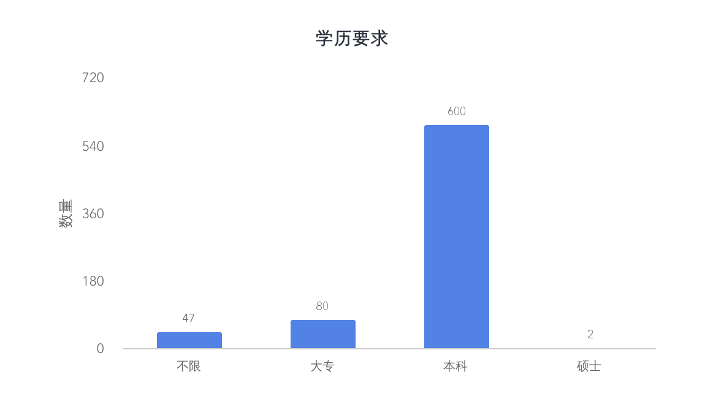

在招聘市場上，Golang 的招聘者更希望你是本科學歷，大專和不限也有一定的份額，但市場份額相差較大

碩士學歷要求的為兩個，可以得出，在市場上 Golang 招聘者們對高學歷的需求並不高，或者並不強制高學歷

### 五、行業領域

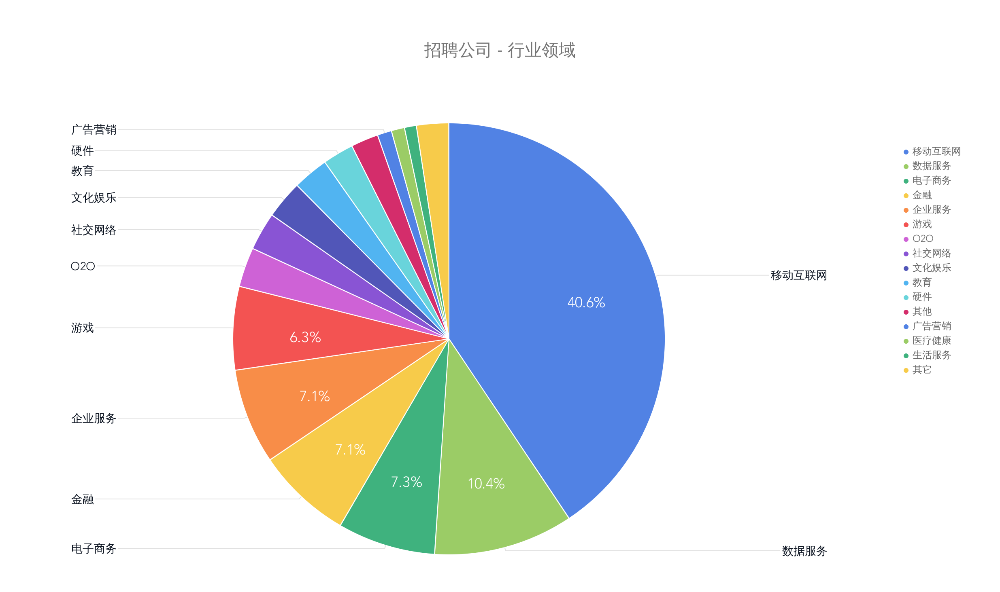

在這裡，重點關注 Golang 工程師的招聘公司都分別在什麼行業領域，大頭移動網際網路是不容置疑的了，還可以驚喜的發現

* 資料服務
* 電子商務
* 金融
* 企業服務
* 遊戲

Golang 在這幾個方面都有所應用，說明了在市場上，Golang 的路子是比較廣闊的，前景不錯

同時，如果可以涉及多個領域的內容，想必身為工程師的你，肯定很激動

### 六、職位誘惑

職位誘惑是投簡歷時必看的一點了，可以看到高頻詞條基本都是 IT 從業者關心的話題了，這裡你懂的...

重點，我看到了一個 “免費三餐” 的詞條命中 7 次，分別來自北京的海淀區、東城區、朝陽區，上海的黃浦區的七家不同的公司，辛苦了

### 七、行業、職位標籤

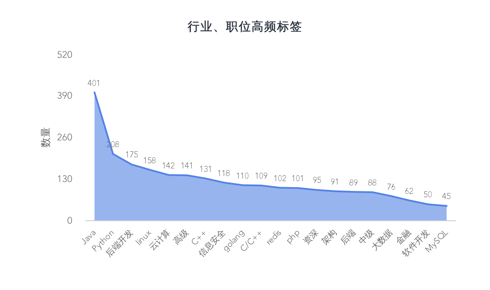

在招聘JD中，描述和標籤常用於給求職者瞭解這一職業的具體工作內容和其關聯性

在圖中你可以看到 Golang 常常和什麼內容搭上邊，這點很有意義哦

1、語言

* Java
* Python
* C/C++
* PHP

在圖中可以看出，Golang 與以上四種語言有一定關聯性，而 Java 和 Python 分別第一、第二名，可以說明市場上對複合型人才的渴望度更高，也許你不懂也行，但你懂了就最好（加分項）。需要你自身有多語言的經驗，也便於和其他人對接

同時 Golang 目前存在許多內部轉語言寫的情況，所以這一點可以參考

2、職稱

* 高階
* 資深
* 中級

特意將職稱放在第二位，可以發現在市場上 Golang 標籤的需求是 高階 > 資深 > 中級，關聯第一項 “語言關聯” 不難得出這個結論，因為語言只是解決問題的工具，到了中級及以上的工程師都是懂多門語言的居多，再採取不同的方案去解決應用場景上的問題

可得出結論，市場目前對 Golang 更期望是中高、高階、資深的人才，而中級的反而少一點點

大家可以努力再往上衝擊衝擊

3、元件

* Linux
* Redis
* Mysql

4、行業

* 雲計算
* 資訊保安
* 大資料
* 金融
* 軟體開發

#### 八、薪資與工作年限

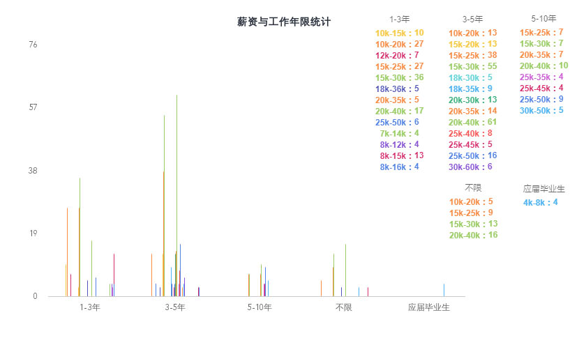

1、1-3年

一個（成長）特殊的階段，有個位數也有雙位數的，大頭可以到15-30k，20-40k，而初級的也有8-16k

2、3-5年

厚積待發的階段，薪酬範疇的跨度是較大，10-60k的薪酬都有，這充分說明能力決定你的上下

3、5-10年

核心，招聘網站上的招聘數量反而少，都會走內推或獵頭，不需要特別介紹了

**小結**

這一部分，相信是很多人關注的地方

在有的文章中會看到，他們的薪資部分是以平均值來展示的。我就很納悶，因為對平均值並不是很關心，**重點是無法體現薪資幅度**。因此這裡我會盡可能的把資料展現給你們看

（正文）從圖表來看，Golang 當前的薪酬水平還是很不錯的，市場能根據不同階段（水平）的人給出一個好的價位

（題外話）看完之後希望你能知道以下內容

* 你當前工作年限的最高、最低薪資範疇
* 你的下一階段的薪資範疇
* 為什麼有的人高，有的人低
* 在大頭部隊還是小頭，為什麼
* 不要滿足於平均值

### 九、融資階段

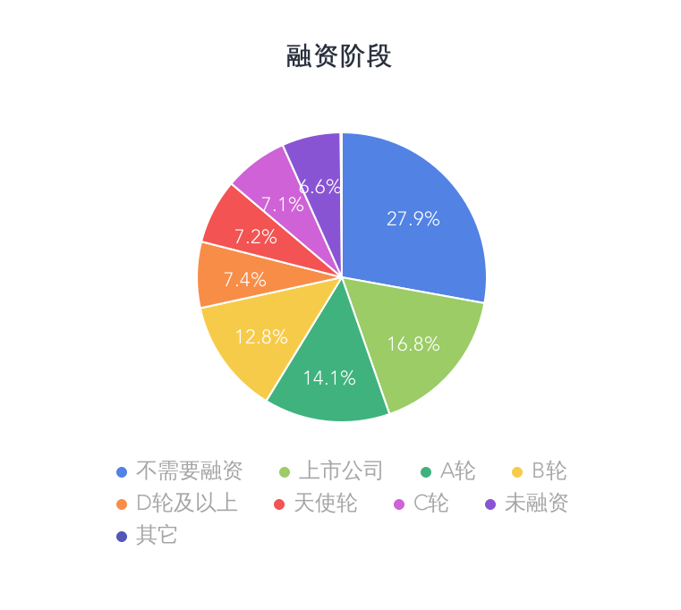

選用 Golang 的公司大多數都較為穩定，有一部分比較刺激 :)

#### 融資階段與薪資範疇對比

**不需要融資**

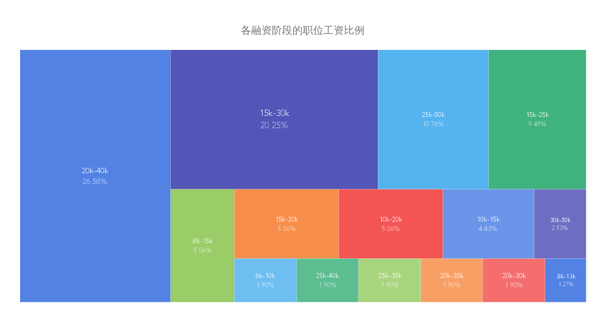

**上市公司**

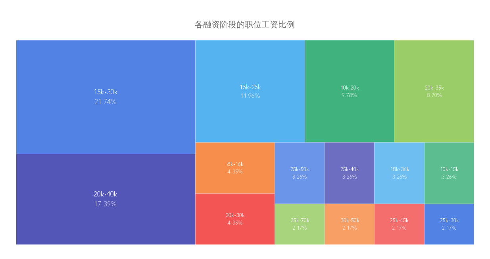

**A輪**

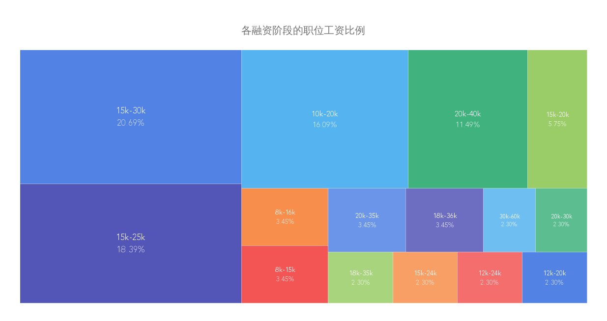

**B輪**

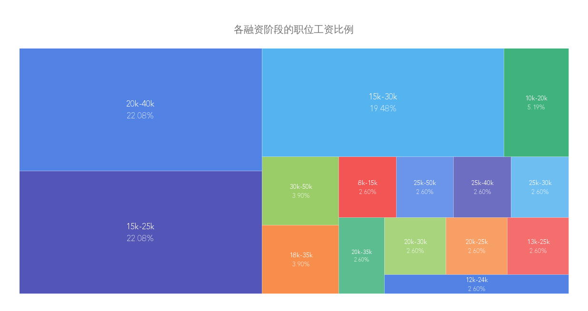

**C輪**

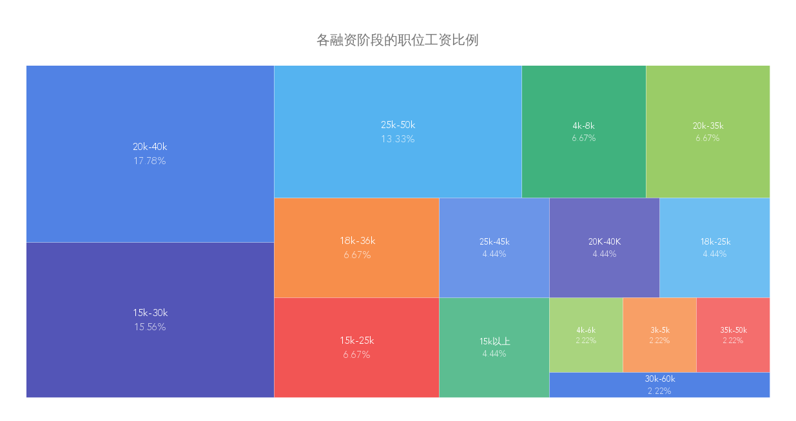

**D輪以上**

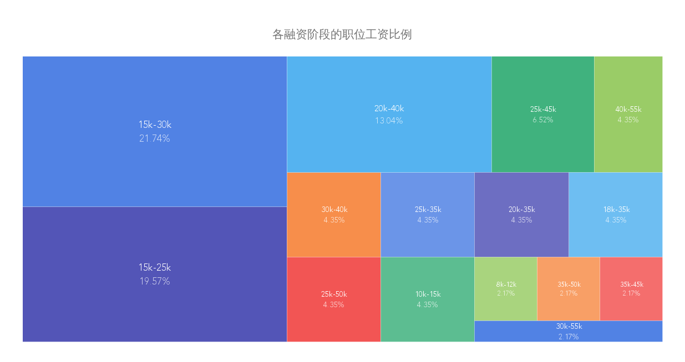

### 十、附近的地鐵

Golang 工程師都駐紮在什麼地鐵站附近呢

經常在地鐵上看到同行在看程式碼，來了解一下都分佈在哪 :)

#### 北京

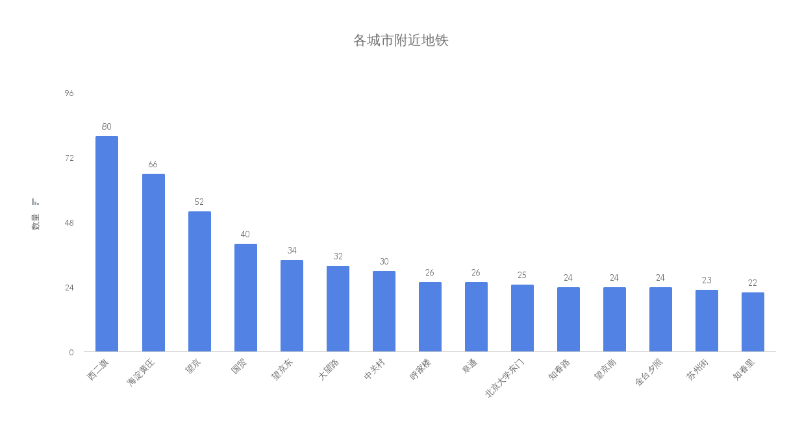

#### 上海

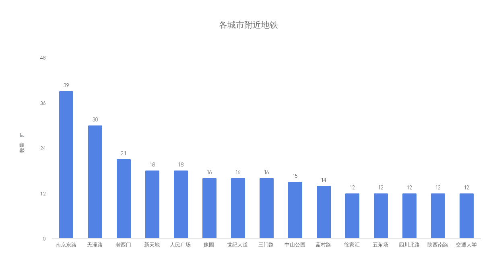

#### 廣州

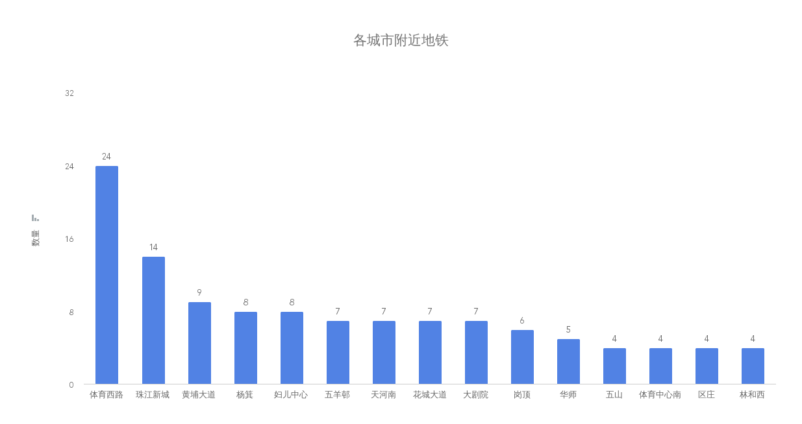

#### 深圳

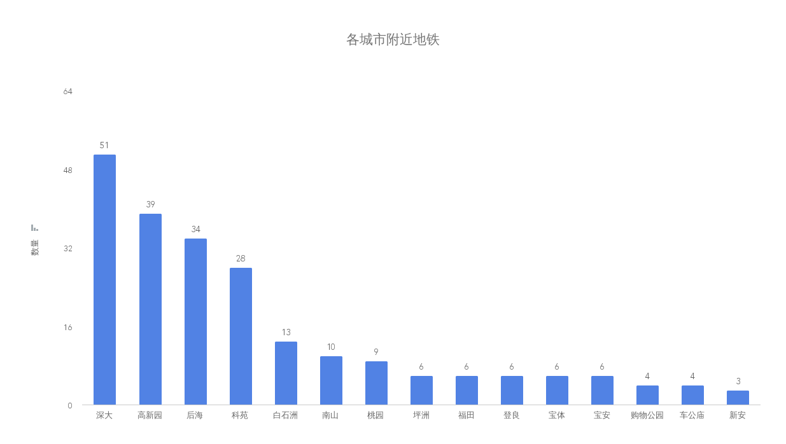

#### 杭州

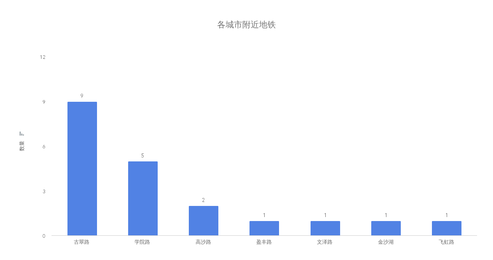

#### 成都

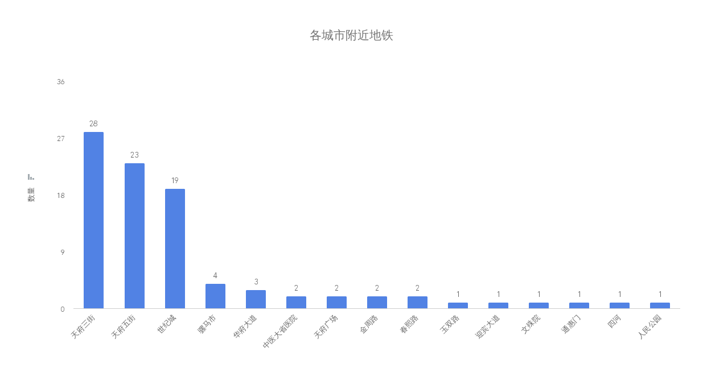

## 結論

如同官方所說 "Go has been on an amazing journey over the last 8+ years"，作為一門新生語言，一直在不斷地發展，**缺點肯定是有的，你要去識別它**

### 從數量來看

單從這個招聘網站上來看，數量方面，與大熱語言的招聘職位數量仍然有一定的差距，但 Golang 存在許多內部轉語言開發的情況，當前展現出來的資料，**招聘數量不多，但質量不錯**

### 從分佈圖來看

一線城市基本都有 Golang 的職位，雖然其他城市較少，但對於新語言來說是需要持續關注的過程，不能一刀切

### 從職稱級別來看

Golang 中高、高階、資深仍然是佔大頭，給的薪資也基本符合市場行情

### 從方向來看

Golang 涉及的行業領域廣泛，移動網際網路、資料服務、電子商務、金融、企業服務、雲計算等都是它的戰場之一

### 從開源專案來看

docker、k8s、etcd、consul 都挺穩

總的來說，Golang 處於一個發展的階段，市場行情也還行、應用場景較廣，不過招聘數量不多，你又怎麼看呢？

最後放上今天新發布的 Logo :)

如果對你有所幫助，歡迎 Star，給文章點個贊，這樣可以讓更多的人看見這篇文章

## 參考

* 專案地址：<https://github.com/go-crawler/lagou_jobs>
