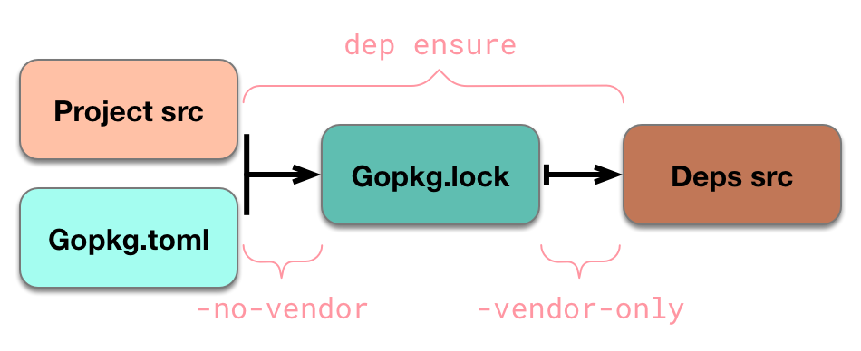

# 2.1 Go依賴管理工具dep

> Go dependency management tool
>
> ## 環境要求
>
> * Golang >= 1.9
> * Dep

## 目前版本：

```
dep:
 version     : devel
 build date  : 
 git hash    : 
 go version  : go1.10
 go compiler : gc
 platform    : linux/amd64
```

`Latest release`為`v0.4.1`

## 安裝

```
go get -u github.com/golang/dep/cmd/dep
```

若`$GOPATH/bin`不在`PATH`下，則需要將生成的`dep`檔案從`$GOPATH/bin`移動至`$GOBIAN`下

## 驗證

```
$ dep
Dep is a tool for managing dependencies for Go projects

Usage: "dep [command]"

Commands:

  init     Set up a new Go project, or migrate an existing one
  status   Report the status of the project's dependencies
  ensure   Ensure a dependency is safely vendored in the project
  prune    Pruning is now performed automatically by dep ensure.
  version  Show the dep version information

Examples:
  dep init                               set up a new project
  dep ensure                             install the project's dependencies
  dep ensure -update                     update the locked versions of all dependencies
  dep ensure -add github.com/pkg/errors  add a dependency to the project

Use "dep help [command]" for more information about a command.
```

## 初始化

在專案根目錄執行初始化命令，`dep`在初始化時會分析應用程式所需要的所有依賴包，得出依賴包清單

並生成`vendor`目錄，`Gopkg.toml`、`Gopkg.lock`檔案



### 預設初始化

```
$ dep init -v
```

直接從對應網路資源處下載

### 優先從$GOPATH初始化

```
$ dep init -gopath -v
```

該命令會先從`$GOPATH`查詢既有的依賴包，若不存在則從對應網路資源處下載

### Gopkg.toml

該檔案由`dep init`生成，包含管理`dep`行為的規則宣告

```
required = ["github.com/user/thing/cmd/thing"]

ignored = [
  "github.com/user/project/pkgX",
  "bitbucket.org/user/project/pkgA/pkgY"
]

[metadata]
key1 = "value that convey data to other systems"
system1-data = "value that is used by a system"
system2-data = "value that is used by another system"

[[constraint]]
  # Required: the root import path of the project being constrained.
  name = "github.com/user/project"
  # Recommended: the version constraint to enforce for the project.
  # Note that only one of "branch", "version" or "revision" can be specified.
  version = "1.0.0"
  branch = "master"
  revision = "abc123"

  # Optional: an alternate location (URL or import path) for the project's source.
  source = "https://github.com/myfork/package.git"

  # Optional: metadata about the constraint or override that could be used by other independent systems
  [metadata]
  key1 = "value that convey data to other systems"
  system1-data = "value that is used by a system"
  system2-data = "value that is used by another system"
```

### Gopkg.lock

該檔案由`dep ensure`和`dep init`生成，包含一個專案依賴關係圖的傳遞完整快照，表示為一系列`[[project]]`節

```
# This file is autogenerated, do not edit; changes may be undone by the next 'dep ensure'.

[[projects]]
  branch = "master"
  name = "github.com/golang/protobuf"
  packages = [
    "jsonpb",
    "proto",
    "protoc-gen-go/descriptor",
    "ptypes",
    "ptypes/any",
    "ptypes/duration",
    "ptypes/struct",
    "ptypes/timestamp"
  ]
  revision = "bbd03ef6da3a115852eaf24c8a1c46aeb39aa175"
```

## 常用命令

### dep ensure

從專案中的`Gopkg.toml`和`Gopkg.lock`中分析關係圖，並取得所需的依賴包

用於確保本地的關係圖、鎖、依賴包清單完全一致

### dep ensure -add

```
# 引入该依赖包的最新版本
dep ensure -add github.com/pkg/foo

# 引入具有特定约束（指定版本）的依赖包
dep ensure -add github.com/pkg/foo@^1.0.1
```

### dep ensure -update

將`Gopkg.lock`中的約定依賴項更新為`Gopkg.toml`允許的最新版本

## 最後

目前`dep`還在官方試驗階段，但已表示生產可安全使用

如果出現什麼問題，大家可以一起留個言討論討論
