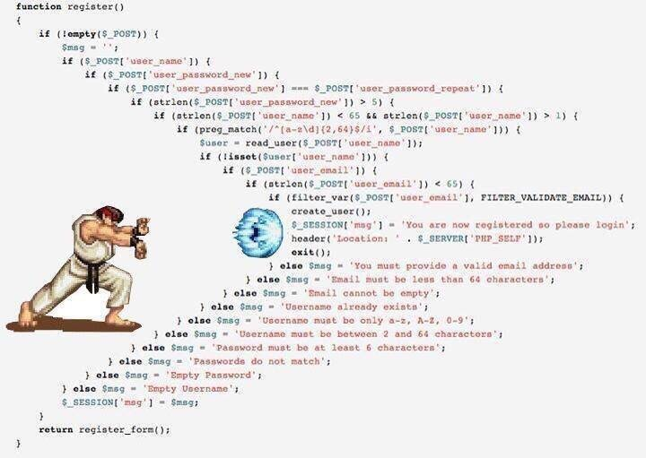

# 3.13 最佳化你的應用結構和實作Redis快取

專案地址：<https://github.com/EDDYCJY/go-gin-example>

## 前言

之前就在想，不少教程或示例的程式碼設計都是一步到位的（也沒問題）

但實際操作的讀者真的能夠理解透徹為什麼嗎？左思右想，有了今天這一章的內容，我認為實際經歷過一遍印象會更加深刻

## 本文目標

在本章節，將介紹以下功能的整理：

* 抽離、分層業務邏輯：減輕 routers/\*.go 內的 api方法的邏輯（但本文暫不分層 repository，這塊邏輯還不重）。
* 增加容錯性：對 gorm 的錯誤進行判斷。
* Redis快取：對取得資料類的介面增加快取設定。
* 減少重複冗餘程式碼。

## 問題在哪？

在規劃階段我們發現了一個問題，這是目前的虛擬碼：

```go
if ! HasErrors() {
    if ExistArticleByID(id) {
        DeleteArticle(id)
        code = e.SUCCESS
    } else {
        code = e.ERROR_NOT_EXIST_ARTICLE
    }
} else {
    for _, err := range valid.Errors {
        logging.Info(err.Key, err.Message)
    }
}

c.JSON(http.StatusOK, gin.H{
    "code": code,
    "msg":  e.GetMsg(code),
    "data": make(map[string]string),
})
```
如果加上規劃內的功能邏輯呢，虛擬碼會變成：

```go
if ! HasErrors() {
    exists, err := ExistArticleByID(id)
    if err == nil {
        if exists {
            err = DeleteArticle(id)
            if err == nil {
                code = e.SUCCESS
            } else {
                code = e.ERROR_XXX
            }
        } else {
            code = e.ERROR_NOT_EXIST_ARTICLE
        }
    } else {
        code = e.ERROR_XXX
    }
} else {
    for _, err := range valid.Errors {
        logging.Info(err.Key, err.Message)
    }
}

c.JSON(http.StatusOK, gin.H{
    "code": code,
    "msg":  e.GetMsg(code),
    "data": make(map[string]string),
})
```
如果快取的邏輯也加進來，後面慢慢不斷的迭代，豈不是會變成如下圖一樣？



現在我們發現了問題，應及時解決這個程式碼結構問題，同時把程式碼寫的清晰、漂亮、易讀易改也是一個重要指標

## 如何改？

在左耳朵耗子的文章中，這類程式碼被稱為 “箭頭型” 程式碼，有如下幾個問題：

1、我的顯示器不夠寬，箭頭型程式碼縮排太狠了，需要我來回拉水平捲軸，這讓我在讀程式碼的時候，相當的不舒服

2、除了寬度外還有長度，有的程式碼的 if-else 裡的 if-else 裡的 if-else 的程式碼太多，讀到中間你都不知道中間的程式碼是經過了什麼樣的層層檢查才來到這裡的

總而言之，“箭頭型程式碼”如果巢狀太多，程式碼太長的話，會相當容易讓維護程式碼的人（包括自己）迷失在程式碼中，因為看到最內層的程式碼時，你已經不知道前面的那一層一層的條件判斷是什麼樣的，程式碼是怎麼執行到這裡的，所以，箭頭型程式碼是非常難以維護和Debug的。

簡單的來說，就是**讓出錯的程式碼先返回，前面把所有的錯誤判斷全判斷掉，然後就剩下的就是正常的程式碼了**

（注意：本段引用自耗子哥的 [如何重構“箭頭型”程式碼](https://coolshell.cn/articles/17757.html)，建議細細品嚐）

## 落實

本專案將對既有程式碼進行最佳化和實作快取，希望你習得方法並對其他地方也進行最佳化

第一步：完成 Redis 的基礎設施建設（需要你先裝好 Redis）

第二步：對現有程式碼進行拆解、分層（不會貼上具體步驟的程式碼，希望你能夠實操一波，加深理解🤔）

### Redis

#### 一、設定

開啟 conf/app.ini 檔案，新增設定：

```
...
[redis]
Host = 127.0.0.1:6379
Password =
MaxIdle = 30
MaxActive = 30
IdleTimeout = 200
```

#### 二、快取 Prefix

開啟 pkg/e 目錄，新建 cache.go，寫入內容：

```go
package e

const (
    CACHE_ARTICLE = "ARTICLE"
    CACHE_TAG     = "TAG"
)
```
#### 三、快取 Key

（1）、開啟 service 目錄，新建 cache\_service/article.go

寫入內容：[傳送門](https://github.com/EDDYCJY/go-gin-example/blob/master/service/cache_service/article.go)

（2）、開啟 service 目錄，新建 cache\_service/tag.go

寫入內容：[傳送門](https://github.com/EDDYCJY/go-gin-example/blob/master/service/cache_service/tag.go)

這一部分主要是編寫取得快取 KEY 的方法，直接參考傳送門即可

#### 四、Redis 工具包

開啟 pkg 目錄，新建 gredis/redis.go，寫入內容：

```go
package gredis

import (
    "encoding/json"
    "time"

    "github.com/gomodule/redigo/redis"

    "github.com/EDDYCJY/go-gin-example/pkg/setting"
)

var RedisConn *redis.Pool

func Setup() error {
    RedisConn = &redis.Pool{
        MaxIdle:     setting.RedisSetting.MaxIdle,
        MaxActive:   setting.RedisSetting.MaxActive,
        IdleTimeout: setting.RedisSetting.IdleTimeout,
        Dial: func() (redis.Conn, error) {
            c, err := redis.Dial("tcp", setting.RedisSetting.Host)
            if err != nil {
                return nil, err
            }
            if setting.RedisSetting.Password != "" {
                if _, err := c.Do("AUTH", setting.RedisSetting.Password); err != nil {
                    c.Close()
                    return nil, err
                }
            }
            return c, err
        },
        TestOnBorrow: func(c redis.Conn, t time.Time) error {
            _, err := c.Do("PING")
            return err
        },
    }

    return nil
}

func Set(key string, data interface{}, time int) error {
    conn := RedisConn.Get()
    defer conn.Close()

    value, err := json.Marshal(data)
    if err != nil {
        return err
    }

    _, err = conn.Do("SET", key, value)
    if err != nil {
        return err
    }

    _, err = conn.Do("EXPIRE", key, time)
    if err != nil {
        return err
    }

    return nil
}

func Exists(key string) bool {
    conn := RedisConn.Get()
    defer conn.Close()

    exists, err := redis.Bool(conn.Do("EXISTS", key))
    if err != nil {
        return false
    }

    return exists
}

func Get(key string) ([]byte, error) {
    conn := RedisConn.Get()
    defer conn.Close()

    reply, err := redis.Bytes(conn.Do("GET", key))
    if err != nil {
        return nil, err
    }

    return reply, nil
}

func Delete(key string) (bool, error) {
    conn := RedisConn.Get()
    defer conn.Close()

    return redis.Bool(conn.Do("DEL", key))
}

func LikeDeletes(key string) error {
    conn := RedisConn.Get()
    defer conn.Close()

    keys, err := redis.Strings(conn.Do("KEYS", "*"+key+"*"))
    if err != nil {
        return err
    }

    for _, key := range keys {
        _, err = Delete(key)
        if err != nil {
            return err
        }
    }

    return nil
}
```
在這裡我們做了一些基礎功能封裝

1、設定 RedisConn 為 redis.Pool（連線池）並設定了它的一些引數：

* Dial：提供建立和設定應用程式連線的一個函式
* TestOnBorrow：可選的應用程式檢查健康功能
* MaxIdle：最大空閒連線數
* MaxActive：在給定時間內，允許分配的最大連線數（當為零時，沒有限制）
* IdleTimeout：在給定時間內將會保持空閒狀態，若到達時間限制則關閉連線（當為零時，沒有限制）

2、封裝基礎方法

檔案內包含 Set、Exists、Get、Delete、LikeDeletes 用於支撐目前的業務邏輯，而在裡面涉及到了如方法：

（1）`RedisConn.Get()`：在連線池中取得一個活躍連線

（2）`conn.Do(commandName string, args ...interface{})`：向 Redis 伺服器傳送命令並返回收到的答覆

（3）`redis.Bool(reply interface{}, err error)`：將命令返回轉為布林值

（4）`redis.Bytes(reply interface{}, err error)`：將命令返回轉為 Bytes

（5）`redis.Strings(reply interface{}, err error)`：將命令返回轉為 \[]string

在 [redigo](https://godoc.org/github.com/gomodule/redigo/redis) 中包含大量類似的方法，萬變不離其宗，建議熟悉其使用規則和 [Redis命令](http://doc.redisfans.com/index.html) 即可

到這裡為止，Redis 就可以愉快的呼叫啦。另外受篇幅限制，這塊的深入講解會另外開設！

### 拆解、分層

在先前規劃中，引出幾個方法去最佳化我們的應用結構

* 錯誤提前返回
* 統一返回方法
* 抽離 Service，減輕 routers/api 的邏輯，進行分層
* 增加 gorm 錯誤判斷，讓錯誤提示更明確（增加內部錯誤碼）

#### 編寫返回方法

要讓錯誤提前返回，c.JSON 的侵入是不可避免的，但是可以讓其更具可變性，指不定哪天就變 XML 了呢？

1、開啟 pkg 目錄，新建 app/request.go，寫入檔案內容：

```go
package app

import (
    "github.com/astaxie/beego/validation"

    "github.com/EDDYCJY/go-gin-example/pkg/logging"
)

func MarkErrors(errors []*validation.Error) {
    for _, err := range errors {
        logging.Info(err.Key, err.Message)
    }

    return
}
```
2、開啟 pkg 目錄，新建 app/response.go，寫入檔案內容：

```go
package app

import (
    "github.com/gin-gonic/gin"

    "github.com/EDDYCJY/go-gin-example/pkg/e"
)

type Gin struct {
    C *gin.Context
}

func (g *Gin) Response(httpCode, errCode int, data interface{}) {
    g.C.JSON(httpCode, gin.H{
        "code": errCode,
        "msg":  e.GetMsg(errCode),
        "data": data,
    })

    return
}
```
這樣子以後如果要變動，直接改動 app 包內的方法即可

#### 修改既有邏輯

開啟 routers/api/v1/article.go，檢視修改 GetArticle 方法後的程式碼為：

```go
func GetArticle(c *gin.Context) {
    appG := app.Gin{c}
    id := com.StrTo(c.Param("id")).MustInt()
    valid := validation.Validation{}
    valid.Min(id, 1, "id").Message("ID必须大于0")

    if valid.HasErrors() {
        app.MarkErrors(valid.Errors)
        appG.Response(http.StatusOK, e.INVALID_PARAMS, nil)
        return
    }

    articleService := article_service.Article{ID: id}
    exists, err := articleService.ExistByID()
    if err != nil {
        appG.Response(http.StatusOK, e.ERROR_CHECK_EXIST_ARTICLE_FAIL, nil)
        return
    }
    if !exists {
        appG.Response(http.StatusOK, e.ERROR_NOT_EXIST_ARTICLE, nil)
        return
    }

    article, err := articleService.Get()
    if err != nil {
        appG.Response(http.StatusOK, e.ERROR_GET_ARTICLE_FAIL, nil)
        return
    }

    appG.Response(http.StatusOK, e.SUCCESS, article)
}
```

這裡有幾個值得變動點，主要是在內部增加了錯誤返回，如果存在錯誤則直接返回。另外進行了分層，業務邏輯內聚到了 service 層中去，而 routers/api（controller）顯著減輕，程式碼會更加的直觀

例如 service/article\_service 下的 `articleService.Get()` 方法：

```
func (a *Article) Get() (*models.Article, error) {
    var cacheArticle *models.Article

    cache := cache_service.Article{ID: a.ID}
    key := cache.GetArticleKey()
    if gredis.Exists(key) {
        data, err := gredis.Get(key)
        if err != nil {
            logging.Info(err)
        } else {
            json.Unmarshal(data, &cacheArticle)
            return cacheArticle, nil
        }
    }

    article, err := models.GetArticle(a.ID)
    if err != nil {
        return nil, err
    }

    gredis.Set(key, article, 3600)
    return article, nil
}
```

而對於 gorm 的 錯誤返回設定，只需要修改 models/article.go 如下:

```
func GetArticle(id int) (*Article, error) {
    var article Article
    err := db.Where("id = ? AND deleted_on = ? ", id, 0).First(&article).Related(&article.Tag).Error
    if err != nil && err != gorm.ErrRecordNotFound {
        return nil, err
    }

    return &article, nil
}
```

習慣性增加 .Error，把控絕大部分的錯誤。另外需要注意一點，在 gorm 中，查詢不到記錄也算一種 “錯誤” 哦

## 最後

顯然，本章節並不是你跟著我敲系列。我給你的課題是 “實作 Redis 快取並最佳化既有的業務邏輯程式碼”

讓其能夠不斷地適應業務的發展，讓程式碼更清晰易讀，且呈層級和結構性

如果有疑惑，可以到 [go-gin-example](https://github.com/EDDYCJY/go-gin-example) 看看我是怎麼寫的，你是怎麼寫的，又分別有什麼優勢、劣勢，取長補短一波？

## 參考

### 本系列示例程式碼

* [go-gin-example](https://github.com/EDDYCJY/go-gin-example)

### 推薦閱讀

* [如何重構“箭頭型”程式碼](https://coolshell.cn/articles/17757.html)

## 關於

### 修改記錄

* 第一版：2018年02月16日釋出文章
* 第二版：2019年10月01日修改文章

## ？

如果有任何疑問或錯誤，歡迎在 [issues](https://github.com/EDDYCJY/blog) 進行提問或給予修正意見，如果喜歡或對你有所幫助，歡迎 Star，對作者是一種鼓勵和推進。

### 我的微信公眾號


