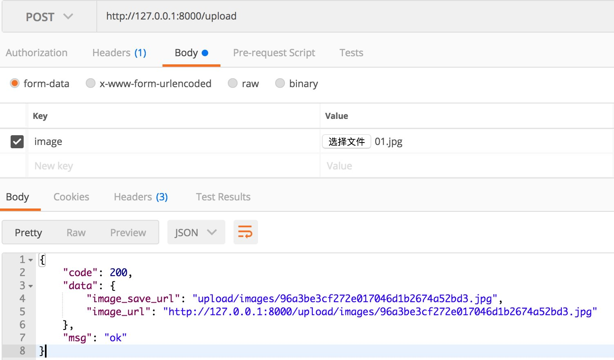
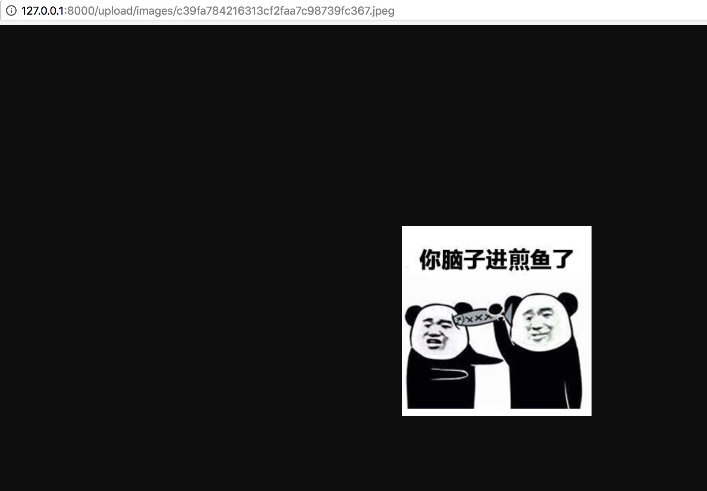

# 3.12 最佳化設定結構及實作圖片上傳

專案地址：<https://github.com/EDDYCJY/go-gin-example>

## 知識點

* 重構、調整結構

## 本文目標

這個應用程式跑了那麼久了，越來越大，越來越壯，彷彿我們的產品一樣，現在它需要進行小範圍重構了，以便於後續的使用，這非常重要。

## 前言

一天，產品經理突然跟你說文章列表，沒有封面圖，不夠美觀，！）&￥*！&）#&￥*！加一個吧，幾分鐘的事

你開啟你的程式，分析了一波寫了個清單：

* 最佳化設定結構（因為設定項越來越多）
* 抽離 原 logging 的 File 便於公用（logging、upload 各保有一份並不合適）
* 實作上傳圖片介面（需限制檔案格式、大小）
* 修改文章介面（需支援封面地址引數）
* 增加 blog\_article （文章）的資料庫欄位
* 實作 http.FileServer

嗯，你發現要較優的話，需要調整部分的應用程式結構，因為功能越來越多，原本的設計也要跟上節奏

也就是在適當的時候，及時最佳化

## 最佳化設定結構

### 一、講解

在先前章節中，採用了直接讀取 KEY 的方式去儲存設定項，而本次需求中，需要增加圖片的設定項，總體就有些冗餘了

我們採用以下解決方法：

* 對映結構體：使用 MapTo 來設定設定引數
* 設定統管：所有的設定項統管到 setting 中

#### 對映結構體（示例）

在 go-ini 中可以採用 MapTo 的方式來對映結構體，例如：

```go
type Server struct {
    RunMode string
    HttpPort int
    ReadTimeout time.Duration
    WriteTimeout time.Duration
}

var ServerSetting = &Server{}

func main() {
    Cfg, err := ini.Load("conf/app.ini")
    if err != nil {
        log.Fatalf("Fail to parse 'conf/app.ini': %v", err)
    }

    err = Cfg.Section("server").MapTo(ServerSetting)
    if err != nil {
        log.Fatalf("Cfg.MapTo ServerSetting err: %v", err)
    }
}
```

在這段程式碼中，可以注意 ServerSetting 取了地址，為什麼 MapTo 必須地址入參呢？

```
// MapTo maps section to given struct.
func (s *Section) MapTo(v interface{}) error {
    typ := reflect.TypeOf(v)
    val := reflect.ValueOf(v)
    if typ.Kind() == reflect.Ptr {
        typ = typ.Elem()
        val = val.Elem()
    } else {
        return errors.New("cannot map to non-pointer struct")
    }

    return s.mapTo(val, false)
}
```

在 MapTo 中 `typ.Kind() == reflect.Ptr` 約束了必須使用指標，否則會返回 `cannot map to non-pointer struct` 的錯誤。這個是表面原因

更往內探究，可以認為是 `field.Set` 的原因，當執行 `val := reflect.ValueOf(v)` ，函式透過傳遞 `v` 複製建立了 `val`，但是 `val` 的改變並不能更改原始的 `v`，要想 `val` 的更改能作用到 `v`，則必須傳遞 `v` 的地址

顯然 go-ini 裡也是包含修改原始值這一項功能的，你覺得是什麼原因呢？

#### 設定統管

在先前的版本中，models 和 file 的設定是在自己的檔案中解析的，而其他在 setting.go 中，因此我們需要將其在 setting 中統一接管

你可能會想，直接把兩者的設定項複製貼上到 setting.go 的 init 中，一下子就完事了，搞那麼麻煩？

但你在想想，先前的程式碼中存在多個 init 函式，執行順序存在問題，無法達到我們的要求，你可以試試

（此處是一個基礎知識點）

在 Go 中，當存在多個 init 函式時，執行順序為：

* 相同包下的 init 函式：按照原始檔編譯順序決定執行順序（預設按檔名排序）
* 不同包下的 init 函式：按照包匯入的依賴關係決定先後順序

所以要避免多 init 的情況，**儘量由程式把控初始化的先後順序**

### 二、落實

#### 修改設定檔案

開啟 conf/app.ini 將設定檔案修改為大駝峰命名，另外我們增加了 5 個設定項用於上傳圖片的功能，4 個檔案日誌方面的設定項

```
[app]
PageSize = 10
JwtSecret = 233

RuntimeRootPath = runtime/

ImagePrefixUrl = http://127.0.0.1:8000
ImageSavePath = upload/images/
# MB
ImageMaxSize = 5
ImageAllowExts = .jpg,.jpeg,.png

LogSavePath = logs/
LogSaveName = log
LogFileExt = log
TimeFormat = 20060102

[server]
#debug or release
RunMode = debug
HttpPort = 8000
ReadTimeout = 60
WriteTimeout = 60

[database]
Type = mysql
User = root
Password = rootroot
Host = 127.0.0.1:3306
Name = blog
TablePrefix = blog_
```

#### 最佳化設定讀取及設定初始化順序

**第一步**

將散落在其他檔案裡的設定都刪掉，**統一在 setting 中處理**以及**修改 init 函式為 Setup 方法**

開啟 pkg/setting/setting.go 檔案，修改如下：

```
package setting

import (
    "log"
    "time"

    "github.com/go-ini/ini"
)

type App struct {
    JwtSecret string
    PageSize int
    RuntimeRootPath string

    ImagePrefixUrl string
    ImageSavePath string
    ImageMaxSize int
    ImageAllowExts []string

    LogSavePath string
    LogSaveName string
    LogFileExt string
    TimeFormat string
}

var AppSetting = &App{}

type Server struct {
    RunMode string
    HttpPort int
    ReadTimeout time.Duration
    WriteTimeout time.Duration
}

var ServerSetting = &Server{}

type Database struct {
    Type string
    User string
    Password string
    Host string
    Name string
    TablePrefix string
}

var DatabaseSetting = &Database{}

func Setup() {
    Cfg, err := ini.Load("conf/app.ini")
    if err != nil {
        log.Fatalf("Fail to parse 'conf/app.ini': %v", err)
    }

    err = Cfg.Section("app").MapTo(AppSetting)
    if err != nil {
        log.Fatalf("Cfg.MapTo AppSetting err: %v", err)
    }

    AppSetting.ImageMaxSize = AppSetting.ImageMaxSize * 1024 * 1024

    err = Cfg.Section("server").MapTo(ServerSetting)
    if err != nil {
        log.Fatalf("Cfg.MapTo ServerSetting err: %v", err)
    }

    ServerSetting.ReadTimeout = ServerSetting.ReadTimeout * time.Second
    ServerSetting.WriteTimeout = ServerSetting.ReadTimeout * time.Second

    err = Cfg.Section("database").MapTo(DatabaseSetting)
    if err != nil {
        log.Fatalf("Cfg.MapTo DatabaseSetting err: %v", err)
    }
}
```

在這裡，我們做了如下幾件事：

* 編寫與設定項保持一致的結構體（App、Server、Database）
* 使用 MapTo 將設定項對映到結構體上
* 對一些需特殊設定的設定項進行再賦值

**需要你去做的事：**

* 將 [models.go](https://github.com/EDDYCJY/go-gin-example/blob/a338ddec103c9506b4c7ed16d9f5386040d99b4b/models/models.go#L23)、[setting.go](https://github.com/EDDYCJY/go-gin-example/blob/a338ddec103c9506b4c7ed16d9f5386040d99b4b/pkg/setting/setting.go#L23)、[pkg/logging/log.go](https://github.com/EDDYCJY/go-gin-example/blob/a338ddec103c9506b4c7ed16d9f5386040d99b4b/pkg/logging/log.go#L32-L37) 的 init 函式修改為 Setup 方法
* 將 [models/models.go](https://github.com/EDDYCJY/go-gin-example/blob/a338ddec103c9506b4c7ed16d9f5386040d99b4b/models/models.go#L23-L39) 獨立讀取的 DB 設定項刪除，改為統一讀取 setting
* 將 [pkg/logging/file](https://github.com/EDDYCJY/go-gin-example/blob/a338ddec103c9506b4c7ed16d9f5386040d99b4b/pkg/logging/file.go#L10-L15) 獨立的 LOG 設定項刪除，改為統一讀取 setting

這幾項比較基礎，並沒有貼出來，我希望你可以自己動手，有問題的話可右拐 [專案地址](https://github.com/EDDYCJY/go-gin-example)

**第二步**

在這一步我們要設定初始化的流程，開啟 main.go 檔案，修改內容：

```
func main() {
    setting.Setup()
    models.Setup()
    logging.Setup()

    endless.DefaultReadTimeOut = setting.ServerSetting.ReadTimeout
    endless.DefaultWriteTimeOut = setting.ServerSetting.WriteTimeout
    endless.DefaultMaxHeaderBytes = 1 << 20
    endPoint := fmt.Sprintf(":%d", setting.ServerSetting.HttpPort)

    server := endless.NewServer(endPoint, routers.InitRouter())
    server.BeforeBegin = func(add string) {
        log.Printf("Actual pid is %d", syscall.Getpid())
    }

    err := server.ListenAndServe()
    if err != nil {
        log.Printf("Server err: %v", err)
    }
}
```

修改完畢後，就成功將多模組的初始化函式放到啟動流程中了（先後順序也可以控制）

**驗證**

在這裡為止，針對本需求的設定最佳化就完畢了，你需要執行 `go run main.go` 驗證一下你的功能是否正常哦

順帶留個基礎問題，大家可以思考下

```
ServerSetting.ReadTimeout = ServerSetting.ReadTimeout * time.Second
ServerSetting.WriteTimeout = ServerSetting.ReadTimeout * time.Second
```

若將 setting.go 檔案中的這兩行刪除，會出現什麼問題，為什麼呢？

## 抽離 File

在先前版本中，在 [logging/file.go](https://github.com/EDDYCJY/go-gin-example/blob/a338ddec103c9506b4c7ed16d9f5386040d99b4b/pkg/logging/file.go) 中使用到了 os 的一些方法，我們透過前期規劃發現，這部分在上傳圖片功能中可以複用

### 第一步

在 pkg 目錄下新建 file/file.go ，寫入檔案內容如下：

```
package file

import (
    "os"
    "path"
    "mime/multipart"
    "io/ioutil"
)

func GetSize(f multipart.File) (int, error) {
    content, err := ioutil.ReadAll(f)

    return len(content), err
}

func GetExt(fileName string) string {
    return path.Ext(fileName)
}

func CheckExist(src string) bool {
    _, err := os.Stat(src)

    return os.IsNotExist(err)
}

func CheckPermission(src string) bool {
    _, err := os.Stat(src)

    return os.IsPermission(err)
}

func IsNotExistMkDir(src string) error {
    if notExist := CheckNotExist(src); notExist == true {
        if err := MkDir(src); err != nil {
            return err
        }
    }

    return nil
}

func MkDir(src string) error {
    err := os.MkdirAll(src, os.ModePerm)
    if err != nil {
        return err
    }

    return nil
}

func Open(name string, flag int, perm os.FileMode) (*os.File, error) {
    f, err := os.OpenFile(name, flag, perm)
    if err != nil {
        return nil, err
    }

    return f, nil
}
```

在這裡我們一共封裝了 7個 方法

* GetSize：取得檔案大小
* GetExt：取得檔案字尾
* CheckExist：檢查檔案是否存在
* CheckPermission：檢查檔案許可權
* IsNotExistMkDir：如果不存在則新建資料夾
* MkDir：新建資料夾
* Open：開啟檔案

在這裡我們用到了 `mime/multipart` 包，它主要實作了 MIME 的 multipart 解析，主要適用於 [HTTP](https://tools.ietf.org/html/rfc2388) 和常見瀏覽器生成的 multipart 主體

multipart 又是什麼，[rfc2388](https://tools.ietf.org/html/rfc2388) 的 multipart/form-data 瞭解一下

### 第二步

我們在第一步已經將 file 重新封裝了一層，在這一步我們將原先 logging 包的方法都修改掉

1、開啟 pkg/logging/file.go 檔案，修改檔案內容：

```
package logging

import (
    "fmt"
    "os"
    "time"

    "github.com/EDDYCJY/go-gin-example/pkg/setting"
    "github.com/EDDYCJY/go-gin-example/pkg/file"
)

func getLogFilePath() string {
    return fmt.Sprintf("%s%s", setting.AppSetting.RuntimeRootPath, setting.AppSetting.LogSavePath)
}

func getLogFileName() string {
    return fmt.Sprintf("%s%s.%s",
        setting.AppSetting.LogSaveName,
        time.Now().Format(setting.AppSetting.TimeFormat),
        setting.AppSetting.LogFileExt,
    )
}

func openLogFile(fileName, filePath string) (*os.File, error) {
    dir, err := os.Getwd()
    if err != nil {
        return nil, fmt.Errorf("os.Getwd err: %v", err)
    }

    src := dir + "/" + filePath
    perm := file.CheckPermission(src)
    if perm == true {
        return nil, fmt.Errorf("file.CheckPermission Permission denied src: %s", src)
    }

    err = file.IsNotExistMkDir(src)
    if err != nil {
        return nil, fmt.Errorf("file.IsNotExistMkDir src: %s, err: %v", src, err)
    }

    f, err := file.Open(src + fileName, os.O_APPEND|os.O_CREATE|os.O_WRONLY, 0644)
    if err != nil {
        return nil, fmt.Errorf("Fail to OpenFile :%v", err)
    }

    return f, nil
}
```

我們將引用都改為了 file/file.go 包裡的方法

2、開啟 pkg/logging/log.go 檔案，修改檔案內容:

```
package logging

...

func Setup() {
    var err error
    filePath := getLogFilePath()
    fileName := getLogFileName()
    F, err = openLogFile(fileName, filePath)
    if err != nil {
        log.Fatalln(err)
    }

    logger = log.New(F, DefaultPrefix, log.LstdFlags)
}

...
```

由於原方法形參改變了，因此 openLogFile 也需要調整

## 實作上傳圖片介面

這一小節，我們開始實作上次圖片相關的一些方法和功能

首先需要在 blog\_article 中增加欄位 `cover_image_url`，格式為 `varchar(255) DEFAULT '' COMMENT '封面图片地址'`

### 第零步

一般不會直接將上傳的圖片名暴露出來，因此我們對圖片名進行 MD5 來達到這個效果

在 util 目錄下新建 md5.go，寫入檔案內容：

```
package util

import (
    "crypto/md5"
    "encoding/hex"
)

func EncodeMD5(value string) string {
    m := md5.New()
    m.Write([]byte(value))

    return hex.EncodeToString(m.Sum(nil))
}
```

### 第一步

在先前我們已經把底層方法給封裝好了，實質這一步為封裝 image 的處理邏輯

在 pkg 目錄下新建 upload/image.go 檔案，寫入檔案內容：

```
package upload

import (
    "os"
    "path"
    "log"
    "fmt"
    "strings"
    "mime/multipart"

    "github.com/EDDYCJY/go-gin-example/pkg/file"
    "github.com/EDDYCJY/go-gin-example/pkg/setting"
    "github.com/EDDYCJY/go-gin-example/pkg/logging"
    "github.com/EDDYCJY/go-gin-example/pkg/util"
)

func GetImageFullUrl(name string) string {
    return setting.AppSetting.ImagePrefixUrl + "/" + GetImagePath() + name
}

func GetImageName(name string) string {
    ext := path.Ext(name)
    fileName := strings.TrimSuffix(name, ext)
    fileName = util.EncodeMD5(fileName)

    return fileName + ext
}

func GetImagePath() string {
    return setting.AppSetting.ImageSavePath
}

func GetImageFullPath() string {
    return setting.AppSetting.RuntimeRootPath + GetImagePath()
}

func CheckImageExt(fileName string) bool {
    ext := file.GetExt(fileName)
    for _, allowExt := range setting.AppSetting.ImageAllowExts {
        if strings.ToUpper(allowExt) == strings.ToUpper(ext) {
            return true
        }
    }

    return false
}

func CheckImageSize(f multipart.File) bool {
    size, err := file.GetSize(f)
    if err != nil {
        log.Println(err)
        logging.Warn(err)
        return false
    }

    return size <= setting.AppSetting.ImageMaxSize
}

func CheckImage(src string) error {
    dir, err := os.Getwd()
    if err != nil {
        return fmt.Errorf("os.Getwd err: %v", err)
    }

    err = file.IsNotExistMkDir(dir + "/" + src)
    if err != nil {
        return fmt.Errorf("file.IsNotExistMkDir err: %v", err)
    }

    perm := file.CheckPermission(src)
    if perm == true {
        return fmt.Errorf("file.CheckPermission Permission denied src: %s", src)
    }

    return nil
}
```

在這裡我們實作了 7 個方法，如下：

* GetImageFullUrl：取得圖片完整訪問URL
* GetImageName：取得圖片名稱
* GetImagePath：取得圖片路徑
* GetImageFullPath：取得圖片完整路徑
* CheckImageExt：檢查圖片字尾
* CheckImageSize：檢查圖片大小
* CheckImage：檢查圖片

這裡基本是對底層程式碼的二次封裝，為了更靈活的處理一些圖片特有的邏輯，並且方便修改，不直接對外暴露下層

### 第二步

這一步將編寫上傳圖片的業務邏輯，在 routers/api 目錄下 新建 upload.go 檔案，寫入檔案內容:

```
package api

import (
    "net/http"

    "github.com/gin-gonic/gin"

    "github.com/EDDYCJY/go-gin-example/pkg/e"
    "github.com/EDDYCJY/go-gin-example/pkg/logging"
    "github.com/EDDYCJY/go-gin-example/pkg/upload"
)

func UploadImage(c *gin.Context) {
    code := e.SUCCESS
    data := make(map[string]string)

    file, image, err := c.Request.FormFile("image")
    if err != nil {
        logging.Warn(err)
        code = e.ERROR
        c.JSON(http.StatusOK, gin.H{
            "code": code,
            "msg":  e.GetMsg(code),
            "data": data,
        })
    }

    if image == nil {
        code = e.INVALID_PARAMS
    } else {
        imageName := upload.GetImageName(image.Filename)
        fullPath := upload.GetImageFullPath()
        savePath := upload.GetImagePath()

        src := fullPath + imageName
        if ! upload.CheckImageExt(imageName) || ! upload.CheckImageSize(file) {
            code = e.ERROR_UPLOAD_CHECK_IMAGE_FORMAT
        } else {
            err := upload.CheckImage(fullPath)
            if err != nil {
                logging.Warn(err)
                code = e.ERROR_UPLOAD_CHECK_IMAGE_FAIL
            } else if err := c.SaveUploadedFile(image, src); err != nil {
                logging.Warn(err)
                code = e.ERROR_UPLOAD_SAVE_IMAGE_FAIL
            } else {
                data["image_url"] = upload.GetImageFullUrl(imageName)
                data["image_save_url"] = savePath + imageName
            }
        }
    }

    c.JSON(http.StatusOK, gin.H{
        "code": code,
        "msg":  e.GetMsg(code),
        "data": data,
    })
}
```

所涉及的錯誤碼（需在 pkg/e/code.go、msg.go 新增）：

```
// 保存图片失败
ERROR_UPLOAD_SAVE_IMAGE_FAIL = 30001
// 检查图片失败
ERROR_UPLOAD_CHECK_IMAGE_FAIL = 30002
// 校验图片错误，图片格式或大小有问题
ERROR_UPLOAD_CHECK_IMAGE_FORMAT = 30003
```

在這一大段的業務邏輯中，我們做了如下事情：

* c.Request.FormFile：取得上傳的圖片（返回提供的表單鍵的第一個檔案）
* CheckImageExt、CheckImageSize檢查圖片大小，檢查圖片字尾
* CheckImage：檢查上傳圖片所需（許可權、資料夾）
* SaveUploadedFile：儲存圖片

總的來說，就是 入參 -> 檢查 -》 儲存 的應用流程

### 第三步

開啟 routers/router.go 檔案，增加路由 `r.POST("/upload", api.UploadImage)` ，如：

```
func InitRouter() *gin.Engine {
    r := gin.New()
    ...
    r.GET("/auth", api.GetAuth)
    r.GET("/swagger/*any", ginSwagger.WrapHandler(swaggerFiles.Handler))
    r.POST("/upload", api.UploadImage)

    apiv1 := r.Group("/api/v1")
    apiv1.Use(jwt.JWT())
    {
        ...
    }

    return r
}
```

### 驗證

最後我們請求一下上傳圖片的介面，測試所編寫的功能



檢查目錄下是否含檔案（注意許可權問題）

```
$ pwd
$GOPATH/src/github.com/EDDYCJY/go-gin-example/runtime/upload/images

$ ll
... 96a3be3cf272e017046d1b2674a52bd3.jpg
... c39fa784216313cf2faa7c98739fc367.jpeg
```

在這裡我們一共返回了 2 個引數，一個是完整的訪問 URL，另一個為儲存路徑

## 實作 http.FileServer

在完成了上一小節後，我們還需要讓前端能夠訪問到圖片，一般是如下：

* CDN&#x20;
* http.FileSystem

在公司的話，CDN 或自建分散式檔案系統居多，也不需要過多關注。而在實踐裡的話肯定是本地搭建了，Go 本身對此就有很好的支援，而 Gin 更是再封裝了一層，只需要在路由增加一行程式碼即可

### r.StaticFS

開啟 routers/router.go 檔案，增加路由 `r.StaticFS("/upload/images", http.Dir(upload.GetImageFullPath()))`，如：

```
func InitRouter() *gin.Engine {
    ...
    r.StaticFS("/upload/images", http.Dir(upload.GetImageFullPath()))

    r.GET("/auth", api.GetAuth)
    r.GET("/swagger/*any", ginSwagger.WrapHandler(swaggerFiles.Handler))
    r.POST("/upload", api.UploadImage)
    ...
}
```

### 它做了什麼

當訪問 $HOST/upload/images 時，將會讀取到 $GOPATH/src/github.com/EDDYCJY/go-gin-example/runtime/upload/images 下的檔案

而這行程式碼又做了什麼事呢，我們來看看方法原型

```
// StaticFS works just like `Static()` but a custom `http.FileSystem` can be used instead.
// Gin by default user: gin.Dir()
func (group *RouterGroup) StaticFS(relativePath string, fs http.FileSystem) IRoutes {
    if strings.Contains(relativePath, ":") || strings.Contains(relativePath, "*") {
        panic("URL parameters can not be used when serving a static folder")
    }
    handler := group.createStaticHandler(relativePath, fs)
    urlPattern := path.Join(relativePath, "/*filepath")

    // Register GET and HEAD handlers
    group.GET(urlPattern, handler)
    group.HEAD(urlPattern, handler)
    return group.returnObj()
}
```

首先在暴露的 URL 中禁止了 \* 和 : 符號的使用，透過 `createStaticHandler` 建立了靜態檔案服務，實質最終呼叫的還是 `fileServer.ServeHTTP` 和一些處理邏輯了

```
func (group *RouterGroup) createStaticHandler(relativePath string, fs http.FileSystem) HandlerFunc {
    absolutePath := group.calculateAbsolutePath(relativePath)
    fileServer := http.StripPrefix(absolutePath, http.FileServer(fs))
    _, nolisting := fs.(*onlyfilesFS)
    return func(c *Context) {
        if nolisting {
            c.Writer.WriteHeader(404)
        }
        fileServer.ServeHTTP(c.Writer, c.Request)
    }
}
```

#### http.StripPrefix

我們可以留意下 `fileServer := http.StripPrefix(absolutePath, http.FileServer(fs))` 這段語句，在靜態檔案服務中很常見，它有什麼作用呢？

`http.StripPrefix` 主要作用是從請求 URL 的路徑中刪除給定的字首，最終返回一個 `Handler`

通常 http.FileServer 要與 http.StripPrefix 相結合使用，否則當你執行：

```
http.Handle("/upload/images", http.FileServer(http.Dir("upload/images")))
```

會無法正確的訪問到檔案目錄，因為 `/upload/images` 也包含在了 URL 路徑中，必須使用：

```
http.Handle("/upload/images", http.StripPrefix("upload/images", http.FileServer(http.Dir("upload/images"))))
```

#### /\*filepath

到下面可以看到 `urlPattern := path.Join(relativePath, "/*filepath")`，`/*filepath` 你是誰，你在這裡有什麼用，你是 Gin 的產物嗎?

透過語義可得知是路由的處理邏輯，而 Gin 的路由是基於 httprouter 的，透過查閱文件可得到以下資訊

```
Pattern: /src/*filepath

 /src/                     match
 /src/somefile.go          match
 /src/subdir/somefile.go   match
```

`*filepath` 將匹配所有檔案路徑，並且 `*filepath` 必須在 Pattern 的最後

### 驗證

重新執行 `go run main.go` ，去訪問剛剛在 upload 介面得到的圖片地址，檢查 http.FileSystem 是否正常



## 修改文章介面

接下來，需要你修改 routers/api/v1/article.go 的 AddArticle、EditArticle 兩個介面

* 新增、更新文章介面：支援入參 cover\_image\_url
* 新增、更新文章介面：增加對 cover\_image\_url 的非空、最長長度校驗

這塊前面文章講過，如果有問題可以參考專案的程式碼👌

## 總結

在這章節中，我們簡單的分析了下需求，對應用做出了一個小規劃並實施

完成了清單中的功能點和最佳化，在實際專案中也是常見的場景，希望你能夠細細品嚐並針對一些點進行深入學習

## 參考

### 本系列示例程式碼

* [go-gin-example](https://github.com/EDDYCJY/go-gin-example)

## 關於

### 修改記錄

* 第一版：2018年02月16日釋出文章
* 第二版：2019年10月02日修改文章

## ？

如果有任何疑問或錯誤，歡迎在 [issues](https://github.com/EDDYCJY/blog) 進行提問或給予修正意見，如果喜歡或對你有所幫助，歡迎 Star，對作者是一種鼓勵和推進。

### 我的微信公眾號


