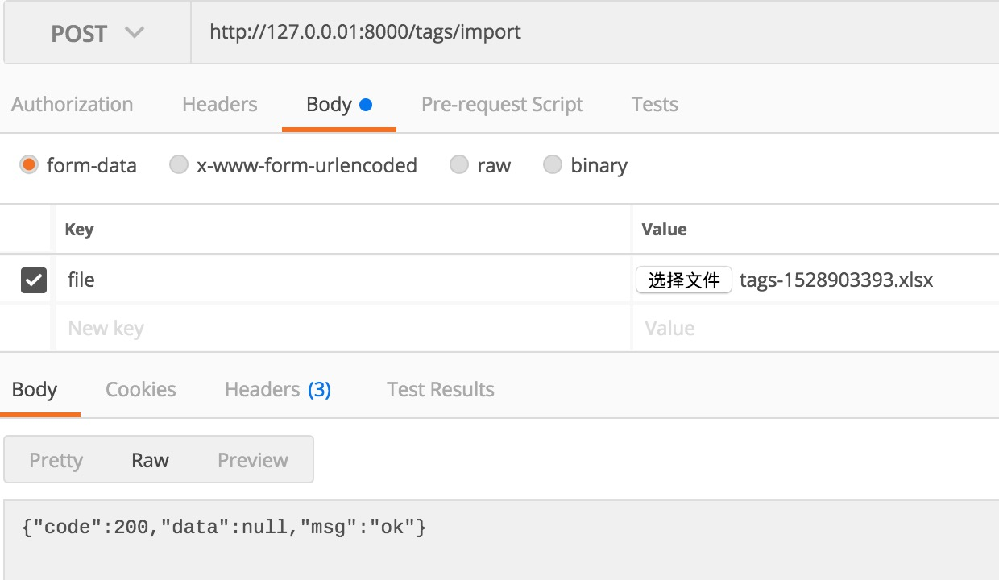

# 3.14 實作匯出、匯入 Excel

專案地址：<https://github.com/EDDYCJY/go-gin-example>

## 知識點

* 匯出功能的實作

## 本文目標

在本節，我們將實作對標籤資訊的匯出、匯入功能，這是很標配功能了，希望你掌握基礎的使用方式。

另外在本文我們使用了 2 個 Excel 的包，excelize 最初的 XML 格式檔案的一些結構，是透過 tealeg/xlsx 格式檔案結構演化而來的，因此特意在此都展示了，你可以根據自己的場景和喜愛去使用。

## 設定

首先要指定匯出的 Excel 檔案的儲存路徑，在 app.ini 中增加設定：

```
[app]
...

ExportSavePath = export/
```

修改 setting.go 的 App struct：

```go
type App struct {
    JwtSecret       string
    PageSize        int
    PrefixUrl string

    RuntimeRootPath string

    ImageSavePath  string
    ImageMaxSize   int
    ImageAllowExts []string

    ExportSavePath string

    LogSavePath string
    LogSaveName string
    LogFileExt  string
    TimeFormat  string
}
```

在這裡需增加 ExportSavePath 設定項，另外將先前 ImagePrefixUrl 改為 PrefixUrl 用於支撐兩者的 HOST 取得

（注意修改 image.go 的 GetImageFullUrl 方法）

## pkg

新建 pkg/export/excel.go 檔案，如下：

```
package export

import "github.com/EDDYCJY/go-gin-example/pkg/setting"

func GetExcelFullUrl(name string) string {
    return setting.AppSetting.PrefixUrl + "/" + GetExcelPath() + name
}

func GetExcelPath() string {
    return setting.AppSetting.ExportSavePath
}

func GetExcelFullPath() string {
    return setting.AppSetting.RuntimeRootPath + GetExcelPath()
}
```

這裡編寫了一些常用的方法，以後取值方式如果有變動，直接改內部程式碼即可，對外不可見

## 嘗試一下標準庫

```
f, err := os.Create(export.GetExcelFullPath() + "test.csv")
if err != nil {
    panic(err)
}
defer f.Close()

f.WriteString("\xEF\xBB\xBF")

w := csv.NewWriter(f)
data := [][]string{
    {"1", "test1", "test1-1"},
    {"2", "test2", "test2-1"},
    {"3", "test3", "test3-1"},
}

w.WriteAll(data)
```

在 Go 提供的標準庫 encoding/csv 中，天然的支援 csv 檔案的讀取和處理，在本段程式碼中，做了如下工作：

1、os.Create：

建立了一個 test.csv 檔案

2、f.WriteString("\xEF\xBB\xBF")：

`\xEF\xBB\xBF` 是 UTF-8 BOM 的 16 進位制格式，在這裡的用處是標識檔案的編碼格式，通常會出現在檔案的開頭，因此第一步就要將其寫入。如果不標識 UTF-8 的編碼格式的話，寫入的漢字會顯示為亂碼

3、csv.NewWriter：

```
func NewWriter(w io.Writer) *Writer {
    return &Writer{
        Comma: ',',
        w:     bufio.NewWriter(w),
    }
}
```

4、w\.WriteAll：

```
func (w *Writer) WriteAll(records [][]string) error {
    for _, record := range records {
        err := w.Write(record)
        if err != nil {
            return err
        }
    }
    return w.w.Flush()
}
```

WriteAll 實際是對 Write 的封裝，需要注意在最後呼叫了 `w.w.Flush()`，這充分了說明了 WriteAll 的使用場景，你可以想想作者的設計用意

## 匯出

### Service 方法

開啟 service/tag.go，增加 Export 方法，如下：

```
func (t *Tag) Export() (string, error) {
    tags, err := t.GetAll()
    if err != nil {
        return "", err
    }

    file := xlsx.NewFile()
    sheet, err := file.AddSheet("标签信息")
    if err != nil {
        return "", err
    }

    titles := []string{"ID", "名称", "创建人", "创建时间", "修改人", "修改时间"}
    row := sheet.AddRow()

    var cell *xlsx.Cell
    for _, title := range titles {
        cell = row.AddCell()
        cell.Value = title
    }

    for _, v := range tags {
        values := []string{
            strconv.Itoa(v.ID),
            v.Name,
            v.CreatedBy,
            strconv.Itoa(v.CreatedOn),
            v.ModifiedBy,
            strconv.Itoa(v.ModifiedOn),
        }

        row = sheet.AddRow()
        for _, value := range values {
            cell = row.AddCell()
            cell.Value = value
        }
    }

    time := strconv.Itoa(int(time.Now().Unix()))
    filename := "tags-" + time + ".xlsx"

    fullPath := export.GetExcelFullPath() + filename
    err = file.Save(fullPath)
    if err != nil {
        return "", err
    }

    return filename, nil
}
```

## routers 入口

開啟 routers/api/v1/tag.go，增加如下方法：

```
func ExportTag(c *gin.Context) {
    appG := app.Gin{C: c}
    name := c.PostForm("name")
    state := -1
    if arg := c.PostForm("state"); arg != "" {
        state = com.StrTo(arg).MustInt()
    }

    tagService := tag_service.Tag{
        Name:  name,
        State: state,
    }

    filename, err := tagService.Export()
    if err != nil {
        appG.Response(http.StatusOK, e.ERROR_EXPORT_TAG_FAIL, nil)
        return
    }

    appG.Response(http.StatusOK, e.SUCCESS, map[string]string{
        "export_url":      export.GetExcelFullUrl(filename),
        "export_save_url": export.GetExcelPath() + filename,
    })
}
```

### 路由

在 routers/router.go 檔案中增加路由方法，如下

```
apiv1 := r.Group("/api/v1")
apiv1.Use(jwt.JWT())
{
    ...
    //导出标签
    r.POST("/tags/export", v1.ExportTag)
}
```

### 驗證介面

訪問 `http://127.0.0.1:8000/tags/export`，結果如下：

```
{
    "code": 200,
    "data": {
        "export_save_url": "export/tags-1528903393.xlsx",
        "export_url": "http://127.0.0.1:8000/export/tags-1528903393.xlsx"
    },
    "msg": "ok"
}
```

最終透過介面返回了匯出檔案的地址和儲存地址

### StaticFS

那你想想，現在直接訪問地址肯定是無法下載檔案的，那麼該如何做呢？

開啟 router.go 檔案，增加程式碼如下：

```
r.StaticFS("/export", http.Dir(export.GetExcelFullPath()))
```

若你不理解，強烈建議溫習下前面的章節，舉一反三

## 驗證下載

再次訪問上面的 export\_url ，如：`http://127.0.0.1:8000/export/tags-1528903393.xlsx`，是不是成功了呢？

## 匯入

### Service 方法

開啟 service/tag.go，增加 Import 方法，如下：

```
func (t *Tag) Import(r io.Reader) error {
    xlsx, err := excelize.OpenReader(r)
    if err != nil {
        return err
    }

    rows := xlsx.GetRows("标签信息")
    for irow, row := range rows {
        if irow > 0 {
            var data []string
            for _, cell := range row {
                data = append(data, cell)
            }

            models.AddTag(data[1], 1, data[2])
        }
    }

    return nil
}
```

## routers 入口

開啟 routers/api/v1/tag.go，增加如下方法：

```
func ImportTag(c *gin.Context) {
    appG := app.Gin{C: c}

    file, _, err := c.Request.FormFile("file")
    if err != nil {
        logging.Warn(err)
        appG.Response(http.StatusOK, e.ERROR, nil)
        return
    }

    tagService := tag_service.Tag{}
    err = tagService.Import(file)
    if err != nil {
        logging.Warn(err)
        appG.Response(http.StatusOK, e.ERROR_IMPORT_TAG_FAIL, nil)
        return
    }

    appG.Response(http.StatusOK, e.SUCCESS, nil)
}
```

### 路由

在 routers/router.go 檔案中增加路由方法，如下

```
apiv1 := r.Group("/api/v1")
apiv1.Use(jwt.JWT())
{
    ...
    //导入标签
    r.POST("/tags/import", v1.ImportTag)
}
```

### 驗證



在這裡我們將先前匯出的 Excel 檔案作為入參，訪問 `http://127.0.0.01:8000/tags/import`，檢查返回和資料是否正確入庫

## 總結

在本文中，簡單介紹了 Excel 的匯入、匯出的使用方式，使用了以下 2 個包：

* [tealeg/xlsx](https://github.com/tealeg/xlsx)
* [360EntSecGroup-Skylar/excelize](https://github.com/360EntSecGroup-Skylar/excelize)

你可以細細閱讀一下它的實作和使用方式，對你的把控更有幫助 🤔

## 課外

* tag：匯出使用 excelize 的方式去實作（可能你會發現更簡單哦）
* tag：匯入去重功能實作
* artice ：匯入、匯出功能實作

也不失為你很好的練手機會，如果有興趣，可以試試

## 參考

### 本系列示例程式碼

* [go-gin-example](https://github.com/EDDYCJY/go-gin-example)

## 關於

### 修改記錄

* 第一版：2018年02月16日釋出文章
* 第二版：2019年10月02日修改文章

## ？

如果有任何疑問或錯誤，歡迎在 [issues](https://github.com/EDDYCJY/blog) 進行提問或給予修正意見，如果喜歡或對你有所幫助，歡迎 Star，對作者是一種鼓勵和推進。

### 我的微信公眾號


