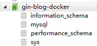

# 3.9 將Golang應用部署到Docker

專案地址：<https://github.com/EDDYCJY/go-gin-example>

## 涉及知識點

* Go + Docker

## 本文目標

將我們的 `go-gin-example` 應用部署到一個 Docker 裡，你需要先準備好如下東西：

* 你需要安裝好 `docker`。
* 如果上外網比較吃力，需要配好映象源。

## Docker

在這裡簡單介紹下Docker，建議深入學習


Docker 是一個開源的輕量級容器技術，讓開發者可以打包他們的應用以及應用執行的上下文環境到一個可移植的映象中，然後釋出到任何支援Docker的系統上執行。 透過容器技術，在幾乎沒有效能開銷的情況下，Docker 為應用提供了一個隔離執行環境

* 簡化設定
* 程式碼流水線管理
* 提高開發效率
* 隔離應用
* 快速、持續部署

接下來我們正式開始對專案進行 `docker` 的所需處理和編寫，每一個大標題為步驟大綱

## Golang

### 一、編寫Dockerfile

在 `go-gin-example` 專案根目錄建立 Dockerfile 檔案，寫入內容

```
FROM golang:latest

ENV GOPROXY https://goproxy.cn,direct
WORKDIR $GOPATH/src/github.com/EDDYCJY/go-gin-example
COPY . $GOPATH/src/github.com/EDDYCJY/go-gin-example
RUN go build .

EXPOSE 8000
ENTRYPOINT ["./go-gin-example"]
```

#### 作用

`golang:latest` 映象為基礎映象，將工作目錄設定為 `$GOPATH/src/go-gin-example`，並將當前上下文目錄的內容複製到 `$GOPATH/src/go-gin-example` 中

在進行 `go build` 編譯完畢後，將容器啟動程式設定為 `./go-gin-example`，也就是我們所編譯的可執行檔案

注意 `go-gin-example` 在 `docker` 容器裡編譯，並沒有在宿主機現場編譯

#### 說明

Dockerfile 檔案是用於定義 Docker 映象生成流程的設定檔案，檔案內容是一條條指令，每一條指令構建一層，因此每一條指令的內容，就是描述該層應當如何構建；這些指令應用於基礎映象並最終建立一個新的映象

你可以認為用於快速建立自定義的 Docker 映象

**1、 FROM**

指定基礎映象（必須有的指令，並且必須是第一條指令）

**2、 WORKDIR**

格式為 `WORKDIR` <工作目錄路徑>

使用 `WORKDIR` 指令可以來**指定工作目錄**（或者稱為當前目錄），以後各層的當前目錄就被改為指定的目錄，如果目錄不存在，`WORKDIR` 會幫你建立目錄

**3、COPY**

格式：

```
COPY <源路径>... <目标路径>
COPY ["<源路径1>",... "<目标路径>"]
```

`COPY` 指令將從構建上下文目錄中 <源路徑> 的檔案/目錄**複製**到新的一層的映象內的 <目標路徑> 位置

**4、RUN**

用於執行命令列命令

格式：`RUN` <命令>

**5、EXPOSE**

格式為 `EXPOSE` <埠1> \[<埠2>...]

`EXPOSE` 指令是**宣告執行時容器提供服務埠，這只是一個宣告**，在執行時並不會因為這個宣告應用就會開啟這個埠的服務

在 Dockerfile 中寫入這樣的宣告有兩個好處

* 幫助映象使用者理解這個映象服務的守護埠，以方便設定對映
* 執行時使用隨機埠對映時，也就是 `docker run -P` 時，會自動隨機對映 `EXPOSE` 的埠

**6、ENTRYPOINT**

`ENTRYPOINT` 的格式和 `RUN` 指令格式一樣，分為兩種格式

* `exec` 格式：

  ```
  <ENTRYPOINT> "<CMD>"
  ```
* `shell` 格式：

  ```
  ENTRYPOINT [ "curl", "-s", "http://ip.cn" ]
  ```

`ENTRYPOINT` 指令是**指定容器啟動程式及引數**

### 二、構建映象

`go-gin-example` 的專案根目錄下**執行** `docker build -t gin-blog-docker .`

該命令作用是建立/構建映象，`-t` 指定名稱為 `gin-blog-docker`，`.` 構建內容為當前上下文目錄

```
$ docker build -t gin-blog-docker .
Sending build context to Docker daemon 96.39 MB
Step 1/6 : FROM golang:latest
 ---> d632bbfe5767
Step 2/6 : WORKDIR $GOPATH/src/github.com/EDDYCJY/go-gin-example
 ---> 56294f978c5d
Removing intermediate container e112997b995d
Step 3/6 : COPY . $GOPATH/src/github.com/EDDYCJY/go-gin-example
 ---> 3b60960120cf
Removing intermediate container 63e310b3f60c
Step 4/6 : RUN go build .
 ---> Running in 52648a431450
go: downloading github.com/gin-gonic/gin v1.3.0
go: downloading github.com/go-ini/ini v1.32.1-0.20180214101753-32e4be5f41bb
go: downloading github.com/swaggo/gin-swagger v1.0.1-0.20190110070702-0c6fcfd3c7f3
...
 ---> 7bfbeb301fea
Removing intermediate container 52648a431450
Step 5/6 : EXPOSE 8000
 ---> Running in 98f5b387d1bb
 ---> b65bd4076c65
Removing intermediate container 98f5b387d1bb
Step 6/6 : ENTRYPOINT ./go-gin-example
 ---> Running in c4f6cdeb667b
 ---> d8a109c7697c
Removing intermediate container c4f6cdeb667b
Successfully built d8a109c7697c
```

### 三、驗證映象

檢視所有的映象，確定剛剛構建的 `gin-blog-docker` 映象是否存在

```
$ docker images
REPOSITORY              TAG                 IMAGE ID            CREATED              SIZE
gin-blog-docker         latest              d8a109c7697c        About a minute ago   946 MB
docker.io/golang        latest              d632bbfe5767        8 days ago           779 MB
...
```

### 四、建立並執行一個新容器

執行命令 `docker run -p 8000:8000 gin-blog-docker`

```
$ docker run -p 8000:8000 gin-blog-docker
dial tcp 127.0.0.1:3306: connect: connection refused
[GIN-debug] [WARNING] Running in "debug" mode. Switch to "release" mode in production.
 - using env:    export GIN_MODE=release
 - using code:    gin.SetMode(gin.ReleaseMode)

...
Actual pid is 1
```

執行成功，你以為大功告成了嗎？

你想太多了，仔細看看控制檯的輸出了一條錯誤 `dial tcp 127.0.0.1:3306: connect: connection refused`

我們研判一下，發現是 `Mysql` 的問題，接下來第二項我們將解決這個問題

## Mysql

### 一、拉取映象

從 `Docker` 的公共倉庫 `Dockerhub` 下載 `MySQL` 映象（國內建議配個映象）

```
$ docker pull mysql
```

### 二、建立並執行一個新容器

執行 `Mysql` 容器，並設定執行成功後返回容器ID

```
$ docker run --name mysql -p 3306:3306 -e MYSQL_ROOT_PASSWORD=rootroot -d mysql
8c86ac986da4922492934b6fe074254c9165b8ee3e184d29865921b0fef29e64
```

#### 連線 Mysql

初始化的 `Mysql` 應該如圖



## Golang + Mysql

### 一、刪除映象

由於原本的映象存在問題，我們需要刪除它，此處有幾種做法

* 刪除原本有問題的映象，重新構建一個新映象
* 重新構建一個不同 `name`、`tag` 的新映象

刪除原本的有問題的映象，`-f` 是強制刪除及其關聯狀態

若不執行 `-f`，你需要執行 `docker ps -a` 查到所關聯的容器，將其 `rm` 解除兩者依賴關係

```
$ docker rmi -f gin-blog-docker
Untagged: gin-blog-docker:latest
Deleted: sha256:d8a109c7697c3c2d9b4de7dbb49669d10106902122817b6467a031706bc52ab4
Deleted: sha256:b65bd4076c65a3c24029ca4def3b3f37001ff7c9eca09e2590c4d29e1e23dce5
Deleted: sha256:7bfbeb301fea9d8912a4b7c43e4bb8b69bdc57f0b416b372bfb6510e476a7dee
Deleted: sha256:3b60960120cf619181c1762cdc1b8ce318b8c815e056659809252dd321bcb642
Deleted: sha256:56294f978c5dfcfa4afa8ad033fd76b755b7ecb5237c6829550741a4d2ce10bc
```

### 二、修改設定檔案

將專案的設定檔案 `conf/app.ini`，內容修改為

```
#debug or release
RUN_MODE = debug

[app]
PAGE_SIZE = 10
JWT_SECRET = 233

[server]
HTTP_PORT = 8000
READ_TIMEOUT = 60
WRITE_TIMEOUT = 60

[database]
TYPE = mysql
USER = root
PASSWORD = rootroot
HOST = mysql:3306
NAME = blog
TABLE_PREFIX = blog_
```

### 三、重新構建映象

重複先前的步驟，回到 `gin-blog` 的專案根目錄下**執行** `docker build -t gin-blog-docker .`

### 四、建立並執行一個新容器

## 關聯

Q：我們需要將 `Golang` 容器和 `Mysql` 容器關聯起來，那麼我們需要怎麼做呢？

A：增加命令 `--link mysql:mysql` 讓 `Golang` 容器與 `Mysql` 容器互聯；透過 `--link`，**可以在容器內直接使用其關聯的容器別名進行訪問**，而不透過IP，但是`--link`只能解決單機容器間的關聯，在分散式多機的情況下，需要透過別的方式進行連線

## 執行

執行命令 `docker run --link mysql:mysql -p 8000:8000 gin-blog-docker`

```
$ docker run --link mysql:mysql -p 8000:8000 gin-blog-docker
[GIN-debug] [WARNING] Running in "debug" mode. Switch to "release" mode in production.
 - using env:    export GIN_MODE=release
 - using code:    gin.SetMode(gin.ReleaseMode)
...
Actual pid is 1
```

## 結果

檢查啟動輸出、介面測試、資料庫內資料，均正常；我們的 `Golang` 容器和 `Mysql` 容器成功關聯執行，大功告成 :)

## Review

### 思考

雖然應用已經能夠跑起來了

但如果對 `Golang` 和 `Docker` 有一定的瞭解，我希望你能夠想到至少2個問題

* 為什麼 `gin-blog-docker` 佔用空間這麼大？（可用 `docker ps -as | grep gin-blog-docker` 檢視）
* `Mysql` 容器直接這麼使用，資料儲存到哪裡去了？

### 建立超小的Golang映象

Q：第一個問題，為什麼這麼映象體積這麼大？

A：`FROM golang:latest` 拉取的是官方 `golang` 映象，包含Golang的編譯和執行環境，外加一堆GCC、build工具，相當齊全

這是有問題的，**我們可以不在Golang容器中現場編譯的**，壓根用不到那些東西，我們只需要一個能夠執行可執行檔案的環境即可

#### 構建Scratch映象

Scratch映象，簡潔、小巧，基本是個空映象

**一、修改Dockerfile**

```
FROM scratch

WORKDIR $GOPATH/src/github.com/EDDYCJY/go-gin-example
COPY . $GOPATH/src/github.com/EDDYCJY/go-gin-example

EXPOSE 8000
CMD ["./go-gin-example"]
```

**二、編譯可執行檔案**

```
CGO_ENABLED=0 GOOS=linux go build -a -installsuffix cgo -o go-gin-example .
```

編譯所生成的可執行檔案會依賴一些庫，並且是動態連結。在這裡因為使用的是 `scratch` 映象，它是空映象，因此我們需要將生成的可執行檔案靜態連結所依賴的庫

**三、構建映象**

```
$ docker build -t gin-blog-docker-scratch .
Sending build context to Docker daemon 133.1 MB
Step 1/5 : FROM scratch
 ---> 
Step 2/5 : WORKDIR $GOPATH/src/github.com/EDDYCJY/go-gin-example
 ---> Using cache
 ---> ee07e166a638
Step 3/5 : COPY . $GOPATH/src/github.com/EDDYCJY/go-gin-example
 ---> 1489a0693d51
Removing intermediate container e3e9efc0fe4d
Step 4/5 : EXPOSE 8000
 ---> Running in b5630de5544a
 ---> 6993e9f8c944
Removing intermediate container b5630de5544a
Step 5/5 : CMD ./go-gin-example
 ---> Running in eebc0d8628ae
 ---> 5310bebeb86a
Removing intermediate container eebc0d8628ae
Successfully built 5310bebeb86a
```

注意，假設你的Golang應用沒有依賴任何的設定等檔案，是可以直接把可執行檔案給複製進去即可，其他都不必關心

這裡可以有好幾種解決方案

* 依賴檔案統一管理掛載
* go-bindata 一下

...

因此這裡如果**解決了檔案依賴的問題**後，就不需要把目錄給 `COPY` 進去了

**四、執行**

```
$ docker run --link mysql:mysql -p 8000:8000 gin-blog-docker-scratch
[GIN-debug] [WARNING] Running in "debug" mode. Switch to "release" mode in production.
 - using env:    export GIN_MODE=release
 - using code:    gin.SetMode(gin.ReleaseMode)

[GIN-debug] GET    /auth                     --> github.com/EDDYCJY/go-gin-example/routers/api.GetAuth (3 handlers)
...
```

成功執行，程式也正常接收請求

接下來我們再看看佔用大小，執行 `docker ps -as` 命令

```
$ docker ps -as
CONTAINER ID        IMAGE                     COMMAND                  ...         SIZE
9ebdba5a8445        gin-blog-docker-scratch   "./go-gin-example"       ...     0 B (virtual 132 MB)
427ee79e6857        gin-blog-docker           "./go-gin-example"       ...     0 B (virtual 946 MB)
```

從結果而言，佔用大小以`Scratch`映象為基礎的容器完勝，完成目標

### Mysql掛載資料卷

倘若不做任何干涉，在每次啟動一個 `Mysql` 容器時，資料庫都是空的。另外容器刪除之後，資料就丟失了（還有各類意外情況），非常糟糕！

#### 資料卷

資料卷 是被設計用來持久化資料的，它的生命週期獨立於容器，Docker 不會在容器被刪除後自動刪除 資料卷，並且也不存在垃圾回收這樣的機制來處理沒有任何容器引用的 資料卷。如果需要在刪除容器的同時移除資料卷。可以在刪除容器的時候使用 `docker rm -v` 這個命令

資料卷 是一個可供一個或多個容器使用的特殊目錄，它繞過 UFS，可以提供很多有用的特性：

* 資料卷 可以在容器之間共享和重用
* 對 資料卷 的修改會立馬生效
* 對 資料卷 的更新，不會影響映象
* 資料卷 預設會一直存在，即使容器被刪除

> 注意：資料卷 的使用，類似於 Linux 下對目錄或檔案進行 mount，映象中的被指定為掛載點的目錄中的檔案會隱藏掉，能顯示看的是掛載的 資料卷。

#### 如何掛載

首先建立一個目錄用於存放資料卷；示例目錄 `/data/docker-mysql`，注意 `--name` 原本名稱為 `mysql` 的容器，需要將其刪除 `docker rm`

```
$ docker run --name mysql -p 3306:3306 -e MYSQL_ROOT_PASSWORD=rootroot -v /data/docker-mysql:/var/lib/mysql -d mysql
54611dbcd62eca33fb320f3f624c7941f15697d998f40b24ee535a1acf93ae72
```

建立成功，檢查目錄 `/data/docker-mysql`，下面多了不少資料庫檔案

#### 驗證

接下來交由你進行驗證，目標是建立一些測試表和資料，然後刪除當前容器，重新建立的容器，資料庫資料也依然存在（當然了資料卷指向要一致）

我已驗證完畢，你呢？

## 參考

### 本系列示例程式碼

* [go-gin-example](https://github.com/EDDYCJY/go-gin-example)

### 書籍

* [Docker —— 從入門到實踐](https://www.gitbook.com/book/yeasy/docker_practice/details)

## 關於

### 修改記錄

* 第一版：2018年02月16日釋出文章
* 第二版：2019年10月01日修改文章

## ？

如果有任何疑問或錯誤，歡迎在 [issues](https://github.com/EDDYCJY/blog) 進行提問或給予修正意見，如果喜歡或對你有所幫助，歡迎 Star，對作者是一種鼓勵和推進。

### 我的微信公眾號


