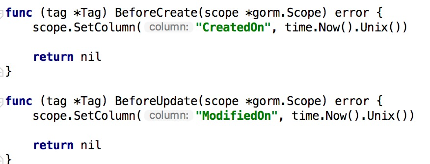
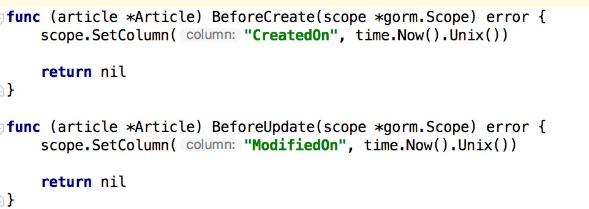

# 3.10 定製 GORM Callbacks

專案地址：<https://github.com/EDDYCJY/go-gin-example>

## 涉及知識點

* GORM

## 本文目標

> GORM itself is powered by Callbacks, so you could fully customize GORM as you want

GORM 本身是由回撥驅動的，所以我們可以根據需要完全定製 GORM，以此達到我們的目的，如下：

* 註冊一個新的回撥
* 刪除現有的回撥
* 替換現有的回撥
* 註冊回撥的順序

在 GORM 中包含以上四類 Callbacks，我們結合專案選用 “替換現有的回撥” 來解決一個小痛點。

## 問題

在 models 目錄下，我們包含 tag.go 和 article.go 兩個檔案，他們有一個問題，就是 BeforeCreate、BeforeUpdate 重複出現了，那難道 100 個檔案，就要寫一百次嗎？

1、tag.go



2、article.go



顯然這是不可能的，如果先前你已經意識到這個問題，那挺OK，但沒有的話，現在開始就要改

### 解決

在這裡我們透過 Callbacks 來實作功能，不需要一個個檔案去編寫

### 實作Callbacks

開啟 models 目錄下的 models.go 檔案，實作以下兩個方法：

1、updateTimeStampForCreateCallback

```go
// updateTimeStampForCreateCallback will set `CreatedOn`, `ModifiedOn` when creating
func updateTimeStampForCreateCallback(scope *gorm.Scope) {
    if !scope.HasError() {
        nowTime := time.Now().Unix()
        if createTimeField, ok := scope.FieldByName("CreatedOn"); ok {
            if createTimeField.IsBlank {
                createTimeField.Set(nowTime)
            }
        }

        if modifyTimeField, ok := scope.FieldByName("ModifiedOn"); ok {
            if modifyTimeField.IsBlank {
                modifyTimeField.Set(nowTime)
            }
        }
    }
}
```
在這段方法中，會完成以下功能

* 檢查是否有含有錯誤（db.Error）
* `scope.FieldByName` 透過 `scope.Fields()` 取得所有欄位，判斷當前是否包含所需欄位

  ```
  for _, field := range scope.Fields() {
    if field.Name == name || field.DBName == name {
        return field, true
    }
    if field.DBName == dbName {
        mostMatchedField = field
    }
  }
  ```
* `field.IsBlank` 可判斷該欄位的值是否為空

  ```
  func isBlank(value reflect.Value) bool {
    switch value.Kind() {
    case reflect.String:
        return value.Len() == 0
    case reflect.Bool:
        return !value.Bool()
    case reflect.Int, reflect.Int8, reflect.Int16, reflect.Int32, reflect.Int64:
        return value.Int() == 0
    case reflect.Uint, reflect.Uint8, reflect.Uint16, reflect.Uint32, reflect.Uint64, reflect.Uintptr:
        return value.Uint() == 0
    case reflect.Float32, reflect.Float64:
        return value.Float() == 0
    case reflect.Interface, reflect.Ptr:
        return value.IsNil()
    }

    return reflect.DeepEqual(value.Interface(), reflect.Zero(value.Type()).Interface())
  }
  ```
* 若為空則 `field.Set` 用於給該欄位設定值，引數為 `interface{}`

2、updateTimeStampForUpdateCallback

```go
// updateTimeStampForUpdateCallback will set `ModifyTime` when updating
func updateTimeStampForUpdateCallback(scope *gorm.Scope) {
    if _, ok := scope.Get("gorm:update_column"); !ok {
        scope.SetColumn("ModifiedOn", time.Now().Unix())
    }
}
```
* `scope.Get(...)` 根據入參取得設定了字面值的引數，例如本文中是 `gorm:update_column` ，它會去查詢含這個字面值的欄位屬性
* `scope.SetColumn(...)` 假設沒有指定 `update_column` 的欄位，我們預設在更新回撥設定 `ModifiedOn` 的值

### 註冊Callbacks

在上面小節我已經把回撥方法編寫好了，接下來需要將其註冊進 GORM 的鉤子裡，但其本身自帶 Create 和 Update 回撥，因此呼叫替換即可

在 models.go 的 init 函式中，增加以下語句

```
db.Callback().Create().Replace("gorm:update_time_stamp", updateTimeStampForCreateCallback)
db.Callback().Update().Replace("gorm:update_time_stamp", updateTimeStampForUpdateCallback)
```

### 驗證

訪問 AddTag 介面，成功後檢查資料庫，可發現 `created_on` 和 `modified_on` 欄位都為當前執行時間

訪問 EditTag 介面，可發現 `modified_on` 為最後一次執行更新的時間

## 拓展

我們想到，在實際專案中硬刪除是較少存在的，那麼是否可以透過 Callbacks 來完成這個功能呢？

答案是可以的，我們在先前 `Model struct` 增加 `DeletedOn` 變數

```go
type Model struct {
    ID int `gorm:"primary_key" json:"id"`
    CreatedOn int `json:"created_on"`
    ModifiedOn int `json:"modified_on"`
    DeletedOn int `json:"deleted_on"`
}
```
### 實作Callbacks

開啟 models 目錄下的 models.go 檔案，實作以下方法：

```go
func deleteCallback(scope *gorm.Scope) {
    if !scope.HasError() {
        var extraOption string
        if str, ok := scope.Get("gorm:delete_option"); ok {
            extraOption = fmt.Sprint(str)
        }

        deletedOnField, hasDeletedOnField := scope.FieldByName("DeletedOn")

        if !scope.Search.Unscoped && hasDeletedOnField {
            scope.Raw(fmt.Sprintf(
                "UPDATE %v SET %v=%v%v%v",
                scope.QuotedTableName(),
                scope.Quote(deletedOnField.DBName),
                scope.AddToVars(time.Now().Unix()),
                addExtraSpaceIfExist(scope.CombinedConditionSql()),
                addExtraSpaceIfExist(extraOption),
            )).Exec()
        } else {
            scope.Raw(fmt.Sprintf(
                "DELETE FROM %v%v%v",
                scope.QuotedTableName(),
                addExtraSpaceIfExist(scope.CombinedConditionSql()),
                addExtraSpaceIfExist(extraOption),
            )).Exec()
        }
    }
}

func addExtraSpaceIfExist(str string) string {
    if str != "" {
        return " " + str
    }
    return ""
}
```
* `scope.Get("gorm:delete_option")` 檢查是否手動指定了delete\_option&#x20;
* `scope.FieldByName("DeletedOn")` 取得我們約定的刪除欄位，若存在則 `UPDATE` 軟刪除，若不存在則 `DELETE` 硬刪除
* `scope.QuotedTableName()` 返回引用的表名，這個方法 GORM 會根據自身邏輯對錶名進行一些處理
* `scope.CombinedConditionSql()` 返回組合好的條件SQL，看一下方法原型很明瞭

  ```
  func (scope *Scope) CombinedConditionSql() string {
    joinSQL := scope.joinsSQL()
    whereSQL := scope.whereSQL()
    if scope.Search.raw {
        whereSQL = strings.TrimSuffix(strings.TrimPrefix(whereSQL, "WHERE ("), ")")
    }
    return joinSQL + whereSQL + scope.groupSQL() +
        scope.havingSQL() + scope.orderSQL() + scope.limitAndOffsetSQL()
  }
  ```
* `scope.AddToVars` 該方法可以新增值作為SQL的引數，也可用於防範SQL注入

  ```
  func (scope *Scope) AddToVars(value interface{}) string {
    _, skipBindVar := scope.InstanceGet("skip_bindvar")

    if expr, ok := value.(*expr); ok {
        exp := expr.expr
        for _, arg := range expr.args {
            if skipBindVar {
                scope.AddToVars(arg)
            } else {
                exp = strings.Replace(exp, "?", scope.AddToVars(arg), 1)
            }
        }
        return exp
    }

    scope.SQLVars = append(scope.SQLVars, value)

    if skipBindVar {
        return "?"
    }
    return scope.Dialect().BindVar(len(scope.SQLVars))
  }
  ```

### 註冊Callbacks

在 models.go 的 init 函式中，增加以下刪除的回撥

```
db.Callback().Delete().Replace("gorm:delete", deleteCallback)
```

### 驗證

重啟服務，訪問 DeleteTag 介面，成功後即可發現 deleted\_on 欄位有值

## 小結

在這一章節中，我們結合 GORM 完成了新增、更新、查詢的 Callbacks，在實際專案中常常也是這麼使用

畢竟，一個鉤子的事，就沒有必要自己手寫過多不必要的程式碼了

（注意，增加了軟刪除後，先前的程式碼需要增加 `deleted_on` 的判斷）

## 參考

### 本系列示例程式碼

* [go-gin-example](https://github.com/EDDYCJY/go-gin-example)

### 文件

* [gorm](http://gorm.io/docs/write_plugins.html)

## 關於

### 修改記錄

* 第一版：2018年02月16日釋出文章
* 第二版：2019年10月01日修改文章

## ？

如果有任何疑問或錯誤，歡迎在 [issues](https://github.com/EDDYCJY/blog) 進行提問或給予修正意見，如果喜歡或對你有所幫助，歡迎 Star，對作者是一種鼓勵和推進。

### 我的微信公眾號


