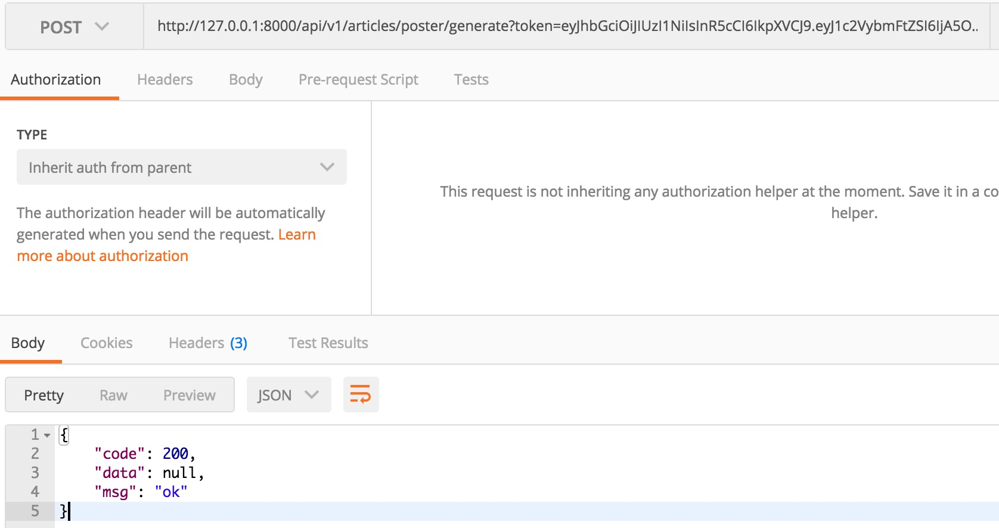
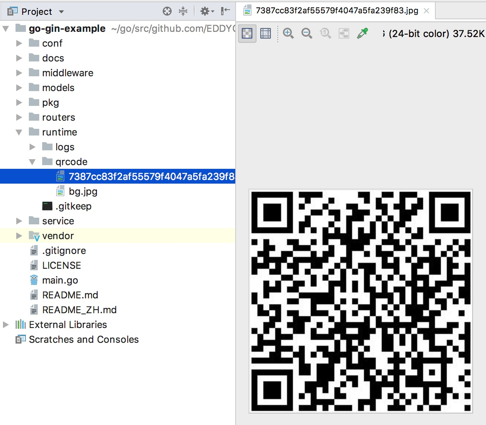
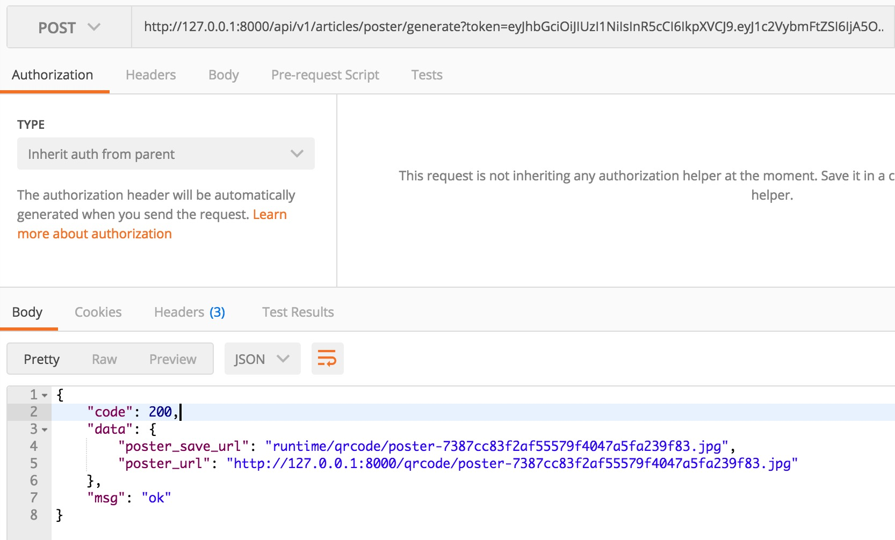
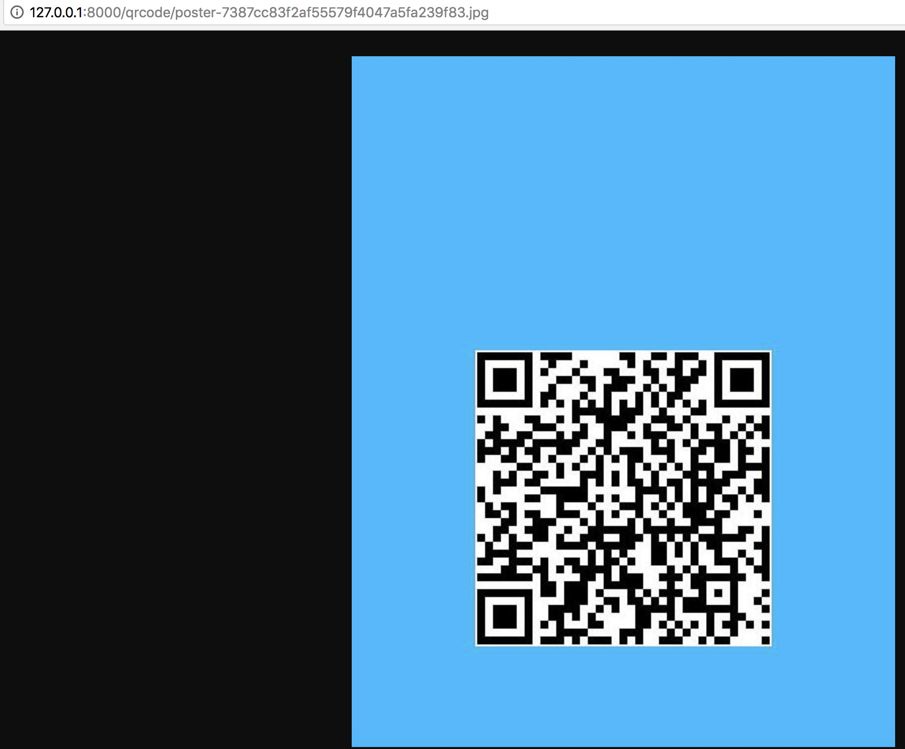

# 3.15 生成二維碼、合併海報

專案地址：<https://github.com/EDDYCJY/go-gin-example>

## 知識點

* 圖片生成
* 二維碼生成

## 本文目標

在文章的詳情頁中，我們常常會需要去宣傳它，而目前最常見的就是發海報了，今天我們將實作如下功能：

* 生成二維碼
* 合併海報（背景圖 + 二維碼）

## 實作

首先，你需要在 App 設定項中增加二維碼及其海報的儲存路徑，我們約定設定項名稱為 `QrCodeSavePath`，值為 `qrcode/`，經過多節連載的你應該能夠完成，若有不懂可參照 [go-gin-example](https://github.com/EDDYCJY/go-gin-example/blob/master/conf/app.ini#L14)。

## 生成二維碼

### 安裝

```
$ go get -u github.com/boombuler/barcode
```

### 工具包

考慮生成二維碼這一動作貼合工具包的定義，且有公用的可能性，新建 pkg/qrcode/qrcode.go 檔案，寫入內容：

```go
package qrcode

import (
    "image/jpeg"

    "github.com/boombuler/barcode"
    "github.com/boombuler/barcode/qr"

    "github.com/EDDYCJY/go-gin-example/pkg/file"
    "github.com/EDDYCJY/go-gin-example/pkg/setting"
    "github.com/EDDYCJY/go-gin-example/pkg/util"
)

type QrCode struct {
    URL    string
    Width  int
    Height int
    Ext    string
    Level  qr.ErrorCorrectionLevel
    Mode   qr.Encoding
}

const (
    EXT_JPG = ".jpg"
)

func NewQrCode(url string, width, height int, level qr.ErrorCorrectionLevel, mode qr.Encoding) *QrCode {
    return &QrCode{
        URL:    url,
        Width:  width,
        Height: height,
        Level:  level,
        Mode:   mode,
        Ext:    EXT_JPG,
    }
}

func GetQrCodePath() string {
    return setting.AppSetting.QrCodeSavePath
}

func GetQrCodeFullPath() string {
    return setting.AppSetting.RuntimeRootPath + setting.AppSetting.QrCodeSavePath
}

func GetQrCodeFullUrl(name string) string {
    return setting.AppSetting.PrefixUrl + "/" + GetQrCodePath() + name
}

func GetQrCodeFileName(value string) string {
    return util.EncodeMD5(value)
}

func (q *QrCode) GetQrCodeExt() string {
    return q.Ext
}

func (q *QrCode) CheckEncode(path string) bool {
    src := path + GetQrCodeFileName(q.URL) + q.GetQrCodeExt()
    if file.CheckNotExist(src) == true {
        return false
    }

    return true
}

func (q *QrCode) Encode(path string) (string, string, error) {
    name := GetQrCodeFileName(q.URL) + q.GetQrCodeExt()
    src := path + name
    if file.CheckNotExist(src) == true {
        code, err := qr.Encode(q.URL, q.Level, q.Mode)
        if err != nil {
            return "", "", err
        }

        code, err = barcode.Scale(code, q.Width, q.Height)
        if err != nil {
            return "", "", err
        }

        f, err := file.MustOpen(name, path)
        if err != nil {
            return "", "", err
        }
        defer f.Close()

        err = jpeg.Encode(f, code, nil)
        if err != nil {
            return "", "", err
        }
    }

    return name, path, nil
}
```
這裡主要聚焦 `func (q *QrCode) Encode` 方法，做了如下事情：

* 取得二維碼生成路徑
* 建立二維碼
* 縮放二維碼到指定大小
* 新建存放二維碼圖片的檔案
* 將影象（二維碼）以 JPEG 4：2：0 基線格式寫入檔案

另外在 `jpeg.Encode(f, code, nil)` 中，第三個引數可設定其影象質量，預設值為 75

```go
// DefaultQuality is the default quality encoding parameter.
const DefaultQuality = 75

// Options are the encoding parameters.
// Quality ranges from 1 to 100 inclusive, higher is better.
type Options struct {
    Quality int
}
```
### 路由方法

1、第一步

在 routers/api/v1/article.go 新增 GenerateArticlePoster 方法用於介面開發

2、第二步

在 routers/router.go 的 apiv1 中新增 `apiv1.POST("/articles/poster/generate", v1.GenerateArticlePoster)` 路由

3、第三步

修改 GenerateArticlePoster 方法，編寫對應的生成邏輯，如下：

```go
const (
    QRCODE_URL = "https://github.com/EDDYCJY/blog#gin%E7%B3%BB%E5%88%97%E7%9B%AE%E5%BD%95"
)

func GenerateArticlePoster(c *gin.Context) {
    appG := app.Gin{c}
    qrc := qrcode.NewQrCode(QRCODE_URL, 300, 300, qr.M, qr.Auto)
    path := qrcode.GetQrCodeFullPath()
    _, _, err := qrc.Encode(path)
    if err != nil {
        appG.Response(http.StatusOK, e.ERROR, nil)
        return
    }

    appG.Response(http.StatusOK, e.SUCCESS, nil)
}
```
### 驗證

透過 POST 方法訪問 `http://127.0.0.1:8000/api/v1/articles/poster/generate?token=$token`（注意 $token）



透過檢查兩個點確定功能是否正常，如下：

1、訪問結果是否 200

2、本地目錄是否成功生成二維碼圖片



## 合併海報

在這一節，將實作二維碼圖片與背景圖合併成新的一張圖，可用於常見的宣傳海報等業務場景

### 背景圖


將背景圖另存為 runtime/qrcode/bg.jpg（實際應用，可存在 OSS 或其他地方）

### service 方法

開啟 service/article\_service 目錄，新建 article\_poster.go 檔案，寫入內容：

```go
package article_service

import (
    "image"
    "image/draw"
    "image/jpeg"
    "os"

    "github.com/EDDYCJY/go-gin-example/pkg/file"
    "github.com/EDDYCJY/go-gin-example/pkg/qrcode"
)

type ArticlePoster struct {
    PosterName string
    *Article
    Qr *qrcode.QrCode
}

func NewArticlePoster(posterName string, article *Article, qr *qrcode.QrCode) *ArticlePoster {
    return &ArticlePoster{
        PosterName: posterName,
        Article:    article,
        Qr:         qr,
    }
}

func GetPosterFlag() string {
    return "poster"
}

func (a *ArticlePoster) CheckMergedImage(path string) bool {
    if file.CheckNotExist(path+a.PosterName) == true {
        return false
    }

    return true
}

func (a *ArticlePoster) OpenMergedImage(path string) (*os.File, error) {
    f, err := file.MustOpen(a.PosterName, path)
    if err != nil {
        return nil, err
    }

    return f, nil
}

type ArticlePosterBg struct {
    Name string
    *ArticlePoster
    *Rect
    *Pt
}

type Rect struct {
    Name string
    X0   int
    Y0   int
    X1   int
    Y1   int
}

type Pt struct {
    X int
    Y int
}

func NewArticlePosterBg(name string, ap *ArticlePoster, rect *Rect, pt *Pt) *ArticlePosterBg {
    return &ArticlePosterBg{
        Name:          name,
        ArticlePoster: ap,
        Rect:          rect,
        Pt:            pt,
    }
}

func (a *ArticlePosterBg) Generate() (string, string, error) {
    fullPath := qrcode.GetQrCodeFullPath()
    fileName, path, err := a.Qr.Encode(fullPath)
    if err != nil {
        return "", "", err
    }

    if !a.CheckMergedImage(path) {
        mergedF, err := a.OpenMergedImage(path)
        if err != nil {
            return "", "", err
        }
        defer mergedF.Close()

        bgF, err := file.MustOpen(a.Name, path)
        if err != nil {
            return "", "", err
        }
        defer bgF.Close()

        qrF, err := file.MustOpen(fileName, path)
        if err != nil {
            return "", "", err
        }
        defer qrF.Close()

        bgImage, err := jpeg.Decode(bgF)
        if err != nil {
            return "", "", err
        }
        qrImage, err := jpeg.Decode(qrF)
        if err != nil {
            return "", "", err
        }

        jpg := image.NewRGBA(image.Rect(a.Rect.X0, a.Rect.Y0, a.Rect.X1, a.Rect.Y1))

        draw.Draw(jpg, jpg.Bounds(), bgImage, bgImage.Bounds().Min, draw.Over)
        draw.Draw(jpg, jpg.Bounds(), qrImage, qrImage.Bounds().Min.Sub(image.Pt(a.Pt.X, a.Pt.Y)), draw.Over)

        jpeg.Encode(mergedF, jpg, nil)
    }

    return fileName, path, nil
}
```
這裡重點留意 `func (a *ArticlePosterBg) Generate()` 方法，做了如下事情：

* 取得二維碼儲存路徑
* 生成二維碼影象
* 檢查合併後圖像（指的是存放合併後的海報）是否存在
* 若不存在，則生成待合併的影象 mergedF
* 開啟事先存放的背景圖 bgF
* 開啟生成的二維碼影象 qrF
* 解碼 bgF 和 qrF 返回 image.Image
* 建立一個新的 RGBA 影象
* 在 RGBA 影象上繪製 背景圖（bgF）
* 在已繪製背景圖的 RGBA 影象上，在指定 Point 上繪製二維碼影象（qrF）
* 將繪製好的 RGBA 影象以 JPEG 4：2：0 基線格式寫入合併後的影象檔案（mergedF）

### 錯誤碼

新增 [錯誤碼](https://github.com/EDDYCJY/go-gin-example/blob/master/pkg/e/code.go#L27)，[錯誤提示](https://github.com/EDDYCJY/go-gin-example/blob/master/pkg/e/msg.go#L25)

### 路由方法

開啟 routers/api/v1/article.go 檔案，修改 GenerateArticlePoster 方法，編寫最終的業務邏輯（含生成二維碼及合併海報），如下：

```go
const (
    QRCODE_URL = "https://github.com/EDDYCJY/blog#gin%E7%B3%BB%E5%88%97%E7%9B%AE%E5%BD%95"
)

func GenerateArticlePoster(c *gin.Context) {
    appG := app.Gin{c}
    article := &article_service.Article{}
    qr := qrcode.NewQrCode(QRCODE_URL, 300, 300, qr.M, qr.Auto) // 目前写死 gin 系列路径，可自行增加业务逻辑
    posterName := article_service.GetPosterFlag() + "-" + qrcode.GetQrCodeFileName(qr.URL) + qr.GetQrCodeExt()
    articlePoster := article_service.NewArticlePoster(posterName, article, qr)
    articlePosterBgService := article_service.NewArticlePosterBg(
        "bg.jpg",
        articlePoster,
        &article_service.Rect{
            X0: 0,
            Y0: 0,
            X1: 550,
            Y1: 700,
        },
        &article_service.Pt{
            X: 125,
            Y: 298,
        },
    )

    _, filePath, err := articlePosterBgService.Generate()
    if err != nil {
        appG.Response(http.StatusOK, e.ERROR_GEN_ARTICLE_POSTER_FAIL, nil)
        return
    }

    appG.Response(http.StatusOK, e.SUCCESS, map[string]string{
        "poster_url":      qrcode.GetQrCodeFullUrl(posterName),
        "poster_save_url": filePath + posterName,
    })
}
```
這塊涉及到大量知識，強烈建議閱讀下，如下：

* [image.Rect](https://golang.org/pkg/image/#Rect)
* [image.Pt](https://golang.org/pkg/image/#Pt)
* [image.NewRGBA](https://golang.org/pkg/image/#NewRGBA)
* [jpeg.Encode](https://golang.org/pkg/image/jpeg/#Encode)
* [jpeg.Decode](https://golang.org/pkg/image/jpeg/#Decode)
* [draw.Op](https://golang.org/pkg/image/draw/#Op)
* [draw.Draw](https://golang.org/pkg/image/draw/#Draw)
* [go-imagedraw-package](https://blog.golang.org/go-imagedraw-package)

其所涉及、關聯的庫都建議研究一下

### StaticFS

在 routers/router.go 檔案，增加如下程式碼:

```go
r.StaticFS("/qrcode", http.Dir(qrcode.GetQrCodeFullPath()))
```

### 驗證



訪問完整的 URL 路徑，返回合成後的海報並掃除二維碼成功則正確 🤓



## 總結

在本章節實作了兩個很常見的業務功能，分別是生成二維碼和合並海報。希望你能夠仔細閱讀我給出的連結，這塊的知識量不少，想要用好影象處理的功能，必須理解對應的思路，舉一反三

最後希望對你有所幫助 👌

## 參考

### 本系列示例程式碼

* [go-gin-example](https://github.com/EDDYCJY/go-gin-example)

## 關於

### 修改記錄

* 第一版：2018年02月16日釋出文章
* 第二版：2019年10月02日修改文章

## ？

如果有任何疑問或錯誤，歡迎在 [issues](https://github.com/EDDYCJY/blog) 進行提問或給予修正意見，如果喜歡或對你有所幫助，歡迎 Star，對作者是一種鼓勵和推進。

### 我的微信公眾號


