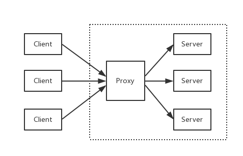
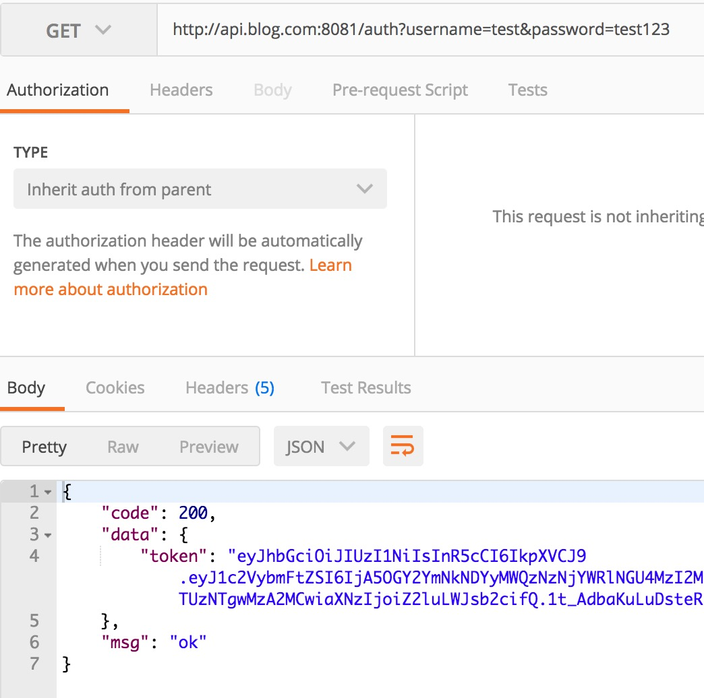
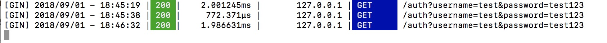

# 3.17 用Nginx部署Go應用

專案地址：<https://github.com/EDDYCJY/go-gin-example>

## 知識點

* Nginx。
* 反向代理。

## 本文目標

簡單部署後端服務。

## 做什麼

在本章節，我們將簡單介紹 Nginx 以及使用 Nginx 來完成對 [go-gin-example](https://github.com/EDDYCJY/go-gin-example) 的部署，會實作反向代理和簡單負載均衡的功能。

## Nginx

### 是什麼

Nginx 是一個 Web Server，可以用作反向代理、負載均衡、郵件代理、TCP / UDP、HTTP 伺服器等等，它擁有很多吸引人的特性，例如：

* 以較低的記憶體佔用率處理 10,000 多個併發連線（每10k非活動HTTP保持活動連線約2.5 MB ）
* 靜態伺服器（處理靜態檔案）
* 正向、反向代理
* 負載均衡
* 透過OpenSSL 對 TLS / SSL 與 SNI 和 OCSP 支援
* FastCGI、SCGI、uWSGI 的支援
* WebSockets、HTTP/1.1 的支援
* Nginx + Lua

### 安裝

請右拐谷歌或百度，安裝好 Nginx 以備接下來的使用

### 簡單講解

#### 常用命令

* nginx：啟動 Nginx
* nginx -s stop：立刻停止 Nginx 服務
* nginx -s reload：重新載入設定檔案
* nginx -s quit：平滑停止 Nginx 服務
* nginx -t：測試設定檔案是否正確
* nginx -v：顯示 Nginx 版本資訊
* nginx -V：顯示 Nginx 版本資訊、編譯器和設定引數的資訊

#### 涉及設定

1、 proxy\_pass：設定**反向代理的路徑**。需要注意的是如果 proxy\_pass 的 url 最後為 /，則表示絕對路徑。否則（不含變數下）表示相對路徑，所有的路徑都會被代理過去

2、 upstream：設定**負載均衡**，upstream 預設是以輪詢的方式進行負載，另外還支援**四種模式**，分別是：

（1）weight：權重，指定輪詢的機率，weight 與訪問機率成正比

（2）ip\_hash：按照訪問 IP 的 hash 結果值分配

（3）fair：按後端伺服器響應時間進行分配，響應時間越短優先級別越高

（4）url\_hash：按照訪問 URL 的 hash 結果值分配

## 部署

在這裡需要對 nginx.conf 進行設定，如果你不知道對應的設定檔案是哪個，可執行 `nginx -t` 看一下

```
$ nginx -t
nginx: the configuration file /usr/local/etc/nginx/nginx.conf syntax is ok
nginx: configuration file /usr/local/etc/nginx/nginx.conf test is successful
```

顯然，我的設定檔案在 `/usr/local/etc/nginx/` 目錄下，並且測試透過

### 反向代理

反向代理是指以代理伺服器來接受網路上的連線請求，然後將請求轉發給內部網路上的伺服器，並將從伺服器上得到的結果返回給請求連線的客戶端，此時代理伺服器對外就表現為一個反向代理伺服器。（來自[百科](https://baike.baidu.com/item/%E5%8F%8D%E5%90%91%E4%BB%A3%E7%90%86/7793488?fr=aladdin)）



#### 設定 hosts

由於需要用本機作為演示，因此先把對映配上去，開啟 `/etc/hosts`，增加內容：

```
127.0.0.1       api.blog.com
```

#### 設定 nginx.conf

開啟 nginx 的設定檔案 nginx.conf（我的是 /usr/local/etc/nginx/nginx.conf），我們做了如下事情：

增加 server 片段的內容，設定 server\_name 為 api.blog.com 並且監聽 8081 埠，將所有路徑轉發到 `http://127.0.0.1:8000/` 下

```
worker_processes  1;

events {
    worker_connections  1024;
}


http {
    include       mime.types;
    default_type  application/octet-stream;

    sendfile        on;
    keepalive_timeout  65;

    server {
        listen       8081;
        server_name  api.blog.com;

        location / {
            proxy_pass http://127.0.0.1:8000/;
        }
    }
}
```

#### 驗證

**啟動 go-gin-example**

回到 [go-gin-example](https://github.com/EDDYCJY/blog/tree/0ea0c3bd3f921800bd3329da8cb4087f12639d8f/gin/github.com/EDDYCJY/go-gin-example/README.md) 的專案下，執行 make，再執行 ./go-gin-exmaple

```bash
$ make
github.com/EDDYCJY/go-gin-example
$ ls
LICENSE        README.md      conf           go-gin-example middleware     pkg            runtime        vendor
Makefile       README_ZH.md   docs           main.go        models         routers        service
$ ./go-gin-example 
...
[GIN-debug] DELETE /api/v1/articles/:id      --> github.com/EDDYCJY/go-gin-example/routers/api/v1.DeleteArticle (4 handlers)
[GIN-debug] POST   /api/v1/articles/poster/generate --> github.com/EDDYCJY/go-gin-example/routers/api/v1.GenerateArticlePoster (4 handlers)
Actual pid is 14672
```

**重啟 nginx**

```bash
$ nginx -t
nginx: the configuration file /usr/local/etc/nginx/nginx.conf syntax is ok
nginx: configuration file /usr/local/etc/nginx/nginx.conf test is successful
$ nginx -s reload
```

**訪問介面**



如此，就實作了一個簡單的反向代理了，是不是很簡單呢

### 負載均衡

負載均衡，英文名稱為Load Balance（常稱 LB），其意思就是分攤到多個操作單元上進行執行（來自百科）

你能從運維口中經常聽見，XXX 負載怎麼突然那麼高。 那麼它到底是什麼呢？

其背後一般有多臺 server，系統會根據設定的策略（例如 Nginx 有提供四種選擇）來進行動態調整，儘可能的達到各節點均衡，從而提高系統整體的吞吐量和快速響應

#### 如何演示

前提條件為多個後端服務，那麼勢必需要多個 [go-gin-example](https://github.com/EDDYCJY/go-gin-example)，為了演示我們可以啟動多個埠，達到模擬的效果

為了便於演示，分別在啟動前將 conf/app.ini 的應用埠修改為 8001 和 8002（也可以做成傳入引數的模式），達到啟動 2 個監聽 8001 和 8002 的後端服務

#### 設定 nginx.conf

回到 nginx.conf 的老地方，增加負載均衡所需的設定。新增 upstream 節點，設定其對應的 2 個後端服務，最後修改了 proxy\_pass 指向（格式為 http\:// + upstream 的節點名稱）

```
worker_processes  1;

events {
    worker_connections  1024;
}


http {
    include       mime.types;
    default_type  application/octet-stream;

    sendfile        on;
    keepalive_timeout  65;

    upstream api.blog.com {
        server 127.0.0.1:8001;
        server 127.0.0.1:8002;
    }

    server {
        listen       8081;
        server_name  api.blog.com;

        location / {
            proxy_pass http://api.blog.com/;
        }
    }
}
```

**重啟 nginx**

```bash
$ nginx -t
nginx: the configuration file /usr/local/etc/nginx/nginx.conf syntax is ok
nginx: configuration file /usr/local/etc/nginx/nginx.conf test is successful
$ nginx -s reload
```

#### 驗證

再重複訪問 `http://api.blog.com:8081/auth?username={USER_NAME}}&password={PASSWORD}`，多訪問幾次便於檢視效果

目前 Nginx 沒有進行特殊設定，那麼它是輪詢策略，而 go-gin-example 預設開著 debug 模式，看看請求 log 就明白了




## 總結

在本章節，希望您能夠簡單習得日常使用的 Web Server 背後都是一些什麼邏輯，Nginx 是什麼？反向代理？負載均衡？

怎麼簡單部署，知道了吧。

## 參考

### 本系列示例程式碼

* [go-gin-example](https://github.com/EDDYCJY/go-gin-example)

## 關於

### 修改記錄

* 第一版：2018年02月16日釋出文章
* 第二版：2019年10月01日修改文章

## ？

如果有任何疑問或錯誤，歡迎在 [issues](https://github.com/EDDYCJY/blog) 進行提問或給予修正意見，如果喜歡或對你有所幫助，歡迎 Star，對作者是一種鼓勵和推進。

### 我的微信公眾號


