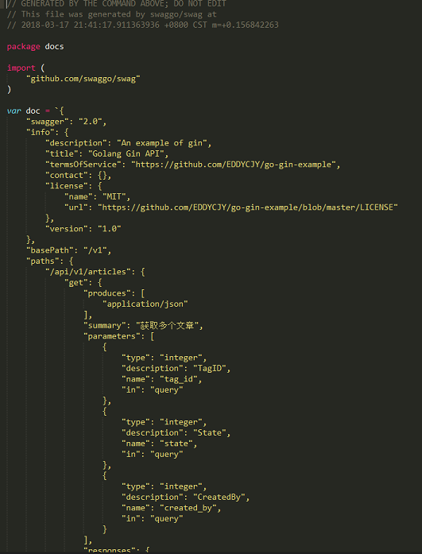
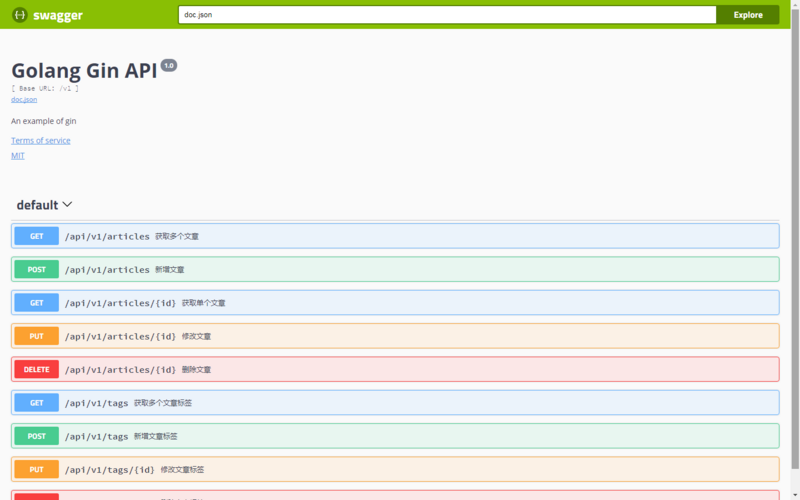

# 3.8 為它加上Swagger

專案地址：<https://github.com/EDDYCJY/go-gin-example>

## 涉及知識點

* Swagger

## 本文目標

一個好的 `API's`，必然離不開一個好的`API`文件，如果要開發純手寫 `API` 文件，不存在的（很難持續維護），因此我們要自動生成介面文件。

## 安裝 swag

```
$ go get -u github.com/swaggo/swag/cmd/swag
```

若 `$GOROOT/bin` 沒有加入`$PATH`中，你需要執行將其可執行檔案移動到`$GOBIN`下

```
mv $GOPATH/bin/swag /usr/local/go/bin
```

### 驗證是否安裝成功

檢查 $GOBIN 下是否有 swag 檔案，如下：

```
$ swag -v
swag version v1.1.1
```

## 安裝 gin-swagger

```
$ go get -u github.com/swaggo/gin-swagger

$ go get -u github.com/swaggo/gin-swagger/swaggerFiles
```

注：三個包都有一定大小，安裝需要等一會或要科學上網。

## 初始化

### 編寫API註釋

`Swagger` 中需要將相應的註釋或註解編寫到方法上，再利用生成器自動生成說明檔案

`gin-swagger` 給出的範例：

```
// @Summary Add a new pet to the store
// @Description get string by ID
// @Accept  json
// @Produce  json
// @Param   some_id     path    int     true        "Some ID"
// @Success 200 {string} string    "ok"
// @Failure 400 {object} web.APIError "We need ID!!"
// @Failure 404 {object} web.APIError "Can not find ID"
// @Router /testapi/get-string-by-int/{some_id} [get]
```

我們可以參照 `Swagger` 的註解規範和範例去編寫

```go
// @Summary 新增文章标签
// @Produce  json
// @Param name query string true "Name"
// @Param state query int false "State"
// @Param created_by query int false "CreatedBy"
// @Success 200 {string} json "{"code":200,"data":{},"msg":"ok"}"
// @Router /api/v1/tags [post]
func AddTag(c *gin.Context) {
```
```go
// @Summary 修改文章标签
// @Produce  json
// @Param id path int true "ID"
// @Param name query string true "ID"
// @Param state query int false "State"
// @Param modified_by query string true "ModifiedBy"
// @Success 200 {string} json "{"code":200,"data":{},"msg":"ok"}"
// @Router /api/v1/tags/{id} [put]
func EditTag(c *gin.Context) {
```
參考的註解請參見 [go-gin-example](https://github.com/EDDYCJY/go-gin-example)。以確保取得最新的 swag 語法

### 路由

在完成了註解的編寫後，我們需要針對 swagger 新增初始化動作和對應的路由規則，才可以使用。開啟 routers/router.go 檔案，新增內容如下：

```go
package routers

import (
    ...

    _ "github.com/EDDYCJY/go-gin-example/docs"

    ...
)

// InitRouter initialize routing information
func InitRouter() *gin.Engine {
    ...
    r.GET("/swagger/*any", ginSwagger.WrapHandler(swaggerFiles.Handler))
    ...
    apiv1 := r.Group("/api/v1")
    apiv1.Use(jwt.JWT())
    {
        ...
    }

    return r
}
```
### 生成

我們進入到`gin-blog`的專案根目錄中，執行初始化命令

```
[$ gin-blog]# swag init
2018/03/13 23:32:10 Generate swagger docs....
2018/03/13 23:32:10 Generate general API Info
2018/03/13 23:32:10 create docs.go at  docs/docs.go
```

完畢後會在專案根目錄下生成`docs`

```
docs/
├── docs.go
└── swagger
    ├── swagger.json
    └── swagger.yaml
```

我們可以檢查 `docs.go` 檔案中的 `doc` 變數，詳細記載中我們檔案中所編寫的註解和說明 

### 驗證

大功告成，訪問一下 `http://127.0.0.1:8000/swagger/index.html`， 檢視 `API` 文件生成是否正確



## 參考

### 本系列示例程式碼

* [go-gin-example](https://github.com/EDDYCJY/go-gin-example)

## 關於

### 修改記錄

* 第一版：2018年02月16日釋出文章
* 第二版：2019年10月01日修改文章

## ？

如果有任何疑問或錯誤，歡迎在 [issues](https://github.com/EDDYCJY/blog) 進行提問或給予修正意見，如果喜歡或對你有所幫助，歡迎 Star，對作者是一種鼓勵和推進。

### 我的微信公眾號


