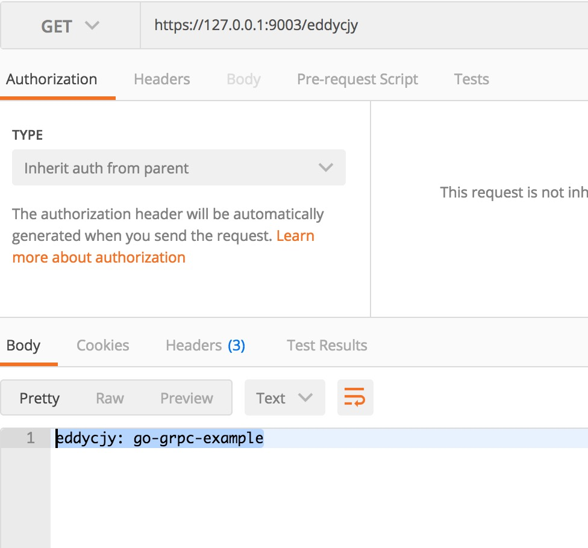

# 4.7 讓你的服務同時提供 HTTP 介面

專案地址：<https://github.com/EDDYCJY/go-grpc-example>

## 前言

* 介面需要提供給其他業務組訪問，但是 RPC 協議不同無法內調，對方問能否走 HTTP 介面，怎麼辦？
* 微信（公眾號、小程式）等第三方回撥介面只支援 HTTP 介面，怎麼辦

我相信你在實際工作中都會遇到如上問題，在 gRPC 中都是有解決方案的，本章節將會進行介紹 🤔

## 為什麼可以同時提供 HTTP 介面

關鍵一點，gRPC 的協議是基於 HTTP/2 的，因此應用程式能夠在單個 TCP 埠上提供 HTTP/1.1 和 gRPC 介面服務（兩種不同的流量）

## 怎麼同時提供 HTTP 介面

### 檢測協議

```
if r.ProtoMajor == 2 && strings.Contains(r.Header.Get("Content-Type"), "application/grpc") {
    server.ServeHTTP(w, r)
} else {
    mux.ServeHTTP(w, r)
}
```

### 流程

1. 檢測請求協議是否為 HTTP/2
2. 判斷 Content-Type 是否為 application/grpc（gRPC 的預設標識位）
3. 根據協議的不同轉發到不同的服務處理

## gRPC

### TLS

在前面的章節，為了便於展示因此沒有簡單封裝

在本節需複用程式碼，重新封裝了，可詳見：[go-grpc-example](https://github.com/EDDYCJY/go-grpc-example/tree/master/pkg/gtls)

### 目錄結構

新建 simple\_http\_client、simple\_http\_server 目錄，目錄結構如下：

```
go-grpc-example
├── client
│   ├── simple_client
│   ├── simple_http_client
│   └── stream_client
├── conf
├── pkg
│   └── gtls
├── proto
├── server
│   ├── simple_http_server
│   ├── simple_server
│   └── stream_server
```

### Server

在 simple\_http\_server 目錄下新建 server.go，寫入檔案內容：

```go
package main

import (
    "context"
    "log"
    "net/http"
    "strings"

    "github.com/EDDYCJY/go-grpc-example/pkg/gtls"
    pb "github.com/EDDYCJY/go-grpc-example/proto"

    "google.golang.org/grpc"
)

type SearchService struct{}

func (s *SearchService) Search(ctx context.Context, r *pb.SearchRequest) (*pb.SearchResponse, error) {
    return &pb.SearchResponse{Response: r.GetRequest() + " HTTP Server"}, nil
}

const PORT = "9003"

func main() {
    certFile := "../../conf/server/server.pem"
    keyFile := "../../conf/server/server.key"
    tlsServer := gtls.Server{
        CertFile: certFile,
        KeyFile:  keyFile,
    }

    c, err := tlsServer.GetTLSCredentials()
    if err != nil {
        log.Fatalf("tlsServer.GetTLSCredentials err: %v", err)
    }

    mux := GetHTTPServeMux()

    server := grpc.NewServer(grpc.Creds(c))
    pb.RegisterSearchServiceServer(server, &SearchService{})

    http.ListenAndServeTLS(":"+PORT,
        certFile,
        keyFile,
        http.HandlerFunc(func(w http.ResponseWriter, r *http.Request) {
            if r.ProtoMajor == 2 && strings.Contains(r.Header.Get("Content-Type"), "application/grpc") {
                server.ServeHTTP(w, r)
            } else {
                mux.ServeHTTP(w, r)
            }

            return
        }),
    )
}

func GetHTTPServeMux() *http.ServeMux {
    mux := http.NewServeMux()
    mux.HandleFunc("/", func(w http.ResponseWriter, r *http.Request) {
        w.Write([]byte("eddycjy: go-grpc-example"))
    })

    return mux
}
```
* http.NewServeMux：建立一個新的 ServeMux，ServeMux 本質上是一個路由表。它預設實作了 ServeHTTP，因此返回 Handler 後可直接透過 HandleFunc 註冊 pattern 和處理邏輯的方法
* http.ListenAndServeTLS：可簡單的理解為提供監聽 HTTPS 服務的方法，重點的協議判斷轉發，也在這裡面

其實，你理解後就會覺得很簡單，核心步驟：判斷 -> 轉發 -> 響應。我們改變了前兩步的預設邏輯，僅此而已

### Client

在 simple\_http\_server 目錄下新建 client.go，寫入檔案內容：

```go
package main

import (
    "context"
    "log"

    "google.golang.org/grpc"

    "github.com/EDDYCJY/go-grpc-example/pkg/gtls"
    pb "github.com/EDDYCJY/go-grpc-example/proto"
)

const PORT = "9003"

func main() {
    tlsClient := gtls.Client{
        ServerName: "go-grpc-example",
        CertFile:   "../../conf/server/server.pem",
    }
    c, err := tlsClient.GetTLSCredentials()
    if err != nil {
        log.Fatalf("tlsClient.GetTLSCredentials err: %v", err)
    }

    conn, err := grpc.Dial(":"+PORT, grpc.WithTransportCredentials(c))
    if err != nil {
        log.Fatalf("grpc.Dial err: %v", err)
    }
    defer conn.Close()

    client := pb.NewSearchServiceClient(conn)
    resp, err := client.Search(context.Background(), &pb.SearchRequest{
        Request: "gRPC",
    })
    if err != nil {
        log.Fatalf("client.Search err: %v", err)
    }

    log.Printf("resp: %s", resp.GetResponse())
}
```
## 驗證

### gRPC Client

```
$ go run client.go 
2018/10/04 14:56:56 resp: gRPC HTTP Server
```

### HTTP/1.1 訪問



## 總結

透過本章節，表面上完成了同埠提供雙服務的功能，但實際上，應該是加深了 HTTP/2 的理解和使用，這才是本質

## 拓展

如果你有一個需求，是要**同時提供** RPC 和 RESTful JSON API 兩種介面的，不要猶豫，點進去：[gRPC + gRPC Gateway 實踐](https://segmentfault.com/a/1190000013339403)

## 問題

你以為這個方案就萬能了嗎，不。Envoy Proxy 的支援就不完美，無法同時監聽一個埠的兩種流量 😤

## 參考

### 本系列示例程式碼

* [go-grpc-example](https://github.com/EDDYCJY/go-grpc-example)
