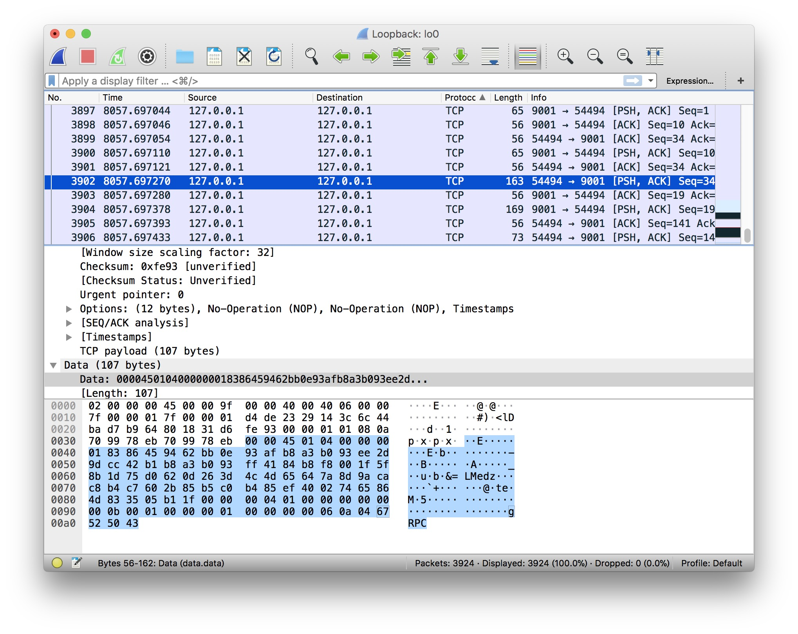
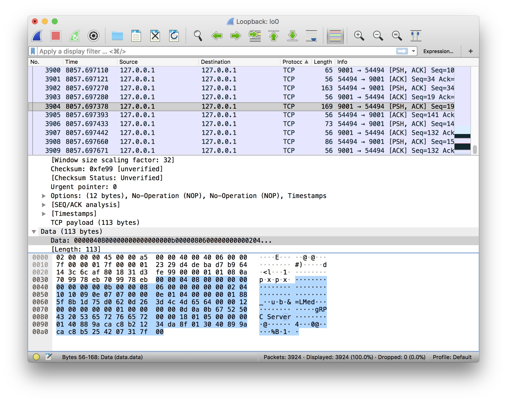
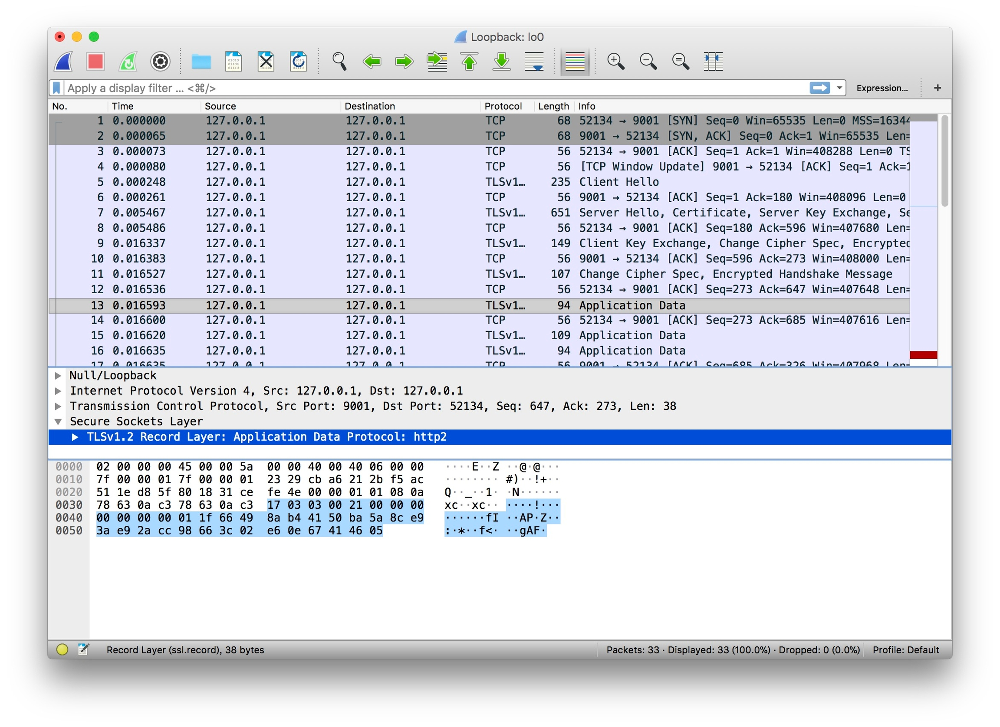

# 4.4 TLS 證書認證

專案地址：<https://github.com/EDDYCJY/go-grpc-example>

## 前言

在前面的章節裡，我們介紹了 gRPC 的四種 API 使用方式。是不是很簡單呢 😀

此時存在一個安全問題，先前的例子中 gRPC Client/Server 都是明文傳輸的，會不會有被竊聽的風險呢？

從結論上來講，是有的。在明文通訊的情況下，你的請求就是裸奔的，有可能被第三方惡意篡改或者偽造為“非法”的資料

## 抓個包





嗯，明文傳輸無誤。這是有問題的，接下將改造我們的 gRPC，以便於解決這個問題 😤

## 證書生成

### 私鑰

```
openssl ecparam -genkey -name secp384r1 -out server.key
```

### 自籤公鑰

```
openssl req -new -x509 -sha256 -key server.key -out server.pem -days 3650
```

#### 填寫資訊

```
Country Name (2 letter code) []:
State or Province Name (full name) []:
Locality Name (eg, city) []:
Organization Name (eg, company) []:
Organizational Unit Name (eg, section) []:
Common Name (eg, fully qualified host name) []:go-grpc-example
Email Address []:
```

### 生成完畢

生成證書結束後，將證書相關檔案放到 conf/ 下，目錄結構：

```
$ tree go-grpc-example 
go-grpc-example
├── client
├── conf
│   ├── server.key
│   └── server.pem
├── proto
└── server
    ├── simple_server
    └── stream_server
```

由於本文偏向 gRPC，詳解可參見 [《製作證書》](https://segmentfault.com/a/1190000013408485#articleHeader3)。後續番外可能會展開細節描述 👌

## 為什麼之前不需要證書

在 simple\_server 中，為什麼“啥事都沒幹”就能在不需要證書的情況下執行呢？

### Server

```go
grpc.NewServer()
```

在服務端顯然沒有傳入任何 DialOptions

### Client

```go
conn, err := grpc.Dial(":"+PORT, grpc.WithInsecure())
```

在客戶端留意到 `grpc.WithInsecure()` 方法

```go
func WithInsecure() DialOption {
    return newFuncDialOption(func(o *dialOptions) {
        o.insecure = true
    })
}
```
在方法內可以看到 `WithInsecure` 返回一個 `DialOption`，並且它最終會透過讀取設定的值來停用安全傳輸

那麼它“最終”又是在哪裡處理的呢，我們把視線移到 `grpc.Dial()` 方法內

```go
func DialContext(ctx context.Context, target string, opts ...DialOption) (conn *ClientConn, err error) {
    ...

    for _, opt := range opts {
        opt.apply(&cc.dopts)
    }
    ...

    if !cc.dopts.insecure {
        if cc.dopts.copts.TransportCredentials == nil {
            return nil, errNoTransportSecurity
        }
    } else {
        if cc.dopts.copts.TransportCredentials != nil {
            return nil, errCredentialsConflict
        }
        for _, cd := range cc.dopts.copts.PerRPCCredentials {
            if cd.RequireTransportSecurity() {
                return nil, errTransportCredentialsMissing
            }
        }
    }
    ...

    creds := cc.dopts.copts.TransportCredentials
    if creds != nil && creds.Info().ServerName != "" {
        cc.authority = creds.Info().ServerName
    } else if cc.dopts.insecure && cc.dopts.authority != "" {
        cc.authority = cc.dopts.authority
    } else {
        // Use endpoint from "scheme://authority/endpoint" as the default
        // authority for ClientConn.
        cc.authority = cc.parsedTarget.Endpoint
    }
    ...
}
```
## gRPC

接下來我們將正式開始編碼，在 gRPC Client/Server 上實作 TLS 證書認證的支援 🤔

### TLS Server

```go
package main

import (
    "context"
    "log"
    "net"

    "google.golang.org/grpc"
    "google.golang.org/grpc/credentials"

    pb "github.com/EDDYCJY/go-grpc-example/proto"
)

...

const PORT = "9001"

func main() {
    c, err := credentials.NewServerTLSFromFile("../../conf/server.pem", "../../conf/server.key")
    if err != nil {
        log.Fatalf("credentials.NewServerTLSFromFile err: %v", err)
    }

    server := grpc.NewServer(grpc.Creds(c))
    pb.RegisterSearchServiceServer(server, &SearchService{})

    lis, err := net.Listen("tcp", ":"+PORT)
    if err != nil {
        log.Fatalf("net.Listen err: %v", err)
    }

    server.Serve(lis)
}
```
* credentials.NewServerTLSFromFile：根據服務端輸入的證書檔案和金鑰構造 TLS 憑證

```go
func NewServerTLSFromFile(certFile, keyFile string) (TransportCredentials, error) {
    cert, err := tls.LoadX509KeyPair(certFile, keyFile)
    if err != nil {
        return nil, err
    }
    return NewTLS(&tls.Config{Certificates: []tls.Certificate{cert}}), nil
}
```
* grpc.Creds()：返回一個 ServerOption，用於設定伺服器連線的憑據。用於 `grpc.NewServer(opt ...ServerOption)` 為 gRPC Server 設定連線選項

```go
func Creds(c credentials.TransportCredentials) ServerOption {
    return func(o *options) {
        o.creds = c
    }
}
```
經過以上兩個簡單步驟，gRPC Server 就建立起需證書認證的服務啦 🤔

### TLS Client

```go
package main

import (
    "context"
    "log"

    "google.golang.org/grpc"
    "google.golang.org/grpc/credentials"

    pb "github.com/EDDYCJY/go-grpc-example/proto"
)

const PORT = "9001"

func main() {
    c, err := credentials.NewClientTLSFromFile("../../conf/server.pem", "go-grpc-example")
    if err != nil {
        log.Fatalf("credentials.NewClientTLSFromFile err: %v", err)
    }

    conn, err := grpc.Dial(":"+PORT, grpc.WithTransportCredentials(c))
    if err != nil {
        log.Fatalf("grpc.Dial err: %v", err)
    }
    defer conn.Close()

    client := pb.NewSearchServiceClient(conn)
    resp, err := client.Search(context.Background(), &pb.SearchRequest{
        Request: "gRPC",
    })
    if err != nil {
        log.Fatalf("client.Search err: %v", err)
    }

    log.Printf("resp: %s", resp.GetResponse())
}
```
* credentials.NewClientTLSFromFile()：根據客戶端輸入的證書檔案和金鑰構造 TLS 憑證。serverNameOverride 為服務名稱

```go
func NewClientTLSFromFile(certFile, serverNameOverride string) (TransportCredentials, error) {
    b, err := ioutil.ReadFile(certFile)
    if err != nil {
        return nil, err
    }
    cp := x509.NewCertPool()
    if !cp.AppendCertsFromPEM(b) {
        return nil, fmt.Errorf("credentials: failed to append certificates")
    }
    return NewTLS(&tls.Config{ServerName: serverNameOverride, RootCAs: cp}), nil
}
```
* grpc.WithTransportCredentials()：返回一個設定連線的 DialOption 選項。用於 `grpc.Dial(target string, opts ...DialOption)` 設定連線選項

```go
func WithTransportCredentials(creds credentials.TransportCredentials) DialOption {
    return newFuncDialOption(func(o *dialOptions) {
        o.copts.TransportCredentials = creds
    })
}
```
## 驗證

### 請求

重新啟動 server.go 和執行 client.go，得到響應結果

```
$ go run client.go
2018/09/30 20:00:21 resp: gRPC Server
```

### 抓個包



成功。

## 總結

在本章節我們實作了 gRPC TLS Client/Servert，你以為大功告成了嗎？我不 😤

## 問題

你仔細再看看，Client 是基於 Server 端的證書和服務名稱來建立請求的。這樣的話，你就需要將 Server 的證書透過各種手段給到 Client 端，否則是無法完成這項任務的

問題也就來了，你無法保證你的“各種手段”是安全的，畢竟現在的網路環境是很危險的，萬一被...

我們將在下一章節解決這個問題，保證其可靠性 🙂

## 參考

### 本系列示例程式碼

* [go-grpc-example](https://github.com/EDDYCJY/go-grpc-example)
