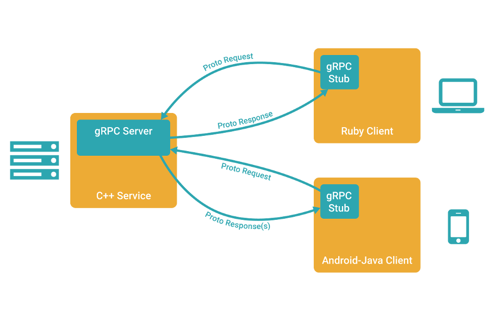

# 4.1 gRPC及相關介紹

專案地址：<https://github.com/EDDYCJY/go-grpc-example>

作為開篇章，將會介紹 gRPC 相關的一些知識。簡單來講 gRPC 是一個 基於 HTTP/2 協議設計的 RPC 框架，它採用了 Protobuf 作為 IDL

你是否有過疑惑，它們都是些什麼？本文將會介紹一些常用的知識和概念，更詳細的會給出手冊地址去深入

## 一、RPC

### 什麼是 RPC

RPC 代指遠端過程呼叫（Remote Procedure Call），它的呼叫包含了傳輸協議和編碼（物件序列號）協議等等。允許運行於一臺計算機的程式呼叫另一臺計算機的子程式，而開發人員無需額外地為這個互動作用程式設計

#### 實際場景：

有兩臺伺服器，分別是A、B。在 A 上的應用 C 想要呼叫 B 伺服器上的應用 D，它們可以直接本地呼叫嗎？\
答案是不能的，但走 RPC 的話，十分方便。因此常有人稱使用 RPC，就跟本地呼叫一個函式一樣簡單

### RPC 框架

我認為，一個完整的 RPC 框架，應包含負載均衡、服務註冊和發現、服務治理等功能，並具有可拓展性便於流量監控系統等接入\
那麼它才算完整的，當然了。有些較單一的 RPC 框架，透過組合多元件也能達到這個標準

你認為呢？

### 常見 RPC 框架

* [gRPC](https://grpc.io/)
* [Thrift](https://github.com/apache/thrift)
* [Rpcx](https://github.com/smallnest/rpcx)
* [Dubbo](https://github.com/apache/incubator-dubbo)

### 比較一下

| \\     | 跨語言 | 多 IDL | 服務治理 | 註冊中心 | 服務管理 |
| ------ | --- | ----- | ---- | ---- | ---- |
| gRPC   | √   | ×     | ×    | ×    | ×    |
| Thrift | √   | ×     | ×    | ×    | ×    |
| Rpcx   | ×   | √     | √    | √    | √    |
| Dubbo  | ×   | √     | √    | √    | √    |

### 為什麼要 RPC

簡單、通用、安全、效率

### RPC 可以基於 HTTP 嗎

RPC 是代指遠端過程呼叫，是可以基於 HTTP 協議的

肯定會有人說效率優勢，我可以告訴你，那是基於 HTTP/1.1 來講的，HTTP/2 優化了許多問題（當然也存在新的問題），所以你看到了本文的主題 gRPC

## 二、Protobuf

### 介紹

Protocol Buffers 是一種與語言、平臺無關，可擴充套件的序列化結構化資料的方法，常用於通訊協議，資料儲存等等。相較於 JSON、XML，它更小、更快、更簡單，因此也更受開發人員的青眯

### 語法

```
syntax = "proto3";

service SearchService {
    rpc Search (SearchRequest) returns (SearchResponse);
}

message SearchRequest {
  string query = 1;
  int32 page_number = 2;
  int32 result_per_page = 3;
}

message SearchResponse {
    ...
}
```

1、第一行（非空的非註釋行）宣告使用 `proto3` 語法。如果不宣告，將預設使用 `proto2` 語法。同時我建議用 v2 還是 v3，都應當宣告其使用的版本

2、定義 `SearchService` RPC 服務，其包含 RPC 方法 `Search`，入參為 `SearchRequest` 訊息，出參為 `SearchResponse` 訊息

3、定義 `SearchRequest`、`SearchResponse` 訊息，前者定義了三個欄位，每一個欄位包含三個屬性：型別、欄位名稱、欄位編號

4、Protobuf 編譯器會根據選擇的語言不同，生成相應語言的 Service Interface Code 和 Stubs

最後，這裡只是簡單的語法介紹，詳細的請右拐 [ Language Guide (proto3)](https://developers.google.com/protocol-buffers/docs/proto3)

### 資料型別

| .proto Type | C++ Type | Java Type  | Go Type | PHP Type       |
| ----------- | -------- | ---------- | ------- | -------------- |
| double      | double   | double     | float64 | float          |
| float       | float    | float      | float32 | float          |
| int32       | int32    | int        | int32   | integer        |
| int64       | int64    | long       | int64   | integer/string |
| uint32      | uint32   | int        | uint32  | integer        |
| uint64      | uint64   | long       | uint64  | integer/string |
| sint32      | int32    | int        | int32   | integer        |
| sint64      | int64    | long       | int64   | integer/string |
| fixed32     | uint32   | int        | uint32  | integer        |
| fixed64     | uint64   | long       | uint64  | integer/string |
| sfixed32    | int32    | int        | int32   | integer        |
| sfixed64    | int64    | long       | int64   | integer/string |
| bool        | bool     | boolean    | bool    | boolean        |
| string      | string   | String     | string  | string         |
| bytes       | string   | ByteString | \[]byte | string         |

### v2 和 v3 主要區別

* 刪除原始值欄位的欄位存在邏輯
* 刪除 required 欄位
* 刪除 optional 欄位，預設就是
* 刪除 default 欄位
* 刪除擴充套件特性，新增 Any 型別來替代它
* 刪除 unknown 欄位的支援
* 新增 [JSON Mapping](https://developers.google.com/protocol-buffers/docs/proto3#json)
* 新增 Map 型別的支援
* 修復 enum 的 unknown 型別
* repeated 預設使用 packed 編碼
* 引入了新的語言實作（C＃，JavaScript，Ruby，Objective-C）

以上是日常涉及的常見功能，如果還想詳細瞭解可閱讀 [Protobuf Version 3.0.0](https://github.com/protocolbuffers/protobuf/releases?after=v3.2.1)

### 相較 Protobuf，為什麼不使用XML？

* 更簡單
* 資料描述檔案只需原來的1/10至1/3
* 解析速度是原來的20倍至100倍
* 減少了二義性
* 生成了更易使用的資料訪問類

## 三、gRPC

### 介紹

gRPC 是一個高效能、開源和通用的 RPC 框架，面向移動和 HTTP/2 設計

#### 多語言

* C++
* C#
* Dart
* Go
* Java
* Node.js
* Objective-C
* PHP
* Python
* Ruby

#### 特點

1、HTTP/2

2、Protobuf

3、客戶端、服務端基於同一份 IDL

4、行動網路的良好支援

5、支援多語言

### 概覽



### 講解

1、客戶端（gRPC Sub）呼叫 A 方法，發起 RPC 呼叫

2、對請求資訊使用 Protobuf 進行物件序列化壓縮（IDL）

3、服務端（gRPC Server）接收到請求後，解碼請求體，進行業務邏輯處理並返回

4、對響應結果使用 Protobuf 進行物件序列化壓縮（IDL）

5、客戶端接受到服務端響應，解碼請求體。回撥被呼叫的 A 方法，喚醒正在等待響應（阻塞）的客戶端呼叫並返回響應結果

### 示例

在這一小節，將簡單的給大家展示 gRPC 的客戶端和服務端的示例程式碼，希望大家先有一個基礎的印象，將會在下一章節詳細介紹 🤔

#### 構建和啟動服務端

```go
lis, err := net.Listen("tcp", fmt.Sprintf(":%d", *port))
if err != nil {
        log.Fatalf("failed to listen: %v", err)
}

grpcServer := grpc.NewServer()
...
pb.RegisterSearchServer(grpcServer, &SearchServer{})
grpcServer.Serve(lis)
```
1、監聽指定 TCP 埠，用於接受客戶端請求

2、建立 gRPC Server 的例項物件

3、gRPC Server 內部服務和路由的註冊

4、Serve() 呼叫伺服器以執行阻塞等待，直到程序被終止或被 Stop() 呼叫

#### 建立客戶端

```go
var opts []grpc.DialOption
...
conn, err := grpc.Dial(*serverAddr, opts...)
if err != nil {
    log.Fatalf("fail to dial: %v", err)
}

defer conn.Close()
client := pb.NewSearchClient(conn)
...
```
1、建立 gRPC Channel 與 gRPC Server 進行通訊（需伺服器地址和埠作為引數）

2、設定 DialOptions 憑證（例如，TLS，GCE憑據，JWT憑證）

3、建立 Search Client Stub

4、呼叫對應的服務方法

## 思考題

1、什麼場景下不適合使用 Protobuf，而適合使用 JSON、XML？

2、Protobuf 一節中提到的 packed 編碼，是什麼？

## 總結

在開篇內容中，我利用了儘量簡短的描述給你介紹了接下來所必須、必要的知識點 希望你能夠有所收穫，建議能到我給的參考資料處進行深入學習，是最好的了

## 參考資料

* [Protocol Buffers](https://developers.google.com/protocol-buffers/docs/proto3)
* [gRPC](https://grpc.io/docs/)
