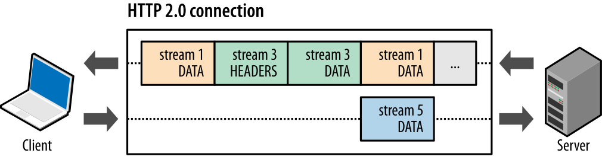
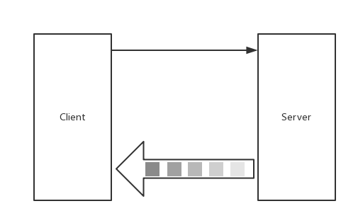

# 4.3 gRPC Streaming, Client and Server

專案地址：<https://github.com/EDDYCJY/go-grpc-example>

## 前言

本章節將介紹 gRPC 的流式，分為三種類型：

* Server-side streaming RPC：伺服器端流式 RPC
* Client-side streaming RPC：客戶端流式 RPC
* Bidirectional streaming RPC：雙向流式 RPC

## 流

任何技術，因為有痛點，所以才有了存在的必要性。如果您想要了解 gRPC 的流式呼叫，請繼續

### 圖



gRPC Streaming 是基於 HTTP/2 的，後續章節再進行詳細講解

### 為什麼不用 Simple RPC

流式為什麼要存在呢，是 Simple RPC 有什麼問題嗎？透過模擬業務場景，可得知在使用 Simple RPC 時，有如下問題：

* 資料包過大造成的瞬時壓力
* 接收資料包時，需要所有資料包都接受成功且正確後，才能夠回撥響應，進行業務處理（無法客戶端邊傳送，服務端邊處理）

### 為什麼用 Streaming RPC

* 大規模資料包
* 實時場景

#### 模擬場景

每天早上 6 點，都有一批百萬級別的資料集要同從 A 同步到 B，在同步的時候，會做一系列操作（歸檔、資料分析、畫像、日誌等）。這一次性涉及的資料量確實大

在同步完成後，也有人馬上會去查閱資料，為了新的一天籌備。也符合實時性。

兩者相較下，這個場景下更適合使用 Streaming RPC

## gRPC

在講解具體的 gRPC 流式程式碼時，會**著重在第一節講解**，因為三種模式其實是不同的組合。希望你能夠注重理解，舉一反三，其實都是一樣的知識點 👍

### 目錄結構

```
$ tree go-grpc-example 
go-grpc-example
├── client
│   ├── simple_client
│   │   └── client.go
│   └── stream_client
│       └── client.go
├── proto
│   ├── search.proto
│   └── stream.proto
└── server
    ├── simple_server
    │   └── server.go
    └── stream_server
        └── server.go
```

增加 stream\_server、stream\_client 存放服務端和客戶端檔案，proto/stream.proto 用於編寫 IDL

### IDL

在 proto 資料夾下的 stream.proto 檔案中，寫入如下內容：

```go
syntax = "proto3";

package proto;

service StreamService {
    rpc List(StreamRequest) returns (stream StreamResponse) {};

    rpc Record(stream StreamRequest) returns (StreamResponse) {};

    rpc Route(stream StreamRequest) returns (stream StreamResponse) {};
}


message StreamPoint {
  string name = 1;
  int32 value = 2;
}

message StreamRequest {
  StreamPoint pt = 1;
}

message StreamResponse {
  StreamPoint pt = 1;
}
```
注意關鍵字 stream，宣告其為一個流方法。這裡共涉及三個方法，對應關係為

* List：伺服器端流式 RPC
* Record：客戶端流式 RPC
* Route：雙向流式 RPC

### 基礎模板 + 空定義

#### Server

```go
package main

import (
    "log"
    "net"

    "google.golang.org/grpc"

    pb "github.com/EDDYCJY/go-grpc-example/proto"

)

type StreamService struct{}

const (
    PORT = "9002"
)

func main() {
    server := grpc.NewServer()
    pb.RegisterStreamServiceServer(server, &StreamService{})

    lis, err := net.Listen("tcp", ":"+PORT)
    if err != nil {
        log.Fatalf("net.Listen err: %v", err)
    }

    server.Serve(lis)
}

func (s *StreamService) List(r *pb.StreamRequest, stream pb.StreamService_ListServer) error {
    return nil
}

func (s *StreamService) Record(stream pb.StreamService_RecordServer) error {
    return nil
}

func (s *StreamService) Route(stream pb.StreamService_RouteServer) error {
    return nil
}
```
寫程式碼前，建議先將 gRPC Server 的基礎模板和介面給空定義出來。若有不清楚可參見上一章節的知識點

#### Client

```go
package main

import (
    "log"

    "google.golang.org/grpc"

    pb "github.com/EDDYCJY/go-grpc-example/proto"
)

const (
    PORT = "9002"
)

func main() {
    conn, err := grpc.Dial(":"+PORT, grpc.WithInsecure())
    if err != nil {
        log.Fatalf("grpc.Dial err: %v", err)
    }

    defer conn.Close()

    client := pb.NewStreamServiceClient(conn)

    err = printLists(client, &pb.StreamRequest{Pt: &pb.StreamPoint{Name: "gRPC Stream Client: List", Value: 2018}})
    if err != nil {
        log.Fatalf("printLists.err: %v", err)
    }

    err = printRecord(client, &pb.StreamRequest{Pt: &pb.StreamPoint{Name: "gRPC Stream Client: Record", Value: 2018}})
    if err != nil {
        log.Fatalf("printRecord.err: %v", err)
    }

    err = printRoute(client, &pb.StreamRequest{Pt: &pb.StreamPoint{Name: "gRPC Stream Client: Route", Value: 2018}})
    if err != nil {
        log.Fatalf("printRoute.err: %v", err)
    }
}

func printLists(client pb.StreamServiceClient, r *pb.StreamRequest) error {
    return nil
}

func printRecord(client pb.StreamServiceClient, r *pb.StreamRequest) error {
    return nil
}

func printRoute(client pb.StreamServiceClient, r *pb.StreamRequest) error {
    return nil
}
```
### 一、Server-side streaming RPC：伺服器端流式 RPC

伺服器端流式 RPC，顯然是單向流，並代指 Server 為 Stream 而 Client 為普通 RPC 請求

簡單來講就是客戶端發起一次普通的 RPC 請求，服務端透過流式響應多次傳送資料集，客戶端 Recv 接收資料集。大致如圖：



#### Server

```go
func (s *StreamService) List(r *pb.StreamRequest, stream pb.StreamService_ListServer) error {
    for n := 0; n <= 6; n++ {
        err := stream.Send(&pb.StreamResponse{
            Pt: &pb.StreamPoint{
                Name:  r.Pt.Name,
                Value: r.Pt.Value + int32(n),
            },
        })
        if err != nil {
            return err
        }
    }

    return nil
}
```
在 Server，主要留意 `stream.Send` 方法。它看上去能傳送 N 次？有沒有大小限制？

```go
type StreamService_ListServer interface {
    Send(*StreamResponse) error
    grpc.ServerStream
}

func (x *streamServiceListServer) Send(m *StreamResponse) error {
    return x.ServerStream.SendMsg(m)
}
```
透過閱讀原始碼，可得知是 protoc 在生成時，根據定義生成了各式各樣符合標準的介面方法。最終再統一排程內部的 `SendMsg` 方法，該方法涉及以下過程:

* 訊息體（物件）序列化
* 壓縮序列化後的訊息體
* 對正在傳輸的訊息體增加 5 個位元組的 header
* 判斷壓縮+序列化後的訊息體總位元組長度是否大於預設的 maxSendMessageSize（預設值為 `math.MaxInt32`），若超出則提示錯誤
* 寫入給流的資料集

#### Client

```go
func printLists(client pb.StreamServiceClient, r *pb.StreamRequest) error {
    stream, err := client.List(context.Background(), r)
    if err != nil {
        return err
    }

    for {
        resp, err := stream.Recv()
        if err == io.EOF {
            break
        }
        if err != nil {
            return err
        }

        log.Printf("resp: pj.name: %s, pt.value: %d", resp.Pt.Name, resp.Pt.Value)
    }

    return nil
}
```
在 Client，主要留意 `stream.Recv()` 方法。什麼情況下 `io.EOF` ？什麼情況下存在錯誤資訊呢?

```go
type StreamService_ListClient interface {
    Recv() (*StreamResponse, error)
    grpc.ClientStream
}

func (x *streamServiceListClient) Recv() (*StreamResponse, error) {
    m := new(StreamResponse)
    if err := x.ClientStream.RecvMsg(m); err != nil {
        return nil, err
    }
    return m, nil
}
```
RecvMsg 會從流中讀取完整的 gRPC 訊息體，另外透過閱讀原始碼可得知：

（1）RecvMsg 是阻塞等待的

（2）RecvMsg 當流成功/結束（呼叫了 Close）時，會返回 `io.EOF`

（3）RecvMsg 當流出現任何錯誤時，流會被中止，錯誤資訊會包含 RPC 錯誤碼。而在 RecvMsg 中可能出現如下錯誤：

* io.EOF
* io.ErrUnexpectedEOF
* transport.ConnectionError
* google.golang.org/grpc/codes

同時需要注意，預設的 MaxReceiveMessageSize 值為 1024 *1024* 4，建議不要超出

#### 驗證

執行 stream\_server/server.go：

```
$ go run server.go
```

執行 stream\_client/client.go：

```
$ go run client.go 
2018/09/24 16:18:25 resp: pj.name: gRPC Stream Client: List, pt.value: 2018
2018/09/24 16:18:25 resp: pj.name: gRPC Stream Client: List, pt.value: 2019
2018/09/24 16:18:25 resp: pj.name: gRPC Stream Client: List, pt.value: 2020
2018/09/24 16:18:25 resp: pj.name: gRPC Stream Client: List, pt.value: 2021
2018/09/24 16:18:25 resp: pj.name: gRPC Stream Client: List, pt.value: 2022
2018/09/24 16:18:25 resp: pj.name: gRPC Stream Client: List, pt.value: 2023
2018/09/24 16:18:25 resp: pj.name: gRPC Stream Client: List, pt.value: 2024
```

### 二、Client-side streaming RPC：客戶端流式 RPC

客戶端流式 RPC，單向流，客戶端透過流式發起**多次** RPC 請求給服務端，服務端發起**一次**響應給客戶端，大致如圖：


#### Server

```go
func (s *StreamService) Record(stream pb.StreamService_RecordServer) error {
    for {
        r, err := stream.Recv()
        if err == io.EOF {
            return stream.SendAndClose(&pb.StreamResponse{Pt: &pb.StreamPoint{Name: "gRPC Stream Server: Record", Value: 1}})
        }
        if err != nil {
            return err
        }

        log.Printf("stream.Recv pt.name: %s, pt.value: %d", r.Pt.Name, r.Pt.Value)
    }

    return nil
}
```
多了一個從未見過的方法 `stream.SendAndClose`，它是做什麼用的呢？

在這段程式中，我們對每一個 Recv 都進行了處理，當發現 `io.EOF` (流關閉) 後，需要將最終的響應結果傳送給客戶端，同時關閉正在另外一側等待的 Recv

#### Client

```go
func printRecord(client pb.StreamServiceClient, r *pb.StreamRequest) error {
    stream, err := client.Record(context.Background())
    if err != nil {
        return err
    }

    for n := 0; n < 6; n++ {
        err := stream.Send(r)
        if err != nil {
            return err
        }
    }

    resp, err := stream.CloseAndRecv()
    if err != nil {
        return err
    }

    log.Printf("resp: pj.name: %s, pt.value: %d", resp.Pt.Name, resp.Pt.Value)

    return nil
}
```
`stream.CloseAndRecv` 和 `stream.SendAndClose` 是配套使用的流方法，相信聰明的你已經秒懂它的作用了

#### 驗證

重啟 stream\_server/server.go，再次執行 stream\_client/client.go：

**stream\_client：**

```
$ go run client.go
2018/09/24 16:23:03 resp: pj.name: gRPC Stream Server: Record, pt.value: 1
```

**stream\_server：**

```
$ go run server.go
2018/09/24 16:23:03 stream.Recv pt.name: gRPC Stream Client: Record, pt.value: 2018
2018/09/24 16:23:03 stream.Recv pt.name: gRPC Stream Client: Record, pt.value: 2018
2018/09/24 16:23:03 stream.Recv pt.name: gRPC Stream Client: Record, pt.value: 2018
2018/09/24 16:23:03 stream.Recv pt.name: gRPC Stream Client: Record, pt.value: 2018
2018/09/24 16:23:03 stream.Recv pt.name: gRPC Stream Client: Record, pt.value: 2018
2018/09/24 16:23:03 stream.Recv pt.name: gRPC Stream Client: Record, pt.value: 2018
```

### 三、Bidirectional streaming RPC：雙向流式 RPC

雙向流式 RPC，顧名思義是雙向流。由客戶端以流式的方式發起請求，服務端同樣以流式的方式響應請求

首個請求一定是 Client 發起，但具體互動方式（誰先誰後、一次發多少、響應多少、什麼時候關閉）根據程式編寫的方式來確定（可以結合協程）

假設該雙向流是**按順序傳送**的話，大致如圖：


還是要強調，雙向流變化很大，因程式編寫的不同而不同。**雙向流圖示無法適用不同的場景**

#### Server

```go
func (s *StreamService) Route(stream pb.StreamService_RouteServer) error {
    n := 0
    for {
        err := stream.Send(&pb.StreamResponse{
            Pt: &pb.StreamPoint{
                Name:  "gPRC Stream Client: Route",
                Value: int32(n),
            },
        })
        if err != nil {
            return err
        }

        r, err := stream.Recv()
        if err == io.EOF {
            return nil
        }
        if err != nil {
            return err
        }

        n++

        log.Printf("stream.Recv pt.name: %s, pt.value: %d", r.Pt.Name, r.Pt.Value)
    }

    return nil
}
```
#### Client

```go
func printRoute(client pb.StreamServiceClient, r *pb.StreamRequest) error {
    stream, err := client.Route(context.Background())
    if err != nil {
        return err
    }

    for n := 0; n <= 6; n++ {
        err = stream.Send(r)
        if err != nil {
            return err
        }

        resp, err := stream.Recv()
        if err == io.EOF {
            break
        }
        if err != nil {
            return err
        }

        log.Printf("resp: pj.name: %s, pt.value: %d", resp.Pt.Name, resp.Pt.Value)
    }

    stream.CloseSend()

    return nil
}
```
#### 驗證

重啟 stream\_server/server.go，再次執行 stream\_client/client.go：

**stream\_server**

```
$ go run server.go
2018/09/24 16:29:43 stream.Recv pt.name: gRPC Stream Client: Route, pt.value: 2018
2018/09/24 16:29:43 stream.Recv pt.name: gRPC Stream Client: Route, pt.value: 2018
2018/09/24 16:29:43 stream.Recv pt.name: gRPC Stream Client: Route, pt.value: 2018
2018/09/24 16:29:43 stream.Recv pt.name: gRPC Stream Client: Route, pt.value: 2018
2018/09/24 16:29:43 stream.Recv pt.name: gRPC Stream Client: Route, pt.value: 2018
2018/09/24 16:29:43 stream.Recv pt.name: gRPC Stream Client: Route, pt.value: 2018
```

**stream\_client**

```
$ go run client.go
2018/09/24 16:29:43 resp: pj.name: gPRC Stream Client: Route, pt.value: 0
2018/09/24 16:29:43 resp: pj.name: gPRC Stream Client: Route, pt.value: 1
2018/09/24 16:29:43 resp: pj.name: gPRC Stream Client: Route, pt.value: 2
2018/09/24 16:29:43 resp: pj.name: gPRC Stream Client: Route, pt.value: 3
2018/09/24 16:29:43 resp: pj.name: gPRC Stream Client: Route, pt.value: 4
2018/09/24 16:29:43 resp: pj.name: gPRC Stream Client: Route, pt.value: 5
2018/09/24 16:29:43 resp: pj.name: gPRC Stream Client: Route, pt.value: 6
```

## 總結

在本文共介紹了三類流的互動方式，可以根據實際的業務場景去選擇合適的方式。會事半功倍哦 🎑

## 參考

### 本系列示例程式碼

* [go-grpc-example](https://github.com/EDDYCJY/go-grpc-example)
