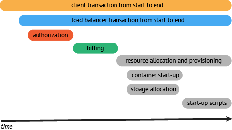
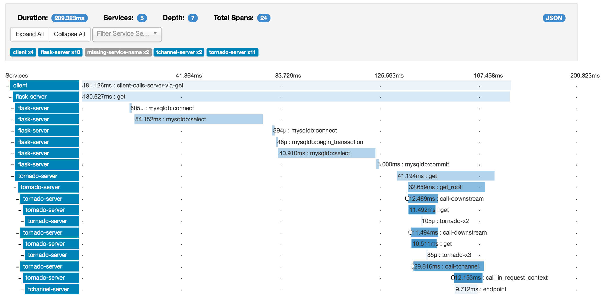
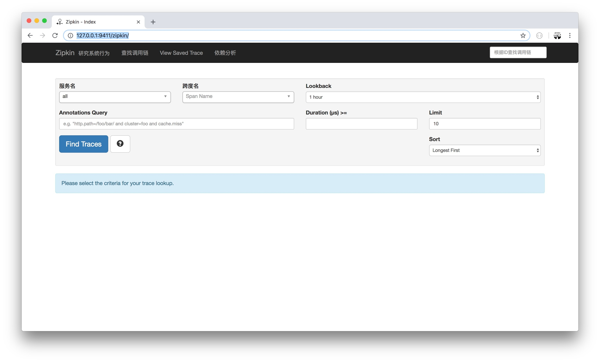
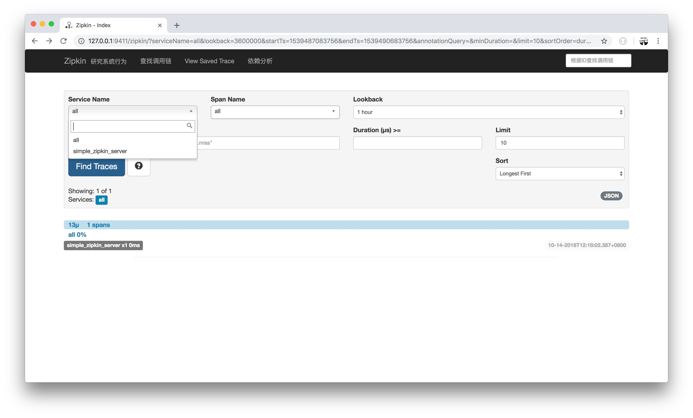
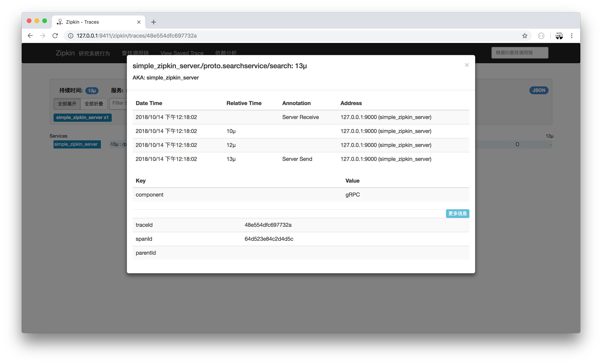
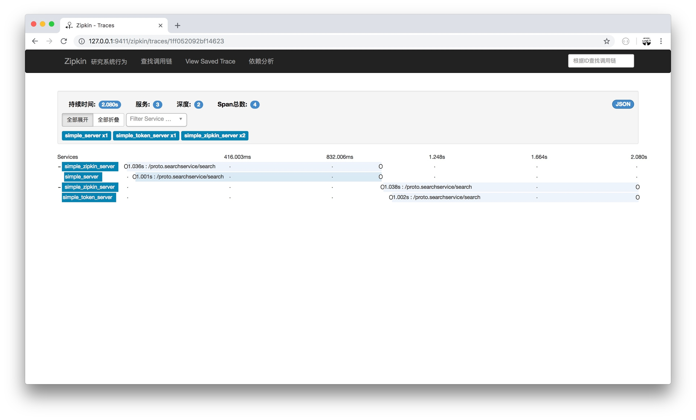
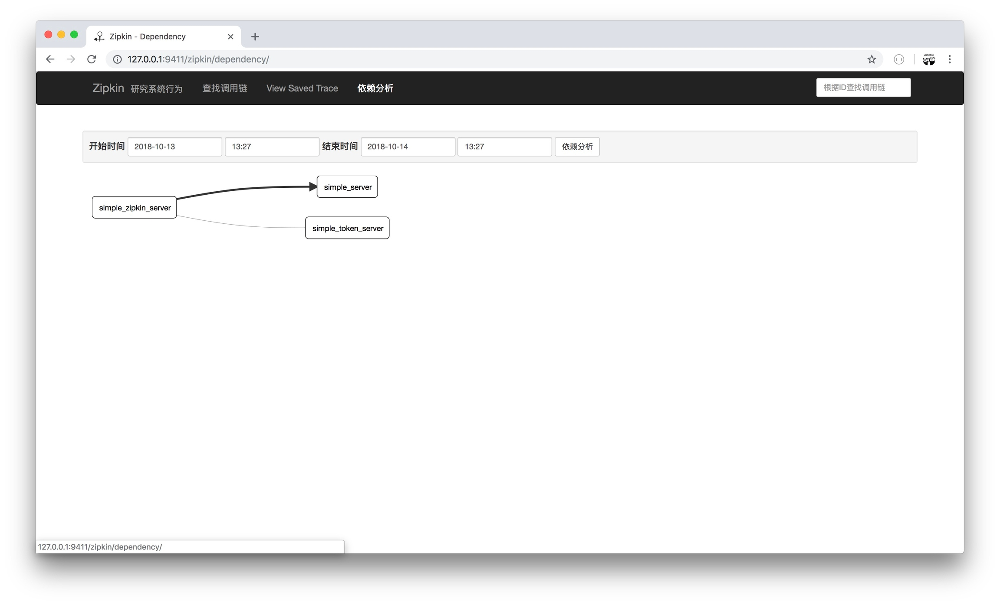

# 4.10 分散式鏈路追蹤

在實際應用中，你做了那麼多 Server 端，寫了 N 個 RPC 方法。想看看方法的指標，卻無處下手？

本文將透過 gRPC + Opentracing + Zipkin 搭建一個**分散式鏈路追蹤系統**來實作檢視整個系統的鏈路、效能等指標。

## Opentracing

### 是什麼

OpenTracing 透過提供平臺無關、廠商無關的API，使得開發人員能夠方便的新增（或更換）追蹤系統的實作

不過 OpenTracing 並不是標準。因為 CNCF 不是官方標準機構，但是它的目標是致力為分散式追蹤建立更標準的 API 和工具

### 名詞解釋

#### Trace

一個 trace 代表了一個事務或者流程在（分散式）系統中的執行過程

#### Span

一個 span 代表在分散式系統中完成的單個工作單元。也包含其他 span 的 “引用”，這允許將多個 spans 組合成一個完整的 Trace

每個 span 根據 OpenTracing 規範封裝以下內容：

* 操作名稱
* 開始時間和結束時間
* key:value span Tags
* key:value span Logs
* SpanContext

#### Tags

Span tags（跨度標籤）可以理解為使用者自定義的 Span 註釋。便於查詢、過濾和理解跟蹤資料

#### Logs

Span logs（跨度日誌）可以記錄 Span 內特定時間或事件的日誌資訊。主要用於捕獲特定 Span 的日誌資訊以及應用程式本身的其他除錯或資訊輸出

#### SpanContext

SpanContext 代表跨越程序邊界，傳遞到子級 Span 的狀態。常在追蹤示意圖中建立上下文時使用

#### Baggage Items

Baggage Items 可以理解為 trace 全域性執行中額外傳輸的資料集合

### 一個案例



圖中可以看到以下內容：

* 執行時間的上下文
* 服務間的層次關係
* 服務間序列或並行呼叫鏈

結合以上資訊，在實際場景中我們可以透過整個系統的呼叫鏈的上下文、效能等指標資訊，一下子就能夠發現系統的痛點在哪兒

## Zipkin



### 是什麼

Zipkin 是分散式追蹤系統。它的作用是收集解決微服務架構中的延遲問題所需的時序資料。它管理這些資料的收集和查詢

Zipkin 的設計基於 [Google Dapper](http://research.google.com/pubs/pub36356.html) 論文。

### 執行

```
docker run -d -p 9411:9411 openzipkin/zipkin
```

其他方法安裝參見：<https://github.com/openzipkin/zipkin>

### 驗證

訪問 <http://127.0.0.1:9411/zipkin/> 檢查 Zipkin 是否執行正常



## gRPC + Opentracing + Zipkin

在前面的小節中，我們做了以下準備工作：

* 瞭解 Opentracing 是什麼
* 搭建 Zipkin 提供分散式追蹤系統的功能

接下來實作 gRPC 透過 Opentracing 標準 API 對接 Zipkin，再透過 Zipkin 去檢視資料

### 目錄結構

新建 simple\_zipkin\_client、simple\_zipkin\_server 目錄，目錄結構如下：

```
go-grpc-example
├── LICENSE
├── README.md
├── client
│   ├── ...
│   ├── simple_zipkin_client
├── conf
├── pkg
├── proto
├── server
│   ├── ...
│   ├── simple_zipkin_server
└── vendor
```

### 安裝

```
$ go get -u github.com/openzipkin/zipkin-go-opentracing
$ go get -u github.com/grpc-ecosystem/grpc-opentracing/go/otgrpc
```

### gRPC

#### Server

```go
package main

import (
    "context"
    "log"
    "net"

    "github.com/grpc-ecosystem/go-grpc-middleware"
    "github.com/grpc-ecosystem/grpc-opentracing/go/otgrpc"
    zipkin "github.com/openzipkin/zipkin-go-opentracing"
    "google.golang.org/grpc"

    "github.com/EDDYCJY/go-grpc-example/pkg/gtls"
    pb "github.com/EDDYCJY/go-grpc-example/proto"
)

type SearchService struct{}

func (s *SearchService) Search(ctx context.Context, r *pb.SearchRequest) (*pb.SearchResponse, error) {
    return &pb.SearchResponse{Response: r.GetRequest() + " Server"}, nil
}

const (
    PORT = "9005"

    SERVICE_NAME              = "simple_zipkin_server"
    ZIPKIN_HTTP_ENDPOINT      = "http://127.0.0.1:9411/api/v1/spans"
    ZIPKIN_RECORDER_HOST_PORT = "127.0.0.1:9000"
)

func main() {
    collector, err := zipkin.NewHTTPCollector(ZIPKIN_HTTP_ENDPOINT)
    if err != nil {
        log.Fatalf("zipkin.NewHTTPCollector err: %v", err)
    }

    recorder := zipkin.NewRecorder(collector, true, ZIPKIN_RECORDER_HOST_PORT, SERVICE_NAME)

    tracer, err := zipkin.NewTracer(
        recorder, zipkin.ClientServerSameSpan(false),
    )
    if err != nil {
        log.Fatalf("zipkin.NewTracer err: %v", err)
    }

    tlsServer := gtls.Server{
        CaFile:   "../../conf/ca.pem",
        CertFile: "../../conf/server/server.pem",
        KeyFile:  "../../conf/server/server.key",
    }
    c, err := tlsServer.GetCredentialsByCA()
    if err != nil {
        log.Fatalf("GetTLSCredentialsByCA err: %v", err)
    }

    opts := []grpc.ServerOption{
        grpc.Creds(c),
        grpc_middleware.WithUnaryServerChain(
            otgrpc.OpenTracingServerInterceptor(tracer, otgrpc.LogPayloads()),
        ),
    }
    ...
}
```
* zipkin.NewHTTPCollector：建立一個 Zipkin HTTP 後端收集器 &#x20;
* zipkin.NewRecorder：建立一個基於 Zipkin 收集器的記錄器
* zipkin.NewTracer：建立一個 OpenTracing 跟蹤器（相容 Zipkin Tracer）
* otgrpc.OpenTracingClientInterceptor：返回 grpc.UnaryServerInterceptor，不同點在於該攔截器會在 gRPC Metadata 中查詢 OpenTracing SpanContext。如果找到則為該服務的 Span Context 的子節點&#x20;
* otgrpc.LogPayloads：設定並返回 Option。作用是讓 OpenTracing 在雙向方向上記錄應用程式的有效載荷（payload）

總的來講，就是初始化 Zipkin，其又包含收集器、記錄器、跟蹤器。再利用攔截器在 Server 端實作 SpanContext、Payload 的雙向讀取和管理

#### Client

```go
func main() {
    // the same as zipkin server
    // ...
    conn, err := grpc.Dial(":"+PORT, grpc.WithTransportCredentials(c),
        grpc.WithUnaryInterceptor(
            otgrpc.OpenTracingClientInterceptor(tracer, otgrpc.LogPayloads()),
        ))
    ...
}
```
* otgrpc.OpenTracingClientInterceptor：返回 grpc.UnaryClientInterceptor。該攔截器的核心功能在於：

（1）OpenTracing SpanContext 注入 gRPC Metadata

（2）檢視 context.Context 中的上下文關係，若存在父級 Span 則建立一個 ChildOf 引用，得到一個子 Span

其他方面，與 Server 端是一致的，先初始化 Zipkin，再增加 Client 端特需的攔截器。就可以完成基礎工作啦

### 驗證

啟動 Server.go，執行 Client.go。檢視 <http://127.0.0.1:9411/zipkin/> 的示意圖：





## 複雜點





來，自己實踐一下

## 總結

在多服務下的架構下，序列、並行、服務套服務是一個非常常見的情況，用常規的方案往往很難發現問題在哪裡（成本太大）。而這種情況就是**分散式追蹤系統**大展拳腳的機會了

希望你透過本章節的介紹和學習，能夠了解其概念和搭建且應用一個追蹤系統。

## 參考

### 本系列示例程式碼

* [go-grpc-example](https://github.com/EDDYCJY/go-grpc-example)

### 資料

* [opentracing](https://opentracing.io/)
* [zipkin](https://zipkin.io)
