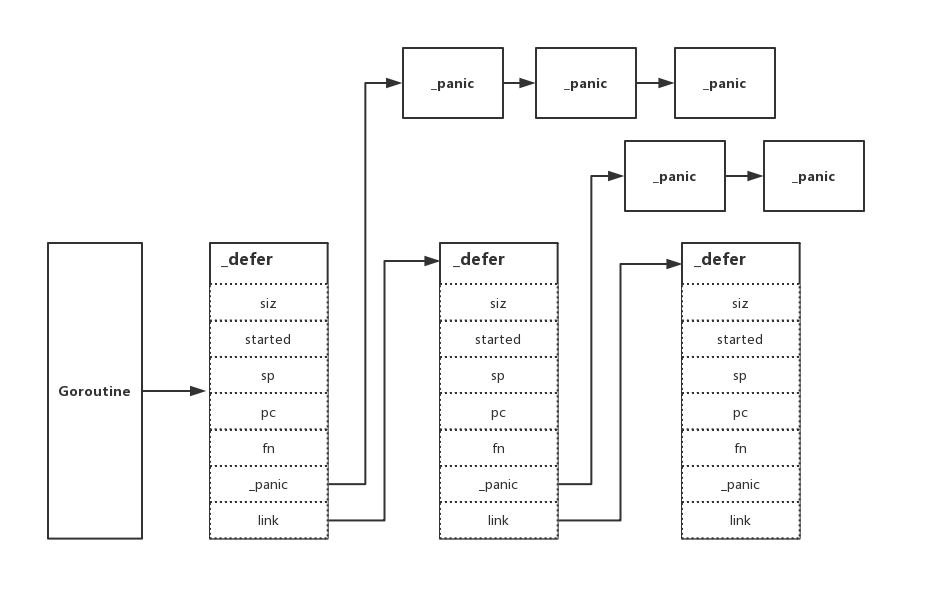

# 6.2 defer

在上一章節 [《深入理解 Go panic and recover》](https://book.eddycjy.com/golang/panic/panic-and-recover.html) 中，我們發現了 `defer` 與其關聯性極大，還是覺得非常有必要深入一下。希望透過本章節大家可以對 `defer` 關鍵字有一個深刻的理解，那麼我們開始吧。你先等等，請排好隊，我們這兒採取後進先出 LIFO 的出站方式...

## 特性

我們簡單的過一下 `defer` 關鍵字的基礎使用，讓大家先有一個基礎的認知

### 一、延遲呼叫

```go
func main() {
    defer log.Println("EDDYCJY.")

    log.Println("end.")
}
```
輸出結果：

```
$ go run main.go            
2019/05/19 21:15:02 end.
2019/05/19 21:15:02 EDDYCJY.
```

### 二、後進先出

```go
func main() {
    for i := 0; i < 6; i++ {
        defer log.Println("EDDYCJY" + strconv.Itoa(i) + ".")
    }


    log.Println("end.")
}
```
輸出結果：

```
$ go run main.go
2019/05/19 21:19:17 end.
2019/05/19 21:19:17 EDDYCJY5.
2019/05/19 21:19:17 EDDYCJY4.
2019/05/19 21:19:17 EDDYCJY3.
2019/05/19 21:19:17 EDDYCJY2.
2019/05/19 21:19:17 EDDYCJY1.
2019/05/19 21:19:17 EDDYCJY0.
```

### 三、執行時間點

```go
func main() {
    func() {
         defer log.Println("defer.EDDYCJY.")
    }()

    log.Println("main.EDDYCJY.")
}
```
輸出結果：

```
$ go run main.go 
2019/05/22 23:30:27 defer.EDDYCJY.
2019/05/22 23:30:27 main.EDDYCJY.
```

### 四、異常處理

```go
func main() {
    defer func() {
        if e := recover(); e != nil {
            log.Println("EDDYCJY.")
        }
    }()

    panic("end.")
}
```
輸出結果：

```
$ go run main.go 
2019/05/20 22:22:57 EDDYCJY.
```

## 原始碼剖析

```
$ go tool compile -S main.go 
"".main STEXT size=163 args=0x0 locals=0x40
    ...
    0x0059 00089 (main.go:6)    MOVQ    AX, 16(SP)
    0x005e 00094 (main.go:6)    MOVQ    $1, 24(SP)
    0x0067 00103 (main.go:6)    MOVQ    $1, 32(SP)
    0x0070 00112 (main.go:6)    CALL    runtime.deferproc(SB)
    0x0075 00117 (main.go:6)    TESTL    AX, AX
    0x0077 00119 (main.go:6)    JNE    137
    0x0079 00121 (main.go:7)    XCHGL    AX, AX
    0x007a 00122 (main.go:7)    CALL    runtime.deferreturn(SB)
    0x007f 00127 (main.go:7)    MOVQ    56(SP), BP
    0x0084 00132 (main.go:7)    ADDQ    $64, SP
    0x0088 00136 (main.go:7)    RET
    0x0089 00137 (main.go:6)    XCHGL    AX, AX
    0x008a 00138 (main.go:6)    CALL    runtime.deferreturn(SB)
    0x008f 00143 (main.go:6)    MOVQ    56(SP), BP
    0x0094 00148 (main.go:6)    ADDQ    $64, SP
    0x0098 00152 (main.go:6)    RET
    ...
```

首先我們需要找到它，找到它實際對應什麼執行程式碼。透過彙編程式碼，可得知涉及如下方法：

* runtime.deferproc
* runtime.deferreturn

很顯然是執行時的方法，是對的人。我們繼續往下走看看都分別承擔了什麼行為

### 資料結構

在開始前我們需要先介紹一下 `defer` 的基礎單元 `_defer` 結構體，如下：

```go
type _defer struct {
    siz     int32
    started bool
    sp      uintptr // sp at time of defer
    pc      uintptr
    fn      *funcval
    _panic  *_panic // panic that is running defer
    link    *_defer
}

...
type funcval struct {
    fn uintptr
    // variable-size, fn-specific data here
}
```
* siz：所有傳入引數的總大小
* started：該 `defer` 是否已經執行過
* sp：函式棧指標暫存器，一般指向當前函式棧的棧頂
* pc：程式計數器，有時稱為指令指標(IP)，執行緒利用它來跟蹤下一個要執行的指令。在大多數處理器中，PC指向的是下一條指令，而不是當前指令
* fn：指向傳入的函式地址和引數
* \_panic：指向 `_panic` 連結串列
* link：指向 `_defer` 連結串列



### deferproc

```go
func deferproc(siz int32, fn *funcval) {
    ...
    sp := getcallersp()
    argp := uintptr(unsafe.Pointer(&fn)) + unsafe.Sizeof(fn)
    callerpc := getcallerpc()

    d := newdefer(siz)
    ...
    d.fn = fn
    d.pc = callerpc
    d.sp = sp
    switch siz {
    case 0:
        // Do nothing.
    case sys.PtrSize:
        *(*uintptr)(deferArgs(d)) = *(*uintptr)(unsafe.Pointer(argp))
    default:
        memmove(deferArgs(d), unsafe.Pointer(argp), uintptr(siz))
    }

    return0()
}
```
* 取得呼叫 `defer` 函式的函式棧指標、傳入函式的引數具體地址以及PC （程式計數器），也就是下一個要執行的指令。這些相當於是預備引數，便於後續的流轉控制
* 建立一個新的 `defer` 最小單元 `_defer`，填入先前準備的引數
* 呼叫 `memmove` 將傳入的引數儲存到新 `_defer` （當前使用）中去，便於後續的使用
* 最後呼叫 `return0` 進行返回，這個函式非常重要。能夠避免在 `deferproc` 中又因為返回 `return`，而誘發 `deferreturn` 方法的呼叫。其根本原因是一個停止 `panic` 的延遲方法會使 `deferproc` 返回 1，但在機制中如果 `deferproc` 返回不等於 0，將會總是檢查返回值並跳轉到函式的末尾。而 `return0` 返回的就是 0，因此可以防止重複呼叫

#### 小結

在**這個函式中會為新的 `_defer` 設定一些基礎屬性，並將呼叫函式的引數集傳入。最後透過特殊的返回方法結束函式呼叫**。另外這一塊與先前 [《深入理解 Go panic and recover》](https://segmentfault.com/a/1190000019251478#articleHeader9) 的處理邏輯有一定關聯性，其實就是 `gp.sched.ret` 返回 0 還是 1 會分流至不同處理方式

### newdefer

```go
func newdefer(siz int32) *_defer {
    var d *_defer
    sc := deferclass(uintptr(siz))
    gp := getg()
    if sc < uintptr(len(p{}.deferpool)) {
        pp := gp.m.p.ptr()
        if len(pp.deferpool[sc]) == 0 && sched.deferpool[sc] != nil {
            ...
            lock(&sched.deferlock)
            d := sched.deferpool[sc]
            unlock(&sched.deferlock)
        }
        ...
    }
    if d == nil {
        systemstack(func() {
            total := roundupsize(totaldefersize(uintptr(siz)))
            d = (*_defer)(mallocgc(total, deferType, true))
        })
        ...
    }
    d.siz = siz
    d.link = gp._defer
    gp._defer = d
    return d
}
```
* 從池中取得可以使用的 `_defer`，則複用作為新的基礎單元
* 若在池中沒有取得到可用的，則呼叫 `mallocgc` 重新申請一個新的
* 設定 `defer` 的基礎屬性，最後修改當前 `Goroutine` 的 `_defer` 指向

透過這個方法我們可以注意到兩點，如下：

* `defer` 與 `Goroutine(g)` 有直接關係，所以討論 `defer` 時基本離不開 `g` 的關聯
* 新的 `defer` 總是會在現有的連結串列中的最前面，也就是 `defer` 的特性後進先出

#### 小結

這個函式主要承擔了取得新的 `_defer` 的作用，它有可能是從 `deferpool` 中取得的，也有可能是重新申請的

### deferreturn

```go
func deferreturn(arg0 uintptr) {
    gp := getg()
    d := gp._defer
    if d == nil {
        return
    }
    sp := getcallersp()
    if d.sp != sp {
        return
    }

    switch d.siz {
    case 0:
        // Do nothing.
    case sys.PtrSize:
        *(*uintptr)(unsafe.Pointer(&arg0)) = *(*uintptr)(deferArgs(d))
    default:
        memmove(unsafe.Pointer(&arg0), deferArgs(d), uintptr(d.siz))
    }
    fn := d.fn
    d.fn = nil
    gp._defer = d.link
    freedefer(d)
    jmpdefer(fn, uintptr(unsafe.Pointer(&arg0)))
}
```
如果在一個方法中呼叫過 `defer` 關鍵字，那麼編譯器將會在結尾處插入 `deferreturn` 方法的呼叫。而該方法中主要做了如下事項：

* 清空當前節點 `_defer` 被呼叫的函式呼叫資訊
* 釋放當前節點的 `_defer` 的儲存資訊並放回池中（便於複用）
* 跳轉到呼叫 `defer` 關鍵字的呼叫函式處

在這段程式碼中，跳轉方法 `jmpdefer` 格外重要。因為它顯式的控制了流轉，程式碼如下：

```
// asm_amd64.s
TEXT runtime·jmpdefer(SB), NOSPLIT, $0-16
    MOVQ    fv+0(FP), DX    // fn
    MOVQ    argp+8(FP), BX    // caller sp
    LEAQ    -8(BX), SP    // caller sp after CALL
    MOVQ    -8(SP), BP    // restore BP as if deferreturn returned (harmless if framepointers not in use)
    SUBQ    $5, (SP)    // return to CALL again
    MOVQ    0(DX), BX
    JMP    BX    // but first run the deferred function
```

透過原始碼的分析，我們發現它做了兩個很 “奇怪” 又很重要的事，如下：

* MOVQ    -8(SP), BP：`-8(BX)` 這個位置儲存的是 `deferreturn` 執行完畢後的地址
* SUBQ    $5, (SP)：`SP` 的地址減 5 ，其減掉的長度就恰好是 `runtime.deferreturn` 的長度

你可能會問，為什麼是 5？好吧。翻了半天最後看了一下彙編程式碼...嗯，相減的確是 5 沒毛病，如下：

```
    0x007a 00122 (main.go:7)    CALL    runtime.deferreturn(SB)
    0x007f 00127 (main.go:7)    MOVQ    56(SP), BP
```

我們整理一下思緒，照上述邏輯的話，那 `deferreturn` 就是一個 “遞迴” 了哦。每次都會重新回到 `deferreturn` 函式，那它在什麼時候才會結束呢，如下：

```go
func deferreturn(arg0 uintptr) {
    gp := getg()
    d := gp._defer
    if d == nil {
        return
    }
    ...
}
```
也就是會不斷地進入 `deferreturn` 函式，判斷連結串列中是否還存著 `_defer`。若已經不存在了，則返回，結束掉它。簡單來講，就是處理完全部 `defer` 才允許你真的離開它。果真如此嗎？我們再看看上面的彙編程式碼，如下：

```
    。..
    0x0070 00112 (main.go:6)    CALL    runtime.deferproc(SB)
    0x0075 00117 (main.go:6)    TESTL    AX, AX
    0x0077 00119 (main.go:6)    JNE    137
    0x0079 00121 (main.go:7)    XCHGL    AX, AX
    0x007a 00122 (main.go:7)    CALL    runtime.deferreturn(SB)
    0x007f 00127 (main.go:7)    MOVQ    56(SP), BP
    0x0084 00132 (main.go:7)    ADDQ    $64, SP
    0x0088 00136 (main.go:7)    RET
    0x0089 00137 (main.go:6)    XCHGL    AX, AX
    0x008a 00138 (main.go:6)    CALL    runtime.deferreturn(SB)
    ...
```

的確如上述流程所分析一致，驗證完畢

#### 小結

這個函式主要承擔了清空已使用的 `defer` 和跳轉到呼叫 `defer` 關鍵字的函式處，非常重要

## 總結

我們有提到 `defer` 關鍵字涉及兩個核心的函式，分別是 `deferproc` 和 `deferreturn` 函式。而 `deferreturn` 函式比較特殊，是當應用函式呼叫 `defer` 關鍵字時，編譯器會在其結尾處插入 `deferreturn` 的呼叫，它們倆一般都是成對出現的

但是當一個 `Goroutine` 上存在著多次 `defer` 行為（也就是多個 `_defer`）時，編譯器會進行利用一些小技巧， 重新回到 `deferreturn` 函式去消耗 `_defer` 連結串列，直到一個不剩才允許真正的結束

而新增的基礎單元 `_defer`，有可能是被複用的，也有可能是全新申請的。它最後都會被追加到 `_defer` 連結串列的表頭，從而設定了後進先出的呼叫特性

## 關聯

* [深入理解 Go panic and recover](https://github.com/EDDYCJY/blog/blob/master/golang/pkg/2019-05-18-%E6%B7%B1%E5%85%A5%E7%90%86%E8%A7%A3Go-panic-and-recover.md)

## 參考

* [Scheduling In Go](https://www.ardanlabs.com/blog/2018/08/scheduling-in-go-part1.html)
* [Dive into stack and defer/panic/recover in go](http://hustcat.github.io/dive-into-stack-defer-panic-recover-in-go/)
* [golang-notes](https://github.com/cch123/golang-notes/blob/master/defer.md)
