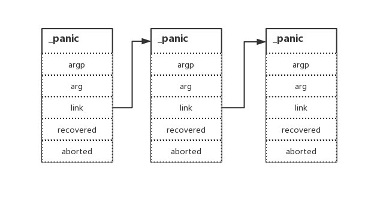

# 6.1 panic and recover

作為一個 gophper，我相信你對於 `panic` 和 `recover` 肯定不陌生，但是你有沒有想過。當我們執行了這兩條語句之後。底層到底發生了什麼事呢？前幾天和同事剛好聊到相關的話題，發現其實大家對這塊理解還是比較模糊的。希望這篇文章能夠從更深入的角度告訴你為什麼，它到底做了什麼事？

## 思考

### 一、為什麼會中止執行

```go
func main() {
    panic("EDDYCJY.")
}
```
輸出結果：

```
$ go run main.go
panic: EDDYCJY.

goroutine 1 [running]:
main.main()
    /Users/eddycjy/go/src/github.com/EDDYCJY/awesomeProject/main.go:4 +0x39
exit status 2
```

請思考一下，為什麼執行 `panic` 後會導致應用程式執行中止？（而不是單單說執行了 `panic` 所以就結束了這麼含糊）

### 二、為什麼不會中止執行

```go
func main() {
    defer func() {
        if err := recover(); err != nil {
            log.Printf("recover: %v", err)
        }
    }()

    panic("EDDYCJY.")
}
```
輸出結果：

```
$ go run main.go 
2019/05/11 23:39:47 recover: EDDYCJY.
```

請思考一下，為什麼加上 `defer` + `recover` 組合就可以保護應用程式？

### 三、不設定 defer 行不

上面問題二是 `defer` + `recover` 組合，那我去掉 `defer` 是不是也可以呢？如下：

```go
func main() {
    if err := recover(); err != nil {
        log.Printf("recover: %v", err)
    }

    panic("EDDYCJY.")
}
```
輸出結果：

```
$ go run main.go
panic: EDDYCJY.

goroutine 1 [running]:
main.main()
    /Users/eddycjy/go/src/github.com/EDDYCJY/awesomeProject/main.go:10 +0xa1
exit status 2
```

竟然不行，啊呀畢竟入門教程都寫的 `defer` + `recover` 組合 “萬能” 捕獲。但是為什麼呢。去掉 `defer` 後為什麼就無法捕獲了？

請思考一下，為什麼需要設定 `defer` 後 `recover` 才能起作用？

同時你還需要仔細想想，我們設定 `defer` + `recover` 組合後就能無憂無慮了嗎，各種 “亂” 寫了嗎？

### 四、為什麼起個 goroutine 就不行

```go
func main() {
    go func() {
        defer func() {
            if err := recover(); err != nil {
                log.Printf("recover: %v", err)
            }
        }()
    }()

    panic("EDDYCJY.")
}
```
輸出結果：

```
$ go run main.go 
panic: EDDYCJY.

goroutine 1 [running]:
main.main()
    /Users/eddycjy/go/src/github.com/EDDYCJY/awesomeProject/main.go:14 +0x51
exit status 2
```

請思考一下，為什麼新起了一個 `Goroutine` 就無法捕獲到異常了？到底發生了什麼事...

## 原始碼

接下來我們將帶著上述 4+1 個小思考題，開始對原始碼的剖析和分析，嘗試從閱讀原始碼中找到思考題的答案和更多為什麼

### 資料結構

```go
type _panic struct {
    argp      unsafe.Pointer
    arg       interface{} 
    link      *_panic 
    recovered bool
    aborted   bool 
}
```
在 `panic` 中是使用 `_panic` 作為其基礎單元的，每執行一次 `panic` 語句，都會建立一個 `_panic`。它包含了一些基礎的欄位用於儲存當前的 `panic` 呼叫情況，涉及的欄位如下：

* argp：指向 `defer` 延遲呼叫的引數的指標
* arg：`panic` 的原因，也就是呼叫 `panic` 時傳入的引數
* link：指向上一個呼叫的 `_panic`
* recovered：`panic` 是否已經被處理，也就是是否被 `recover`
* aborted：`panic` 是否被中止

另外透過檢視 `link` 欄位，可得知其是一個連結串列的資料結構，如下圖：



### 恐慌 panic

```go
func main() {
    panic("EDDYCJY.")
}
```
輸出結果：

```
$ go run main.go
panic: EDDYCJY.

goroutine 1 [running]:
main.main()
    /Users/eddycjy/go/src/github.com/EDDYCJY/awesomeProject/main.go:4 +0x39
exit status 2
```

我們去反查一下 `panic` 處理具體邏輯的地方在哪，如下：

```
$ go tool compile -S main.go
"".main STEXT size=66 args=0x0 locals=0x18
    0x0000 00000 (main.go:23)    TEXT    "".main(SB), ABIInternal, $24-0
    0x0000 00000 (main.go:23)    MOVQ    (TLS), CX
    0x0009 00009 (main.go:23)    CMPQ    SP, 16(CX)
    ...
    0x002f 00047 (main.go:24)    PCDATA    $2, $0
    0x002f 00047 (main.go:24)    MOVQ    AX, 8(SP)
    0x0034 00052 (main.go:24)    CALL    runtime.gopanic(SB)
```

顯然彙編程式碼直指內部實作是 `runtime.gopanic`，我們一起來看看這個方法做了什麼事，如下（省略了部分）：

```go
func gopanic(e interface{}) {
    gp := getg()
    ...
    var p _panic
    p.arg = e
    p.link = gp._panic
    gp._panic = (*_panic)(noescape(unsafe.Pointer(&p)))

    for {
        d := gp._defer
        if d == nil {
            break
        }

        // defer...
        ...
        d._panic = (*_panic)(noescape(unsafe.Pointer(&p)))

        p.argp = unsafe.Pointer(getargp(0))
        reflectcall(nil, unsafe.Pointer(d.fn), deferArgs(d), uint32(d.siz), uint32(d.siz))
        p.argp = nil

        // recover...
        if p.recovered {
            ...
            mcall(recovery)
            throw("recovery failed") // mcall should not return
        }
    }

    preprintpanics(gp._panic)

    fatalpanic(gp._panic) // should not return
    *(*int)(nil) = 0      // not reached
}
```
* 取得指向當前 `Goroutine` 的指標
* 初始化一個 `panic` 的基本單位 `_panic` 用作後續的操作
* 取得當前 `Goroutine` 上掛載的 `_defer`（資料結構也是連結串列）
* 若當前存在 `defer` 呼叫，則呼叫 `reflectcall` 方法去執行先前 `defer` 中延遲執行的程式碼，若在執行過程中需要執行 `recover` 將會呼叫 `gorecover` 方法
* 結束前，使用 `preprintpanics` 方法打印出所涉及的 `panic` 訊息
* 最後呼叫 `fatalpanic` 中止應用程式，實際是執行 `exit(2)` 進行最終退出行為的

透過對上述程式碼的執行分析，可得知 `panic` 方法實際上就是處理當前 `Goroutine(g)` 上所掛載的 `._panic` 連結串列（所以無法對其他 `Goroutine` 的異常事件響應），然後對其所屬的 `defer` 連結串列和 `recover` 進行檢測並處理，最後呼叫退出命令中止應用程式

### 無法恢復的恐慌 fatalpanic

```go
func fatalpanic(msgs *_panic) {
    pc := getcallerpc()
    sp := getcallersp()
    gp := getg()
    var docrash bool

    systemstack(func() {
        if startpanic_m() && msgs != nil {
            ...
            printpanics(msgs)
        }

        docrash = dopanic_m(gp, pc, sp)
    })

    systemstack(func() {
        exit(2)
    })

    *(*int)(nil) = 0
}
```
我們看到在異常處理的最後會執行該方法，似乎它承擔了所有收尾工作。實際呢，它是在最後對程式執行 `exit` 指令來達到中止執行的作用，但在結束前它會透過 `printpanics` 遞迴輸出所有的異常訊息及引數。程式碼如下：

```go
func printpanics(p *_panic) {
    if p.link != nil {
        printpanics(p.link)
        print("\t")
    }
    print("panic: ")
    printany(p.arg)
    if p.recovered {
        print(" [recovered]")
    }
    print("\n")
}
```
所以不要以為所有的異常都能夠被 `recover` 到，實際上像 `fatal error` 和 `runtime.throw` 都是無法被 `recover` 到的，甚至是 oom 也是直接中止程式的，也有反手就給你來個 `exit(2)` 教做人。因此在寫程式碼時你應該要相對注意些，“恐慌” 是存在無法恢復的場景的

### 恢復 recover

```go
func main() {
    defer func() {
        if err := recover(); err != nil {
            log.Printf("recover: %v", err)
        }
    }()

    panic("EDDYCJY.")
}
```
輸出結果：

```
$ go run main.go 
2019/05/11 23:39:47 recover: EDDYCJY.
```

和預期一致，成功捕獲到了異常。但是 `recover` 是怎麼恢復 `panic` 的呢？再看看彙編程式碼，如下：

```
$ go tool compile -S main.go
"".main STEXT size=110 args=0x0 locals=0x18
    0x0000 00000 (main.go:5)    TEXT    "".main(SB), ABIInternal, $24-0
    ...
    0x0024 00036 (main.go:6)    LEAQ    "".main.func1·f(SB), AX
    0x002b 00043 (main.go:6)    PCDATA    $2, $0
    0x002b 00043 (main.go:6)    MOVQ    AX, 8(SP)
    0x0030 00048 (main.go:6)    CALL    runtime.deferproc(SB)
    ...
    0x0050 00080 (main.go:12)    CALL    runtime.gopanic(SB)
    0x0055 00085 (main.go:12)    UNDEF
    0x0057 00087 (main.go:6)    XCHGL    AX, AX
    0x0058 00088 (main.go:6)    CALL    runtime.deferreturn(SB)
    ...
    0x0022 00034 (main.go:7)    MOVQ    AX, (SP)
    0x0026 00038 (main.go:7)    CALL    runtime.gorecover(SB)
    0x002b 00043 (main.go:7)    PCDATA    $2, $1
    0x002b 00043 (main.go:7)    MOVQ    16(SP), AX
    0x0030 00048 (main.go:7)    MOVQ    8(SP), CX
    ...
    0x0056 00086 (main.go:8)    LEAQ    go.string."recover: %v"(SB), AX
    ...
    0x0086 00134 (main.go:8)    CALL    log.Printf(SB)
    ...
```

透過分析底層呼叫，可得知主要是如下幾個方法：

* runtime.deferproc
* runtime.gopanic
* runtime.deferreturn
* runtime.gorecover

在上小節中，我們講述了簡單的流程，`gopanic` 方法會呼叫當前 `Goroutine` 下的 `defer` 連結串列，若 `reflectcall` 執行中遇到 `recover` 就會呼叫 `gorecover` 進行處理，該方法程式碼如下：

```go
func gorecover(argp uintptr) interface{} {
    gp := getg()
    p := gp._panic
    if p != nil && !p.recovered && argp == uintptr(p.argp) {
        p.recovered = true
        return p.arg
    }
    return nil
}
```
這程式碼，看上去挺簡單的，核心就是修改 `recovered` 欄位。該欄位是用於標識當前 `panic` 是否已經被 `recover` 處理。但是這和我們想象的並不一樣啊，程式是怎麼從 `panic` 流轉回去的呢？是不是在核心方法裡處理了呢？我們再看看 `gopanic` 的程式碼，如下：

```go
func gopanic(e interface{}) {
    ...
    for {
        // defer...
        ...
        pc := d.pc
        sp := unsafe.Pointer(d.sp) // must be pointer so it gets adjusted during stack copy
        freedefer(d)

        // recover...
        if p.recovered {
            atomic.Xadd(&runningPanicDefers, -1)

            gp._panic = p.link
            for gp._panic != nil && gp._panic.aborted {
                gp._panic = gp._panic.link
            }
            if gp._panic == nil { 
                gp.sig = 0
            }

            gp.sigcode0 = uintptr(sp)
            gp.sigcode1 = pc
            mcall(recovery)
            throw("recovery failed") 
        }
    }
    ...
}
```
我們回到 `gopanic` 方法中再仔細看看，發現實際上是包含對 `recover` 流轉的處理程式碼的。恢復流程如下：

* 判斷當前 `_panic` 中的 `recover` 是否已標註為處理
* 從 `_panic` 連結串列中刪除已標註中止的 `panic` 事件，也就是刪除已經被恢復的 `panic` 事件
* 將相關需要恢復的棧幀資訊傳遞給 `recovery` 方法的 `gp` 引數（每個棧幀對應著一個未執行完的函式。棧幀中儲存了該函式的返回地址和區域性變數）
* 執行 `recovery` 進行恢復動作

從流程來看，最核心的是 `recovery` 方法。它承擔了異常流轉控制的職責。程式碼如下：

```go
func recovery(gp *g) {
    sp := gp.sigcode0
    pc := gp.sigcode1

    if sp != 0 && (sp < gp.stack.lo || gp.stack.hi < sp) {
        print("recover: ", hex(sp), " not in [", hex(gp.stack.lo), ", ", hex(gp.stack.hi), "]\n")
        throw("bad recovery")
    }

    gp.sched.sp = sp
    gp.sched.pc = pc
    gp.sched.lr = 0
    gp.sched.ret = 1
    gogo(&gp.sched)
}
```
粗略一看，似乎就是很簡單的設定了一些值？但實際上設定的是編譯器中偽暫存器的值，常常被用於維護上下文等。在這裡我們需要結合 `gopanic` 方法一同觀察 `recovery` 方法。它所使用的棧指標 `sp` 和程式計數器 `pc` 是由當前 `defer` 在呼叫流程中的 `deferproc` 傳遞下來的，因此實際上最後是透過 `gogo` 方法跳回了 `deferproc` 方法。另外我們注意到：

```
gp.sched.ret = 1
```

在底層中程式將 `gp.sched.ret` 設定為了 1，也就是**沒有實際呼叫** `deferproc` 方法，直接修改了其返回值。意味著預設它已經處理完成。直接轉移到 `deferproc` 方法的下一條指令去。至此為止，異常狀態的流轉控制就已經結束了。接下來就是繼續走 `defer` 的流程了

為了驗證這個想法，我們可以看一下核心的跳轉方法 `gogo` ，程式碼如下：

```
// void gogo(Gobuf*)
// restore state from Gobuf; longjmp
TEXT runtime·gogo(SB),NOSPLIT,$8-4
    MOVW    buf+0(FP), R1
    MOVW    gobuf_g(R1), R0
    BL    setg<>(SB)

    MOVW    gobuf_sp(R1), R13    // restore SP==R13
    MOVW    gobuf_lr(R1), LR
    MOVW    gobuf_ret(R1), R0
    MOVW    gobuf_ctxt(R1), R7
    MOVW    $0, R11
    MOVW    R11, gobuf_sp(R1)    // clear to help garbage collector
    MOVW    R11, gobuf_ret(R1)
    MOVW    R11, gobuf_lr(R1)
    MOVW    R11, gobuf_ctxt(R1)
    MOVW    gobuf_pc(R1), R11
    CMP    R11, R11 // set condition codes for == test, needed by stack split
    B    (R11)
```

透過檢視程式碼可得知其主要作用是從 `Gobuf` 恢復狀態。簡單來講就是將暫存器的值修改為對應 `Goroutine(g)` 的值，而在文中講了很多次的 `Gobuf`，如下：

```go
type gobuf struct {
    sp   uintptr
    pc   uintptr
    g    guintptr
    ctxt unsafe.Pointer
    ret  sys.Uintreg
    lr   uintptr
    bp   uintptr
}
```
講道理，其實它儲存的就是 `Goroutine` 切換上下文時所需要的一些東西

## 拓展

```go
const(
    OPANIC       // panic(Left)
    ORECOVER     // recover()
    ...
)
...
func walkexpr(n *Node, init *Nodes) *Node {
    ...
    switch n.Op {
    default:
        Dump("walk", n)
        Fatalf("walkexpr: switch 1 unknown op %+S", n)

    case ONONAME, OINDREGSP, OEMPTY, OGETG:
    case OTYPE, ONAME, OLITERAL:
        ...
    case OPANIC:
        n = mkcall("gopanic", nil, init, n.Left)

    case ORECOVER:
        n = mkcall("gorecover", n.Type, init, nod(OADDR, nodfp, nil))
    ...
}
```
實際上在呼叫 `panic` 和 `recover` 關鍵字時，是在編譯階段先轉換為相應的 OPCODE 後，再由編譯器轉換為對應的執行時方法。並不是你所想像那樣一步到位，有興趣的小夥伴可以研究一下

## 總結

本文主要針對 `panic` 和 `recover` 關鍵字進行了深入原始碼的剖析，而開頭的 4+1 個思考題，就是希望您能夠帶著疑問去學習，達到事半功倍的功效

另外本文和 `defer` 有一定的關聯性，因此需要有一定的基礎知識。若剛剛看的時候這部分不理解，學習後可以再讀一遍加深印象

在最後，現在的你可以回答這幾個思考題了嗎？說出來了才是真的懂 ：）
