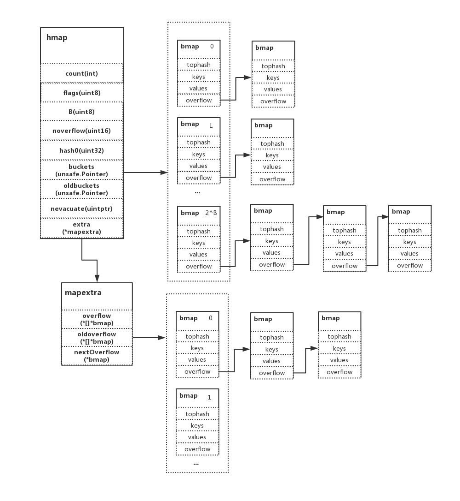
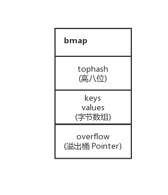
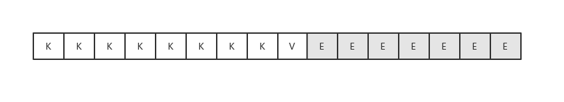
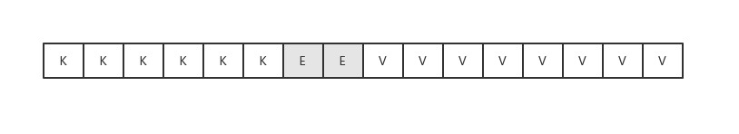
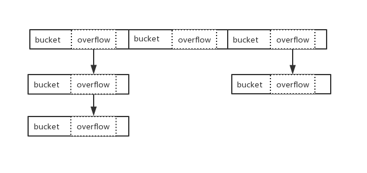
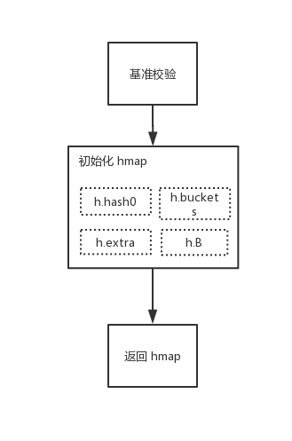
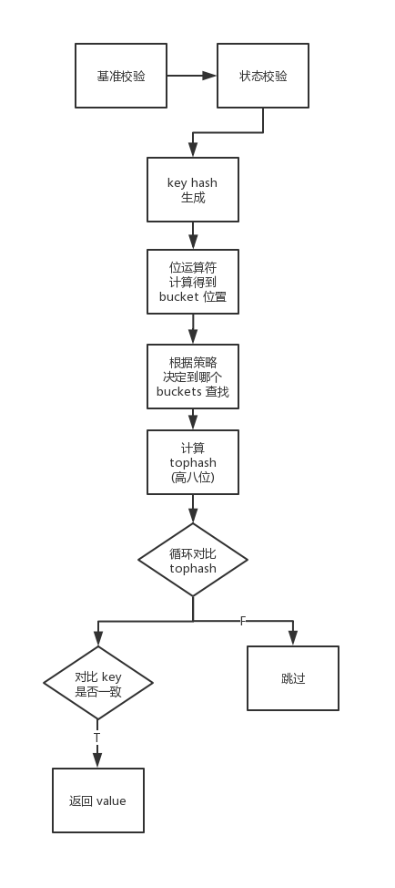

# 7.3 map：初始化和訪問元素

從本文開始咱們一起探索 Go map 裡面的奧妙吧，看看它的內在是怎麼構成的，又分別有什麼值得留意的地方？

第一篇將探討**初始化和訪問元素**相關板塊，咱們帶著疑問去學習，例如：

* 初始化的時候會馬上分配記憶體嗎？
* 底層資料是如何儲存的？
* 底層是如何使用 key 去尋找資料的？
* 底層是用什麼方式解決雜湊衝突的？
* 資料型別那麼多，底層又是怎麼處理的呢？

...

## 資料結構

首先我們一起看看 Go map 的基礎資料結構，先有一個大致的印象



### hmap

```go
type hmap struct {
    count     int 
    flags     uint8
    B         uint8
    noverflow uint16
    hash0     uint32
    buckets    unsafe.Pointer
    oldbuckets unsafe.Pointer
    nevacuate  uintptr 
    extra *mapextra
}

type mapextra struct {
    overflow    *[]*bmap
    oldoverflow *[]*bmap
    nextOverflow *bmap
}
```
* count：map 的大小，也就是 len() 的值。代指 map 中的鍵值對個數
* flags：狀態標識，主要是 goroutine 寫入和擴容機制的相關狀態控制。併發讀寫的判斷條件之一就是該值
* B：桶，最大可容納的元素數量，值為 **負載因子（預設 6.5） \* 2 ^ B**，是 2 的指數
* noverflow：溢位桶的數量
* hash0：雜湊因子
* buckets：儲存當前桶資料的指標地址（指向一段連續的記憶體地址，主要儲存鍵值對資料）
* oldbuckets，儲存舊桶的指標地址
* nevacuate：遷移進度
* extra：原有 buckets 滿載後，會發生擴容動作，在 Go 的機制中使用了增量擴容，如下為細項：
  * `overflow` 為 `hmap.buckets` （當前）溢位桶的指標地址
  * `oldoverflow` 為 `hmap.oldbuckets` （舊）溢位桶的指標地址
  * `nextOverflow` 為空閒溢位桶的指標地址

在這裡我們要注意幾點，如下：

1. 如果 keys 和 values 都不包含指標並且允許內聯的情況下。會將 bucket 標識為不包含指標，使用 extra 儲存溢位桶就可以避免 GC 掃描整個 map，節省不必要的開銷
2. 在前面有提到，Go 用了增量擴容。而 `buckets` 和 `oldbuckets` 也是與擴容相關的載體，一般情況下只使用 `buckets`，`oldbuckets` 是為空的。但如果正在擴容的話，`oldbuckets` 便不為空，`buckets` 的大小也會改變
3. 當 `hint` 大於 8 時，就會使用 `*mapextra` 做溢位桶。若小於 8，則儲存在 buckets 桶中

### bmap



```go
bucketCntBits = 3
bucketCnt     = 1 << bucketCntBits
...
type bmap struct {
    tophash [bucketCnt]uint8
}
```
* tophash：key 的 hash 值高 8 位
* keys：8 個 key
* values：8 個 value
* overflow：下一個溢位桶的指標地址（當 hash 衝突發生時）

實際 bmap 就是 buckets 中的 bucket，一個 bucket 最多儲存 8 個鍵值對

#### tophash

tophash 是個長度為 8 的陣列，代指桶最大可容納的鍵值對為 8。

儲存每個元素 hash 值的高 8 位，如果 `tophash [0] <minTopHash`，則 `tophash [0]` 表示為遷移進度

#### keys 和 values

在這裡我們留意到，儲存 k 和 v 的載體並不是用 `k/v/k/v/k/v/k/v` 的模式，而是 `k/k/k/k/v/v/v/v` 的形式去儲存。這是為什麼呢？

```
map[int64]int8
```

在這個例子中，如果按照 `k/v/k/v/k/v/k/v` 的形式存放的話，雖然每個鍵值對的值都只佔用 1 個位元組。但是卻需要 7 個填充位元組來補齊記憶體空間。最終就會造成大量的記憶體 “浪費”



但是如果以 `k/k/k/k/v/v/v/v` 的形式存放的話，就能夠解決因對齊所 "浪費" 的記憶體空間

因此這部分的拆分主要是考慮到記憶體對齊的問題，雖然相對會複雜一點，但依然值得如此設計



#### overflow

可能會有同學疑惑為什麼會有溢位桶這個東西？實際上在不存在雜湊衝突的情況下，去掉溢位桶，也就是隻需要桶、雜湊因子、雜湊演算法。也能實作一個簡單的 hash table。但是雜湊衝突（碰撞）是不可避免的...

而在 Go map 中當 `hmap.buckets` 滿了後，就會使用溢位桶接著儲存。我們結合分析可確定 Go 採用的是陣列 + 鏈地址法解決雜湊衝突



## 初始化

### 用法

```go
m := make(map[int32]int32)
```
### 函式原型

透過閱讀原始碼可得知，初始化方法有好幾種。函式原型如下：

```go
func makemap_small() *hmap
func makemap64(t *maptype, hint int64, h *hmap) *hmap
func makemap(t *maptype, hint int, h *hmap) *hmap
```
* makemap\_small：當 `hint` 小於 8 時，會呼叫 `makemap_small` 來初始化 hmap。主要差異在於是否會馬上初始化 hash table
* makemap64：當 `hint` 型別為 int64 時的特殊轉換及校驗處理，後續實質呼叫 `makemap`
* makemap：實作了標準的 map 初始化動作

### 原始碼

```go
func makemap(t *maptype, hint int, h *hmap) *hmap {
    if hint < 0 || hint > int(maxSliceCap(t.bucket.size)) {
        hint = 0
    }

    if h == nil {
        h = new(hmap)
    }
    h.hash0 = fastrand()

    B := uint8(0)
    for overLoadFactor(hint, B) {
        B++
    }
    h.B = B

    if h.B != 0 {
        var nextOverflow *bmap
        h.buckets, nextOverflow = makeBucketArray(t, h.B, nil)
        if nextOverflow != nil {
            h.extra = new(mapextra)
            h.extra.nextOverflow = nextOverflow
        }
    }

    return h
}
```
* 根據傳入的 `bucket` 型別，取得其型別能夠申請的最大容量大小。並對其長度 `make(map[k]v, hint)` 進行邊界值檢驗
* 初始化 hmap
* 初始化雜湊因子
* 根據傳入的 `hint`，計算一個可以放下 `hint` 個元素的桶 `B` 的最小值
* 分配並初始化 hash table。如果 `B` 為 0 將在後續懶惰分配桶，大於 0 則會馬上進行分配
* 返回初始化完畢的 hmap

在這裡可以注意到，（當 `hint` 大於等於 8 ）第一次初始化 map 時，就會透過呼叫 `makeBucketArray` 對 buckets 進行分配。因此我們常常會說，在初始化時指定一個適當大小的容量。能夠提升效能。

若該容量過少，而新增的鍵值對又很多。就會導致頻繁的分配 buckets，進行擴容遷移等 rehash 動作。最終結果就是效能直接的下降（敲黑板）

而當 `hint` 小於 8 時，這種問題**相對**就不會凸顯的太明顯，如下：

```go
func makemap_small() *hmap {
    h := new(hmap)
    h.hash0 = fastrand()
    return h
}
```
### 圖示



## 訪問

### 用法

```
v := m[i]
v, ok := m[i]
```

### 函式原型

在實作 map 元素訪問上有好幾種方法，主要是包含針對 32/64 位、string 型別的特殊處理，總的函式原型如下：

```
mapaccess1(t *maptype, h *hmap, key unsafe.Pointer) unsafe.Pointer
mapaccess2(t *maptype, h *hmap, key unsafe.Pointer) (unsafe.Pointer, bool)

mapaccessK(t *maptype, h *hmap, key unsafe.Pointer) (unsafe.Pointer, unsafe.Pointer)

mapaccess1_fat(t *maptype, h *hmap, key, zero unsafe.Pointer) unsafe.Pointer
mapaccess2_fat(t *maptype, h *hmap, key, zero unsafe.Pointer) (unsafe.Pointer, bool)

mapaccess1_fast32(t *maptype, h *hmap, key uint32) unsafe.Pointer
mapaccess2_fast32(t *maptype, h *hmap, key uint32) (unsafe.Pointer, bool)
mapassign_fast32(t *maptype, h *hmap, key uint32) unsafe.Pointer
mapassign_fast32ptr(t *maptype, h *hmap, key unsafe.Pointer) unsafe.Pointer

mapaccess1_fast64(t *maptype, h *hmap, key uint64) unsafe.Pointer
...

mapaccess1_faststr(t *maptype, h *hmap, ky string) unsafe.Pointer
...
```

* mapaccess1：返回 `h[key]` 的指標地址，如果鍵不在 `map` 中，將返回對應型別的零值
* mapaccess2：返回 `h[key]` 的指標地址，如果鍵不在 `map` 中，將返回零值和布林值用於判斷

### 原始碼

```go
func mapaccess1(t *maptype, h *hmap, key unsafe.Pointer) unsafe.Pointer {
    ...
    if h == nil || h.count == 0 {
        return unsafe.Pointer(&zeroVal[0])
    }
    if h.flags&hashWriting != 0 {
        throw("concurrent map read and map write")
    }
    alg := t.key.alg
    hash := alg.hash(key, uintptr(h.hash0))
    m := bucketMask(h.B)
    b := (*bmap)(add(h.buckets, (hash&m)*uintptr(t.bucketsize)))
    if c := h.oldbuckets; c != nil {
        if !h.sameSizeGrow() {
            // There used to be half as many buckets; mask down one more power of two.
            m >>= 1
        }
        oldb := (*bmap)(add(c, (hash&m)*uintptr(t.bucketsize)))
        if !evacuated(oldb) {
            b = oldb
        }
    }
    top := tophash(hash)
    for ; b != nil; b = b.overflow(t) {
        for i := uintptr(0); i < bucketCnt; i++ {
            if b.tophash[i] != top {
                continue
            }
            k := add(unsafe.Pointer(b), dataOffset+i*uintptr(t.keysize))
            if t.indirectkey {
                k = *((*unsafe.Pointer)(k))
            }
            if alg.equal(key, k) {
                v := add(unsafe.Pointer(b), dataOffset+bucketCnt*uintptr(t.keysize)+i*uintptr(t.valuesize))
                if t.indirectvalue {
                    v = *((*unsafe.Pointer)(v))
                }
                return v
            }
        }
    }
    return unsafe.Pointer(&zeroVal[0])
}
```
* 判斷 map 是否為 nil，長度是否為 0。若是則返回零值
* 判斷當前是否併發讀寫 map，若是則丟擲異常
* 根據 key 的不同型別呼叫不同的 hash 方法計算得出 hash 值
* 確定 key 在哪一個 bucket 中，並得到其位置
* 判斷是否正在發生擴容（h.oldbuckets 是否為 nil），若正在擴容，則到老的 buckets 中查詢（因為 buckets 中可能還沒有值，搬遷未完成），若該 bucket 已經搬遷完畢。則到 buckets 中繼續查詢
* 計算 hash 的 tophash 值（高八位）
* 根據計算出來的 tophash，依次迴圈對比 buckets 的 tophash 值（快速試錯）
* 如果 tophash 匹配成功，則計算 key 的所在位置，正式完整的對比兩個 key 是否一致
* 若查詢成功並返回，若不存在，則返回零值

在上述步驟三中，提到了根據不同的型別計算出 hash 值，另外會計算出 hash 值的高八位和低八位。低八位會作為 bucket index，作用是用於找到 key 所在的 bucket。而高八位會儲存在 bmap tophash 中

其主要作用是在上述步驟七中進行迭代快速定位。這樣子可以提高效能，而不是一開始就直接用 key 進行一致性對比

### 圖示



## 總結

在本章節，我們介紹了 map 型別的以下知識點：

* map 的基礎資料結構
* 初始化 map
* 訪問 map

從閱讀原始碼中，得知 Go 本身**對於一些不同大小、不同型別的屬性，包括雜湊方法都有編寫特定方法**去執行。總的來說，這塊的設計隱含較多的思路，有不少點值得細細品嚐 :)

注：本文基於 Go 1.11.5
