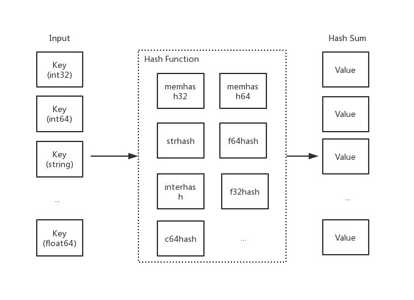
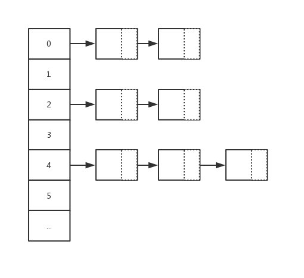

# 7.4 map：賦值和擴容遷移

## 概要

在 [上一章節](https://book.eddycjy.com/golang/map/map-access.html) 中，資料結構小節裡講解了大量基礎欄位，可能你會疑惑需要 #&（！……#（！￥！ 來幹嘛？接下來我們一起簡單瞭解一下基礎概念。再開始研討今天文章的重點內容。我相信這樣你能更好的讀懂這篇文章

### 雜湊函式

雜湊函式，又稱雜湊演算法、雜湊函式。主要作用是透過特定演算法將資料根據一定規則組合重新生成得到一個**雜湊值**

而在雜湊表中，其生成的雜湊值常用於尋找其鍵對映到哪一個桶上。而一個好的雜湊函式，應當儘量少的出現雜湊衝突，以此保證操作雜湊表的時間複雜度（但是雜湊衝突在目前來講，是無法避免的。我們需要 “解決” 它）



### 鏈地址法

在雜湊操作中，相當核心的一個處理動作就是 “雜湊衝突” 的解決。而在 Go map 中採用的就是 "鏈地址法 " 去解決雜湊衝突，又稱 "拉鍊法"。其主要做法是陣列 + 連結串列的資料結構，其溢位節點的儲存記憶體都是動態申請的，因此相對更靈活。而每一個元素都是一個連結串列。如下圖：



### 桶/溢位桶

```go
type hmap struct {
    ...
    buckets    unsafe.Pointer
    ...
    extra *mapextra
}

type mapextra struct {
    overflow    *[]*bmap
    oldoverflow *[]*bmap
    nextOverflow *bmap
}
```
在上章節中，我們介紹了 Go map 中的桶和溢位桶的概念，在其桶中只能儲存 8 個鍵值對元素。當超過 8 個時，將會使用溢位桶進行儲存或進行擴容

你可能會有疑問，hint 大於 8 又會怎麼樣？答案很明顯，效能問題，其時間複雜度改變（也就是執行效率出現問題）

## 前言

概要複習的差不多後，接下來我們將一同研討 Go map 的另外三個核心行為：賦值、擴容、遷移。正式開始我們的研討之旅吧 ：）

## 賦值

```go
m := make(map[int32]string)
m[0] = "EDDYCJY"
```
### 函式原型

在 map 的賦值動作中，依舊是針對 32/64 位、string、pointer 型別有不同的轉換處理，總的函式原型如下：

```go
func mapassign(t *maptype, h *hmap, key unsafe.Pointer) unsafe.Pointer
func mapaccess1_fast32(t *maptype, h *hmap, key uint32) unsafe.Pointer
func mapaccess2_fast32(t *maptype, h *hmap, key uint32) (unsafe.Pointer, bool)
func mapassign_fast32(t *maptype, h *hmap, key uint32) unsafe.Pointer
func mapassign_fast32ptr(t *maptype, h *hmap, key unsafe.Pointer) unsafe.Pointer

func mapaccess1_fast64(t *maptype, h *hmap, key uint64) unsafe.Pointer
func mapaccess2_fast64(t *maptype, h *hmap, key uint64) (unsafe.Pointer, bool)
func mapassign_fast64(t *maptype, h *hmap, key uint64) unsafe.Pointer
func mapassign_fast64ptr(t *maptype, h *hmap, key unsafe.Pointer) unsafe.Pointer
func mapaccess1_faststr(t *maptype, h *hmap, ky string) unsafe.Pointer
func mapaccess2_faststr(t *maptype, h *hmap, ky string) (unsafe.Pointer, bool)
func mapassign_faststr(t *maptype, h *hmap, s string) unsafe.Pointer
...
```
接下來我們將分成幾個部分去看看底層在賦值的時候，都做了些什麼處理？

### 原始碼

#### 第一階段：校驗和初始化

```go
func mapassign(t *maptype, h *hmap, key unsafe.Pointer) unsafe.Pointer {
    if h == nil {
        panic(plainError("assignment to entry in nil map"))
    }
    ...
    if h.flags&hashWriting != 0 {
        throw("concurrent map writes")
    }
    alg := t.key.alg
    hash := alg.hash(key, uintptr(h.hash0))

    h.flags |= hashWriting

    if h.buckets == nil {
        h.buckets = newobject(t.bucket) // newarray(t.bucket, 1)
    }
    ...    
}
```
* 判斷 hmap 是否已經初始化（是否為 nil）
* 判斷是否併發讀寫 map，若是則丟擲異常
* 根據 key 的不同型別呼叫不同的 hash 方法計算得出 hash 值
* 設定 flags 標誌位，表示有一個 goroutine 正在寫入資料。因為 `alg.hash` 有可能出現 `panic` 導致異常
* 判斷 buckets 是否為 nil，若是則呼叫 `newobject` 根據當前 bucket 大小進行分配（例如：上章節提到的 `makemap_small` 方法，就在初始化時沒有初始 buckets，那麼它在第一次賦值時就會對 buckets 分配）

#### 第二階段：尋找可插入位和更新既有值

```
...
again:
    bucket := hash & bucketMask(h.B)
    if h.growing() {
        growWork(t, h, bucket)
    }
    b := (*bmap)(unsafe.Pointer(uintptr(h.buckets) + bucket*uintptr(t.bucketsize)))
    top := tophash(hash)

    var inserti *uint8
    var insertk unsafe.Pointer
    var val unsafe.Pointer
    for {
        for i := uintptr(0); i < bucketCnt; i++ {
            if b.tophash[i] != top {
                if b.tophash[i] == empty && inserti == nil {
                    inserti = &b.tophash[i]
                    insertk = add(unsafe.Pointer(b), dataOffset+i*uintptr(t.keysize))
                    val = add(unsafe.Pointer(b), dataOffset+bucketCnt*uintptr(t.keysize)+i*uintptr(t.valuesize))
                }
                continue
            }
            k := add(unsafe.Pointer(b), dataOffset+i*uintptr(t.keysize))
            if t.indirectkey {
                k = *((*unsafe.Pointer)(k))
            }
            if !alg.equal(key, k) {
                continue
            }
            // already have a mapping for key. Update it.
            if t.needkeyupdate {
                typedmemmove(t.key, k, key)
            }
            val = add(unsafe.Pointer(b), dataOffset+bucketCnt*uintptr(t.keysize)+i*uintptr(t.valuesize))
            goto done
        }
        ovf := b.overflow(t)
        if ovf == nil {
            break
        }
        b = ovf
    }

    if !h.growing() && (overLoadFactor(h.count+1, h.B) || tooManyOverflowBuckets(h.noverflow, h.B)) {
        hashGrow(t, h)
        goto again // Growing the table invalidates everything, so try again
    }
    ...
```

* 根據低八位計算得到 bucket 的記憶體地址，並判斷是否正在擴容，若正在擴容中則先遷移再接著處理
* 計算並得到 bucket 的 bmap 指標地址，計算 key hash 高八位用於查詢 Key
* 迭代 buckets 中的每一個 bucket（共 8 個），對比 `bucket.tophash` 與 top（高八位）是否一致
* 若不一致，判斷是否為空槽。若是空槽（有兩種情況，第一種是**沒有插入過**。第二種是**插入後被刪除**），則把該位置標識為可插入 tophash 位置。注意，這裡就是第一個可以插入資料的地方
* 若 key 與當前 k 不匹配則跳過。但若是匹配（也就是原本已經存在），則進行更新。最後跳出並返回 value 的記憶體地址
* 判斷是否迭代完畢，若是則結束迭代 buckets 並更新當前桶位置
* 若滿足三個條件：觸發最大 `LoadFactor` 、存在過多溢位桶 `overflow buckets`、沒有正在進行擴容。就會進行擴容動作（以確保後續的動作）

總的來講，這一塊邏輯做了兩件大事，第一是**尋找空位，將位置其記錄在案，用於後續的插入動作**。第二是**判斷 Key 是否已經存在雜湊表中，存在則進行更新**。而若是第二種場景，更新完畢後就會進行收尾動作，第一種將繼續執行下述的程式碼

#### 第三階段：申請新的插入位和插入新值

```
    ...
    if inserti == nil {
        newb := h.newoverflow(t, b)
        inserti = &newb.tophash[0]
        insertk = add(unsafe.Pointer(newb), dataOffset)
        val = add(insertk, bucketCnt*uintptr(t.keysize))
    }

    if t.indirectkey {
        kmem := newobject(t.key)
        *(*unsafe.Pointer)(insertk) = kmem
        insertk = kmem
    }
    if t.indirectvalue {
        vmem := newobject(t.elem)
        *(*unsafe.Pointer)(val) = vmem
    }
    typedmemmove(t.key, insertk, key)
    *inserti = top
    h.count++

done:
    ...
    return val
```

經過前面迭代尋找動作，若沒有找到可插入的位置，意味著當前的所有桶都滿了，將重新分配一個新溢位桶用於插入動作。最後再在上一步申請的新插入位置，儲存鍵值對，返回該值的記憶體地址

#### 第四階段：寫入

但是這裡又疑惑了？最後為什麼是返回記憶體地址。這是因為隱藏的最後一步寫入動作（將值複製到指定記憶體區域）是透過底層彙編配合來完成的，在 runtime 中只完成了絕大部分的動作

```go
func main() {
    m := make(map[int32]int32)
    m[0] = 6666666
}
```
對應的彙編部分：

```
...
0x0099 00153 (test.go:6)    CALL    runtime.mapassign_fast32(SB)
0x009e 00158 (test.go:6)    PCDATA    $2, $2
0x009e 00158 (test.go:6)    MOVQ    24(SP), AX
0x00a3 00163 (test.go:6)    PCDATA    $2, $0
0x00a3 00163 (test.go:6)    MOVL    $6666666, (AX)
```

這裡分為了幾個部位，主要是呼叫 `mapassign` 函式和拿到值存放的記憶體地址，再將 6666666 這個值存放進該記憶體地址中。另外我們看到 `PCDATA` 指令，主要是包含一些垃圾回收的資訊，由編譯器產生

### 小結

透過前面幾個階段的分析，我們可梳理出一些要點。例如：

* 不同型別對應雜湊函式不一樣
* 高八位用於定位 bucket
* 低八位用於定位 key，快速試錯後再進行完整對比
* buckets/overflow buckets 遍歷
* 可插入位的處理
* 最終寫入動作與底層彙編的互動

## 擴容

在所有動作中，擴容規則是大家較關注的點，也是賦值裡非常重要的一環。因此咱們將這節拉出來，對這塊細節進行研討

### 什麼時候擴容

```
if !h.growing() && (overLoadFactor(h.count+1, h.B) || tooManyOverflowBuckets(h.noverflow, h.B)) {
    hashGrow(t, h)
    goto again
}
```

在特定條件的情況下且當前沒有正在進行擴容動作（以判斷 `hmap.oldbuckets != nil` 為基準）。雜湊表在賦值、刪除的動作下會觸發擴容行為，條件如下：

* 觸發 `load factor` 的最大值，負載因子已達到當前界限
* 溢位桶 `overflow buckets` 過多

### 什麼時候受影響

那麼什麼情況下會對這兩個 “值” 有影響呢？如下：

1. 負載因子 `load factor`，用途是評估雜湊表當前的時間複雜度，其與雜湊表當前包含的鍵值對數、桶數量等相關。如果負載因子越大，則說明空間使用率越高，但產生雜湊衝突的可能性更高。而負載因子越小，說明空間使用率低，產生雜湊衝突的可能性更低
2. 溢位桶 `overflow buckets` 的判定與 buckets 總數和 overflow buckets 總數相關聯

### 因子關係

| loadFactor | %overflow | bytes/entry | hitprobe | missprobe |
| ---------- | --------- | ----------- | -------- | --------- |
| 4.00       | 2.13      | 20.77       | 3.00     | 4.00      |
| 4.50       | 4.05      | 17.30       | 3.25     | 4.50      |
| 5.00       | 6.85      | 14.77       | 3.50     | 5.00      |
| 5.50       | 10.55     | 12.94       | 3.75     | 5.50      |
| 6.00       | 15.27     | 11.67       | 4.00     | 6.00      |
| 6.50       | 20.90     | 10.79       | 4.25     | 6.50      |
| 7.00       | 27.14     | 10.15       | 4.50     | 7.00      |

* loadFactor：負載因子
* %overflow：溢位率，具有溢位桶 `overflow buckets` 的桶的百分比
* bytes/entry：每個鍵值對所的位元組數開銷
* hitprobe：查詢存在的 key 時，平均需要檢索的條目數量
* missprobe：查詢不存在的 key 時，平均需要檢索的條目數量

這一組資料能夠體現出不同的負載因子會給雜湊表的動作帶來怎麼樣的影響。而在上一章節我們有提到預設的負載因子是 6.5 (loadFactorNum/loadFactorDen)，可以看出來是經過測試後取出的一個比較合理的因子。能夠較好的影響雜湊表的擴容動作的時機

### 原始碼剖析

```go
func hashGrow(t *maptype, h *hmap) {
    bigger := uint8(1)
    if !overLoadFactor(h.count+1, h.B) {
        bigger = 0
        h.flags |= sameSizeGrow
    }
    oldbuckets := h.buckets
    newbuckets, nextOverflow := makeBucketArray(t, h.B+bigger, nil)
    ...
    h.oldbuckets = oldbuckets
    h.buckets = newbuckets
    h.nevacuate = 0
    h.noverflow = 0

    if h.extra != nil && h.extra.overflow != nil {
        if h.extra.oldoverflow != nil {
            throw("oldoverflow is not nil")
        }
        h.extra.oldoverflow = h.extra.overflow
        h.extra.overflow = nil
    }
    if nextOverflow != nil {
        if h.extra == nil {
            h.extra = new(mapextra)
        }
        h.extra.nextOverflow = nextOverflow
    }

    // the actual copying of the hash table data is done incrementally
    // by growWork() and evacuate().
}
```
#### 第一階段：確定擴容容量規則

在上小節有講到擴容的依據有兩種，在 `hashGrow` 開頭就進行了劃分。如下：

```
if !overLoadFactor(h.count+1, h.B) {
    bigger = 0
    h.flags |= sameSizeGrow
}
```

若不是負載因子 `load factor` 超過當前界限，也就是屬於溢位桶 `overflow buckets` 過多的情況。因此本次擴容規則將是 `sameSizeGrow`，即是**不改變大小的擴容動作**。那要是前者的情況呢？

```
bigger := uint8(1)
...
newbuckets, nextOverflow := makeBucketArray(t, h.B+bigger, nil)
```

結合程式碼分析可得出，若是負載因子 `load factor` 達到當前界限，將會動態擴容**當前大小的兩倍**作為其新容量大小

#### 第二階段：初始化、交換新舊 桶/溢位桶

主要是針對擴容的相關資料**前置處理**，涉及 buckets/oldbuckets、overflow/oldoverflow 之類與儲存相關的欄位

```
...
oldbuckets := h.buckets
newbuckets, nextOverflow := makeBucketArray(t, h.B+bigger, nil)

flags := h.flags &^ (iterator | oldIterator)
if h.flags&iterator != 0 {
    flags |= oldIterator
}

h.B += bigger
...
h.noverflow = 0

if h.extra != nil && h.extra.overflow != nil {
    ...
    h.extra.oldoverflow = h.extra.overflow
    h.extra.overflow = nil
}
if nextOverflow != nil {
    ...
    h.extra.nextOverflow = nextOverflow
}
```

這裡注意到這段程式碼： `newbuckets, nextOverflow := makeBucketArray(t, h.B+bigger, nil)`。第一反應是擴容的時候就馬上申請並初始化記憶體了嗎？假設涉及大量的記憶體分配，那挺耗費效能的...

然而並不，內部只會先進行預分配，當使用的時候才會真正的去初始化

#### 第三階段：擴容

在原始碼中，發現第三階段的流轉並沒有顯式展示。這是因為流轉由底層去做控制了。但透過分析程式碼和註釋，可得知由第三階段涉及 `growWork` 和 `evacuate` 方法。如下：

```go
func growWork(t *maptype, h *hmap, bucket uintptr) {
    evacuate(t, h, bucket&h.oldbucketmask())

    if h.growing() {
        evacuate(t, h, h.nevacuate)
    }
}
```
在該方法中，主要是兩個 `evacuate` 函式的呼叫。他們在呼叫上又分別有什麼區別呢？如下：

* evacuate(t, h, bucket\&h.oldbucketmask()): 將 oldbucket 中的元素遷移 rehash 到擴容後的新 bucket
* evacuate(t, h, h.nevacuate): 如果當前正在進行擴容，則再進行多一次遷移

另外，在執行擴容動作的時候，可以發現都是以 bucket/oldbucket 為單位的，而不是傳統的 buckets/oldbuckets。再結合程式碼分析，可得知在 Go map 中**擴容是採取增量擴容的方式，並非一步到位**

**為什麼是增量擴容？**

如果是全量擴容的話，那問題就來了。假設當前 hmap 的容量比較大，直接全量擴容的話，就會導致擴容要花費大量的時間和記憶體，導致系統卡頓，最直觀的表現就是慢。顯然，不能這麼做

而增量擴容，就可以解決這個問題。它透過每一次的 map 操作行為去分攤總的一次性動作。因此有了 buckets/oldbuckets 的設計，它是逐步完成的，並且會在擴容完畢後才進行清空

### 小結

透過前面三個階段的分析，可以得知擴容的大致過程。我們階段性總結一下。主要如下：

* 根據需擴容的原因不同（overLoadFactor/tooManyOverflowBuckets），分為兩類容量規則方向，為等量擴容（不改變原有大小）或雙倍擴容
* 新申請的擴容空間（newbuckets/newoverflow）都是預分配，等真正使用的時候才會初始化
* 擴容完畢後（預分配），不會馬上就進行遷移。而是採取**增量擴容**的方式，當有訪問到具體 bukcet 時，才會逐漸的進行遷移（將 oldbucket 遷移到 bucket）

這時候又想到，既然遷移是逐步進行的。那如果在途中又要擴容了，怎麼辦？

```
again:
    bucket := hash & bucketMask(h.B)
    ...
    if !h.growing() && (overLoadFactor(h.count+1, h.B) || tooManyOverflowBuckets(h.noverflow, h.B)) {
        hashGrow(t, h)
        goto again 
    }
```

在這裡注意到 `goto again` 語句，結合上下文可得若正在進行擴容，就會不斷地進行遷移。待遷移完畢後才會開始進行下一次的擴容動作

## 遷移

在擴容的完整閉環中，包含著遷移的動作，又稱 “搬遷”。因此我們繼續深入研究 `evacuate` 函式。接下來一起開啟遷移世界的大門。如下：

```go
type evacDst struct {
    b *bmap          
    i int            
    k unsafe.Pointer 
    v unsafe.Pointer 
}
```
`evacDst` 是遷移中的基礎資料結構，其包含如下欄位：

* b: 當前目標桶
* i: 當前目標桶儲存的鍵值對數量
* k: 指向當前 key 的記憶體地址
* v: 指向當前 value 的記憶體地址

```go
func evacuate(t *maptype, h *hmap, oldbucket uintptr) {
    b := (*bmap)(add(h.oldbuckets, oldbucket*uintptr(t.bucketsize)))
    newbit := h.noldbuckets()
    if !evacuated(b) {
        var xy [2]evacDst
        x := &xy[0]
        x.b = (*bmap)(add(h.buckets, oldbucket*uintptr(t.bucketsize)))
        x.k = add(unsafe.Pointer(x.b), dataOffset)
        x.v = add(x.k, bucketCnt*uintptr(t.keysize))

        if !h.sameSizeGrow() {
            y := &xy[1]
            y.b = (*bmap)(add(h.buckets, (oldbucket+newbit)*uintptr(t.bucketsize)))
            y.k = add(unsafe.Pointer(y.b), dataOffset)
            y.v = add(y.k, bucketCnt*uintptr(t.keysize))
        }

        for ; b != nil; b = b.overflow(t) {
            ...
        }

        if h.flags&oldIterator == 0 && t.bucket.kind&kindNoPointers == 0 {
            b := add(h.oldbuckets, oldbucket*uintptr(t.bucketsize))
            ptr := add(b, dataOffset)
            n := uintptr(t.bucketsize) - dataOffset
            memclrHasPointers(ptr, n)
        }
    }

    if oldbucket == h.nevacuate {
        advanceEvacuationMark(h, t, newbit)
    }
}
```
* 計算並得到 oldbucket 的 bmap 指標地址
* 計算 hmap 在增長之前的桶數量
* 判斷當前的遷移（搬遷）狀態，以便流轉後續的操作。若沒有正在進行遷移 `!evacuated(b)` ，則根據擴容的規則的不同，當規則為等量擴容 `sameSizeGrow` 時，只使用一個 `evacDst` 桶用於分流。而為雙倍擴容時，就會使用兩個 `evacDst` 進行分流操作
* 當分流完畢後，需要遷移的資料都會透過 `typedmemmove` 函式遷移到指定的目標桶上
* 若當前不存在 flags 使用標誌、使用 oldbucket 迭代器、bucket 不為指標型別。則取消連結溢位桶、清除鍵值
* 在最後 `advanceEvacuationMark` 函式中會對遷移進度 `hmap.nevacuate` 進行累積計數，並呼叫 `bucketEvacuated` 對舊桶 oldbuckets 進行不斷的遷移。直至全部遷移完畢。那麼也就表示擴容完畢了，會對 `hmap.oldbuckets` 和 `h.extra.oldoverflow` 進行清空

總的來講，就是計算得到所需資料的位置。再根據當前的遷移狀態、擴容規則進行資料分流遷移。結束後進行清理，促進 GC 的回收

## 總結

在本章節我們主要研討了 Go map 的幾個核心動作，分別是：“賦值、擴容、遷移” 。而透過本次的閱讀，我們能夠更進一步的認識到一些要點，例如：

* 賦值的時候會觸發擴容嗎？
* 負載因子是什麼？過高會帶來什麼問題？它的變動會對雜湊表操作帶來什麼影響嗎？
* 溢位桶越多會帶來什麼問題？
* 是否要擴容的基準條件是什麼？
* 擴容的容量規則是怎麼樣的？
* 擴容的步驟是怎麼樣的？涉及到了哪些資料結構？
* 擴容是一次性擴容還是增量擴容？
* 正在擴容的時候又要擴容怎麼辦？
* 擴容時的遷移分流動作是怎麼樣的？
* 在擴容動作中，底層彙編承擔了什麼角色？做了什麼事？
* 在 buckets/overflow buckets 中尋找時，是如何 “快速” 定位值的？低八位、高八位的用途？
* 空槽有可能出現在任意位置嗎？假設已經沒有空槽了，但是又有新值要插入，底層會怎麼處理

最後希望你透過本文的閱讀，能更清楚地瞭解到 Go map 是怎麼樣運作的 ：）
