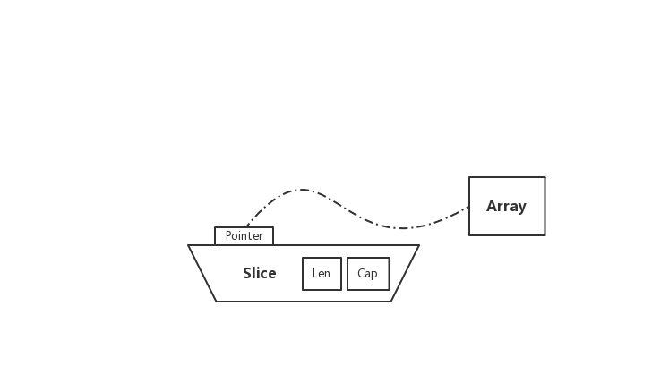
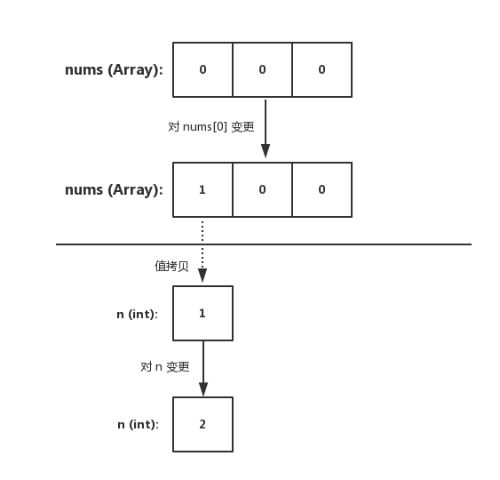
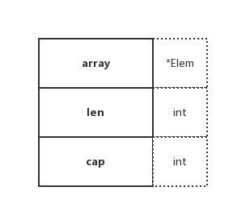
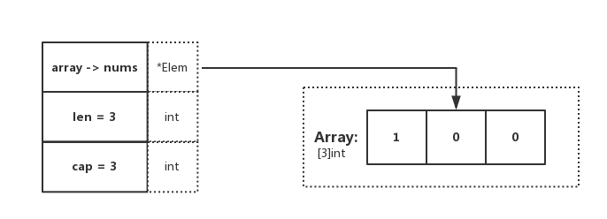
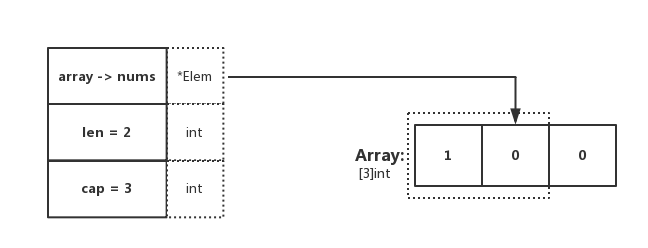
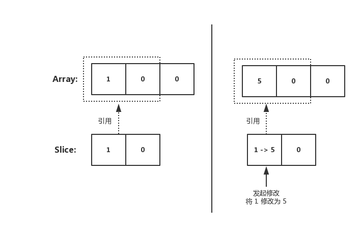
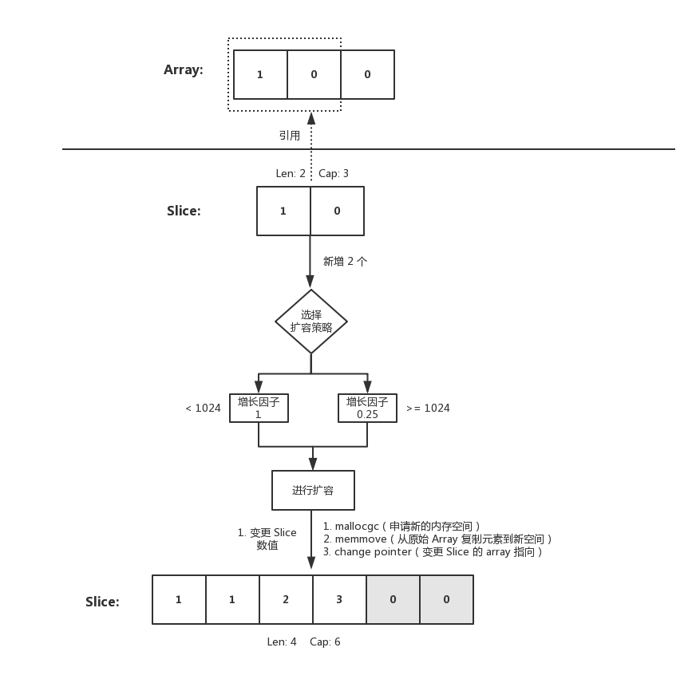
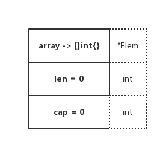
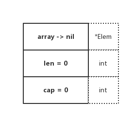

# 7.1 slice



## 是什麼

在 Go 中，Slice（切片）是抽象在 Array（陣列）之上的特殊型別。為了更好地瞭解 Slice，第一步需要先對 Array 進行理解。深刻了解 Slice 與 Array 之間的區別後，就能更好的對其底層一番摸索 😄

## 用法

### Array

```go
func main() {
    nums := [3]int{}
    nums[0] = 1

    n := nums[0]
    n = 2

    fmt.Printf("nums: %v\n", nums)
    fmt.Printf("n: %d\n", n)
}
```
我們可得知在 Go 中，陣列型別需要指定長度和元素型別。在上述程式碼中，可得知 `[3]int{}` 表示 3 個整數的陣列，並進行了初始化。底層資料儲存為一段連續的記憶體空間，透過固定的索引值（下標）進行檢索



陣列在聲明後，其元素的初始值（也就是零值）為 0。並且該變數可以直接使用，不需要特殊操作

同時陣列的長度是固定的，它的長度是型別的一部分，因此 `[3]int` 和 `[4]int` 在型別上是不同的，不能稱為 “一個東西”

#### 輸出結果

```
nums: [1 0 0] 
n: 2
```

### Slice

```go
func main() {
    nums := [3]int{}
    nums[0] = 1

    dnums := nums[:]

    fmt.Printf("dnums: %v", dnums)
}
```
Slice 是對 Array 的抽象，型別為 `[]T`。在上述程式碼中，`dnums` 變數透過 `nums[:]` 進行賦值。需要注意的是，Slice 和 Array 不一樣，它不需要指定長度。也更加的靈活，能夠自動擴容

## 資料結構



```go
type slice struct {
    array unsafe.Pointer
    len   int
    cap   int
}
```
Slice 的底層資料結構共分為三部分，如下：

* array：指向所引用的陣列指標（`unsafe.Pointer` 可以表示任何可定址的值的指標）
* len：長度，當前引用切片的元素個數
* cap：容量，當前引用切片的容量（底層陣列的元素總數）

在實際使用中，cap 一定是大於或等於 len 的。否則會導致 panic

### 示例

為了更好的理解，我們回顧上小節的程式碼便於演示，如下：

```go
func main() {
    nums := [3]int{}
    nums[0] = 1

    dnums := nums[:]

    fmt.Printf("dnums: %v", dnums)
}
```


在程式碼中，可觀察到 `dnums := nums[:]`，這段程式碼確定了 Slice 的 Pointer 指向陣列，且 len 和 cap 都為陣列的基礎屬性。與圖示表達一致

### len、cap 不同

```go
func main() {
    nums := [3]int{}
    nums[0] = 1

    dnums := nums[0:2]

    fmt.Printf("dnums: %v, len: %d, cap: %d", dnums, len(dnums), cap(dnums))
}
```


#### 輸出結果

```
dnums: [1 0], len: 2, cap: 3
```

顯然，在這裡指定了 `Slice[0:2]`，因此 len 為所引用元素的個數，cap 為所引用的陣列元素總個數。與期待一致 😄

## 建立

Slice 的建立有兩種方式，如下：

* `var []T` 或 `[]T{}`
* `func make（[] T，len，cap）[] T`

可以留意 make 函式，我們都知道 Slice 需要指向一個 Array。那 make 是怎麼做的呢？

它會在呼叫 make 的時候，分配一個數組並返回引用該陣列的 Slice

```go
func makeslice(et *_type, len, cap int) slice {
    maxElements := maxSliceCap(et.size)
    if len < 0 || uintptr(len) > maxElements {
        panic(errorString("makeslice: len out of range"))
    }

    if cap < len || uintptr(cap) > maxElements {
        panic(errorString("makeslice: cap out of range"))
    }

    p := mallocgc(et.size*uintptr(cap), et, true)
    return slice{p, len, cap}
}
```
* 根據傳入的 Slice 型別，取得其型別能夠申請的最大容量大小
* 判斷 len 是否合規，檢查是否在 0 < x < maxElements 範圍內
* 判斷 cap 是否合規，檢查是否在 len < x < maxElements 範圍內
* 申請 Slice 所需的記憶體空間物件。若為大型物件（大於 32 KB）則直接從堆中分配
* 返回申請成功的 Slice 記憶體地址和相關屬性（預設返回申請到的記憶體起始地址）

## 擴容

當使用 Slice 時，若儲存的元素不斷增長（例如透過 append）。當條件滿足擴容的策略時，將會觸發自動擴容

那麼分別是什麼規則呢？讓我們一起看看原始碼是怎麼說的 😄

### zerobase

```go
func growslice(et *_type, old slice, cap int) slice {
    ...
    if et.size == 0 {
        if cap < old.cap {
            panic(errorString("growslice: cap out of range"))
        }

        return slice{unsafe.Pointer(&zerobase), old.len, cap}
    }
    ...
}
```
當 Slice size 為 0 時，若將要擴容的容量比原本的容量小，則丟擲異常（也就是不支援縮容操作）。否則，將重新生成一個新的 Slice 返回，其 Pointer 指向一個 0 byte 地址（不會保留老的 Array 指向）

### 擴容 - 計算策略

```go
func growslice(et *_type, old slice, cap int) slice {
    ...
    newcap := old.cap
    doublecap := newcap + newcap
    if cap > doublecap {
        newcap = cap
    } else {
        if old.len < 1024 {
            newcap = doublecap
        } else {
            for 0 < newcap && newcap < cap {
                newcap += newcap / 4
            }
            ...
        }
    }
    ...
}
```
* 若 Slice cap 大於 doublecap，則擴容後容量大小為 新 Slice 的容量（超了基準值，我就只給你需要的容量大小）
* 若 Slice len 小於 1024 個，在擴容時，增長因子為 1（也就是 3 個變 6 個）
* 若 Slice len 大於 1024 個，在擴容時，增長因子為 0.25（原本容量的四分之一）

注：也就是小於 1024 個時，增長 2 倍。大於 1024 個時，增長 1.25 倍

### 擴容 - 記憶體策略

```go
func growslice(et *_type, old slice, cap int) slice {
    ...
    var overflow bool
    var lenmem, newlenmem, capmem uintptr
    const ptrSize = unsafe.Sizeof((*byte)(nil))
    switch et.size {
    case 1:
        lenmem = uintptr(old.len)
        newlenmem = uintptr(cap)
        capmem = roundupsize(uintptr(newcap))
        overflow = uintptr(newcap) > _MaxMem
        newcap = int(capmem)
        ...
    }

    if cap < old.cap || overflow || capmem > _MaxMem {
        panic(errorString("growslice: cap out of range"))
    }

    var p unsafe.Pointer
    if et.kind&kindNoPointers != 0 {
        p = mallocgc(capmem, nil, false)
        memmove(p, old.array, lenmem)
        memclrNoHeapPointers(add(p, newlenmem), capmem-newlenmem)
    } else {
        p = mallocgc(capmem, et, true)
        if !writeBarrier.enabled {
            memmove(p, old.array, lenmem)
        } else {
            for i := uintptr(0); i < lenmem; i += et.size {
                typedmemmove(et, add(p, i), add(old.array, i))
            }
        }
    }
    ...
}
```
1、取得老 Slice 長度和計算假定擴容後的新 Slice 元素長度、容量大小以及指標地址（用於後續操作記憶體的一系列操作）

2、確定新 Slice 容量大於老 Sice，並且新容量記憶體小於指定的最大記憶體、沒有溢位。否則丟擲異常

3、若元素型別為 `kindNoPointers`，也就是**非指標**型別。則在老 Slice 後繼續擴容

* 第一步：根據先前計算的 `capmem`，在老 Slice cap 後繼續申請記憶體空間，其後用於擴容
* 第二步：將 old.array 上的 n 個 bytes（根據 lenmem）複製到新的記憶體空間上
* 第三步：新記憶體空間（p）加上新 Slice cap 的容量地址。最終得到完整的新 Slice cap 記憶體地址 `add(p, newlenmem)` （ptr）
* 第四步：從 ptr 開始重新初始化 n 個 bytes（capmem-newlenmem）

注：那麼問題來了，為什麼要重新初始化這塊記憶體呢？這是因為 ptr 是未初始化的記憶體（例如：可重用的記憶體，一般用於新的記憶體分配），其可能包含 “垃圾”。因此在這裡應當進行 “清理”。便於後面實際使用（擴容）

4、不滿足 3 的情況下，重新申請並初始化一塊記憶體給新 Slice 用於儲存 Array

5、檢測當前是否正在執行 GC，也就是當前是否啟用 Write Barrier（寫屏障），若**啟用**則透過 `typedmemmove` 方法，利用指標運算**迴圈複製**。否則透過 `memmove` 方法採取**整體複製**的方式將 lenmem 個位元組從 old.array 複製到 ptr，以此達到更高的效率

注：一般會在 GC 標記階段啟用 Write Barrier，並且 Write Barrier 只針對指標啟用。那麼在第 5 點中，你就不難理解為什麼會有兩種截然不同的處理方式了

#### 小結

這裡需要注意的是，擴容時的記憶體管理的選擇項，如下：

* 翻新擴充套件：當前元素為 `kindNoPointers`，將在老 Slice cap 的地址後繼續申請空間用於擴容
* 舉家搬遷：重新申請一塊記憶體地址，整體遷移並擴容

### 兩個小 “陷阱”

#### 一、同根

```go
func main() {
    nums := [3]int{}
    nums[0] = 1

    fmt.Printf("nums: %v , len: %d, cap: %d\n", nums, len(nums), cap(nums))

    dnums := nums[0:2]
    dnums[0] = 5

    fmt.Printf("nums: %v ,len: %d, cap: %d\n", nums, len(nums), cap(nums))
    fmt.Printf("dnums: %v, len: %d, cap: %d\n", dnums, len(dnums), cap(dnums))
}
```
輸出結果：

```
nums: [1 0 0] , len: 3, cap: 3
nums: [5 0 0] ,len: 3, cap: 3
dnums: [5 0], len: 2, cap: 3
```

在**未擴容前**，Slice array 指向所引用的 Array。因此在 Slice 上的變更。會直接修改到原始 Array 上（兩者所引用的是同一個）



#### 二、時過境遷

隨著 Slice 不斷 append，內在的元素越來越多，終於觸發了擴容。如下程式碼：

```go
func main() {
    nums := [3]int{}
    nums[0] = 1

    fmt.Printf("nums: %v , len: %d, cap: %d\n", nums, len(nums), cap(nums))

    dnums := nums[0:2]
    dnums = append(dnums, []int{2, 3}...)
    dnums[1] = 1

    fmt.Printf("nums: %v ,len: %d, cap: %d\n", nums, len(nums), cap(nums))
    fmt.Printf("dnums: %v, len: %d, cap: %d\n", dnums, len(dnums), cap(dnums))
}
```
輸出結果：

```
nums: [1 0 0] , len: 3, cap: 3
nums: [1 0 0] ,len: 3, cap: 3
dnums: [1 1 2 3], len: 4, cap: 6
```

往 Slice append 元素時，若滿足擴容策略，也就是假設插入後，原本陣列的容量就超過最大值了

這時候內部就會重新申請一塊記憶體空間，將原本的元素**複製**一份到新的記憶體空間上。此時其與原本的陣列就沒有任何關聯關係了，**再進行修改值也不會變動到原始陣列**。這是需要注意的



## 複製

### 原型

```
func copy（dst，src [] T）int
```

copy 函式將資料從**源 Slice**複製到**目標 Slice**。它返回複製的元素數。

### 示例

```go
func main() {
    dst := []int{1, 2, 3}
    src := []int{4, 5, 6, 7, 8}
    n := copy(dst, src)

    fmt.Printf("dst: %v, n: %d", dst, n)
}
```
copy 函式支援在不同長度的 Slice 之間進行復制，若出現長度不一致，在複製時會按照最少的 Slice 元素個數進行復制

那麼在原始碼中是如何完成複製這一個行為的呢？我們來一起看看原始碼的實作，如下：

```go
func slicecopy(to, fm slice, width uintptr) int {
    if fm.len == 0 || to.len == 0 {
        return 0
    }

    n := fm.len
    if to.len < n {
        n = to.len
    }

    if width == 0 {
        return n
    }

    ...

    size := uintptr(n) * width
    if size == 1 {
        *(*byte)(to.array) = *(*byte)(fm.array) // known to be a byte pointer
    } else {
        memmove(to.array, fm.array, size)
    }
    return n
}
```
* 若源 Slice 或目標 Slice 存在長度為 0 的情況，則直接返回 0（因為壓根不需要執行復制行為）
* 透過對比兩個 Slice，取得最小的 Slice 長度。便於後續操作
* 若 Slice 只有一個元素，則直接利用指標的特性進行轉換
* 若 Slice 大於一個元素，則從 `fm.array` 複製 `size` 個位元組到 `to.array` 的地址處（會覆蓋原有的值）

## "奇特"的初始化

在 Slice 中流傳著兩個傳說，分別是 Empty 和 Nil Slice，接下來讓我們看看它們的小區別 🤓

### Empty

```go
func main() {
    nums := []int{}
    renums := make([]int, 0)

    fmt.Printf("nums: %v, len: %d, cap: %d\n", nums, len(nums), cap(nums))
    fmt.Printf("renums: %v, len: %d, cap: %d\n", renums, len(renums), cap(renums))
}
```
輸出結果：

```
nums: [], len: 0, cap: 0
renums: [], len: 0, cap: 0
```

### Nil

```go
func main() {
    var nums []int
}
```
輸出結果：

```
nums: [], len: 0, cap: 0
```

### 想一想

乍一看，Empty Slice 和 Nil Slice 好像一模一樣？不管是 len，還是 cap 都為 0。好像沒區別？我們再看看如下程式碼：

```go
func main() {
    var nums []int
    renums := make([]int, 0)
    if nums == nil {
        fmt.Println("nums is nil.")
    }
    if renums == nil {
        fmt.Println("renums is nil.")
    }
}
```
你覺得輸出結果是什麼呢？你可能已經想到了，最終的輸出結果：

```
nums is nil.
```

#### 為什麼

**Empty**



**Nil**



從圖示中可以看出來，兩者有本質上的區別。其底層陣列的指向指標是不一樣的，Nil Slice 指向的是 nil，Empty Slice 指向的是實際存在的空陣列地址

你可以認為，Nil Slice 代指不存在的 Slice，Empty Slice 代指空集合。兩者所代表的意義是完全不同的

## 總結

透過本文，可得知 Go Slice 相當靈活。不需要你手動擴容，也不需要你關注加多少減多少。對 Array 是動態引用，是 Go 型別的一個極大的補充，也因此在應用中使用的更多、更便捷

雖然有個別要注意的 “坑”，但其實是合理的。你覺得呢？😄
