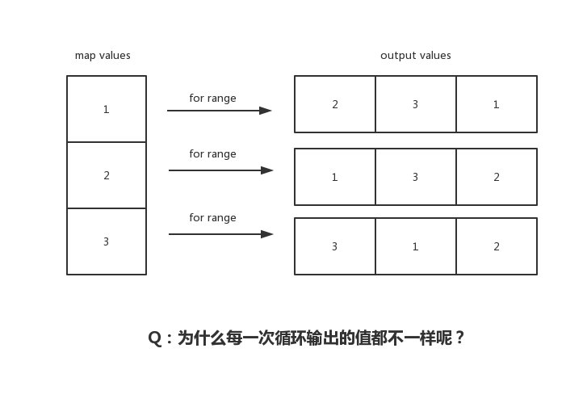

# 7.5 map：為什麼遍歷 map 是無序的



有的小夥伴沒留意過 Go map 輸出順序，以為它是穩定的有序的；有的小夥伴知道是無序的，但卻不知道為什麼？有的卻理解錯誤？今天我們將透過本文，揭開 `for range map` 的 “神秘” 面紗，看看它內部實作到底是怎麼樣的，輸出順序到底是怎麼樣？

## 前言

```go
func main() {
    m := make(map[int32]string)
    m[0] = "EDDYCJY1"
    m[1] = "EDDYCJY2"
    m[2] = "EDDYCJY3"
    m[3] = "EDDYCJY4"
    m[4] = "EDDYCJY5"

    for k, v := range m {
        log.Printf("k: %v, v: %v", k, v)
    }
}
```
假設執行這段程式碼，輸出結果是按順序？還是無序輸出呢？

```
2019/04/03 23:27:29 k: 3, v: EDDYCJY4
2019/04/03 23:27:29 k: 4, v: EDDYCJY5
2019/04/03 23:27:29 k: 0, v: EDDYCJY1
2019/04/03 23:27:29 k: 1, v: EDDYCJY2
2019/04/03 23:27:29 k: 2, v: EDDYCJY3
```

從輸出結果上來講，是非固定順序輸出的，也就是每次都不一樣（標題也講了）。但這是為什麼呢？

首先**建議你先自己想想原因**。其次我在面試時聽過一些說法。有人說因為是雜湊的所以就是無（亂）序等等說法。當時我是有點 ？？？

這也是這篇文章出現的原因，希望大家可以一起研討一下，理清這個問題 ：）

## 看一下彙編

```
    ...
    0x009b 00155 (main.go:11)    LEAQ    type.map[int32]string(SB), AX
    0x00a2 00162 (main.go:11)    PCDATA    $2, $0
    0x00a2 00162 (main.go:11)    MOVQ    AX, (SP)
    0x00a6 00166 (main.go:11)    PCDATA    $2, $2
    0x00a6 00166 (main.go:11)    LEAQ    ""..autotmp_3+24(SP), AX
    0x00ab 00171 (main.go:11)    PCDATA    $2, $0
    0x00ab 00171 (main.go:11)    MOVQ    AX, 8(SP)
    0x00b0 00176 (main.go:11)    PCDATA    $2, $2
    0x00b0 00176 (main.go:11)    LEAQ    ""..autotmp_2+72(SP), AX
    0x00b5 00181 (main.go:11)    PCDATA    $2, $0
    0x00b5 00181 (main.go:11)    MOVQ    AX, 16(SP)
    0x00ba 00186 (main.go:11)    CALL    runtime.mapiterinit(SB)
    0x00bf 00191 (main.go:11)    JMP    207
    0x00c1 00193 (main.go:11)    PCDATA    $2, $2
    0x00c1 00193 (main.go:11)    LEAQ    ""..autotmp_2+72(SP), AX
    0x00c6 00198 (main.go:11)    PCDATA    $2, $0
    0x00c6 00198 (main.go:11)    MOVQ    AX, (SP)
    0x00ca 00202 (main.go:11)    CALL    runtime.mapiternext(SB)
    0x00cf 00207 (main.go:11)    CMPQ    ""..autotmp_2+72(SP), $0
    0x00d5 00213 (main.go:11)    JNE    193
    ...
```

我們大致看一下整體過程，重點處理 Go map 迴圈迭代的是兩個 runtime 方法，如下：

* runtime.mapiterinit
* runtime.mapiternext

但你可能會想，明明用的是 `for range` 進行迴圈迭代，怎麼出現了這兩個函式，怎麼回事？

## 看一下轉換後

```
var hiter map_iteration_struct
for mapiterinit(type, range, &hiter); hiter.key != nil; mapiternext(&hiter) {
    index_temp = *hiter.key
    value_temp = *hiter.val
    index = index_temp
    value = value_temp
    original body
}
```

實際上編譯器對於 slice 和 map 的迴圈迭代有不同的實作方式，並不是 `for` 一扔就完事了，還做了一些附加動作進行處理。而上述程式碼就是 `for range map` 在編譯器展開後的偽實作

## 看一下原始碼

### runtime.mapiterinit

```go
func mapiterinit(t *maptype, h *hmap, it *hiter) {
    ...
    it.t = t
    it.h = h
    it.B = h.B
    it.buckets = h.buckets
    if t.bucket.kind&kindNoPointers != 0 {
        h.createOverflow()
        it.overflow = h.extra.overflow
        it.oldoverflow = h.extra.oldoverflow
    }

    r := uintptr(fastrand())
    if h.B > 31-bucketCntBits {
        r += uintptr(fastrand()) << 31
    }
    it.startBucket = r & bucketMask(h.B)
    it.offset = uint8(r >> h.B & (bucketCnt - 1))
    it.bucket = it.startBucket
    ...

    mapiternext(it)
}
```
透過對 `mapiterinit` 方法閱讀，可得知其主要用途是在 map 進行遍歷迭代時**進行初始化動作**。共有三個形參，用於讀取當前雜湊表的型別資訊、當前雜湊表的儲存資訊和當前遍歷迭代的資料

#### 為什麼

咱們關注到原始碼中 `fastrand` 的部分，這個方法名，是不是迷之眼熟。沒錯，它是一個生成隨機數的方法。再看看上下文：

```
...
// decide where to start
r := uintptr(fastrand())
if h.B > 31-bucketCntBits {
    r += uintptr(fastrand()) << 31
}
it.startBucket = r & bucketMask(h.B)
it.offset = uint8(r >> h.B & (bucketCnt - 1))

// iterator state
it.bucket = it.startBucket
```

在這段程式碼中，它生成了隨機數。用於決定從哪裡開始迴圈迭代。更具體的話就是根據隨機數，選擇一個桶位置作為起始點進行遍歷迭代

因此每次重新 `for range map`，你見到的結果都是不一樣的。那是因為它的起始位置根本就不固定！

### runtime.mapiternext

```go
func mapiternext(it *hiter) {
    ...
    for ; i < bucketCnt; i++ {
        ...
        k := add(unsafe.Pointer(b), dataOffset+uintptr(offi)*uintptr(t.keysize))
        v := add(unsafe.Pointer(b), dataOffset+bucketCnt*uintptr(t.keysize)+uintptr(offi)*uintptr(t.valuesize))
        ...
        if (b.tophash[offi] != evacuatedX && b.tophash[offi] != evacuatedY) ||
            !(t.reflexivekey || alg.equal(k, k)) {
            ...
            it.key = k
            it.value = v
        } else {
            rk, rv := mapaccessK(t, h, k)
            if rk == nil {
                continue // key has been deleted
            }
            it.key = rk
            it.value = rv
        }
        it.bucket = bucket
        if it.bptr != b { 
            it.bptr = b
        }
        it.i = i + 1
        it.checkBucket = checkBucket
        return
    }
    b = b.overflow(t)
    i = 0
    goto next
}
```
在上小節中，咱們已經選定了起始桶的位置。接下來就是透過 `mapiternext` 進行**具體的迴圈遍歷動作**。該方法主要涉及如下：

* 從已選定的桶中開始進行遍歷，尋找桶中的下一個元素進行處理
* 如果桶已經遍歷完，則對溢位桶 `overflow buckets` 進行遍歷處理

透過對本方法的閱讀，可得知其對 buckets 的**遍歷規則**以及對於擴容的一些處理（這不是本文重點。因此沒有具體展開）

## 總結

在本文開始，咱們先提出核心討論點：“為什麼 Go map 遍歷輸出是不固定順序？”。而透過這一番分析，原因也很簡單明瞭。就是 `for range map` 在開始處理迴圈邏輯的時候，就做了隨機播種...

你想問為什麼要這麼做？當然是官方有意為之，因為 Go 在早期（1.0）的時候，雖是穩定迭代的，但從結果來講，其實是無法保證每個 Go 版本迭代遍歷規則都是一樣的。而這將會導致可移植性問題。因此，改之。也請不要依賴...

## 參考

* [Go maps in action](https://blog.golang.org/go-maps-in-action)
