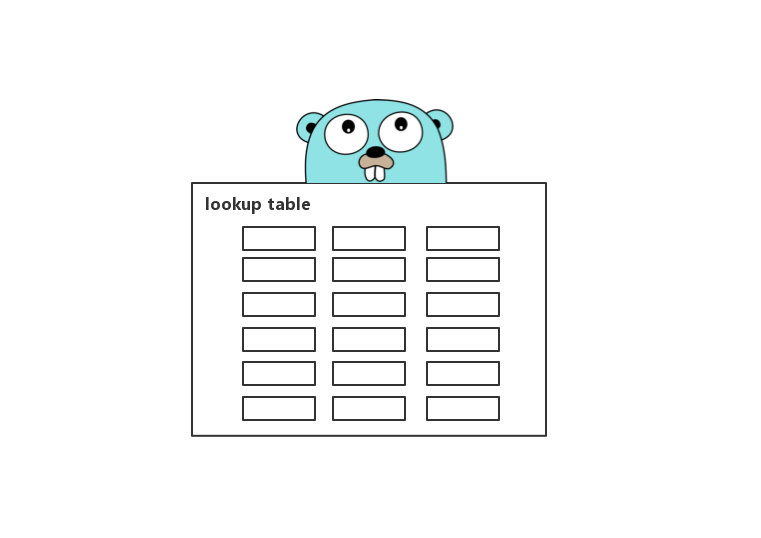

# 7.2 slice：最大容量大小是怎麼來的



## 前言

在《深入理解 Go Slice》中，我們提到了 “根據其型別大小去取得能夠申請的最大容量大小” 的處理邏輯。今天我們將更深入地去探究一下，底層到底做了什麼東西，涉及什麼知識點？

Go Slice 對應程式碼如下：

```go
func makeslice(et *_type, len, cap int) slice {
    maxElements := maxSliceCap(et.size)
    if len < 0 || uintptr(len) > maxElements {
        ...
    }

    if cap < len || uintptr(cap) > maxElements {
        ...
    }

    p := mallocgc(et.size*uintptr(cap), et, true)
    return slice{p, len, cap}
}
```
根據想要追尋的邏輯，定位到了 `maxSliceCap` 方法，它會根據**當前型別的大小取得到了所允許的最大容量大小**來進行閾值判斷，也就是安全檢查。這是淺層的瞭解，我們繼續追下去看看還做了些什麼？

## maxSliceCap

```go
func maxSliceCap(elemsize uintptr) uintptr {
    if elemsize < uintptr(len(maxElems)) {
        return maxElems[elemsize]
    }
    return maxAlloc / elemsize
}
```
## maxElems

```go
var maxElems = [...]uintptr{
    ^uintptr(0),
    maxAlloc / 1, maxAlloc / 2, maxAlloc / 3, maxAlloc / 4,
    maxAlloc / 5, maxAlloc / 6, maxAlloc / 7, maxAlloc / 8,
    maxAlloc / 9, maxAlloc / 10, maxAlloc / 11, maxAlloc / 12,
    maxAlloc / 13, maxAlloc / 14, maxAlloc / 15, maxAlloc / 16,
    maxAlloc / 17, maxAlloc / 18, maxAlloc / 19, maxAlloc / 20,
    maxAlloc / 21, maxAlloc / 22, maxAlloc / 23, maxAlloc / 24,
    maxAlloc / 25, maxAlloc / 26, maxAlloc / 27, maxAlloc / 28,
    maxAlloc / 29, maxAlloc / 30, maxAlloc / 31, maxAlloc / 32,
}
```

`maxElems` 是包含一些預定義的切片最大容量值的查詢表，索引是切片元素的型別大小。而值看起來 “奇奇怪怪” 不大眼熟，都是些什麼呢。主要是以下三個核心點：

* ^uintptr(0)
* maxAlloc
* maxAlloc / typeSize

### ^uintptr(0)

```go
func main() {
    log.Printf("uintptr: %v\n", uintptr(0))
    log.Printf("^uintptr: %v\n", ^uintptr(0))
}
```
輸出結果：

```
2019/01/05 17:51:52 uintptr: 0
2019/01/05 17:51:52 ^uintptr: 18446744073709551615
```

我們留意一下輸出結果，比較神奇。取反之後為什麼是 18446744073709551615 呢？

### uintptr 是什麼

在分析之前，我們要知道 uintptr 的本質（真面目），也就是它的型別是什麼，如下：

```
type uintptr uintptr
```

uintptr 的型別是自定義型別，接著找它的真面目，如下：

```
#ifdef _64BIT
typedef    uint64        uintptr;
#else
typedef    uint32        uintptr;
#endif
```

透過對以上程式碼的分析，可得出以下結論：

* 在 32 位系統下，uintptr 為 uint32 型別，佔用大小為 4 個位元組
* 在 64 位系統下，uintptr 為 uint64 型別，佔用大小為 8 個位元組

### ^uintptr 做了什麼事

^ 位運算子的作用是**按位異或**，如下：

```go
func main() {
    log.Println(^1)
    log.Println(^uint64(0))
}
```
輸出結果：

```
2019/01/05 20:44:49 -2
2019/01/05 20:44:49 18446744073709551615
```

接下來我們分析一下，這兩段程式碼都做了什麼事情呢

#### ^1

二進位制：0001

按位取反：1110

該數為有符號整數，最高位為符號位。低三位為表示數值。按位取反後為 1110，根據先前的說明，最高位為 1，因此表示為 -。取反後 110 對應十進位制 -2

#### ^uint64(0)

二進位制：0000 0000 0000 0000 0000 0000 0000 0000 0000 0000 0000 0000 0000 0000 0000 0000

按位取反：1111 1111 1111 1111 1111 1111 1111 1111 1111 1111 1111 1111 1111 1111 1111 1111

該數為無符號整數，該位取反後得到十進位制值為：18446744073709551615

這個值是不是看起來很眼熟呢？沒錯，就是 `^uintptr(0)` 的值。也印證了其底層資料型別為 uint64 的事實 （本機為 64 位）。同時它又代表如下：

* math.MaxUint64
* 2 的 64 次方減 1

### maxAlloc

```go
const GoarchMips = 0
const GoarchMipsle = 0
const GoarchWasm = 0

...

_64bit = 1 << (^uintptr(0) >> 63) / 2

heapAddrBits = (_64bit*(1-sys.GoarchWasm))*48 + (1-_64bit+sys.GoarchWasm)*(32-(sys.GoarchMips+sys.GoarchMipsle))

maxAlloc = (1 << heapAddrBits) - (1-_64bit)*1
```

`maxAlloc` 是**允許使用者分配的最大虛擬記憶體空間**。在 64 位，理論上可分配最大 `1 << heapAddrBits` 位元組。在 32 位，最大可分配小於 `1 << 32` 位元組

在本文，僅需瞭解它承載的是什麼就好了。具體的在以後記憶體管理的文章再講述

注：該變數在 go 10.1 為 `_MaxMem`，go 11.4 已改為 `maxAlloc`。相關的 `heapAddrBits` 計算方式也有所改變

### maxAlloc / typeSize

我們再次回顧 `maxSliceCap` 的邏輯程式碼，這次重點放在控制邏輯，如下：

```
// func makeslice
maxElements := maxSliceCap(et.size)

...

// func maxSliceCap
if elemsize < uintptr(len(maxElems)) {
    return maxElems[elemsize]
}
return maxAlloc / elemsize
```

透過這段程式碼和 Slice 上下文邏輯，可得知在想得到該型別的最大容量大小時。會根據對應的型別大小去查詢表查詢索引（索引為型別大小，擺放順序是有考慮原因的）。“迫不得已的情況下” 才會手動的計算它的值，最終計算得到的記憶體位元組大小都為該型別大小的整數倍

查詢表的設定，更像是一個最佳化邏輯。減少常用的計算開銷 :)

## 總結

透過本文的分析，可得出 Slice 所允許申請的最大容量大小，與當前**值型別**和當前**平臺位數**有直接關係

## 最後

本文與[《有點不安全卻又一亮的 Go unsafe.Pointer》](https://github.com/EDDYCJY/blog/blob/master/golang/pkg/2018-12-15-%E6%9C%89%E7%82%B9%E4%B8%8D%E5%AE%89%E5%85%A8%E5%8D%B4%E5%8F%88%E4%B8%80%E4%BA%AE%E7%9A%84Go-unsafe-Pointer.md)一同屬於[《深入理解 Go Slice》](https://github.com/EDDYCJY/blog/blob/master/golang/pkg/2018-12-11-%E6%B7%B1%E5%85%A5%E7%90%86%E8%A7%A3Go-Slice.md)的關聯章節。如果你在閱讀原始碼時，對這些片段有疑惑。記得想盡辦法深究下去，搞懂它

短短的一句話其實蘊含著不少知識點，希望這篇文章恰恰好可以幫你解惑

注：本文 Go 程式碼基於版本 11.4
