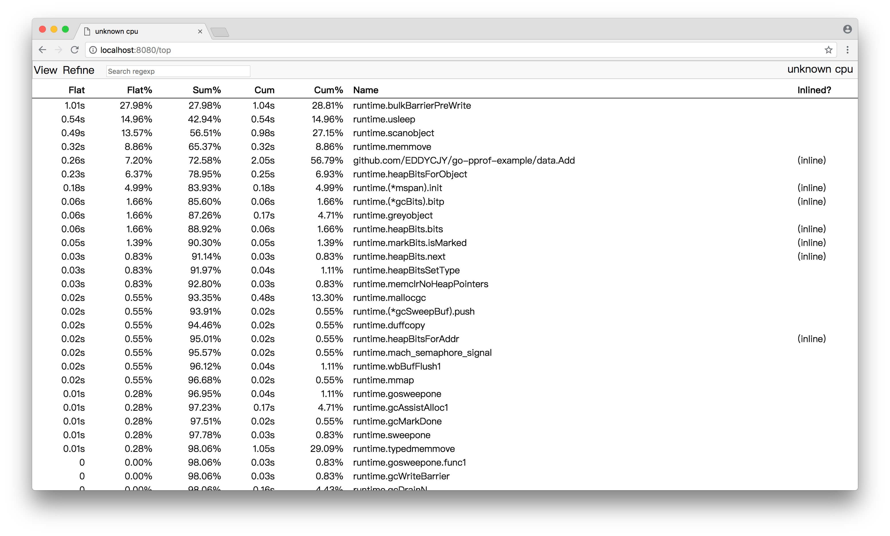
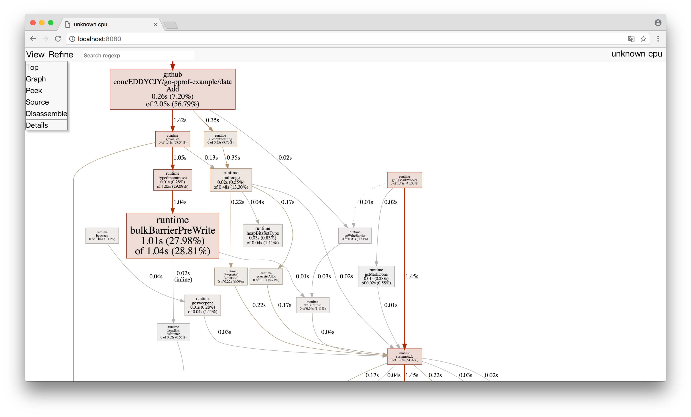
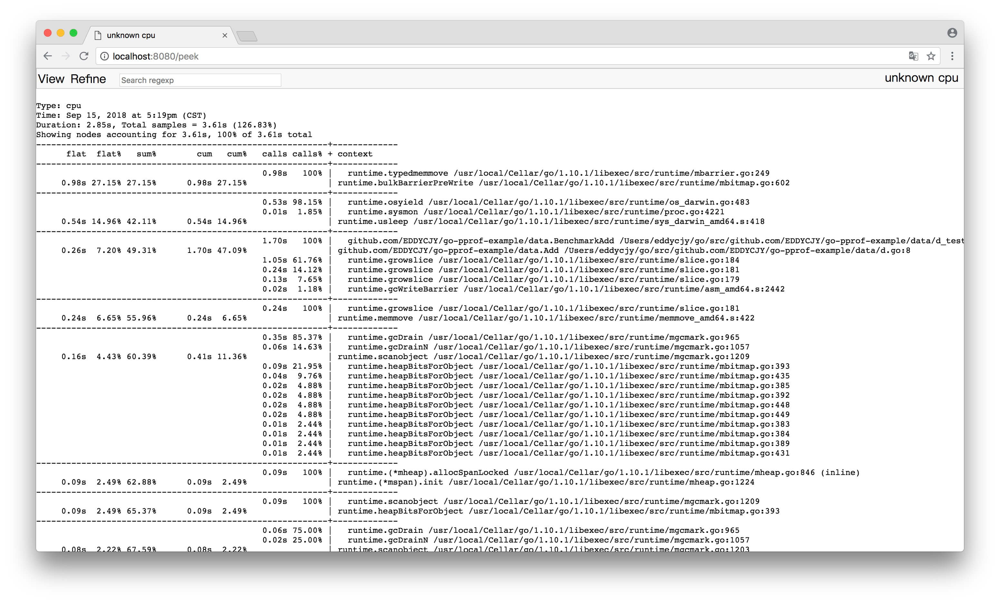
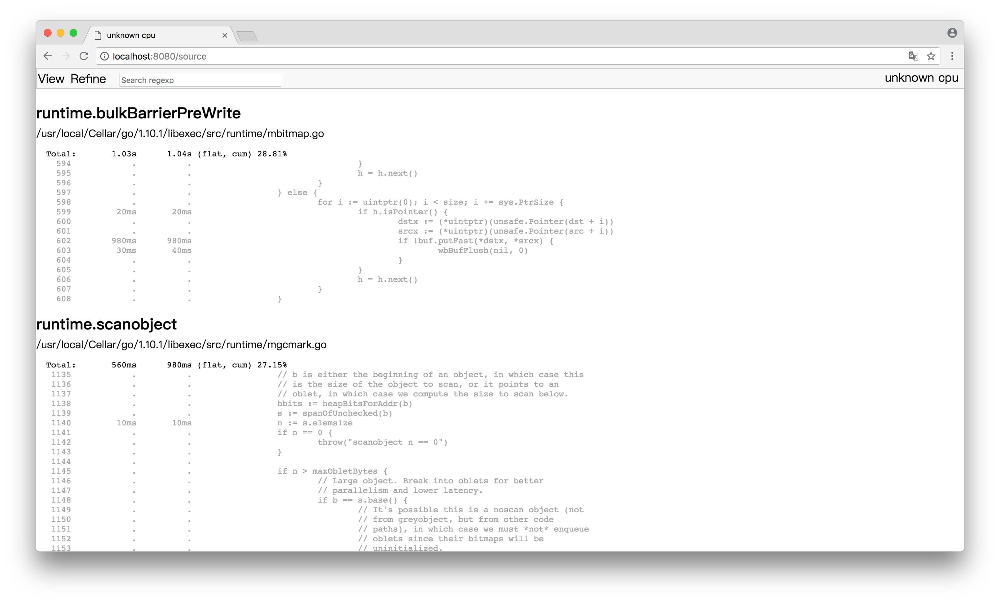
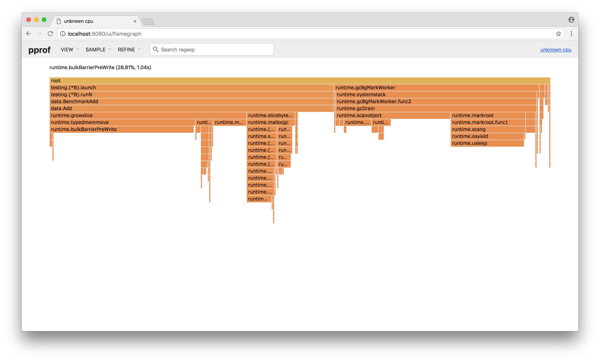

# 9.1 Go 大殺器之效能剖析 PProf

## 前言

寫了幾噸程式碼，實作了幾百個介面。功能測試也通過了，終於成功的部署上線了

結果，效能不佳，什麼鬼？😭

## 想做效能分析

### PProf

想要進行效能最佳化，首先矚目在 Go 自身提供的工具鏈來作為分析依據，本文將帶你學習、使用 Go 後花園，涉及如下：

* runtime/pprof：採集程式（非 Server）的執行資料進行分析
* net/http/pprof：採集 HTTP Server 的執行時資料進行分析

### 是什麼

pprof 是用於視覺化和分析效能分析資料的工具

pprof 以 [profile.proto](https://github.com/google/pprof/blob/master/proto/profile.proto) 讀取分析樣本的集合，並生成報告以視覺化並幫助分析資料（支援文字和圖形報告）

profile.proto 是一個 Protocol Buffer v3 的描述檔案，它描述了一組 callstack 和 symbolization 資訊， 作用是表示統計分析的一組取樣的呼叫棧，是很常見的 stacktrace 設定檔案格式

### 支援什麼使用模式

* Report generation：報告生成
* Interactive terminal use：互動式終端使用
* Web interface：Web 介面

### 可以做什麼

* CPU Profiling：CPU 分析，按照一定的頻率採集所監聽的應用程式 CPU（含暫存器）的使用情況，可確定應用程式在主動消耗 CPU 週期時花費時間的位置
* Memory Profiling：記憶體分析，在應用程式進行堆分配時記錄堆疊跟蹤，用於監視當前和歷史記憶體使用情況，以及檢查記憶體洩漏
* Block Profiling：阻塞分析，記錄 goroutine 阻塞等待同步（包括定時器通道）的位置
* Mutex Profiling：互斥鎖分析，報告互斥鎖的競爭情況

## 一個簡單的例子

我們將編寫一個簡單且有點問題的例子，用於基本的程式初步分析

### 編寫 demo 檔案

（1）demo.go，檔案內容：

```go
package main

import (
    "log"
    "net/http"
    _ "net/http/pprof"
    "github.com/EDDYCJY/go-pprof-example/data"
)

func main() {
    go func() {
        for {
            log.Println(data.Add("https://github.com/EDDYCJY"))
        }
    }()

    http.ListenAndServe("0.0.0.0:6060", nil)
}
```
（2）data/d.go，檔案內容：

```go
package data

var datas []string

func Add(str string) string {
    data := []byte(str)
    sData := string(data)
    datas = append(datas, sData)

    return sData
}
```
執行這個檔案，你的 HTTP 服務會多出 /debug/pprof 的 endpoint 可用於觀察應用程式的情況

### 分析

#### 一、透過 Web 介面

檢視當前總覽：訪問 `http://127.0.0.1:6060/debug/pprof/`

```
/debug/pprof/

profiles:
0    block
5    goroutine
3    heap
0    mutex
9    threadcreate

full goroutine stack dump
```

這個頁面中有許多子頁面，咱們繼續深究下去，看看可以得到什麼？

* cpu（CPU Profiling）: `$HOST/debug/pprof/profile`，預設進行 30s 的 CPU Profiling，得到一個分析用的 profile 檔案
* block（Block Profiling）：`$HOST/debug/pprof/block`，檢視導致阻塞同步的堆疊跟蹤
* goroutine：`$HOST/debug/pprof/goroutine`，檢視當前所有執行的 goroutines 堆疊跟蹤
* heap（Memory Profiling）: `$HOST/debug/pprof/heap`，檢視活動物件的記憶體分配情況
* mutex（Mutex Profiling）：`$HOST/debug/pprof/mutex`，檢視導致互斥鎖的競爭持有者的堆疊跟蹤
* threadcreate：`$HOST/debug/pprof/threadcreate`，檢視建立新OS執行緒的堆疊跟蹤

#### 二、透過互動式終端使用

（1）go tool pprof <http://localhost:6060/debug/pprof/profile?seconds=60>

```bash
$ go tool pprof http://localhost:6060/debug/pprof/profile\?seconds\=60

Fetching profile over HTTP from http://localhost:6060/debug/pprof/profile?seconds=60
Saved profile in /Users/eddycjy/pprof/pprof.samples.cpu.007.pb.gz
Type: cpu
Duration: 1mins, Total samples = 26.55s (44.15%)
Entering interactive mode (type "help" for commands, "o" for options)
(pprof)
```

執行該命令後，需等待 60 秒（可調整 seconds 的值），pprof 會進行 CPU Profiling。結束後將預設進入 pprof 的互動式命令模式，可以對分析的結果進行檢視或匯出。具體可執行 `pprof help` 檢視命令說明

```bash
(pprof) top10
Showing nodes accounting for 25.92s, 97.63% of 26.55s total
Dropped 85 nodes (cum <= 0.13s)
Showing top 10 nodes out of 21
      flat  flat%   sum%        cum   cum%
    23.28s 87.68% 87.68%     23.29s 87.72%  syscall.Syscall
     0.77s  2.90% 90.58%      0.77s  2.90%  runtime.memmove
     0.58s  2.18% 92.77%      0.58s  2.18%  runtime.freedefer
     0.53s  2.00% 94.76%      1.42s  5.35%  runtime.scanobject
     0.36s  1.36% 96.12%      0.39s  1.47%  runtime.heapBitsForObject
     0.35s  1.32% 97.44%      0.45s  1.69%  runtime.greyobject
     0.02s 0.075% 97.51%     24.96s 94.01%  main.main.func1
     0.01s 0.038% 97.55%     23.91s 90.06%  os.(*File).Write
     0.01s 0.038% 97.59%      0.19s  0.72%  runtime.mallocgc
     0.01s 0.038% 97.63%     23.30s 87.76%  syscall.Write
```

* flat：給定函式上執行耗時
* flat%：同上的 CPU 執行耗時總比例
* sum%：給定函式累積使用 CPU 總比例
* cum：當前函式加上它之上的呼叫執行總耗時
* cum%：同上的 CPU 執行耗時總比例

最後一列為函式名稱，在大多數的情況下，我們可以透過這五列得出一個應用程式的執行情況，加以最佳化 🤔

（2）go tool pprof <http://localhost:6060/debug/pprof/heap>

```bash
$ go tool pprof http://localhost:6060/debug/pprof/heap
Fetching profile over HTTP from http://localhost:6060/debug/pprof/heap
Saved profile in /Users/eddycjy/pprof/pprof.alloc_objects.alloc_space.inuse_objects.inuse_space.008.pb.gz
Type: inuse_space
Entering interactive mode (type "help" for commands, "o" for options)
(pprof) top
Showing nodes accounting for 837.48MB, 100% of 837.48MB total
      flat  flat%   sum%        cum   cum%
  837.48MB   100%   100%   837.48MB   100%  main.main.func1
```

* -inuse\_space：分析應用程式的常駐記憶體佔用情況
* -alloc\_objects：分析應用程式的記憶體臨時分配情況

（3） go tool pprof <http://localhost:6060/debug/pprof/block>

（4） go tool pprof <http://localhost:6060/debug/pprof/mutex>

#### 三、PProf 視覺化介面

這是令人期待的一小節。在這之前，我們需要簡單的編寫好測試用例來跑一下

**編寫測試用例**

（1）新建 data/d\_test.go，檔案內容：

```go
package data

import "testing"

const url = "https://github.com/EDDYCJY"

func TestAdd(t *testing.T) {
    s := Add(url)
    if s == "" {
        t.Errorf("Test.Add error!")
    }
}

func BenchmarkAdd(b *testing.B) {
    for i := 0; i < b.N; i++ {
        Add(url)
    }
}
```

（2）執行測試用例

```
$ go test -bench=. -cpuprofile=cpu.prof
pkg: github.com/EDDYCJY/go-pprof-example/data
BenchmarkAdd-4       10000000           187 ns/op
PASS
ok      github.com/EDDYCJY/go-pprof-example/data    2.300s
```

-memprofile 也可以瞭解一下

**啟動 PProf 視覺化介面**

**方法一：**

```
$ go tool pprof -http=:8080 cpu.prof
```

**方法二：**

```
$ go tool pprof cpu.prof 
$ (pprof) web
```

如果出現 `Could not execute dot; may need to install graphviz.`，就是提示你要安裝 `graphviz` 了 （請右拐谷歌）

**檢視 PProf 視覺化介面**

（1）Top



（2）Graph



框越大，線越粗代表它佔用的時間越大哦

（3）Peek



（4）Source



透過 PProf 的視覺化介面，我們能夠更方便、更直觀的看到 Go 應用程式的呼叫鏈、使用情況等，並且在 View 選單欄中，還支援如上多種方式的切換

你想想，在煩惱不知道什麼問題的時候，能用這些輔助工具來檢測問題，是不是瞬間效率翻倍了呢 👌

#### 四、PProf 火焰圖

另一種視覺化資料的方法是火焰圖，需手動安裝原生 PProf 工具：

（1） 安裝 PProf

```
$ go get -u github.com/google/pprof
```

（2） 啟動 PProf 視覺化介面:

```
$ pprof -http=:8080 cpu.prof
```

（3） 檢視 PProf 視覺化介面

開啟 PProf 的視覺化介面時，你會明顯發現比官方工具鏈的 PProf 精緻一些，並且多了 Flame Graph（火焰圖）

它就是本次的目標之一，它的最大優點是動態的。呼叫順序由上到下（A -> B -> C -> D），每一塊代表一個函式，越大代表佔用 CPU 的時間更長。同時它也支援點選塊深入進行分析！



## 總結

在本章節，粗略地介紹了 Go 的效能利器 PProf。在特定的場景中，PProf 給定位、剖析問題帶了極大的幫助

希望本文對你有所幫助，另外建議能夠自己實際操作一遍，最好是可以深入琢磨一下，內含大量的用法、知識點 🤓

## 思考題

你很優秀的看到了最後，那麼有兩道簡單的思考題，希望拓展你的思路

（1）flat 一定大於 cum 嗎，為什麼？什麼場景下 cum 會比 flat 大？

（2）本章節的 demo 程式碼，有什麼效能問題？怎麼解決它？
