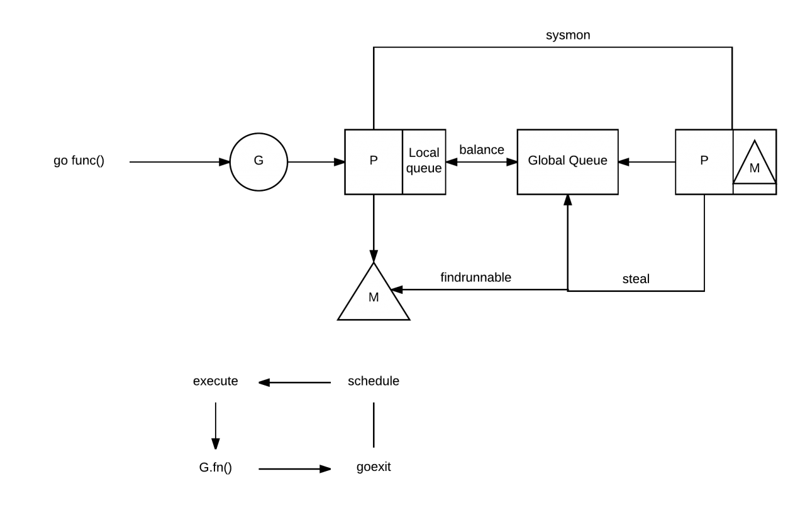
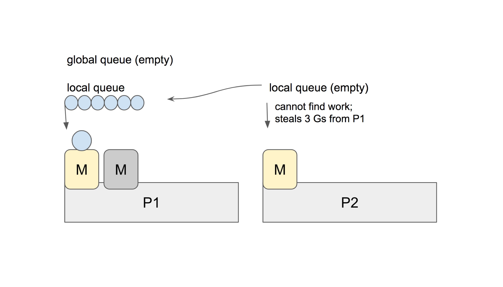

# 9.3 用 GODEBUG 看排程跟蹤


讓 Go 更強大的原因之一莫過於它的 GODEBUG 工具，GODEBUG 的設定可以讓 Go 程式在執行時輸出除錯資訊，可以根據你的要求很直觀的看到你想要的排程器或垃圾回收等詳細資訊，並且還不需要加裝其它的外掛，非常方便，今天我們將先講解 GODEBUG 的排程器相關內容，希望對你有所幫助。

不過在開始前，沒接觸過的小夥伴得先補補如下前置知識，便於更好的瞭解偵錯程式輸出的資訊內容。

## 前置知識

Go scheduler 的主要功能是針對在處理器上執行的 OS 執行緒分發可執行的 Goroutine，而我們一提到排程器，就離不開三個經常被提到的縮寫，分別是：

* G：Goroutine，實際上我們每次呼叫 `go func` 就是生成了一個 G。
* P：處理器，一般為處理器的核數，可以透過 `GOMAXPROCS` 進行修改。
* M：OS 執行緒

這三者互動實際來源於 Go 的 M: N 排程模型，也就是 M 必須與 P 進行繫結，然後不斷地在 M 上迴圈尋找可執行的 G 來執行相應的任務，如果想具體瞭解可以詳細閱讀 [《Go Runtime Scheduler》](https://speakerdeck.com/retervision/go-runtime-scheduler)，我們抽其中的工作流程圖進行簡單分析，如下:



1. 當我們執行 `go func()` 時，實際上就是建立一個全新的 Goroutine，我們稱它為 G。
2. 新建立的 G 會被放入 P 的本地佇列（Local Queue）或全域性佇列（Global Queue）中，準備下一步的動作。
3. 喚醒或建立 M 以便執行 G。
4. 不斷地進行事件迴圈
5. 尋找在可用狀態下的 G 進行執行任務
6. 清除後，重新進入事件迴圈

而在描述中有提到全域性和本地這兩類佇列，其實在功能上來講都是用於存放正在等待執行的 G，但是不同點在於，本地佇列有數量限制，不允許超過 256 個。並且在新建 G 時，會優先選擇 P 的本地佇列，如果本地佇列滿了，則將 P 的本地佇列的一半的 G 移動到全域性佇列，這其實可以理解為排程資源的共享和再平衡。

另外我們可以看到圖上有 steal 行為，這是用來做什麼的呢，我們都知道當你建立新的 G 或者 G 變成可執行狀態時，它會被推送加入到當前 P 的本地佇列中。但其實當 P 執行 G 完畢後，它也會 “幹活”，它會將其從本地佇列中彈出 G，同時會檢查當前本地佇列是否為空，如果為空會隨機的從其他 P 的本地佇列中嘗試竊取一半可執行的 G 到自己的名下。例子如下：



在這個例子中，P2 在本地佇列中找不到可以執行的 G，它會執行 `work-stealing` 排程演算法，隨機選擇其它的處理器 P1，並從 P1 的本地佇列中竊取了三個 G 到它自己的本地佇列中去。至此，P1、P2 都擁有了可執行的 G，P1 多餘的 G 也不會被浪費，排程資源將會更加平均的在多個處理器中流轉。

## GODEBUG

GODEBUG 變數可以控制執行時內的除錯變數，引數以逗號分隔，格式為：`name=val`。本文著重點在排程器觀察上，將會使用如下兩個引數：

* schedtrace：設定 `schedtrace=X` 引數可以使執行時在每 X 毫秒發出一行排程器的摘要資訊到標準 err 輸出中。
* scheddetail：設定 `schedtrace=X` 和 `scheddetail=1` 可以使執行時在每 X 毫秒發出一次詳細的多行資訊，資訊內容主要包括排程程式、處理器、OS 執行緒 和 Goroutine 的狀態。

### 演示程式碼

```go
func main() {
    wg := sync.WaitGroup{}
    wg.Add(10)
    for i := 0; i < 10; i++ {
        go func(wg *sync.WaitGroup) {
            var counter int
            for i := 0; i < 1e10; i++ {
                counter++
            }
            wg.Done()
        }(&wg)
    }

    wg.Wait()
}
```
### schedtrace

```
$ GODEBUG=schedtrace=1000 ./awesomeProject 
SCHED 0ms: gomaxprocs=4 idleprocs=1 threads=5 spinningthreads=1 idlethreads=0 runqueue=0 [0 0 0 0]
SCHED 1000ms: gomaxprocs=4 idleprocs=0 threads=5 spinningthreads=0 idlethreads=0 runqueue=0 [1 2 2 1]
SCHED 2000ms: gomaxprocs=4 idleprocs=0 threads=5 spinningthreads=0 idlethreads=0 runqueue=0 [1 2 2 1]
SCHED 3001ms: gomaxprocs=4 idleprocs=0 threads=5 spinningthreads=0 idlethreads=0 runqueue=0 [1 2 2 1]
SCHED 4010ms: gomaxprocs=4 idleprocs=0 threads=5 spinningthreads=0 idlethreads=0 runqueue=0 [1 2 2 1]
SCHED 5011ms: gomaxprocs=4 idleprocs=0 threads=5 spinningthreads=0 idlethreads=0 runqueue=0 [1 2 2 1]
SCHED 6012ms: gomaxprocs=4 idleprocs=0 threads=5 spinningthreads=0 idlethreads=0 runqueue=0 [1 2 2 1]
SCHED 7021ms: gomaxprocs=4 idleprocs=0 threads=5 spinningthreads=0 idlethreads=0 runqueue=4 [0 1 1 0]
SCHED 8023ms: gomaxprocs=4 idleprocs=0 threads=5 spinningthreads=0 idlethreads=0 runqueue=4 [0 1 1 0]
SCHED 9031ms: gomaxprocs=4 idleprocs=0 threads=5 spinningthreads=0 idlethreads=0 runqueue=4 [0 1 1 0]
SCHED 10033ms: gomaxprocs=4 idleprocs=0 threads=5 spinningthreads=0 idlethreads=0 runqueue=4 [0 1 1 0]
SCHED 11038ms: gomaxprocs=4 idleprocs=0 threads=5 spinningthreads=0 idlethreads=0 runqueue=4 [0 1 1 0]
SCHED 12044ms: gomaxprocs=4 idleprocs=0 threads=5 spinningthreads=0 idlethreads=0 runqueue=4 [0 1 1 0]
SCHED 13051ms: gomaxprocs=4 idleprocs=0 threads=5 spinningthreads=0 idlethreads=0 runqueue=4 [0 1 1 0]
SCHED 14052ms: gomaxprocs=4 idleprocs=2 threads=5 
...
```

* sched：每一行都代表排程器的除錯資訊，後面提示的毫秒數表示啟動到現在的執行時間，輸出的時間間隔受 `schedtrace` 的值影響。
* gomaxprocs：當前的 CPU 核心數（GOMAXPROCS 的當前值）。
* idleprocs：空閒的處理器數量，後面的數字表示當前的空閒數量。
* threads：OS 執行緒數量，後面的數字表示當前正在執行的執行緒數量。
* spinningthreads：自旋狀態的 OS 執行緒數量。
* idlethreads：空閒的執行緒數量。
* runqueue：全域性佇列中中的 Goroutine 數量，而後面的 \[0 0 1 1] 則分別代表這 4 個 P 的本地佇列正在執行的 Goroutine 數量。

在上面我們有提到 “自旋執行緒” 這個概念，如果你之前沒有了解過相關概念，一聽 “自旋” 肯定會比較懵，我們引用 《Head First of Golang Scheduler》 的內容來說明：

> 自旋執行緒的這個說法，是因為 Go Scheduler 的設計者在考慮了 “OS 的資源利用率” 以及 “頻繁的執行緒搶佔給 OS 帶來的負載” 之後，提出了 “Spinning Thread” 的概念。也就是當 “自旋執行緒” 沒有找到可供其排程執行的 Goroutine 時，並不會銷燬該執行緒 ，而是採取 “自旋” 的操作儲存了下來。雖然看起來這是浪費了一些資源，但是考慮一下 syscall 的情景就可以知道，比起 “自旋"，執行緒間頻繁的搶佔以及頻繁的建立和銷燬操作可能帶來的危害會更大。

### scheddetail

如果我們想要更詳細的看到排程器的完整資訊時，我們可以增加 `scheddetail` 引數，就能夠更進一步的檢視排程的細節邏輯，如下：

```
$ GODEBUG=scheddetail=1,schedtrace=1000 ./awesomeProject
SCHED 1000ms: gomaxprocs=4 idleprocs=0 threads=5 spinningthreads=0 idlethreads=0 runqueue=0 gcwaiting=0 nmidlelocked=0 stopwait=0 sysmonwait=0
  P0: status=1 schedtick=2 syscalltick=0 m=3 runqsize=3 gfreecnt=0
  P1: status=1 schedtick=2 syscalltick=0 m=4 runqsize=1 gfreecnt=0
  P2: status=1 schedtick=2 syscalltick=0 m=0 runqsize=1 gfreecnt=0
  P3: status=1 schedtick=1 syscalltick=0 m=2 runqsize=1 gfreecnt=0
  M4: p=1 curg=18 mallocing=0 throwing=0 preemptoff= locks=0 dying=0 spinning=false blocked=false lockedg=-1
  M3: p=0 curg=22 mallocing=0 throwing=0 preemptoff= locks=0 dying=0 spinning=false blocked=false lockedg=-1
  M2: p=3 curg=24 mallocing=0 throwing=0 preemptoff= locks=0 dying=0 spinning=false blocked=false lockedg=-1
  M1: p=-1 curg=-1 mallocing=0 throwing=0 preemptoff= locks=1 dying=0 spinning=false blocked=false lockedg=-1
  M0: p=2 curg=26 mallocing=0 throwing=0 preemptoff= locks=0 dying=0 spinning=false blocked=false lockedg=-1
  G1: status=4(semacquire) m=-1 lockedm=-1
  G2: status=4(force gc (idle)) m=-1 lockedm=-1
  G3: status=4(GC sweep wait) m=-1 lockedm=-1
  G17: status=1() m=-1 lockedm=-1
  G18: status=2() m=4 lockedm=-1
  G19: status=1() m=-1 lockedm=-1
  G20: status=1() m=-1 lockedm=-1
  G21: status=1() m=-1 lockedm=-1
  G22: status=2() m=3 lockedm=-1
  G23: status=1() m=-1 lockedm=-1
  G24: status=2() m=2 lockedm=-1
  G25: status=1() m=-1 lockedm=-1
  G26: status=2() m=0 lockedm=-1
```

在這裡我們抽取了 1000ms 時的除錯資訊來檢視，資訊量比較大，我們先從每一個欄位開始瞭解。如下：

#### G

* status：G 的執行狀態。
* m：隸屬哪一個 M。
* lockedm：是否有鎖定 M。

在第一點中我們有提到 G 的執行狀態，這對於分析內部流轉非常的有用，共涉及如下 9 種狀態：

| 狀態                  | 值 | 含義                                                  |
| ------------------- | - | --------------------------------------------------- |
| \_Gidle             | 0 | 剛剛被分配，還沒有進行初始化。                                     |
| \_Grunnable         | 1 | 已經在執行佇列中，還沒有執行使用者程式碼。                                 |
| \_Grunning          | 2 | 不在執行佇列裡中，已經可以執行使用者程式碼，此時已經分配了 M 和 P。                  |
| \_Gsyscall          | 3 | 正在執行系統呼叫，此時分配了 M。                                   |
| \_Gwaiting          | 4 | 在執行時被阻止，沒有執行使用者程式碼，也不在執行佇列中，此時它正在某處阻塞等待中。             |
| \_Gmoribund\_unused | 5 | 尚未使用，但是在 gdb 中進行了硬編碼。                               |
| \_Gdead             | 6 | 尚未使用，這個狀態可能是剛退出或是剛被初始化，此時它並沒有執行使用者程式碼，有可能有也有可能沒有分配堆疊。 |
| \_Genqueue\_unused  | 7 | 尚未使用。                                               |
| \_Gcopystack        | 8 | 正在複製堆疊，並沒有執行使用者程式碼，也不在執行佇列中。                          |

在理解了各類的狀態的意思後，我們結合上述案例看看，如下：

```
G1: status=4(semacquire) m=-1 lockedm=-1
G2: status=4(force gc (idle)) m=-1 lockedm=-1
G3: status=4(GC sweep wait) m=-1 lockedm=-1
G17: status=1() m=-1 lockedm=-1
G18: status=2() m=4 lockedm=-1
```

在這個片段中，G1 的執行狀態為 `_Gwaiting`，並沒有分配 M 和鎖定。這時候你可能好奇在片段中括號裡的是什麼東西呢，其實是因為該 `status=4` 是表示 `Goroutine` 在**執行時時被阻止**，而阻止它的事件就是 `semacquire` 事件，是因為 `semacquire` 會檢查訊號量的情況，在合適的時機就呼叫 `goparkunlock` 函式，把當前 `Goroutine` 放進等待佇列，並把它設為 `_Gwaiting` 狀態。

那麼在實際執行中還有什麼原因會導致這種現象呢，我們一起看看，如下：

```go
    waitReasonZero                                    // ""
    waitReasonGCAssistMarking                         // "GC assist marking"
    waitReasonIOWait                                  // "IO wait"
    waitReasonChanReceiveNilChan                      // "chan receive (nil chan)"
    waitReasonChanSendNilChan                         // "chan send (nil chan)"
    waitReasonDumpingHeap                             // "dumping heap"
    waitReasonGarbageCollection                       // "garbage collection"
    waitReasonGarbageCollectionScan                   // "garbage collection scan"
    waitReasonPanicWait                               // "panicwait"
    waitReasonSelect                                  // "select"
    waitReasonSelectNoCases                           // "select (no cases)"
    waitReasonGCAssistWait                            // "GC assist wait"
    waitReasonGCSweepWait                             // "GC sweep wait"
    waitReasonChanReceive                             // "chan receive"
    waitReasonChanSend                                // "chan send"
    waitReasonFinalizerWait                           // "finalizer wait"
    waitReasonForceGGIdle                             // "force gc (idle)"
    waitReasonSemacquire                              // "semacquire"
    waitReasonSleep                                   // "sleep"
    waitReasonSyncCondWait                            // "sync.Cond.Wait"
    waitReasonTimerGoroutineIdle                      // "timer goroutine (idle)"
    waitReasonTraceReaderBlocked                      // "trace reader (blocked)"
    waitReasonWaitForGCCycle                          // "wait for GC cycle"
    waitReasonGCWorkerIdle                            // "GC worker (idle)"
```

我們透過以上 `waitReason` 可以瞭解到 `Goroutine` 會被暫停執行的原因要素，也就是會出現在括號中的事件。

#### M

* p：隸屬哪一個 P。
* curg：當前正在使用哪個 G。
* runqsize：執行佇列中的 G 數量。
* gfreecnt：可用的G（狀態為 Gdead）。
* mallocing：是否正在分配記憶體。
* throwing：是否丟擲異常。
* preemptoff：不等於空字串的話，保持 curg 在這個 m 上執行。

#### P

* status：P 的執行狀態。
* schedtick：P 的排程次數。
* syscalltick：P 的系統呼叫次數。
* m：隸屬哪一個 M。
* runqsize：執行佇列中的 G 數量。
* gfreecnt：可用的G（狀態為 Gdead）。

| 狀態         | 值 | 含義                                            |
| ---------- | - | --------------------------------------------- |
| \_Pidle    | 0 | 剛剛被分配，還沒有進行進行初始化。                             |
| \_Prunning | 1 | 當 M 與 P 繫結呼叫 acquirep 時，P 的狀態會改變為 \_Prunning。 |
| \_Psyscall | 2 | 正在執行系統呼叫。                                     |
| \_Pgcstop  | 3 | 暫停執行，此時系統正在進行 GC，直至 GC 結束後才會轉變到下一個狀態階段。       |
| \_Pdead    | 4 | 廢棄，不再使用。                                      |

## 總結

透過本文我們學習到了排程的一些基礎知識，再透過神奇的 GODEBUG 掌握了觀察排程器的方式方法，你想想，是不是可以和我上一篇文章的 `go tool trace` 來結合使用呢，在實際的使用中，類似的辦法有很多，組合巧用是重點。

## 參考

* [Debugging performance issues in Go programs](https://software.intel.com/en-us/blogs/2014/05/10/debugging-performance-issues-in-go-programs)
* [A whirlwind tour of Go’s runtime environment variables](https://dave.cheney.net/tag/godebug)
* [Go排程器系列（2）宏觀看排程器](https://mp.weixin.qq.com/s?__biz=Mzg3MTA0NDQ1OQ==\&mid=2247483907\&idx=2\&sn=c955372683bc0078e14227702ab0a35e\&chksm=ce85c607f9f24f116158043f63f7ca11dc88cd519393ba182261f0d7fc328c7b6a94fef4e416\&scene=38#wechat_redirect)
* [Go's work-stealing scheduler](https://rakyll.org/scheduler/)
* [Scheduler Tracing In Go](https://www.ardanlabs.com/blog/2015/02/scheduler-tracing-in-go.html)
* [Head First of Golang Scheduler](https://zhuanlan.zhihu.com/p/42057783)
* [goroutine 的狀態切換](http://xargin.com/state-of-goroutine/)
* [Environment\_Variables](https://golang.org/pkg/runtime/#hdr-Environment_Variables)
